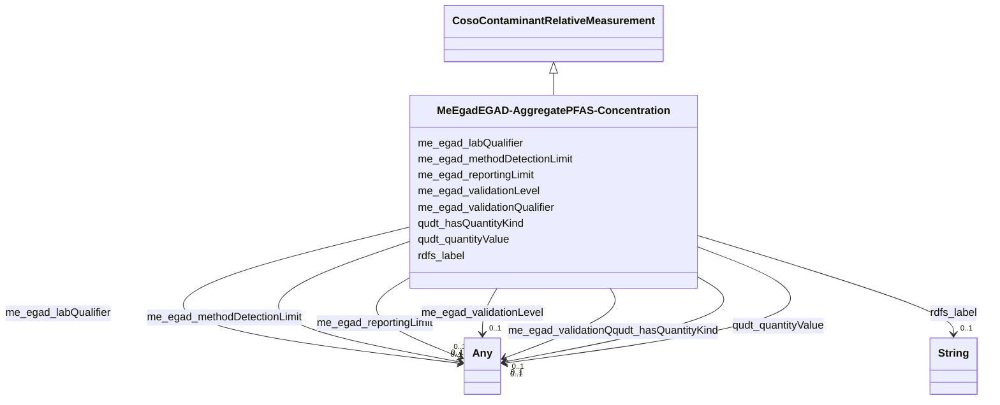

# Class: No class (entity type) name specified (me_egad_EGAD-AggregatePFAS-Concentration)


_No class (type) description specified_


This class occurs 37677 times.


URI: [me_egad:EGAD-AggregatePFAS-Concentration](http://sawgraph.spatialai.org/v1/me-egad#EGAD-AggregatePFAS-Concentration)





## Inheritance
* [CosoContaminantRelativeMeasurement](../classes/CosoContaminantRelativeMeasurement.md)
    * **MeEgadEGAD-AggregatePFAS-Concentration**


## Slots

| Name | Cardinality and Range | Description | Inheritance | Occurrences |
| ---  | --- | --- | --- | --- |
| [rdfs_label](../slots/rdfs_label.md) | 0..1 <br/> [xsd:string](http://www.w3.org/2001/XMLSchema#string) | No slot (predicate) description specified <br/>  | direct | 37686 |
| [qudt_hasQuantityKind](../slots/qudt_hasQuantityKind.md) | 0..1 <br/> [OwlNamedIndividual](../classes/OwlNamedIndividual.md)&nbsp;or&nbsp;<br />[QudtQuantityKind](../classes/QudtQuantityKind.md)&nbsp;or&nbsp;<br />[xsd:anyURI](http://www.w3.org/2001/XMLSchema#anyURI)&nbsp;or&nbsp;<br />[CosoContaminantConcentrationQuantityKind](../classes/CosoContaminantConcentrationQuantityKind.md) | No slot (predicate) description specified <br/>  | direct | 37677 |
| [me_egad_labQualifier](../slots/me_egad_labQualifier.md) | 0..1 <br/> [MeEgadEGAD-ConcentrationQualifier](../classes/MeEgadEGAD-ConcentrationQualifier.md)&nbsp;or&nbsp;<br />[OwlNamedIndividual](../classes/OwlNamedIndividual.md) | No slot (predicate) description specified <br/>  | direct | 49380 |
| [me_egad_validationLevel](../slots/me_egad_validationLevel.md) | 0..1 <br/> [MeEgadEGAD-ValidationLevel](../classes/MeEgadEGAD-ValidationLevel.md)&nbsp;or&nbsp;<br />[xsd:anyURI](http://www.w3.org/2001/XMLSchema#anyURI)&nbsp;or&nbsp;<br />[OwlNamedIndividual](../classes/OwlNamedIndividual.md) | No slot (predicate) description specified <br/>  | direct | 75025 |
| [me_egad_methodDetectionLimit](../slots/me_egad_methodDetectionLimit.md) | 0..1 <br/> [xsd:anyURI](http://www.w3.org/2001/XMLSchema#anyURI)&nbsp;or&nbsp;<br />[MeEgadEGAD-MethodDetectionLimit](../classes/MeEgadEGAD-MethodDetectionLimit.md) | No slot (predicate) description specified <br/>  | direct | 37689 |
| [me_egad_validationQualifier](../slots/me_egad_validationQualifier.md) | 0..1 <br/> [xsd:anyURI](http://www.w3.org/2001/XMLSchema#anyURI)&nbsp;or&nbsp;<br />[MeEgadEGAD-ConcentrationQualifier](../classes/MeEgadEGAD-ConcentrationQualifier.md)&nbsp;or&nbsp;<br />[OwlNamedIndividual](../classes/OwlNamedIndividual.md) | No slot (predicate) description specified <br/>  | direct | 57028 |
| [qudt_quantityValue](../slots/qudt_quantityValue.md) | 0..1 <br/> [CosoDetectQuantityValue](../classes/CosoDetectQuantityValue.md)&nbsp;or&nbsp;<br />[QudtQuantityValue](../classes/QudtQuantityValue.md)&nbsp;or&nbsp;<br />[CosoNonDetectQuantityValue](../classes/CosoNonDetectQuantityValue.md) | No slot (predicate) description specified <br/>  | direct | 37730 |
| [me_egad_reportingLimit](../slots/me_egad_reportingLimit.md) | 0..1 <br/> [xsd:anyURI](http://www.w3.org/2001/XMLSchema#anyURI)&nbsp;or&nbsp;<br />[MeEgadEGAD-ReportingLimit](../classes/MeEgadEGAD-ReportingLimit.md) | No slot (predicate) description specified <br/>  | direct | 37857 |


## Usages

| used by | used in | type | used |
| ---  | --- | --- | --- |
| [MeEgadEGAD-PFAS-Observation](../classes/MeEgadEGAD-PFAS-Observation.md) | [coso_hasResult](../slots/coso_hasResult.md) | any_of[range] | [MeEgadEGAD-AggregatePFAS-Concentration](../classes/MeEgadEGAD-AggregatePFAS-Concentration.md) |


## LinkML Source

<!-- TODO: investigate https://stackoverflow.com/questions/37606292/how-to-create-tabbed-code-blocks-in-mkdocs-or-sphinx -->

### Direct

<details>

```yaml
name: me_egad_EGAD-AggregatePFAS-Concentration
conforms_to: No schema conformance document specified
annotations:
  count:
    tag: count
    value: 37677
description: No class (type) description specified
title: No class (entity type) name specified
from_schema: sawgraph-kg
rank: 1000
is_a: coso_ContaminantRelativeMeasurement
slots:
- rdfs_label
- qudt_hasQuantityKind
- me_egad_labQualifier
- me_egad_validationLevel
- me_egad_methodDetectionLimit
- me_egad_validationQualifier
- qudt_quantityValue
- me_egad_reportingLimit
slot_usage:
  me_egad_labQualifier:
    name: me_egad_labQualifier
    annotations:
      me_egad_EGAD-ConcentrationQualifier:
        tag: me_egad_EGAD-ConcentrationQualifier
        value: 24690
      owl_NamedIndividual:
        tag: owl_NamedIndividual
        value: 24690
  me_egad_methodDetectionLimit:
    name: me_egad_methodDetectionLimit
    annotations:
      uri:
        tag: uri
        value: 37689
  me_egad_reportingLimit:
    name: me_egad_reportingLimit
    annotations:
      uri:
        tag: uri
        value: 37857
  me_egad_validationLevel:
    name: me_egad_validationLevel
    annotations:
      me_egad_EGAD-ValidationLevel:
        tag: me_egad_EGAD-ValidationLevel
        value: 37474
      owl_NamedIndividual:
        tag: owl_NamedIndividual
        value: 37474
      uri:
        tag: uri
        value: 77
  me_egad_validationQualifier:
    name: me_egad_validationQualifier
    annotations:
      me_egad_EGAD-ConcentrationQualifier:
        tag: me_egad_EGAD-ConcentrationQualifier
        value: 28510
      owl_NamedIndividual:
        tag: owl_NamedIndividual
        value: 28510
      uri:
        tag: uri
        value: 8
  qudt_hasQuantityKind:
    name: qudt_hasQuantityKind
    annotations:
      uri:
        tag: uri
        value: 37677
  qudt_quantityValue:
    name: qudt_quantityValue
    annotations:
      coso_DetectQuantityValue:
        tag: coso_DetectQuantityValue
        value: 26256
      coso_NonDetectQuantityValue:
        tag: coso_NonDetectQuantityValue
        value: 11474
  rdfs_label:
    name: rdfs_label
    annotations:
      string:
        tag: string
        value: 37686
class_uri: me_egad:EGAD-AggregatePFAS-Concentration

```
</details>

### Induced

<details>

```yaml
name: me_egad_EGAD-AggregatePFAS-Concentration
conforms_to: No schema conformance document specified
annotations:
  count:
    tag: count
    value: 37677
description: No class (type) description specified
title: No class (entity type) name specified
from_schema: sawgraph-kg
rank: 1000
is_a: coso_ContaminantRelativeMeasurement
slot_usage:
  me_egad_labQualifier:
    name: me_egad_labQualifier
    annotations:
      me_egad_EGAD-ConcentrationQualifier:
        tag: me_egad_EGAD-ConcentrationQualifier
        value: 24690
      owl_NamedIndividual:
        tag: owl_NamedIndividual
        value: 24690
  me_egad_methodDetectionLimit:
    name: me_egad_methodDetectionLimit
    annotations:
      uri:
        tag: uri
        value: 37689
  me_egad_reportingLimit:
    name: me_egad_reportingLimit
    annotations:
      uri:
        tag: uri
        value: 37857
  me_egad_validationLevel:
    name: me_egad_validationLevel
    annotations:
      me_egad_EGAD-ValidationLevel:
        tag: me_egad_EGAD-ValidationLevel
        value: 37474
      owl_NamedIndividual:
        tag: owl_NamedIndividual
        value: 37474
      uri:
        tag: uri
        value: 77
  me_egad_validationQualifier:
    name: me_egad_validationQualifier
    annotations:
      me_egad_EGAD-ConcentrationQualifier:
        tag: me_egad_EGAD-ConcentrationQualifier
        value: 28510
      owl_NamedIndividual:
        tag: owl_NamedIndividual
        value: 28510
      uri:
        tag: uri
        value: 8
  qudt_hasQuantityKind:
    name: qudt_hasQuantityKind
    annotations:
      uri:
        tag: uri
        value: 37677
  qudt_quantityValue:
    name: qudt_quantityValue
    annotations:
      coso_DetectQuantityValue:
        tag: coso_DetectQuantityValue
        value: 26256
      coso_NonDetectQuantityValue:
        tag: coso_NonDetectQuantityValue
        value: 11474
  rdfs_label:
    name: rdfs_label
    annotations:
      string:
        tag: string
        value: 37686
attributes:
  rdfs_label:
    name: rdfs_label
    annotations:
      string:
        tag: string
        value: 37686
    description: No slot (predicate) description specified
    examples:
    - object:
        example_object: Microgram per Kilogram
        example_object_type: string
        example_predicate: rdfs:label
        example_subject: http://qudt.org/vocab/unit/MicroGM-PER-KiloGM
        example_subject_type: qudt_Unit
    - object:
        example_object: AB
        example_object_type: string
        example_predicate: rdfs:label
        example_subject: me_egad_data:AB
        example_subject_type: prov_Agent
    - object:
        example_object: COMPOUND IS FOUND IN THE ASSOCIATED METHOD BLANK (ORGANIC)
          OR THE REPORTED VALUE WAS LESS THAN THE REPORTING LIMIT BUT GREATER THAN
          OR EQUAL TO THE IDL. (INORGANIC)
        example_object_type: string
        example_predicate: rdfs:label
        example_subject: me_egad_data:concentrationQualifier.B
        example_subject_type: owl_NamedIndividual
    - object:
        example_object: ALPHA ANALYTICAL LAB - WESTBOROUGH, MA
        example_object_type: string
        example_predicate: rdfs:label
        example_subject: me_egad_data:organization.lab.AA
        example_subject_type: prov_Organization
    - object:
        example_object: EGAD PFAS measurements for sample EP001
        example_object_type: string
        example_predicate: rdfs:label
        example_subject: me_egad_data:result.101365P.NA.20130507.1763231
        example_subject_type: me_egad_EGAD-SinglePFAS-Concentration
    - object:
        example_object: EGAD PFAS measurements for sample EP001
        example_object_type: string
        example_predicate: rdfs:label
        example_subject: me_egad_data:result.101365P.NA.20130507.DEP18010
        example_subject_type: me_egad_EGAD-AggregatePFAS-Concentration
    - object:
        example_object: EGAD sample BETH WILLIAMS ACF
        example_object_type: string
        example_predicate: rdfs:label
        example_subject: me_egad_data:sample.AAL210144001R.20210112
        example_subject_type: me_egad_EGAD-Sample
    - object:
        example_object: EGAD sample point 100410
        example_object_type: string
        example_predicate: rdfs:label
        example_subject: me_egad_data:samplePoint.100410
        example_subject_type: me_egad_EGAD-SamplePoint
    - object:
        example_object: EGAD sampled feature associated with sample point 100410
        example_object_type: string
        example_predicate: rdfs:label
        example_subject: me_egad_data:sampledFeature.100410
        example_subject_type: me_egad_EGAD-SampledFeature
    - object:
        example_object: MAINE ARMY NATIONAL GUARD - BANGOR RANGE
        example_object_type: string
        example_predicate: rdfs:label
        example_subject: me_egad_data:site.100843
        example_subject_type: me_egad_EGAD-Site
    - object:
        example_object: FARMINGTON VILLAGE CORPORATION
        example_object_type: string
        example_predicate: rdfs:label
        example_subject: me_egad_data:site.131980
        example_subject_type: me_egad_EGAD-PFAS-Site
    - object:
        example_object: Single Contamiant Concentration Quantity
        example_object_type: string
        example_predicate: rdfs:label
        example_subject: coso:SingleContaminantConcentrationQuantityKind
        example_subject_type: coso_ContaminantConcentrationQuantityKind
    - object:
        example_object: Non-Detect
        example_object_type: string
        example_predicate: rdfs:label
        example_subject: coso:non-detect
        example_subject_type: qudt_EnumeratedValue
    - object:
        example_object: Enumerated Quantity
        example_object_type: string
        example_predicate: rdfs:label
        example_subject: qudt:EnumeratedQuantity
        example_subject_type: None
    - object:
        example_object: EGAD PFAS observation for sample BETH WILLIAMS ACF
        example_object_type: string
        example_predicate: rdfs:label
        example_subject: me_egad_data:observation.AAL210144001R.20210112.1763231
        example_subject_type: me_egad_EGAD-PFAS-Observation
    from_schema: sawgraph-kg
    rank: 1000
    slot_uri: rdfs:label
    alias: rdfs_label
    owner: me_egad_EGAD-AggregatePFAS-Concentration
    domain_of:
    - owl_NamedIndividual
    - owl_OntologyProperty
    - qudt_AspectClass
    - qudt_BitEncodingType
    - qudt_BooleanEncodingType
    - qudt_ByteEncodingType
    - qudt_CardinalityType
    - qudt_CharEncodingType
    - qudt_DateTimeStringEncodingType
    - qudt_EndianType
    - qudt_EnumeratedValue
    - qudt_FloatingPointEncodingType
    - qudt_IntegerEncodingType
    - qudt_OrderedType
    - qudt_SignednessType
    - qudt_Unit
    - vaem_#CatalogEntry
    - vaem_#GraphMetaData
    - vaem_#Party
    - coso_ContaminantConcentrationQuantityKind
    - coso_ContaminantVolumeQuantityKind
    - coso_Substance
    - coso_SubstanceCollection
    - me_egad_EGAD-AggregatePFAS-Concentration
    - me_egad_EGAD-AnalysisMethod
    - me_egad_EGAD-ConcentrationQualifier
    - me_egad_EGAD-PFAS-Observation
    - me_egad_EGAD-PFAS-ParameterName
    - me_egad_EGAD-PFAS-Site
    - me_egad_EGAD-ResultType
    - me_egad_EGAD-Sample
    - me_egad_EGAD-SampleCollectionMethod
    - me_egad_EGAD-SampleDetailedLocation
    - me_egad_EGAD-SampleMaterialType
    - me_egad_EGAD-SampleMaterialTypeQualifier
    - me_egad_EGAD-SamplePoint
    - me_egad_EGAD-SamplePointType
    - me_egad_EGAD-SampleTreatmentStatus
    - me_egad_EGAD-SampledFeature
    - me_egad_EGAD-SinglePFAS-Concentration
    - me_egad_EGAD-Site
    - me_egad_EGAD-SiteType
    - me_egad_EGAD-ValidationLevel
    - prov_Agent
    - prov_Organization
    range: string
  qudt_hasQuantityKind:
    name: qudt_hasQuantityKind
    annotations:
      uri:
        tag: uri
        value: 37677
    description: No slot (predicate) description specified
    title: has quantity kind
    examples:
    - object:
        example_object: http://qudt.org/vocab/quantitykind/MassRatio
        example_object_type: uri
        example_predicate: qudt:hasQuantityKind
        example_subject: http://qudt.org/vocab/unit/MicroGM-PER-KiloGM
        example_subject_type: qudt_Unit
    - object:
        example_object: coso:SingleContaminantConcentrationQuantityKind
        example_object_type: owl_NamedIndividual
        example_predicate: qudt:hasQuantityKind
        example_subject: me_egad_data:result.101365P.NA.20130507.1763231
        example_subject_type: me_egad_EGAD-SinglePFAS-Concentration
    - object:
        example_object: coso:SingleContaminantConcentrationQuantityKind
        example_object_type: coso_ContaminantConcentrationQuantityKind
        example_predicate: qudt:hasQuantityKind
        example_subject: me_egad_data:result.101365P.NA.20130507.1763231
        example_subject_type: me_egad_EGAD-SinglePFAS-Concentration
    - object:
        example_object: coso:AggregateContaminantConcentrationQuantityKind
        example_object_type: uri
        example_predicate: qudt:hasQuantityKind
        example_subject: me_egad_data:result.101365P.NA.20130507.DEP18010
        example_subject_type: me_egad_EGAD-AggregatePFAS-Concentration
    from_schema: sawgraph-kg
    source: http://qudt.org/2.1/schema/qudt
    rank: 1000
    slot_uri: qudt:hasQuantityKind
    alias: qudt_hasQuantityKind
    owner: me_egad_EGAD-AggregatePFAS-Concentration
    domain_of:
    - qudt_Unit
    - me_egad_EGAD-AggregatePFAS-Concentration
    - me_egad_EGAD-SinglePFAS-Concentration
    range: Any
    any_of:
    - range: owl_NamedIndividual
    - range: qudt_QuantityKind
    - range: uri
    - range: coso_ContaminantConcentrationQuantityKind
  me_egad_labQualifier:
    name: me_egad_labQualifier
    annotations:
      me_egad_EGAD-ConcentrationQualifier:
        tag: me_egad_EGAD-ConcentrationQualifier
        value: 24690
      owl_NamedIndividual:
        tag: owl_NamedIndividual
        value: 24690
    description: No slot (predicate) description specified
    title: egad - lab qualifier
    examples:
    - object:
        example_object: me_egad_data:concentrationQualifier.U
        example_object_type: me_egad_EGAD-ConcentrationQualifier
        example_predicate: me_egad:labQualifier
        example_subject: me_egad_data:result.101365P.NA.20130507.1763231
        example_subject_type: me_egad_EGAD-SinglePFAS-Concentration
    - object:
        example_object: me_egad_data:concentrationQualifier.U
        example_object_type: owl_NamedIndividual
        example_predicate: me_egad:labQualifier
        example_subject: me_egad_data:result.101365P.NA.20130507.1763231
        example_subject_type: me_egad_EGAD-SinglePFAS-Concentration
    - object:
        example_object: me_egad_data:concentrationQualifier.U
        example_object_type: me_egad_EGAD-ConcentrationQualifier
        example_predicate: me_egad:labQualifier
        example_subject: me_egad_data:result.101365P.NA.20130507.DEP18010
        example_subject_type: me_egad_EGAD-AggregatePFAS-Concentration
    - object:
        example_object: me_egad_data:concentrationQualifier.U
        example_object_type: owl_NamedIndividual
        example_predicate: me_egad:labQualifier
        example_subject: me_egad_data:result.101365P.NA.20130507.DEP18010
        example_subject_type: me_egad_EGAD-AggregatePFAS-Concentration
    from_schema: sawgraph-kg
    rank: 1000
    slot_uri: me_egad:labQualifier
    alias: me_egad_labQualifier
    owner: me_egad_EGAD-AggregatePFAS-Concentration
    domain_of:
    - me_egad_EGAD-AggregatePFAS-Concentration
    - me_egad_EGAD-SinglePFAS-Concentration
    subproperty_of: coso_resultAnnotation
    range: Any
    any_of:
    - range: me_egad_EGAD-ConcentrationQualifier
    - range: owl_NamedIndividual
  me_egad_validationLevel:
    name: me_egad_validationLevel
    annotations:
      me_egad_EGAD-ValidationLevel:
        tag: me_egad_EGAD-ValidationLevel
        value: 37474
      owl_NamedIndividual:
        tag: owl_NamedIndividual
        value: 37474
      uri:
        tag: uri
        value: 77
    description: No slot (predicate) description specified
    title: egad - validation level
    examples:
    - object:
        example_object: me_egad_data:validationLevel.DEP
        example_object_type: me_egad_EGAD-ValidationLevel
        example_predicate: me_egad:validationLevel
        example_subject: me_egad_data:result.101365P.NA.20130507.DEP18010
        example_subject_type: me_egad_EGAD-AggregatePFAS-Concentration
    - object:
        example_object: me_egad_data:validationLevel.DEP
        example_object_type: owl_NamedIndividual
        example_predicate: me_egad:validationLevel
        example_subject: me_egad_data:result.101365P.NA.20130507.DEP18010
        example_subject_type: me_egad_EGAD-AggregatePFAS-Concentration
    - object:
        example_object: me_egad_data:validationLevel.DEP
        example_object_type: me_egad_EGAD-ValidationLevel
        example_predicate: me_egad:validationLevel
        example_subject: me_egad_data:result.1028303.ELL.20190405.335671
        example_subject_type: me_egad_EGAD-SinglePFAS-Concentration
    - object:
        example_object: me_egad_data:validationLevel.DEP
        example_object_type: owl_NamedIndividual
        example_predicate: me_egad:validationLevel
        example_subject: me_egad_data:result.1028303.ELL.20190405.335671
        example_subject_type: me_egad_EGAD-SinglePFAS-Concentration
    - object:
        example_object: me_egad_data:validationLevel.T2
        example_object_type: uri
        example_predicate: me_egad:validationLevel
        example_subject: me_egad_data:result.170094201.VAL.20170725.108427538
        example_subject_type: me_egad_EGAD-SinglePFAS-Concentration
    - object:
        example_object: me_egad_data:validationLevel.T2
        example_object_type: uri
        example_predicate: me_egad:validationLevel
        example_subject: me_egad_data:result.170098413.VAL.20170802.DEP18016
        example_subject_type: me_egad_EGAD-AggregatePFAS-Concentration
    from_schema: sawgraph-kg
    rank: 1000
    slot_uri: me_egad:validationLevel
    alias: me_egad_validationLevel
    owner: me_egad_EGAD-AggregatePFAS-Concentration
    domain_of:
    - me_egad_EGAD-AggregatePFAS-Concentration
    - me_egad_EGAD-SinglePFAS-Concentration
    subproperty_of: coso_resultAnnotation
    range: Any
    any_of:
    - range: me_egad_EGAD-ValidationLevel
    - range: uri
    - range: owl_NamedIndividual
  me_egad_methodDetectionLimit:
    name: me_egad_methodDetectionLimit
    annotations:
      uri:
        tag: uri
        value: 37689
    description: No slot (predicate) description specified
    title: egad - method detection limit
    examples:
    - object:
        example_object: me_egad_data:mdl.1.1.NG/G
        example_object_type: uri
        example_predicate: me_egad:methodDetectionLimit
        example_subject: me_egad_data:result.1028303.ELL.20190405.335671
        example_subject_type: me_egad_EGAD-SinglePFAS-Concentration
    - object:
        example_object: me_egad_data:mdl.1.1.NG/G
        example_object_type: uri
        example_predicate: me_egad:methodDetectionLimit
        example_subject: me_egad_data:result.1028303.ELL.20190405.DEP18010
        example_subject_type: me_egad_EGAD-AggregatePFAS-Concentration
    from_schema: sawgraph-kg
    rank: 1000
    slot_uri: me_egad:methodDetectionLimit
    alias: me_egad_methodDetectionLimit
    owner: me_egad_EGAD-AggregatePFAS-Concentration
    domain_of:
    - me_egad_EGAD-AggregatePFAS-Concentration
    - me_egad_EGAD-SinglePFAS-Concentration
    subproperty_of: coso_resultAnnotation
    range: Any
    any_of:
    - range: uri
    - range: me_egad_EGAD-MethodDetectionLimit
  me_egad_validationQualifier:
    name: me_egad_validationQualifier
    annotations:
      me_egad_EGAD-ConcentrationQualifier:
        tag: me_egad_EGAD-ConcentrationQualifier
        value: 28510
      owl_NamedIndividual:
        tag: owl_NamedIndividual
        value: 28510
      uri:
        tag: uri
        value: 8
    description: No slot (predicate) description specified
    title: egad - validation qualifier
    examples:
    - object:
        example_object: me_egad_data:concentrationQualifier.U
        example_object_type: me_egad_EGAD-ConcentrationQualifier
        example_predicate: me_egad:validationQualifier
        example_subject: me_egad_data:result.1028303.ELL.20190405.335671
        example_subject_type: me_egad_EGAD-SinglePFAS-Concentration
    - object:
        example_object: me_egad_data:concentrationQualifier.U
        example_object_type: owl_NamedIndividual
        example_predicate: me_egad:validationQualifier
        example_subject: me_egad_data:result.1028303.ELL.20190405.335671
        example_subject_type: me_egad_EGAD-SinglePFAS-Concentration
    - object:
        example_object: me_egad_data:concentrationQualifier.J
        example_object_type: me_egad_EGAD-ConcentrationQualifier
        example_predicate: me_egad:validationQualifier
        example_subject: me_egad_data:result.1039233.ELL.20190412.DEP18010
        example_subject_type: me_egad_EGAD-AggregatePFAS-Concentration
    - object:
        example_object: me_egad_data:concentrationQualifier.J
        example_object_type: owl_NamedIndividual
        example_predicate: me_egad:validationQualifier
        example_subject: me_egad_data:result.1039233.ELL.20190412.DEP18010
        example_subject_type: me_egad_EGAD-AggregatePFAS-Concentration
    - object:
        example_object: me_egad_data:concentrationQualifier.M
        example_object_type: uri
        example_predicate: me_egad:validationQualifier
        example_subject: me_egad_data:result.320623561.TA.20200701.335671
        example_subject_type: me_egad_EGAD-SinglePFAS-Concentration
    - object:
        example_object: me_egad_data:concentrationQualifier.M
        example_object_type: uri
        example_predicate: me_egad:validationQualifier
        example_subject: me_egad_data:result.320623562.TA.20200701.DEP18010
        example_subject_type: me_egad_EGAD-AggregatePFAS-Concentration
    from_schema: sawgraph-kg
    rank: 1000
    slot_uri: me_egad:validationQualifier
    alias: me_egad_validationQualifier
    owner: me_egad_EGAD-AggregatePFAS-Concentration
    domain_of:
    - me_egad_EGAD-AggregatePFAS-Concentration
    - me_egad_EGAD-SinglePFAS-Concentration
    subproperty_of: coso_resultAnnotation
    range: Any
    any_of:
    - range: uri
    - range: me_egad_EGAD-ConcentrationQualifier
    - range: owl_NamedIndividual
  qudt_quantityValue:
    name: qudt_quantityValue
    annotations:
      coso_DetectQuantityValue:
        tag: coso_DetectQuantityValue
        value: 26256
      coso_NonDetectQuantityValue:
        tag: coso_NonDetectQuantityValue
        value: 11474
    description: No slot (predicate) description specified
    title: quantity value
    examples:
    - object:
        example_object: me_egad_data:quantityValue.101365P.NA.20130507.1763231
        example_object_type: coso_NonDetectQuantityValue
        example_predicate: qudt:quantityValue
        example_subject: me_egad_data:result.101365P.NA.20130507.1763231
        example_subject_type: me_egad_EGAD-SinglePFAS-Concentration
    - object:
        example_object: me_egad_data:quantityValue.101365P.NA.20130507.DEP18010
        example_object_type: coso_NonDetectQuantityValue
        example_predicate: qudt:quantityValue
        example_subject: me_egad_data:result.101365P.NA.20130507.DEP18010
        example_subject_type: me_egad_EGAD-AggregatePFAS-Concentration
    - object:
        example_object: me_egad_data:quantityValue.1028303.ELL.20190405.45298906
        example_object_type: coso_DetectQuantityValue
        example_predicate: qudt:quantityValue
        example_subject: me_egad_data:result.1028303.ELL.20190405.45298906
        example_subject_type: me_egad_EGAD-SinglePFAS-Concentration
    - object:
        example_object: me_egad_data:quantityValue.1028303.ELL.20190405.DEP18010
        example_object_type: coso_DetectQuantityValue
        example_predicate: qudt:quantityValue
        example_subject: me_egad_data:result.1028303.ELL.20190405.DEP18010
        example_subject_type: me_egad_EGAD-AggregatePFAS-Concentration
    from_schema: sawgraph-kg
    source: http://qudt.org/2.1/schema/qudt
    rank: 1000
    slot_uri: qudt:quantityValue
    alias: qudt_quantityValue
    owner: me_egad_EGAD-AggregatePFAS-Concentration
    domain_of:
    - me_egad_EGAD-AggregatePFAS-Concentration
    - me_egad_EGAD-SinglePFAS-Concentration
    range: Any
    any_of:
    - range: coso_DetectQuantityValue
    - range: qudt_QuantityValue
    - range: coso_NonDetectQuantityValue
  me_egad_reportingLimit:
    name: me_egad_reportingLimit
    annotations:
      uri:
        tag: uri
        value: 37857
    description: No slot (predicate) description specified
    title: egad - reporting limit
    examples:
    - object:
        example_object: me_egad_data:rl.0.04.UG/L
        example_object_type: uri
        example_predicate: me_egad:reportingLimit
        example_subject: me_egad_data:result.101365P.NA.20130507.1763231
        example_subject_type: me_egad_EGAD-SinglePFAS-Concentration
    - object:
        example_object: me_egad_data:rl.0.02.UG/L
        example_object_type: uri
        example_predicate: me_egad:reportingLimit
        example_subject: me_egad_data:result.101365P.NA.20130507.DEP18010
        example_subject_type: me_egad_EGAD-AggregatePFAS-Concentration
    from_schema: sawgraph-kg
    rank: 1000
    slot_uri: me_egad:reportingLimit
    alias: me_egad_reportingLimit
    owner: me_egad_EGAD-AggregatePFAS-Concentration
    domain_of:
    - me_egad_EGAD-AggregatePFAS-Concentration
    - me_egad_EGAD-SinglePFAS-Concentration
    subproperty_of: coso_resultAnnotation
    range: Any
    any_of:
    - range: uri
    - range: me_egad_EGAD-ReportingLimit
class_uri: me_egad:EGAD-AggregatePFAS-Concentration

```
</details>