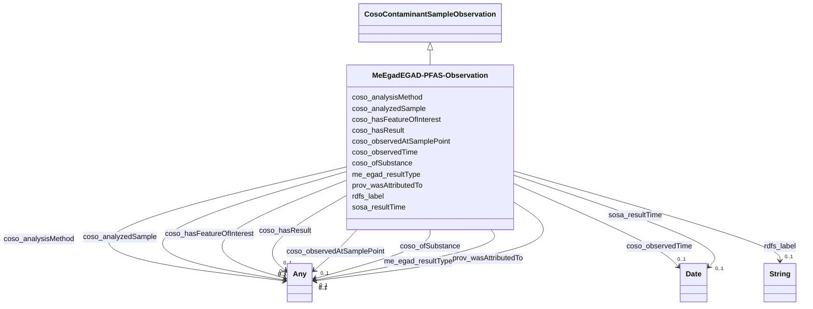

# Class: EGAD - PFAS Observation (me_egad_EGAD-PFAS-Observation)


_No class (type) description specified_


This class occurs 576763 times.


URI: [me_egad:EGAD-PFAS-Observation](http://sawgraph.spatialai.org/v1/me-egad#EGAD-PFAS-Observation)





## Inheritance
* [CosoContaminantSampleObservation](../classes/CosoContaminantSampleObservation.md)
    * **MeEgadEGAD-PFAS-Observation**


## Slots

| Name | Cardinality and Range | Description | Inheritance | Occurrences |
| ---  | --- | --- | --- | --- |
| [coso_analysisMethod](../slots/coso_analysisMethod.md) | 0..1 <br/> [MeEgadEGAD-AnalysisMethod](../classes/MeEgadEGAD-AnalysisMethod.md)&nbsp;or&nbsp;<br />[OwlNamedIndividual](../classes/OwlNamedIndividual.md) | No slot (predicate) description specified <br/>  | direct | 1155212 |
| [coso_observedAtSamplePoint](../slots/coso_observedAtSamplePoint.md) | 0..1 <br/> [MeEgadEGAD-SamplePoint](../classes/MeEgadEGAD-SamplePoint.md)&nbsp;or&nbsp;<br />[CosoSamplePoint](../classes/CosoSamplePoint.md) | No slot (predicate) description specified <br/>  | direct | 577112 |
| [rdfs_label](../slots/rdfs_label.md) | 0..1 <br/> [xsd:string](http://www.w3.org/2001/XMLSchema#string) | No slot (predicate) description specified <br/>  | direct | 576850 |
| [prov_wasAttributedTo](../slots/prov_wasAttributedTo.md) | 0..1 <br/> [ProvAgent](../classes/ProvAgent.md)&nbsp;or&nbsp;<br />[ProvOrganization](../classes/ProvOrganization.md)&nbsp;or&nbsp;<br />[xsd:anyURI](http://www.w3.org/2001/XMLSchema#anyURI) | No slot (predicate) description specified <br/>  | direct | 576763 |
| [coso_hasResult](../slots/coso_hasResult.md) | 0..1 <br/> [MeEgadEGAD-SinglePFAS-Concentration](../classes/MeEgadEGAD-SinglePFAS-Concentration.md)&nbsp;or&nbsp;<br />[MeEgadEGAD-AggregatePFAS-Concentration](../classes/MeEgadEGAD-AggregatePFAS-Concentration.md)&nbsp;or&nbsp;<br />[CosoContaminantMeasurement](../classes/CosoContaminantMeasurement.md) | No slot (predicate) description specified <br/>  | direct | 576763 |
| [coso_observedTime](../slots/coso_observedTime.md) | 0..1 <br/> [xsd:date](http://www.w3.org/2001/XMLSchema#date) | No slot (predicate) description specified <br/>  | direct | 576799 |
| [coso_ofSubstance](../slots/coso_ofSubstance.md) | 0..1 <br/> [B4df387098a2ec498fe4c9889d19680a0](../classes/B4df387098a2ec498fe4c9889d19680a0.md)&nbsp;or&nbsp;<br />[xsd:anyURI](http://www.w3.org/2001/XMLSchema#anyURI) | No slot (predicate) description specified <br/>  | direct | 576763 |
| [me_egad_resultType](../slots/me_egad_resultType.md) | 0..1 <br/> [MeEgadEGAD-ResultType](../classes/MeEgadEGAD-ResultType.md)&nbsp;or&nbsp;<br />[OwlNamedIndividual](../classes/OwlNamedIndividual.md) | No slot (predicate) description specified <br/>  | direct | 1153526 |
| [coso_hasFeatureOfInterest](../slots/coso_hasFeatureOfInterest.md) | 0..1 <br/> [MeEgadEGAD-SampledFeature](../classes/MeEgadEGAD-SampledFeature.md)&nbsp;or&nbsp;<br />[CosoFeature](../classes/CosoFeature.md) | No slot (predicate) description specified <br/>  | direct | 577112 |
| [sosa_resultTime](../slots/sosa_resultTime.md) | 0..1 <br/> [xsd:date](http://www.w3.org/2001/XMLSchema#date) | No slot (predicate) description specified <br/>  | direct | 578715 |
| [coso_analyzedSample](../slots/coso_analyzedSample.md) | 0..1 <br/> [CosoMaterialSample](../classes/CosoMaterialSample.md)&nbsp;or&nbsp;<br />[MeEgadEGAD-Sample](../classes/MeEgadEGAD-Sample.md) | No slot (predicate) description specified <br/>  | direct | 576763 |


## LinkML Source

<!-- TODO: investigate https://stackoverflow.com/questions/37606292/how-to-create-tabbed-code-blocks-in-mkdocs-or-sphinx -->

### Direct

<details>

```yaml
name: me_egad_EGAD-PFAS-Observation
conforms_to: No schema conformance document specified
annotations:
  count:
    tag: count
    value: 576763
description: No class (type) description specified
title: EGAD - PFAS Observation
from_schema: sawgraph-kg
rank: 1000
is_a: coso_ContaminantSampleObservation
slots:
- coso_analysisMethod
- coso_observedAtSamplePoint
- rdfs_label
- prov_wasAttributedTo
- coso_hasResult
- coso_observedTime
- coso_ofSubstance
- me_egad_resultType
- coso_hasFeatureOfInterest
- sosa_resultTime
- coso_analyzedSample
slot_usage:
  coso_analysisMethod:
    name: coso_analysisMethod
    annotations:
      me_egad_EGAD-AnalysisMethod:
        tag: me_egad_EGAD-AnalysisMethod
        value: 577606
      owl_NamedIndividual:
        tag: owl_NamedIndividual
        value: 577606
  coso_analyzedSample:
    name: coso_analyzedSample
    annotations:
      me_egad_EGAD-Sample:
        tag: me_egad_EGAD-Sample
        value: 576763
  coso_hasFeatureOfInterest:
    name: coso_hasFeatureOfInterest
    annotations:
      me_egad_EGAD-SampledFeature:
        tag: me_egad_EGAD-SampledFeature
        value: 577112
  coso_hasResult:
    name: coso_hasResult
    annotations:
      me_egad_EGAD-AggregatePFAS-Concentration:
        tag: me_egad_EGAD-AggregatePFAS-Concentration
        value: 37677
      me_egad_EGAD-SinglePFAS-Concentration:
        tag: me_egad_EGAD-SinglePFAS-Concentration
        value: 539086
  coso_observedAtSamplePoint:
    name: coso_observedAtSamplePoint
    annotations:
      me_egad_EGAD-SamplePoint:
        tag: me_egad_EGAD-SamplePoint
        value: 577112
  coso_observedTime:
    name: coso_observedTime
    annotations:
      date:
        tag: date
        value: 576799
  coso_ofSubstance:
    name: coso_ofSubstance
    annotations:
      uri:
        tag: uri
        value: 576763
  me_egad_resultType:
    name: me_egad_resultType
    annotations:
      me_egad_EGAD-ResultType:
        tag: me_egad_EGAD-ResultType
        value: 576763
      owl_NamedIndividual:
        tag: owl_NamedIndividual
        value: 576763
  prov_wasAttributedTo:
    name: prov_wasAttributedTo
    annotations:
      prov_Organization:
        tag: prov_Organization
        value: 576127
      uri:
        tag: uri
        value: 636
  rdfs_label:
    name: rdfs_label
    annotations:
      string:
        tag: string
        value: 576850
  sosa_resultTime:
    name: sosa_resultTime
    annotations:
      date:
        tag: date
        value: 578715
class_uri: me_egad:EGAD-PFAS-Observation

```
</details>

### Induced

<details>

```yaml
name: me_egad_EGAD-PFAS-Observation
conforms_to: No schema conformance document specified
annotations:
  count:
    tag: count
    value: 576763
description: No class (type) description specified
title: EGAD - PFAS Observation
from_schema: sawgraph-kg
rank: 1000
is_a: coso_ContaminantSampleObservation
slot_usage:
  coso_analysisMethod:
    name: coso_analysisMethod
    annotations:
      me_egad_EGAD-AnalysisMethod:
        tag: me_egad_EGAD-AnalysisMethod
        value: 577606
      owl_NamedIndividual:
        tag: owl_NamedIndividual
        value: 577606
  coso_analyzedSample:
    name: coso_analyzedSample
    annotations:
      me_egad_EGAD-Sample:
        tag: me_egad_EGAD-Sample
        value: 576763
  coso_hasFeatureOfInterest:
    name: coso_hasFeatureOfInterest
    annotations:
      me_egad_EGAD-SampledFeature:
        tag: me_egad_EGAD-SampledFeature
        value: 577112
  coso_hasResult:
    name: coso_hasResult
    annotations:
      me_egad_EGAD-AggregatePFAS-Concentration:
        tag: me_egad_EGAD-AggregatePFAS-Concentration
        value: 37677
      me_egad_EGAD-SinglePFAS-Concentration:
        tag: me_egad_EGAD-SinglePFAS-Concentration
        value: 539086
  coso_observedAtSamplePoint:
    name: coso_observedAtSamplePoint
    annotations:
      me_egad_EGAD-SamplePoint:
        tag: me_egad_EGAD-SamplePoint
        value: 577112
  coso_observedTime:
    name: coso_observedTime
    annotations:
      date:
        tag: date
        value: 576799
  coso_ofSubstance:
    name: coso_ofSubstance
    annotations:
      uri:
        tag: uri
        value: 576763
  me_egad_resultType:
    name: me_egad_resultType
    annotations:
      me_egad_EGAD-ResultType:
        tag: me_egad_EGAD-ResultType
        value: 576763
      owl_NamedIndividual:
        tag: owl_NamedIndividual
        value: 576763
  prov_wasAttributedTo:
    name: prov_wasAttributedTo
    annotations:
      prov_Organization:
        tag: prov_Organization
        value: 576127
      uri:
        tag: uri
        value: 636
  rdfs_label:
    name: rdfs_label
    annotations:
      string:
        tag: string
        value: 576850
  sosa_resultTime:
    name: sosa_resultTime
    annotations:
      date:
        tag: date
        value: 578715
attributes:
  coso_analysisMethod:
    name: coso_analysisMethod
    annotations:
      me_egad_EGAD-AnalysisMethod:
        tag: me_egad_EGAD-AnalysisMethod
        value: 577606
      owl_NamedIndividual:
        tag: owl_NamedIndividual
        value: 577606
    description: No slot (predicate) description specified
    examples:
    - object:
        example_object: me_egad_data:testMethod.E537M
        example_object_type: me_egad_EGAD-AnalysisMethod
        example_predicate: coso:analysisMethod
        example_subject: me_egad_data:observation.AAL210144001R.20210112.1763231
        example_subject_type: me_egad_EGAD-PFAS-Observation
    - object:
        example_object: me_egad_data:testMethod.E537M
        example_object_type: owl_NamedIndividual
        example_predicate: coso:analysisMethod
        example_subject: me_egad_data:observation.AAL210144001R.20210112.1763231
        example_subject_type: me_egad_EGAD-PFAS-Observation
    from_schema: sawgraph-kg
    rank: 1000
    slot_uri: coso:analysisMethod
    alias: coso_analysisMethod
    owner: me_egad_EGAD-PFAS-Observation
    domain_of:
    - me_egad_EGAD-PFAS-Observation
    range: Any
    any_of:
    - range: me_egad_EGAD-AnalysisMethod
    - range: owl_NamedIndividual
  coso_observedAtSamplePoint:
    name: coso_observedAtSamplePoint
    annotations:
      me_egad_EGAD-SamplePoint:
        tag: me_egad_EGAD-SamplePoint
        value: 577112
    description: No slot (predicate) description specified
    title: observed at sample point
    examples:
    - object:
        example_object: me_egad_data:samplePoint.146496
        example_object_type: me_egad_EGAD-SamplePoint
        example_predicate: coso:observedAtSamplePoint
        example_subject: me_egad_data:observation.AAL210144001R.20210112.1763231
        example_subject_type: me_egad_EGAD-PFAS-Observation
    from_schema: sawgraph-kg
    rank: 1000
    domain: coso_ContaminantSampleObservation
    slot_uri: coso:observedAtSamplePoint
    alias: coso_observedAtSamplePoint
    owner: me_egad_EGAD-PFAS-Observation
    domain_of:
    - me_egad_EGAD-PFAS-Observation
    subproperty_of: coso_observedAtPoint
    range: Any
    any_of:
    - range: me_egad_EGAD-SamplePoint
    - range: coso_SamplePoint
  rdfs_label:
    name: rdfs_label
    annotations:
      string:
        tag: string
        value: 576850
    description: No slot (predicate) description specified
    examples:
    - object:
        example_object: Microgram per Kilogram
        example_object_type: string
        example_predicate: rdfs:label
        example_subject: http://qudt.org/vocab/unit/MicroGM-PER-KiloGM
        example_subject_type: qudt_Unit
    - object:
        example_object: AB
        example_object_type: string
        example_predicate: rdfs:label
        example_subject: me_egad_data:AB
        example_subject_type: prov_Agent
    - object:
        example_object: COMPOUND IS FOUND IN THE ASSOCIATED METHOD BLANK (ORGANIC)
          OR THE REPORTED VALUE WAS LESS THAN THE REPORTING LIMIT BUT GREATER THAN
          OR EQUAL TO THE IDL. (INORGANIC)
        example_object_type: string
        example_predicate: rdfs:label
        example_subject: me_egad_data:concentrationQualifier.B
        example_subject_type: owl_NamedIndividual
    - object:
        example_object: ALPHA ANALYTICAL LAB - WESTBOROUGH, MA
        example_object_type: string
        example_predicate: rdfs:label
        example_subject: me_egad_data:organization.lab.AA
        example_subject_type: prov_Organization
    - object:
        example_object: EGAD PFAS measurements for sample EP001
        example_object_type: string
        example_predicate: rdfs:label
        example_subject: me_egad_data:result.101365P.NA.20130507.1763231
        example_subject_type: me_egad_EGAD-SinglePFAS-Concentration
    - object:
        example_object: EGAD PFAS measurements for sample EP001
        example_object_type: string
        example_predicate: rdfs:label
        example_subject: me_egad_data:result.101365P.NA.20130507.DEP18010
        example_subject_type: me_egad_EGAD-AggregatePFAS-Concentration
    - object:
        example_object: EGAD sample BETH WILLIAMS ACF
        example_object_type: string
        example_predicate: rdfs:label
        example_subject: me_egad_data:sample.AAL210144001R.20210112
        example_subject_type: me_egad_EGAD-Sample
    - object:
        example_object: EGAD sample point 100410
        example_object_type: string
        example_predicate: rdfs:label
        example_subject: me_egad_data:samplePoint.100410
        example_subject_type: me_egad_EGAD-SamplePoint
    - object:
        example_object: EGAD sampled feature associated with sample point 100410
        example_object_type: string
        example_predicate: rdfs:label
        example_subject: me_egad_data:sampledFeature.100410
        example_subject_type: me_egad_EGAD-SampledFeature
    - object:
        example_object: MAINE ARMY NATIONAL GUARD - BANGOR RANGE
        example_object_type: string
        example_predicate: rdfs:label
        example_subject: me_egad_data:site.100843
        example_subject_type: me_egad_EGAD-Site
    - object:
        example_object: FARMINGTON VILLAGE CORPORATION
        example_object_type: string
        example_predicate: rdfs:label
        example_subject: me_egad_data:site.131980
        example_subject_type: me_egad_EGAD-PFAS-Site
    - object:
        example_object: Single Contamiant Concentration Quantity
        example_object_type: string
        example_predicate: rdfs:label
        example_subject: coso:SingleContaminantConcentrationQuantityKind
        example_subject_type: coso_ContaminantConcentrationQuantityKind
    - object:
        example_object: Non-Detect
        example_object_type: string
        example_predicate: rdfs:label
        example_subject: coso:non-detect
        example_subject_type: qudt_EnumeratedValue
    - object:
        example_object: Enumerated Quantity
        example_object_type: string
        example_predicate: rdfs:label
        example_subject: qudt:EnumeratedQuantity
        example_subject_type: None
    - object:
        example_object: EGAD PFAS observation for sample BETH WILLIAMS ACF
        example_object_type: string
        example_predicate: rdfs:label
        example_subject: me_egad_data:observation.AAL210144001R.20210112.1763231
        example_subject_type: me_egad_EGAD-PFAS-Observation
    from_schema: sawgraph-kg
    rank: 1000
    slot_uri: rdfs:label
    alias: rdfs_label
    owner: me_egad_EGAD-PFAS-Observation
    domain_of:
    - owl_NamedIndividual
    - owl_OntologyProperty
    - qudt_AspectClass
    - qudt_BitEncodingType
    - qudt_BooleanEncodingType
    - qudt_ByteEncodingType
    - qudt_CardinalityType
    - qudt_CharEncodingType
    - qudt_DateTimeStringEncodingType
    - qudt_EndianType
    - qudt_EnumeratedValue
    - qudt_FloatingPointEncodingType
    - qudt_IntegerEncodingType
    - qudt_OrderedType
    - qudt_SignednessType
    - qudt_Unit
    - vaem_#CatalogEntry
    - vaem_#GraphMetaData
    - vaem_#Party
    - coso_ContaminantConcentrationQuantityKind
    - coso_ContaminantVolumeQuantityKind
    - coso_Substance
    - coso_SubstanceCollection
    - me_egad_EGAD-AggregatePFAS-Concentration
    - me_egad_EGAD-AnalysisMethod
    - me_egad_EGAD-ConcentrationQualifier
    - me_egad_EGAD-PFAS-Observation
    - me_egad_EGAD-PFAS-ParameterName
    - me_egad_EGAD-PFAS-Site
    - me_egad_EGAD-ResultType
    - me_egad_EGAD-Sample
    - me_egad_EGAD-SampleCollectionMethod
    - me_egad_EGAD-SampleDetailedLocation
    - me_egad_EGAD-SampleMaterialType
    - me_egad_EGAD-SampleMaterialTypeQualifier
    - me_egad_EGAD-SamplePoint
    - me_egad_EGAD-SamplePointType
    - me_egad_EGAD-SampleTreatmentStatus
    - me_egad_EGAD-SampledFeature
    - me_egad_EGAD-SinglePFAS-Concentration
    - me_egad_EGAD-Site
    - me_egad_EGAD-SiteType
    - me_egad_EGAD-ValidationLevel
    - prov_Agent
    - prov_Organization
    range: string
  prov_wasAttributedTo:
    name: prov_wasAttributedTo
    annotations:
      prov_Organization:
        tag: prov_Organization
        value: 576127
      uri:
        tag: uri
        value: 636
    description: No slot (predicate) description specified
    examples:
    - object:
        example_object: me_egad_data:MEDACF
        example_object_type: prov_Agent
        example_predicate: prov:wasAttributedTo
        example_subject: me_egad_data:sample.AAL210144001R.20210112
        example_subject_type: me_egad_EGAD-Sample
    - object:
        example_object: me_egad_data:organization.lab.AA
        example_object_type: prov_Organization
        example_predicate: prov:wasAttributedTo
        example_subject: me_egad_data:observation.AAL210144001R.20210112.1763231
        example_subject_type: me_egad_EGAD-PFAS-Observation
    - object:
        example_object: me_egad_data:organization.lab.NA
        example_object_type: uri
        example_predicate: prov:wasAttributedTo
        example_subject: me_egad_data:observation.NA101365P.20130507.1763231
        example_subject_type: me_egad_EGAD-PFAS-Observation
    from_schema: sawgraph-kg
    rank: 1000
    slot_uri: prov:wasAttributedTo
    alias: prov_wasAttributedTo
    owner: me_egad_EGAD-PFAS-Observation
    domain_of:
    - me_egad_EGAD-PFAS-Observation
    - me_egad_EGAD-Sample
    range: Any
    any_of:
    - range: prov_Agent
    - range: prov_Organization
    - range: uri
  coso_hasResult:
    name: coso_hasResult
    annotations:
      me_egad_EGAD-AggregatePFAS-Concentration:
        tag: me_egad_EGAD-AggregatePFAS-Concentration
        value: 37677
      me_egad_EGAD-SinglePFAS-Concentration:
        tag: me_egad_EGAD-SinglePFAS-Concentration
        value: 539086
    description: No slot (predicate) description specified
    title: has result
    examples:
    - object:
        example_object: me_egad_data:result.L210144001R.AA.20210112.1763231
        example_object_type: me_egad_EGAD-SinglePFAS-Concentration
        example_predicate: coso:hasResult
        example_subject: me_egad_data:observation.AAL210144001R.20210112.1763231
        example_subject_type: me_egad_EGAD-PFAS-Observation
    - object:
        example_object: me_egad_data:result.L210144001R.AA.20210112.DEP18010
        example_object_type: me_egad_EGAD-AggregatePFAS-Concentration
        example_predicate: coso:hasResult
        example_subject: me_egad_data:observation.AAL210144001R.20210112.DEP18010
        example_subject_type: me_egad_EGAD-PFAS-Observation
    from_schema: sawgraph-kg
    rank: 1000
    domain: coso_ContaminantObservation
    slot_uri: coso:hasResult
    alias: coso_hasResult
    owner: me_egad_EGAD-PFAS-Observation
    domain_of:
    - me_egad_EGAD-PFAS-Observation
    subproperty_of: sosa_hasResult
    range: Any
    any_of:
    - range: me_egad_EGAD-SinglePFAS-Concentration
    - range: me_egad_EGAD-AggregatePFAS-Concentration
    - range: coso_ContaminantMeasurement
  coso_observedTime:
    name: coso_observedTime
    annotations:
      date:
        tag: date
        value: 576799
    description: No slot (predicate) description specified
    title: observed time
    examples:
    - object:
        example_object: '2021-01-12'
        example_object_type: date
        example_predicate: coso:observedTime
        example_subject: me_egad_data:observation.AAL210144001R.20210112.1763231
        example_subject_type: me_egad_EGAD-PFAS-Observation
    from_schema: sawgraph-kg
    rank: 1000
    domain: coso_ContaminantObservation
    slot_uri: coso:observedTime
    alias: coso_observedTime
    owner: me_egad_EGAD-PFAS-Observation
    domain_of:
    - me_egad_EGAD-PFAS-Observation
    range: date
  coso_ofSubstance:
    name: coso_ofSubstance
    annotations:
      uri:
        tag: uri
        value: 576763
    description: No slot (predicate) description specified
    title: of substance
    examples:
    - object:
        example_object: me_egad:parameter.PFOS_A
        example_object_type: uri
        example_predicate: coso:ofSubstance
        example_subject: me_egad_data:observation.AAL210144001R.20210112.1763231
        example_subject_type: me_egad_EGAD-PFAS-Observation
    from_schema: sawgraph-kg
    rank: 1000
    domain: coso_ContaminantObservation
    slot_uri: coso:ofSubstance
    alias: coso_ofSubstance
    owner: me_egad_EGAD-PFAS-Observation
    domain_of:
    - me_egad_EGAD-PFAS-Observation
    range: Any
    any_of:
    - range: __B4df387098a2ec498fe4c9889d19680a0
    - range: uri
  me_egad_resultType:
    name: me_egad_resultType
    annotations:
      me_egad_EGAD-ResultType:
        tag: me_egad_EGAD-ResultType
        value: 576763
      owl_NamedIndividual:
        tag: owl_NamedIndividual
        value: 576763
    description: No slot (predicate) description specified
    title: egad - result type
    examples:
    - object:
        example_object: me_egad_data:resultType.TRG
        example_object_type: me_egad_EGAD-ResultType
        example_predicate: me_egad:resultType
        example_subject: me_egad_data:observation.AAL210144001R.20210112.1763231
        example_subject_type: me_egad_EGAD-PFAS-Observation
    - object:
        example_object: me_egad_data:resultType.TRG
        example_object_type: owl_NamedIndividual
        example_predicate: me_egad:resultType
        example_subject: me_egad_data:observation.AAL210144001R.20210112.1763231
        example_subject_type: me_egad_EGAD-PFAS-Observation
    from_schema: sawgraph-kg
    rank: 1000
    slot_uri: me_egad:resultType
    alias: me_egad_resultType
    owner: me_egad_EGAD-PFAS-Observation
    domain_of:
    - me_egad_EGAD-PFAS-Observation
    subproperty_of: coso_observationAnnotation
    range: Any
    any_of:
    - range: me_egad_EGAD-ResultType
    - range: owl_NamedIndividual
  coso_hasFeatureOfInterest:
    name: coso_hasFeatureOfInterest
    annotations:
      me_egad_EGAD-SampledFeature:
        tag: me_egad_EGAD-SampledFeature
        value: 577112
    description: No slot (predicate) description specified
    title: has feature of interest
    examples:
    - object:
        example_object: me_egad_data:sampledFeature.146496
        example_object_type: me_egad_EGAD-SampledFeature
        example_predicate: coso:hasFeatureOfInterest
        example_subject: me_egad_data:observation.AAL210144001R.20210112.1763231
        example_subject_type: me_egad_EGAD-PFAS-Observation
    from_schema: sawgraph-kg
    rank: 1000
    slot_uri: coso:hasFeatureOfInterest
    alias: coso_hasFeatureOfInterest
    owner: me_egad_EGAD-PFAS-Observation
    domain_of:
    - me_egad_EGAD-PFAS-Observation
    subproperty_of: coso_hasAnyFeatureOfInterest
    range: Any
    any_of:
    - range: me_egad_EGAD-SampledFeature
    - range: coso_Feature
  sosa_resultTime:
    name: sosa_resultTime
    annotations:
      date:
        tag: date
        value: 578715
    description: No slot (predicate) description specified
    examples:
    - object:
        example_object: '2021-01-18'
        example_object_type: date
        example_predicate: sosa:resultTime
        example_subject: me_egad_data:observation.AAL210144001R.20210112.1763231
        example_subject_type: me_egad_EGAD-PFAS-Observation
    from_schema: sawgraph-kg
    rank: 1000
    slot_uri: sosa:resultTime
    alias: sosa_resultTime
    owner: me_egad_EGAD-PFAS-Observation
    domain_of:
    - me_egad_EGAD-PFAS-Observation
    range: date
  coso_analyzedSample:
    name: coso_analyzedSample
    annotations:
      me_egad_EGAD-Sample:
        tag: me_egad_EGAD-Sample
        value: 576763
    description: No slot (predicate) description specified
    title: analyzed sample
    examples:
    - object:
        example_object: me_egad_data:sample.AAL210144001R.20210112
        example_object_type: me_egad_EGAD-Sample
        example_predicate: coso:analyzedSample
        example_subject: me_egad_data:observation.AAL210144001R.20210112.1763231
        example_subject_type: me_egad_EGAD-PFAS-Observation
    from_schema: sawgraph-kg
    rank: 1000
    domain: coso_ContaminantSampleObservation
    slot_uri: coso:analyzedSample
    alias: coso_analyzedSample
    owner: me_egad_EGAD-PFAS-Observation
    domain_of:
    - me_egad_EGAD-PFAS-Observation
    subproperty_of: coso_hasAnyFeatureOfInterest
    range: Any
    any_of:
    - range: coso_MaterialSample
    - range: me_egad_EGAD-Sample
class_uri: me_egad:EGAD-PFAS-Observation

```
</details>