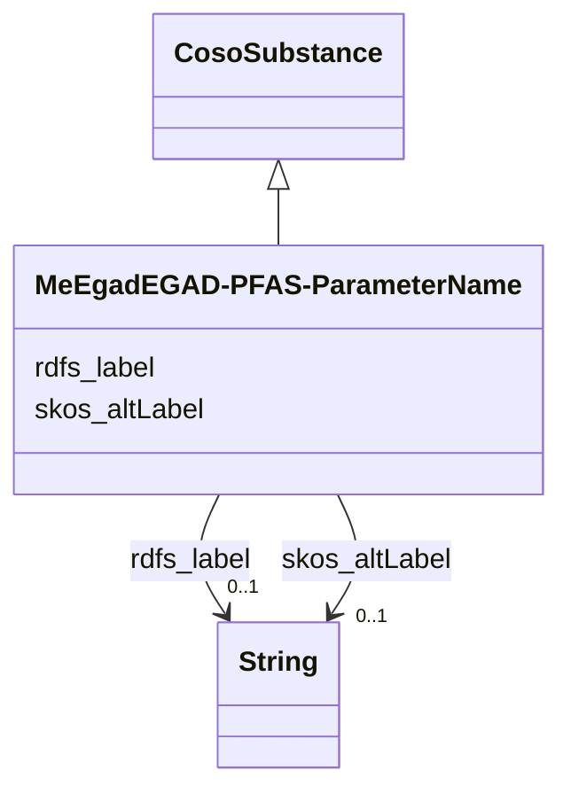

# Class: EGAD - PFAS Parameter Name (me_egad_EGAD-PFAS-ParameterName)


_No class (type) description specified_


This class occurs 101 times.


URI: [me_egad:EGAD-PFAS-ParameterName](http://sawgraph.spatialai.org/v1/me-egad#EGAD-PFAS-ParameterName)





## Inheritance
* [CosoSubstance](../classes/CosoSubstance.md)
    * **MeEgadEGAD-PFAS-ParameterName**


## Slots

| Name | Cardinality and Range | Description | Inheritance | Occurrences |
| ---  | --- | --- | --- | --- |
| [skos_altLabel](../slots/skos_altLabel.md) | 0..1 <br/> [xsd:string](http://www.w3.org/2001/XMLSchema#string) | No slot (predicate) description specified <br/>  | direct |  |
| [rdfs_label](../slots/rdfs_label.md) | 0..1 <br/> [xsd:string](http://www.w3.org/2001/XMLSchema#string) | No slot (predicate) description specified <br/>  | direct |  |


## LinkML Source

<!-- TODO: investigate https://stackoverflow.com/questions/37606292/how-to-create-tabbed-code-blocks-in-mkdocs-or-sphinx -->

### Direct

<details>

```yaml
name: me_egad_EGAD-PFAS-ParameterName
conforms_to: No schema conformance document specified
annotations:
  count:
    tag: count
    value: 101
description: No class (type) description specified
title: EGAD - PFAS Parameter Name
from_schema: sawgraph-kg
rank: 1000
is_a: coso_Substance
slots:
- skos_altLabel
- rdfs_label
class_uri: me_egad:EGAD-PFAS-ParameterName

```
</details>

### Induced

<details>

```yaml
name: me_egad_EGAD-PFAS-ParameterName
conforms_to: No schema conformance document specified
annotations:
  count:
    tag: count
    value: 101
description: No class (type) description specified
title: EGAD - PFAS Parameter Name
from_schema: sawgraph-kg
rank: 1000
is_a: coso_Substance
attributes:
  skos_altLabel:
    name: skos_altLabel
    annotations:
      count:
        tag: count
        value: 8144
    description: No slot (predicate) description specified
    title: No slot (predicate) name specified -- this slot is noted as a subproperty
      of another slot in this graph but has not itself been defined.
    examples:
    - object:
        example_object: B-5
        example_object_type: string
        example_predicate: skos:altLabel
        example_subject: me_egad_data:samplePoint.100410
        example_subject_type: me_egad_EGAD-SamplePoint
    - object:
        example_object: 10:2 FTS_A
        example_object_type: string
        example_predicate: skos:altLabel
        example_subject: me_egad_data:parameter.10-2_FTS_A
        example_subject_type: owl_NamedIndividual
    from_schema: sawgraph-kg
    rank: 1000
    slot_uri: skos:altLabel
    alias: skos_altLabel
    owner: me_egad_EGAD-PFAS-ParameterName
    domain_of:
    - owl_NamedIndividual
    - coso_Substance
    - coso_SubstanceCollection
    - me_egad_EGAD-PFAS-ParameterName
    - me_egad_EGAD-SamplePoint
    range: string
  rdfs_label:
    name: rdfs_label
    annotations:
      count:
        tag: count
        value: 1194911
      string:
        tag: string
        value: 1
    description: No slot (predicate) description specified
    examples:
    - object:
        example_object: Microgram per Kilogram
        example_object_type: string
        example_predicate: rdfs:label
        example_subject: http://qudt.org/vocab/unit/MicroGM-PER-KiloGM
        example_subject_type: qudt_Unit
    - object:
        example_object: AB
        example_object_type: string
        example_predicate: rdfs:label
        example_subject: me_egad_data:AB
        example_subject_type: prov_Agent
    - object:
        example_object: COMPOUND IS FOUND IN THE ASSOCIATED METHOD BLANK (ORGANIC)
          OR THE REPORTED VALUE WAS LESS THAN THE REPORTING LIMIT BUT GREATER THAN
          OR EQUAL TO THE IDL. (INORGANIC)
        example_object_type: string
        example_predicate: rdfs:label
        example_subject: me_egad_data:concentrationQualifier.B
        example_subject_type: owl_NamedIndividual
    - object:
        example_object: ALPHA ANALYTICAL LAB - WESTBOROUGH, MA
        example_object_type: string
        example_predicate: rdfs:label
        example_subject: me_egad_data:organization.lab.AA
        example_subject_type: prov_Organization
    - object:
        example_object: EGAD PFAS measurements for sample EP001
        example_object_type: string
        example_predicate: rdfs:label
        example_subject: me_egad_data:result.101365P.NA.20130507.1763231
        example_subject_type: me_egad_EGAD-SinglePFAS-Concentration
    - object:
        example_object: EGAD PFAS measurements for sample EP001
        example_object_type: string
        example_predicate: rdfs:label
        example_subject: me_egad_data:result.101365P.NA.20130507.DEP18010
        example_subject_type: me_egad_EGAD-AggregatePFAS-Concentration
    - object:
        example_object: EGAD sample BETH WILLIAMS ACF
        example_object_type: string
        example_predicate: rdfs:label
        example_subject: me_egad_data:sample.AAL210144001R.20210112
        example_subject_type: me_egad_EGAD-Sample
    - object:
        example_object: EGAD sample point 100410
        example_object_type: string
        example_predicate: rdfs:label
        example_subject: me_egad_data:samplePoint.100410
        example_subject_type: me_egad_EGAD-SamplePoint
    - object:
        example_object: EGAD sampled feature associated with sample point 100410
        example_object_type: string
        example_predicate: rdfs:label
        example_subject: me_egad_data:sampledFeature.100410
        example_subject_type: me_egad_EGAD-SampledFeature
    - object:
        example_object: MAINE ARMY NATIONAL GUARD - BANGOR RANGE
        example_object_type: string
        example_predicate: rdfs:label
        example_subject: me_egad_data:site.100843
        example_subject_type: me_egad_EGAD-Site
    - object:
        example_object: FARMINGTON VILLAGE CORPORATION
        example_object_type: string
        example_predicate: rdfs:label
        example_subject: me_egad_data:site.131980
        example_subject_type: me_egad_EGAD-PFAS-Site
    - object:
        example_object: Single Contamiant Concentration Quantity
        example_object_type: string
        example_predicate: rdfs:label
        example_subject: coso:SingleContaminantConcentrationQuantityKind
        example_subject_type: coso_ContaminantConcentrationQuantityKind
    - object:
        example_object: Non-Detect
        example_object_type: string
        example_predicate: rdfs:label
        example_subject: coso:non-detect
        example_subject_type: qudt_EnumeratedValue
    - object:
        example_object: Enumerated Quantity
        example_object_type: string
        example_predicate: rdfs:label
        example_subject: qudt:EnumeratedQuantity
        example_subject_type: None
    - object:
        example_object: EGAD PFAS observation for sample BETH WILLIAMS ACF
        example_object_type: string
        example_predicate: rdfs:label
        example_subject: me_egad_data:observation.AAL210144001R.20210112.1763231
        example_subject_type: me_egad_EGAD-PFAS-Observation
    from_schema: sawgraph-kg
    rank: 1000
    slot_uri: rdfs:label
    alias: rdfs_label
    owner: me_egad_EGAD-PFAS-ParameterName
    domain_of:
    - owl_NamedIndividual
    - owl_OntologyProperty
    - qudt_AspectClass
    - qudt_BitEncodingType
    - qudt_BooleanEncodingType
    - qudt_ByteEncodingType
    - qudt_CardinalityType
    - qudt_CharEncodingType
    - qudt_DateTimeStringEncodingType
    - qudt_EndianType
    - qudt_EnumeratedValue
    - qudt_FloatingPointEncodingType
    - qudt_IntegerEncodingType
    - qudt_OrderedType
    - qudt_SignednessType
    - qudt_Unit
    - vaem_#CatalogEntry
    - vaem_#GraphMetaData
    - vaem_#Party
    - coso_ContaminantConcentrationQuantityKind
    - coso_ContaminantVolumeQuantityKind
    - coso_Substance
    - coso_SubstanceCollection
    - me_egad_EGAD-AggregatePFAS-Concentration
    - me_egad_EGAD-AnalysisMethod
    - me_egad_EGAD-ConcentrationQualifier
    - me_egad_EGAD-PFAS-Observation
    - me_egad_EGAD-PFAS-ParameterName
    - me_egad_EGAD-PFAS-Site
    - me_egad_EGAD-ResultType
    - me_egad_EGAD-Sample
    - me_egad_EGAD-SampleCollectionMethod
    - me_egad_EGAD-SampleDetailedLocation
    - me_egad_EGAD-SampleMaterialType
    - me_egad_EGAD-SampleMaterialTypeQualifier
    - me_egad_EGAD-SamplePoint
    - me_egad_EGAD-SamplePointType
    - me_egad_EGAD-SampleTreatmentStatus
    - me_egad_EGAD-SampledFeature
    - me_egad_EGAD-SinglePFAS-Concentration
    - me_egad_EGAD-Site
    - me_egad_EGAD-SiteType
    - me_egad_EGAD-ValidationLevel
    - prov_Agent
    - prov_Organization
    range: string
class_uri: me_egad:EGAD-PFAS-ParameterName

```
</details>