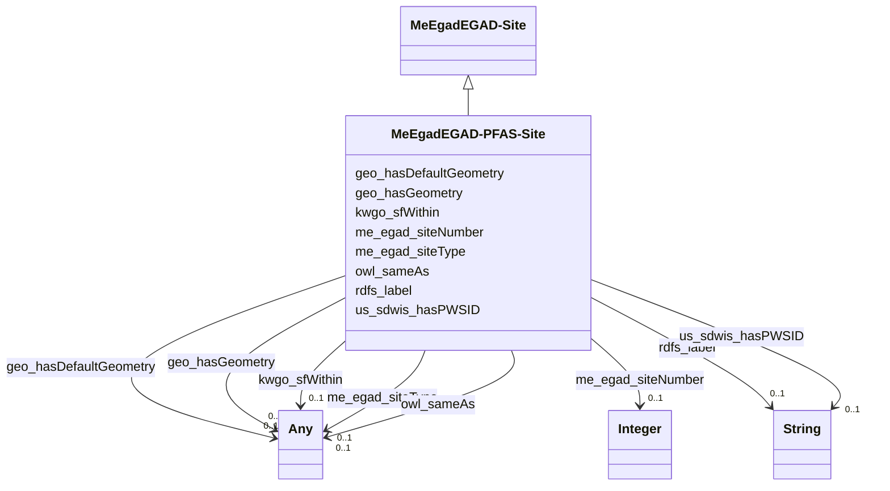

# Class: EGAD - PFAS Site (me_egad_EGAD-PFAS-Site)


_No class (type) description specified_


This class occurs 957 times.


URI: [me_egad:EGAD-PFAS-Site](http://sawgraph.spatialai.org/v1/me-egad#EGAD-PFAS-Site)





## Inheritance
* [MeEgadEGAD-Site](../classes/MeEgadEGAD-Site.md)
    * **MeEgadEGAD-PFAS-Site**


## Slots

| Name | Cardinality and Range | Description | Inheritance | Occurrences |
| ---  | --- | --- | --- | --- |
| [rdfs_label](../slots/rdfs_label.md) | 0..1 <br/> [xsd:string](http://www.w3.org/2001/XMLSchema#string) | No slot (predicate) description specified <br/>  | direct | 45 |
| [us_sdwis_hasPWSID](../slots/us_sdwis_hasPWSID.md) | 0..1 <br/> [xsd:string](http://www.w3.org/2001/XMLSchema#string) | No slot (predicate) description specified <br/>  | direct | 13 |
| [kwgo_sfWithin](../slots/kwgo_sfWithin.md) | 0..1 <br/> [xsd:anyURI](http://www.w3.org/2001/XMLSchema#anyURI)&nbsp;or&nbsp;<br />[KwgoS2CellLevel13](../classes/KwgoS2CellLevel13.md) | No slot (predicate) description specified <br/>  | direct | 926 |
| [me_egad_siteNumber](../slots/me_egad_siteNumber.md) | 0..1 <br/> [xsd:integer](http://www.w3.org/2001/XMLSchema#integer) | Site number in the EGAD dataset from the state of Maine <br/>  | direct | 45 |
| [geo_hasGeometry](../slots/geo_hasGeometry.md) | 0..1 <br/> [GeoGeometry](../classes/GeoGeometry.md)&nbsp;or&nbsp;<br />[Sf#Point](../classes/Sf#Point.md) | No slot (predicate) description specified <br/>  | direct | 3450 |
| [me_egad_siteType](../slots/me_egad_siteType.md) | 0..1 <br/> [MeEgadEGAD-SiteType](../classes/MeEgadEGAD-SiteType.md)&nbsp;or&nbsp;<br />[OwlNamedIndividual](../classes/OwlNamedIndividual.md) | No slot (predicate) description specified <br/>  | direct | 2636 |
| [owl_sameAs](../slots/owl_sameAs.md) | 0..1 <br/> [QudtUnit](../classes/QudtUnit.md)&nbsp;or&nbsp;<br />[xsd:anyURI](http://www.w3.org/2001/XMLSchema#anyURI) | No slot (predicate) description specified <br/>  | direct | 13 |
| [geo_hasDefaultGeometry](../slots/geo_hasDefaultGeometry.md) | 0..1 <br/> [GeoGeometry](../classes/GeoGeometry.md)&nbsp;or&nbsp;<br />[Sf#Point](../classes/Sf#Point.md) | No slot (predicate) description specified <br/>  | direct | 3450 |


## Usages

| used by | used in | type | used |
| ---  | --- | --- | --- |
| [KwgoS2CellLevel13](../classes/KwgoS2CellLevel13.md) | [kwgo_sfContains](../slots/kwgo_sfContains.md) | any_of[range] | [MeEgadEGAD-PFAS-Site](../classes/MeEgadEGAD-PFAS-Site.md) |
| [MeEgadEGAD-SamplePoint](../classes/MeEgadEGAD-SamplePoint.md) | [me_egad_associatedSite](../slots/me_egad_associatedSite.md) | any_of[range] | [MeEgadEGAD-PFAS-Site](../classes/MeEgadEGAD-PFAS-Site.md) |


## LinkML Source

<!-- TODO: investigate https://stackoverflow.com/questions/37606292/how-to-create-tabbed-code-blocks-in-mkdocs-or-sphinx -->

### Direct

<details>

```yaml
name: me_egad_EGAD-PFAS-Site
conforms_to: No schema conformance document specified
annotations:
  count:
    tag: count
    value: 957
description: No class (type) description specified
title: EGAD - PFAS Site
from_schema: sawgraph-kg
rank: 1000
is_a: me_egad_EGAD-Site
slots:
- rdfs_label
- us_sdwis_hasPWSID
- kwgo_sfWithin
- me_egad_siteNumber
- geo_hasGeometry
- me_egad_siteType
- owl_sameAs
- geo_hasDefaultGeometry
slot_usage:
  geo_hasDefaultGeometry:
    name: geo_hasDefaultGeometry
    annotations:
      geo_Geometry:
        tag: geo_Geometry
        value: 1725
      sf_#Point:
        tag: sf_#Point
        value: 1725
  geo_hasGeometry:
    name: geo_hasGeometry
    annotations:
      geo_Geometry:
        tag: geo_Geometry
        value: 1725
      sf_#Point:
        tag: sf_#Point
        value: 1725
  kwgo_sfWithin:
    name: kwgo_sfWithin
    annotations:
      kwgo_S2Cell_Level13:
        tag: kwgo_S2Cell_Level13
        value: 883
      uri:
        tag: uri
        value: 43
  me_egad_siteNumber:
    name: me_egad_siteNumber
    annotations:
      integer:
        tag: integer
        value: 45
  me_egad_siteType:
    name: me_egad_siteType
    annotations:
      me_egad_EGAD-SiteType:
        tag: me_egad_EGAD-SiteType
        value: 1318
      owl_NamedIndividual:
        tag: owl_NamedIndividual
        value: 1318
  owl_sameAs:
    name: owl_sameAs
    annotations:
      uri:
        tag: uri
        value: 13
  rdfs_label:
    name: rdfs_label
    annotations:
      string:
        tag: string
        value: 45
  us_sdwis_hasPWSID:
    name: us_sdwis_hasPWSID
    annotations:
      string:
        tag: string
        value: 13
class_uri: me_egad:EGAD-PFAS-Site

```
</details>

### Induced

<details>

```yaml
name: me_egad_EGAD-PFAS-Site
conforms_to: No schema conformance document specified
annotations:
  count:
    tag: count
    value: 957
description: No class (type) description specified
title: EGAD - PFAS Site
from_schema: sawgraph-kg
rank: 1000
is_a: me_egad_EGAD-Site
slot_usage:
  geo_hasDefaultGeometry:
    name: geo_hasDefaultGeometry
    annotations:
      geo_Geometry:
        tag: geo_Geometry
        value: 1725
      sf_#Point:
        tag: sf_#Point
        value: 1725
  geo_hasGeometry:
    name: geo_hasGeometry
    annotations:
      geo_Geometry:
        tag: geo_Geometry
        value: 1725
      sf_#Point:
        tag: sf_#Point
        value: 1725
  kwgo_sfWithin:
    name: kwgo_sfWithin
    annotations:
      kwgo_S2Cell_Level13:
        tag: kwgo_S2Cell_Level13
        value: 883
      uri:
        tag: uri
        value: 43
  me_egad_siteNumber:
    name: me_egad_siteNumber
    annotations:
      integer:
        tag: integer
        value: 45
  me_egad_siteType:
    name: me_egad_siteType
    annotations:
      me_egad_EGAD-SiteType:
        tag: me_egad_EGAD-SiteType
        value: 1318
      owl_NamedIndividual:
        tag: owl_NamedIndividual
        value: 1318
  owl_sameAs:
    name: owl_sameAs
    annotations:
      uri:
        tag: uri
        value: 13
  rdfs_label:
    name: rdfs_label
    annotations:
      string:
        tag: string
        value: 45
  us_sdwis_hasPWSID:
    name: us_sdwis_hasPWSID
    annotations:
      string:
        tag: string
        value: 13
attributes:
  rdfs_label:
    name: rdfs_label
    annotations:
      string:
        tag: string
        value: 45
    description: No slot (predicate) description specified
    examples:
    - object:
        example_object: Microgram per Kilogram
        example_object_type: string
        example_predicate: rdfs:label
        example_subject: http://qudt.org/vocab/unit/MicroGM-PER-KiloGM
        example_subject_type: qudt_Unit
    - object:
        example_object: AB
        example_object_type: string
        example_predicate: rdfs:label
        example_subject: me_egad_data:AB
        example_subject_type: prov_Agent
    - object:
        example_object: COMPOUND IS FOUND IN THE ASSOCIATED METHOD BLANK (ORGANIC)
          OR THE REPORTED VALUE WAS LESS THAN THE REPORTING LIMIT BUT GREATER THAN
          OR EQUAL TO THE IDL. (INORGANIC)
        example_object_type: string
        example_predicate: rdfs:label
        example_subject: me_egad_data:concentrationQualifier.B
        example_subject_type: owl_NamedIndividual
    - object:
        example_object: ALPHA ANALYTICAL LAB - WESTBOROUGH, MA
        example_object_type: string
        example_predicate: rdfs:label
        example_subject: me_egad_data:organization.lab.AA
        example_subject_type: prov_Organization
    - object:
        example_object: EGAD PFAS measurements for sample EP001
        example_object_type: string
        example_predicate: rdfs:label
        example_subject: me_egad_data:result.101365P.NA.20130507.1763231
        example_subject_type: me_egad_EGAD-SinglePFAS-Concentration
    - object:
        example_object: EGAD PFAS measurements for sample EP001
        example_object_type: string
        example_predicate: rdfs:label
        example_subject: me_egad_data:result.101365P.NA.20130507.DEP18010
        example_subject_type: me_egad_EGAD-AggregatePFAS-Concentration
    - object:
        example_object: EGAD sample BETH WILLIAMS ACF
        example_object_type: string
        example_predicate: rdfs:label
        example_subject: me_egad_data:sample.AAL210144001R.20210112
        example_subject_type: me_egad_EGAD-Sample
    - object:
        example_object: EGAD sample point 100410
        example_object_type: string
        example_predicate: rdfs:label
        example_subject: me_egad_data:samplePoint.100410
        example_subject_type: me_egad_EGAD-SamplePoint
    - object:
        example_object: EGAD sampled feature associated with sample point 100410
        example_object_type: string
        example_predicate: rdfs:label
        example_subject: me_egad_data:sampledFeature.100410
        example_subject_type: me_egad_EGAD-SampledFeature
    - object:
        example_object: MAINE ARMY NATIONAL GUARD - BANGOR RANGE
        example_object_type: string
        example_predicate: rdfs:label
        example_subject: me_egad_data:site.100843
        example_subject_type: me_egad_EGAD-Site
    - object:
        example_object: FARMINGTON VILLAGE CORPORATION
        example_object_type: string
        example_predicate: rdfs:label
        example_subject: me_egad_data:site.131980
        example_subject_type: me_egad_EGAD-PFAS-Site
    - object:
        example_object: Single Contamiant Concentration Quantity
        example_object_type: string
        example_predicate: rdfs:label
        example_subject: coso:SingleContaminantConcentrationQuantityKind
        example_subject_type: coso_ContaminantConcentrationQuantityKind
    - object:
        example_object: Non-Detect
        example_object_type: string
        example_predicate: rdfs:label
        example_subject: coso:non-detect
        example_subject_type: qudt_EnumeratedValue
    - object:
        example_object: Enumerated Quantity
        example_object_type: string
        example_predicate: rdfs:label
        example_subject: qudt:EnumeratedQuantity
        example_subject_type: None
    - object:
        example_object: EGAD PFAS observation for sample BETH WILLIAMS ACF
        example_object_type: string
        example_predicate: rdfs:label
        example_subject: me_egad_data:observation.AAL210144001R.20210112.1763231
        example_subject_type: me_egad_EGAD-PFAS-Observation
    from_schema: sawgraph-kg
    rank: 1000
    slot_uri: rdfs:label
    alias: rdfs_label
    owner: me_egad_EGAD-PFAS-Site
    domain_of:
    - owl_NamedIndividual
    - owl_OntologyProperty
    - qudt_AspectClass
    - qudt_BitEncodingType
    - qudt_BooleanEncodingType
    - qudt_ByteEncodingType
    - qudt_CardinalityType
    - qudt_CharEncodingType
    - qudt_DateTimeStringEncodingType
    - qudt_EndianType
    - qudt_EnumeratedValue
    - qudt_FloatingPointEncodingType
    - qudt_IntegerEncodingType
    - qudt_OrderedType
    - qudt_SignednessType
    - qudt_Unit
    - vaem_#CatalogEntry
    - vaem_#GraphMetaData
    - vaem_#Party
    - coso_ContaminantConcentrationQuantityKind
    - coso_ContaminantVolumeQuantityKind
    - coso_Substance
    - coso_SubstanceCollection
    - me_egad_EGAD-AggregatePFAS-Concentration
    - me_egad_EGAD-AnalysisMethod
    - me_egad_EGAD-ConcentrationQualifier
    - me_egad_EGAD-PFAS-Observation
    - me_egad_EGAD-PFAS-ParameterName
    - me_egad_EGAD-PFAS-Site
    - me_egad_EGAD-ResultType
    - me_egad_EGAD-Sample
    - me_egad_EGAD-SampleCollectionMethod
    - me_egad_EGAD-SampleDetailedLocation
    - me_egad_EGAD-SampleMaterialType
    - me_egad_EGAD-SampleMaterialTypeQualifier
    - me_egad_EGAD-SamplePoint
    - me_egad_EGAD-SamplePointType
    - me_egad_EGAD-SampleTreatmentStatus
    - me_egad_EGAD-SampledFeature
    - me_egad_EGAD-SinglePFAS-Concentration
    - me_egad_EGAD-Site
    - me_egad_EGAD-SiteType
    - me_egad_EGAD-ValidationLevel
    - prov_Agent
    - prov_Organization
    range: string
  us_sdwis_hasPWSID:
    name: us_sdwis_hasPWSID
    annotations:
      string:
        tag: string
        value: 13
    description: No slot (predicate) description specified
    examples:
    - object:
        example_object: ME0002893
        example_object_type: string
        example_predicate: us_sdwis:hasPWSID
        example_subject: me_egad_data:site.124837
        example_subject_type: me_egad_EGAD-Site
    - object:
        example_object: ME0090540
        example_object_type: string
        example_predicate: us_sdwis:hasPWSID
        example_subject: me_egad_data:site.131980
        example_subject_type: me_egad_EGAD-PFAS-Site
    from_schema: sawgraph-kg
    rank: 1000
    slot_uri: us_sdwis:hasPWSID
    alias: us_sdwis_hasPWSID
    owner: me_egad_EGAD-PFAS-Site
    domain_of:
    - me_egad_EGAD-PFAS-Site
    - me_egad_EGAD-Site
    range: string
  kwgo_sfWithin:
    name: kwgo_sfWithin
    annotations:
      kwgo_S2Cell_Level13:
        tag: kwgo_S2Cell_Level13
        value: 883
      uri:
        tag: uri
        value: 43
    description: No slot (predicate) description specified
    examples:
    - object:
        example_object: kwgr:s2.level13.5525380644965711872
        example_object_type: kwgo_S2Cell_Level13
        example_predicate: kwgo:sfWithin
        example_subject: me_egad_data:samplePoint.100410
        example_subject_type: me_egad_EGAD-SamplePoint
    - object:
        example_object: dcgeoid:2302778255
        example_object_type: uri
        example_predicate: kwgo:sfWithin
        example_subject: me_egad_data:samplePoint.100410
        example_subject_type: me_egad_EGAD-SamplePoint
    - object:
        example_object: kwgr:s2.level13.5525436170302914560
        example_object_type: kwgo_S2Cell_Level13
        example_predicate: kwgo:sfWithin
        example_subject: me_egad_data:site.100843
        example_subject_type: me_egad_EGAD-PFAS-Site
    - object:
        example_object: kwgr:s2.level13.5525436170302914560
        example_object_type: kwgo_S2Cell_Level13
        example_predicate: kwgo:sfWithin
        example_subject: me_egad_data:site.100843
        example_subject_type: me_egad_EGAD-Site
    - object:
        example_object: dcgeoid:2301902795
        example_object_type: uri
        example_predicate: kwgo:sfWithin
        example_subject: me_egad_data:site.100843
        example_subject_type: me_egad_EGAD-Site
    - object:
        example_object: dcgeoid:2300724775
        example_object_type: uri
        example_predicate: kwgo:sfWithin
        example_subject: me_egad_data:site.131980
        example_subject_type: me_egad_EGAD-PFAS-Site
    from_schema: sawgraph-kg
    rank: 1000
    slot_uri: kwgo:sfWithin
    alias: kwgo_sfWithin
    owner: me_egad_EGAD-PFAS-Site
    domain_of:
    - me_egad_EGAD-PFAS-Site
    - me_egad_EGAD-SamplePoint
    - me_egad_EGAD-Site
    range: Any
    any_of:
    - range: uri
    - range: kwgo_S2Cell_Level13
  me_egad_siteNumber:
    name: me_egad_siteNumber
    annotations:
      integer:
        tag: integer
        value: 45
    description: Site number in the EGAD dataset from the state of Maine.
    title: site number
    examples:
    - object:
        example_object: '100843'
        example_object_type: integer
        example_predicate: me_egad:siteNumber
        example_subject: me_egad_data:site.100843
        example_subject_type: me_egad_EGAD-Site
    - object:
        example_object: '131980'
        example_object_type: integer
        example_predicate: me_egad:siteNumber
        example_subject: me_egad_data:site.131980
        example_subject_type: me_egad_EGAD-PFAS-Site
    from_schema: sawgraph-kg
    rank: 1000
    slot_uri: me_egad:siteNumber
    alias: me_egad_siteNumber
    owner: me_egad_EGAD-PFAS-Site
    domain_of:
    - me_egad_EGAD-PFAS-Site
    - me_egad_EGAD-Site
    subproperty_of: dct_identifier
    range: integer
  geo_hasGeometry:
    name: geo_hasGeometry
    annotations:
      geo_Geometry:
        tag: geo_Geometry
        value: 1725
      sf_#Point:
        tag: sf_#Point
        value: 1725
    description: No slot (predicate) description specified
    examples:
    - object:
        example_object: me_egad_data:samplePoint.geometry.100410
        example_object_type: geo_Geometry
        example_predicate: geo:hasGeometry
        example_subject: me_egad_data:samplePoint.100410
        example_subject_type: me_egad_EGAD-SamplePoint
    - object:
        example_object: me_egad_data:samplePoint.geometry.100410
        example_object_type: sf_#Point
        example_predicate: geo:hasGeometry
        example_subject: me_egad_data:samplePoint.100410
        example_subject_type: me_egad_EGAD-SamplePoint
    - object:
        example_object: me_egad_data:egad.site.geometry.100843
        example_object_type: geo_Geometry
        example_predicate: geo:hasGeometry
        example_subject: me_egad_data:site.100843
        example_subject_type: me_egad_EGAD-PFAS-Site
    - object:
        example_object: me_egad_data:egad.site.geometry.100843
        example_object_type: sf_#Point
        example_predicate: geo:hasGeometry
        example_subject: me_egad_data:site.100843
        example_subject_type: me_egad_EGAD-PFAS-Site
    - object:
        example_object: me_egad_data:egad.site.geometry.100843
        example_object_type: geo_Geometry
        example_predicate: geo:hasGeometry
        example_subject: me_egad_data:site.100843
        example_subject_type: me_egad_EGAD-Site
    - object:
        example_object: me_egad_data:egad.site.geometry.100843
        example_object_type: sf_#Point
        example_predicate: geo:hasGeometry
        example_subject: me_egad_data:site.100843
        example_subject_type: me_egad_EGAD-Site
    from_schema: sawgraph-kg
    rank: 1000
    slot_uri: geo:hasGeometry
    alias: geo_hasGeometry
    owner: me_egad_EGAD-PFAS-Site
    domain_of:
    - me_egad_EGAD-PFAS-Site
    - me_egad_EGAD-SamplePoint
    - me_egad_EGAD-Site
    range: Any
    any_of:
    - range: geo_Geometry
    - range: sf_#Point
  me_egad_siteType:
    name: me_egad_siteType
    annotations:
      me_egad_EGAD-SiteType:
        tag: me_egad_EGAD-SiteType
        value: 1318
      owl_NamedIndividual:
        tag: owl_NamedIndividual
        value: 1318
    description: No slot (predicate) description specified
    examples:
    - object:
        example_object: me_egad_data:siteType.UNCDOD
        example_object_type: me_egad_EGAD-SiteType
        example_predicate: me_egad:siteType
        example_subject: me_egad_data:site.100843
        example_subject_type: me_egad_EGAD-PFAS-Site
    - object:
        example_object: me_egad_data:siteType.UNCDOD
        example_object_type: owl_NamedIndividual
        example_predicate: me_egad:siteType
        example_subject: me_egad_data:site.100843
        example_subject_type: me_egad_EGAD-PFAS-Site
    - object:
        example_object: me_egad_data:siteType.UNCDOD
        example_object_type: me_egad_EGAD-SiteType
        example_predicate: me_egad:siteType
        example_subject: me_egad_data:site.100843
        example_subject_type: me_egad_EGAD-Site
    - object:
        example_object: me_egad_data:siteType.UNCDOD
        example_object_type: owl_NamedIndividual
        example_predicate: me_egad:siteType
        example_subject: me_egad_data:site.100843
        example_subject_type: me_egad_EGAD-Site
    from_schema: sawgraph-kg
    rank: 1000
    slot_uri: me_egad:siteType
    alias: me_egad_siteType
    owner: me_egad_EGAD-PFAS-Site
    domain_of:
    - me_egad_EGAD-PFAS-Site
    - me_egad_EGAD-Site
    range: Any
    any_of:
    - range: me_egad_EGAD-SiteType
    - range: owl_NamedIndividual
  owl_sameAs:
    name: owl_sameAs
    annotations:
      uri:
        tag: uri
        value: 13
    description: No slot (predicate) description specified
    examples:
    - object:
        example_object: http://qudt.org/vocab/unit/PERCENT
        example_object_type: qudt_Unit
        example_predicate: owl:sameAs
        example_subject: http://qudt.org/vocab/unit/PERCENT
        example_subject_type: qudt_Unit
    - object:
        example_object: http://geoconnex.us/ref/pws/ME0002893
        example_object_type: uri
        example_predicate: owl:sameAs
        example_subject: me_egad_data:site.124837
        example_subject_type: me_egad_EGAD-Site
    - object:
        example_object: http://geoconnex.us/ref/pws/ME0090540
        example_object_type: uri
        example_predicate: owl:sameAs
        example_subject: me_egad_data:site.131980
        example_subject_type: me_egad_EGAD-PFAS-Site
    from_schema: sawgraph-kg
    rank: 1000
    slot_uri: owl:sameAs
    alias: owl_sameAs
    owner: me_egad_EGAD-PFAS-Site
    domain_of:
    - qudt_Unit
    - me_egad_EGAD-PFAS-Site
    - me_egad_EGAD-Site
    range: Any
    any_of:
    - range: qudt_Unit
    - range: uri
  geo_hasDefaultGeometry:
    name: geo_hasDefaultGeometry
    annotations:
      geo_Geometry:
        tag: geo_Geometry
        value: 1725
      sf_#Point:
        tag: sf_#Point
        value: 1725
    description: No slot (predicate) description specified
    examples:
    - object:
        example_object: me_egad_data:samplePoint.geometry.100410
        example_object_type: geo_Geometry
        example_predicate: geo:hasDefaultGeometry
        example_subject: me_egad_data:samplePoint.100410
        example_subject_type: me_egad_EGAD-SamplePoint
    - object:
        example_object: me_egad_data:samplePoint.geometry.100410
        example_object_type: sf_#Point
        example_predicate: geo:hasDefaultGeometry
        example_subject: me_egad_data:samplePoint.100410
        example_subject_type: me_egad_EGAD-SamplePoint
    - object:
        example_object: me_egad_data:egad.site.geometry.100843
        example_object_type: geo_Geometry
        example_predicate: geo:hasDefaultGeometry
        example_subject: me_egad_data:site.100843
        example_subject_type: me_egad_EGAD-PFAS-Site
    - object:
        example_object: me_egad_data:egad.site.geometry.100843
        example_object_type: sf_#Point
        example_predicate: geo:hasDefaultGeometry
        example_subject: me_egad_data:site.100843
        example_subject_type: me_egad_EGAD-PFAS-Site
    - object:
        example_object: me_egad_data:egad.site.geometry.100843
        example_object_type: geo_Geometry
        example_predicate: geo:hasDefaultGeometry
        example_subject: me_egad_data:site.100843
        example_subject_type: me_egad_EGAD-Site
    - object:
        example_object: me_egad_data:egad.site.geometry.100843
        example_object_type: sf_#Point
        example_predicate: geo:hasDefaultGeometry
        example_subject: me_egad_data:site.100843
        example_subject_type: me_egad_EGAD-Site
    from_schema: sawgraph-kg
    rank: 1000
    slot_uri: geo:hasDefaultGeometry
    alias: geo_hasDefaultGeometry
    owner: me_egad_EGAD-PFAS-Site
    domain_of:
    - me_egad_EGAD-PFAS-Site
    - me_egad_EGAD-SamplePoint
    - me_egad_EGAD-Site
    range: Any
    any_of:
    - range: geo_Geometry
    - range: sf_#Point
class_uri: me_egad:EGAD-PFAS-Site

```
</details>