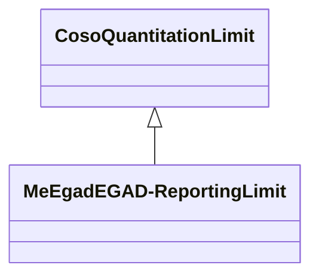

# Class: EGAD - Reporting Limit (me_egad_EGAD-ReportingLimit)


_No class (type) description specified_


URI: [me_egad:EGAD-ReportingLimit](http://sawgraph.spatialai.org/v1/me-egad#EGAD-ReportingLimit)





## Inheritance
* [CosoQuantitationLimit](../classes/CosoQuantitationLimit.md)
    * **MeEgadEGAD-ReportingLimit**


## Slots

| Name | Cardinality and Range | Description | Inheritance | Occurrences |
| ---  | --- | --- | --- | --- |


## Usages

| used by | used in | type | used |
| ---  | --- | --- | --- |
| [MeEgadEGAD-AggregatePFAS-Concentration](../classes/MeEgadEGAD-AggregatePFAS-Concentration.md) | [me_egad_reportingLimit](../slots/me_egad_reportingLimit.md) | any_of[range] | [MeEgadEGAD-ReportingLimit](../classes/MeEgadEGAD-ReportingLimit.md) |
| [MeEgadEGAD-SinglePFAS-Concentration](../classes/MeEgadEGAD-SinglePFAS-Concentration.md) | [me_egad_reportingLimit](../slots/me_egad_reportingLimit.md) | any_of[range] | [MeEgadEGAD-ReportingLimit](../classes/MeEgadEGAD-ReportingLimit.md) |


## LinkML Source

<!-- TODO: investigate https://stackoverflow.com/questions/37606292/how-to-create-tabbed-code-blocks-in-mkdocs-or-sphinx -->

### Direct

<details>

```yaml
name: me_egad_EGAD-ReportingLimit
conforms_to: No schema conformance document specified
description: No class (type) description specified
title: EGAD - Reporting Limit
from_schema: sawgraph-kg
rank: 1000
is_a: coso_QuantitationLimit
class_uri: me_egad:EGAD-ReportingLimit

```
</details>

### Induced

<details>

```yaml
name: me_egad_EGAD-ReportingLimit
conforms_to: No schema conformance document specified
description: No class (type) description specified
title: EGAD - Reporting Limit
from_schema: sawgraph-kg
rank: 1000
is_a: coso_QuantitationLimit
class_uri: me_egad:EGAD-ReportingLimit

```
</details>