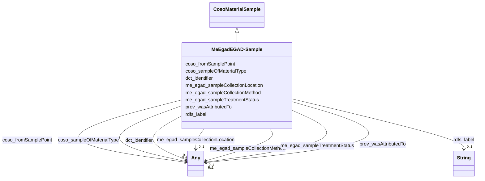

# Class: EGAD - Sample (me_egad_EGAD-Sample)


_No class (type) description specified_


This class occurs 23024 times.


URI: [me_egad:EGAD-Sample](http://sawgraph.spatialai.org/v1/me-egad#EGAD-Sample)





## Inheritance
* [CosoMaterialSample](../classes/CosoMaterialSample.md)
    * **MeEgadEGAD-Sample**


## Slots

| Name | Cardinality and Range | Description | Inheritance | Occurrences |
| ---  | --- | --- | --- | --- |
| [me_egad_sampleCollectionMethod](../slots/me_egad_sampleCollectionMethod.md) | 0..1 <br/> [MeEgadEGAD-SampleCollectionMethod](../classes/MeEgadEGAD-SampleCollectionMethod.md)&nbsp;or&nbsp;<br />[OwlNamedIndividual](../classes/OwlNamedIndividual.md) | No slot (predicate) description specified <br/>  | direct | 45380 |
| [coso_fromSamplePoint](../slots/coso_fromSamplePoint.md) | 0..1 <br/> [MeEgadEGAD-SamplePoint](../classes/MeEgadEGAD-SamplePoint.md)&nbsp;or&nbsp;<br />[CosoSamplePoint](../classes/CosoSamplePoint.md) | No slot (predicate) description specified <br/>  | direct | 23037 |
| [rdfs_label](../slots/rdfs_label.md) | 0..1 <br/> [xsd:string](http://www.w3.org/2001/XMLSchema#string) | No slot (predicate) description specified <br/>  | direct | 23031 |
| [dct_identifier](../slots/dct_identifier.md) | 0..1 <br/> [xsd:string](http://www.w3.org/2001/XMLSchema#string)&nbsp;or&nbsp;<br />[xsd:integer](http://www.w3.org/2001/XMLSchema#integer) | No slot (predicate) description specified <br/>  | direct | 23031 |
| [prov_wasAttributedTo](../slots/prov_wasAttributedTo.md) | 0..1 <br/> [ProvAgent](../classes/ProvAgent.md)&nbsp;or&nbsp;<br />[ProvOrganization](../classes/ProvOrganization.md)&nbsp;or&nbsp;<br />[xsd:anyURI](http://www.w3.org/2001/XMLSchema#anyURI) | No slot (predicate) description specified <br/>  | direct | 20826 |
| [me_egad_sampleCollectionLocation](../slots/me_egad_sampleCollectionLocation.md) | 0..1 <br/> [MeEgadEGAD-SampleDetailedLocation](../classes/MeEgadEGAD-SampleDetailedLocation.md)&nbsp;or&nbsp;<br />[OwlNamedIndividual](../classes/OwlNamedIndividual.md) | No slot (predicate) description specified <br/>  | direct | 31112 |
| [me_egad_sampleTreatmentStatus](../slots/me_egad_sampleTreatmentStatus.md) | 0..1 <br/> [MeEgadEGAD-SampleTreatmentStatus](../classes/MeEgadEGAD-SampleTreatmentStatus.md)&nbsp;or&nbsp;<br />[OwlNamedIndividual](../classes/OwlNamedIndividual.md) | No slot (predicate) description specified <br/>  | direct | 31220 |
| [coso_sampleOfMaterialType](../slots/coso_sampleOfMaterialType.md) | 0..1 <br/> [MeEgadEGAD-SampleMaterialType](../classes/MeEgadEGAD-SampleMaterialType.md)&nbsp;or&nbsp;<br />[OwlNamedIndividual](../classes/OwlNamedIndividual.md)&nbsp;or&nbsp;<br />[MeEgadEGAD-SampleMaterialTypeQualifier](../classes/MeEgadEGAD-SampleMaterialTypeQualifier.md)&nbsp;or&nbsp;<br />[CosoSampleMaterialType](../classes/CosoSampleMaterialType.md) | No slot (predicate) description specified <br/>  | direct | 48546 |


## Usages

| used by | used in | type | used |
| ---  | --- | --- | --- |
| [MeEgadEGAD-PFAS-Observation](../classes/MeEgadEGAD-PFAS-Observation.md) | [coso_analyzedSample](../slots/coso_analyzedSample.md) | any_of[range] | [MeEgadEGAD-Sample](../classes/MeEgadEGAD-Sample.md) |


## LinkML Source

<!-- TODO: investigate https://stackoverflow.com/questions/37606292/how-to-create-tabbed-code-blocks-in-mkdocs-or-sphinx -->

### Direct

<details>

```yaml
name: me_egad_EGAD-Sample
conforms_to: No schema conformance document specified
annotations:
  count:
    tag: count
    value: 23024
description: No class (type) description specified
title: EGAD - Sample
from_schema: sawgraph-kg
rank: 1000
is_a: coso_MaterialSample
slots:
- me_egad_sampleCollectionMethod
- coso_fromSamplePoint
- rdfs_label
- dct_identifier
- prov_wasAttributedTo
- me_egad_sampleCollectionLocation
- me_egad_sampleTreatmentStatus
- coso_sampleOfMaterialType
slot_usage:
  coso_fromSamplePoint:
    name: coso_fromSamplePoint
    annotations:
      me_egad_EGAD-SamplePoint:
        tag: me_egad_EGAD-SamplePoint
        value: 23037
  coso_sampleOfMaterialType:
    name: coso_sampleOfMaterialType
    annotations:
      me_egad_EGAD-SampleMaterialType:
        tag: me_egad_EGAD-SampleMaterialType
        value: 23004
      me_egad_EGAD-SampleMaterialTypeQualifier:
        tag: me_egad_EGAD-SampleMaterialTypeQualifier
        value: 1269
      owl_NamedIndividual:
        tag: owl_NamedIndividual
        value: 24273
  dct_identifier:
    name: dct_identifier
    annotations:
      string:
        tag: string
        value: 23031
  me_egad_sampleCollectionLocation:
    name: me_egad_sampleCollectionLocation
    annotations:
      me_egad_EGAD-SampleDetailedLocation:
        tag: me_egad_EGAD-SampleDetailedLocation
        value: 15556
      owl_NamedIndividual:
        tag: owl_NamedIndividual
        value: 15556
  me_egad_sampleCollectionMethod:
    name: me_egad_sampleCollectionMethod
    annotations:
      me_egad_EGAD-SampleCollectionMethod:
        tag: me_egad_EGAD-SampleCollectionMethod
        value: 22690
      owl_NamedIndividual:
        tag: owl_NamedIndividual
        value: 22690
  me_egad_sampleTreatmentStatus:
    name: me_egad_sampleTreatmentStatus
    annotations:
      me_egad_EGAD-SampleTreatmentStatus:
        tag: me_egad_EGAD-SampleTreatmentStatus
        value: 15610
      owl_NamedIndividual:
        tag: owl_NamedIndividual
        value: 15610
  prov_wasAttributedTo:
    name: prov_wasAttributedTo
    annotations:
      prov_Agent:
        tag: prov_Agent
        value: 20826
  rdfs_label:
    name: rdfs_label
    annotations:
      string:
        tag: string
        value: 23031
class_uri: me_egad:EGAD-Sample

```
</details>

### Induced

<details>

```yaml
name: me_egad_EGAD-Sample
conforms_to: No schema conformance document specified
annotations:
  count:
    tag: count
    value: 23024
description: No class (type) description specified
title: EGAD - Sample
from_schema: sawgraph-kg
rank: 1000
is_a: coso_MaterialSample
slot_usage:
  coso_fromSamplePoint:
    name: coso_fromSamplePoint
    annotations:
      me_egad_EGAD-SamplePoint:
        tag: me_egad_EGAD-SamplePoint
        value: 23037
  coso_sampleOfMaterialType:
    name: coso_sampleOfMaterialType
    annotations:
      me_egad_EGAD-SampleMaterialType:
        tag: me_egad_EGAD-SampleMaterialType
        value: 23004
      me_egad_EGAD-SampleMaterialTypeQualifier:
        tag: me_egad_EGAD-SampleMaterialTypeQualifier
        value: 1269
      owl_NamedIndividual:
        tag: owl_NamedIndividual
        value: 24273
  dct_identifier:
    name: dct_identifier
    annotations:
      string:
        tag: string
        value: 23031
  me_egad_sampleCollectionLocation:
    name: me_egad_sampleCollectionLocation
    annotations:
      me_egad_EGAD-SampleDetailedLocation:
        tag: me_egad_EGAD-SampleDetailedLocation
        value: 15556
      owl_NamedIndividual:
        tag: owl_NamedIndividual
        value: 15556
  me_egad_sampleCollectionMethod:
    name: me_egad_sampleCollectionMethod
    annotations:
      me_egad_EGAD-SampleCollectionMethod:
        tag: me_egad_EGAD-SampleCollectionMethod
        value: 22690
      owl_NamedIndividual:
        tag: owl_NamedIndividual
        value: 22690
  me_egad_sampleTreatmentStatus:
    name: me_egad_sampleTreatmentStatus
    annotations:
      me_egad_EGAD-SampleTreatmentStatus:
        tag: me_egad_EGAD-SampleTreatmentStatus
        value: 15610
      owl_NamedIndividual:
        tag: owl_NamedIndividual
        value: 15610
  prov_wasAttributedTo:
    name: prov_wasAttributedTo
    annotations:
      prov_Agent:
        tag: prov_Agent
        value: 20826
  rdfs_label:
    name: rdfs_label
    annotations:
      string:
        tag: string
        value: 23031
attributes:
  me_egad_sampleCollectionMethod:
    name: me_egad_sampleCollectionMethod
    annotations:
      me_egad_EGAD-SampleCollectionMethod:
        tag: me_egad_EGAD-SampleCollectionMethod
        value: 22690
      owl_NamedIndividual:
        tag: owl_NamedIndividual
        value: 22690
    description: No slot (predicate) description specified
    title: egad - sample collection method
    examples:
    - object:
        example_object: me_egad_data:samplingMethod.GS
        example_object_type: me_egad_EGAD-SampleCollectionMethod
        example_predicate: me_egad:sampleCollectionMethod
        example_subject: me_egad_data:sample.AAL210144001R.20210112
        example_subject_type: me_egad_EGAD-Sample
    - object:
        example_object: me_egad_data:samplingMethod.GS
        example_object_type: owl_NamedIndividual
        example_predicate: me_egad:sampleCollectionMethod
        example_subject: me_egad_data:sample.AAL210144001R.20210112
        example_subject_type: me_egad_EGAD-Sample
    from_schema: sawgraph-kg
    rank: 1000
    slot_uri: me_egad:sampleCollectionMethod
    alias: me_egad_sampleCollectionMethod
    owner: me_egad_EGAD-Sample
    domain_of:
    - me_egad_EGAD-Sample
    subproperty_of: coso_sampleAnnotation
    range: Any
    any_of:
    - range: me_egad_EGAD-SampleCollectionMethod
    - range: owl_NamedIndividual
  coso_fromSamplePoint:
    name: coso_fromSamplePoint
    annotations:
      me_egad_EGAD-SamplePoint:
        tag: me_egad_EGAD-SamplePoint
        value: 23037
    description: No slot (predicate) description specified
    title: from sample point
    examples:
    - object:
        example_object: me_egad_data:samplePoint.146496
        example_object_type: me_egad_EGAD-SamplePoint
        example_predicate: coso:fromSamplePoint
        example_subject: me_egad_data:sample.AAL210144001R.20210112
        example_subject_type: me_egad_EGAD-Sample
    from_schema: sawgraph-kg
    rank: 1000
    domain: coso_MaterialSample
    slot_uri: coso:fromSamplePoint
    alias: coso_fromSamplePoint
    owner: me_egad_EGAD-Sample
    domain_of:
    - me_egad_EGAD-Sample
    range: Any
    any_of:
    - range: me_egad_EGAD-SamplePoint
    - range: coso_SamplePoint
  rdfs_label:
    name: rdfs_label
    annotations:
      string:
        tag: string
        value: 23031
    description: No slot (predicate) description specified
    examples:
    - object:
        example_object: Microgram per Kilogram
        example_object_type: string
        example_predicate: rdfs:label
        example_subject: http://qudt.org/vocab/unit/MicroGM-PER-KiloGM
        example_subject_type: qudt_Unit
    - object:
        example_object: AB
        example_object_type: string
        example_predicate: rdfs:label
        example_subject: me_egad_data:AB
        example_subject_type: prov_Agent
    - object:
        example_object: COMPOUND IS FOUND IN THE ASSOCIATED METHOD BLANK (ORGANIC)
          OR THE REPORTED VALUE WAS LESS THAN THE REPORTING LIMIT BUT GREATER THAN
          OR EQUAL TO THE IDL. (INORGANIC)
        example_object_type: string
        example_predicate: rdfs:label
        example_subject: me_egad_data:concentrationQualifier.B
        example_subject_type: owl_NamedIndividual
    - object:
        example_object: ALPHA ANALYTICAL LAB - WESTBOROUGH, MA
        example_object_type: string
        example_predicate: rdfs:label
        example_subject: me_egad_data:organization.lab.AA
        example_subject_type: prov_Organization
    - object:
        example_object: EGAD PFAS measurements for sample EP001
        example_object_type: string
        example_predicate: rdfs:label
        example_subject: me_egad_data:result.101365P.NA.20130507.1763231
        example_subject_type: me_egad_EGAD-SinglePFAS-Concentration
    - object:
        example_object: EGAD PFAS measurements for sample EP001
        example_object_type: string
        example_predicate: rdfs:label
        example_subject: me_egad_data:result.101365P.NA.20130507.DEP18010
        example_subject_type: me_egad_EGAD-AggregatePFAS-Concentration
    - object:
        example_object: EGAD sample BETH WILLIAMS ACF
        example_object_type: string
        example_predicate: rdfs:label
        example_subject: me_egad_data:sample.AAL210144001R.20210112
        example_subject_type: me_egad_EGAD-Sample
    - object:
        example_object: EGAD sample point 100410
        example_object_type: string
        example_predicate: rdfs:label
        example_subject: me_egad_data:samplePoint.100410
        example_subject_type: me_egad_EGAD-SamplePoint
    - object:
        example_object: EGAD sampled feature associated with sample point 100410
        example_object_type: string
        example_predicate: rdfs:label
        example_subject: me_egad_data:sampledFeature.100410
        example_subject_type: me_egad_EGAD-SampledFeature
    - object:
        example_object: MAINE ARMY NATIONAL GUARD - BANGOR RANGE
        example_object_type: string
        example_predicate: rdfs:label
        example_subject: me_egad_data:site.100843
        example_subject_type: me_egad_EGAD-Site
    - object:
        example_object: FARMINGTON VILLAGE CORPORATION
        example_object_type: string
        example_predicate: rdfs:label
        example_subject: me_egad_data:site.131980
        example_subject_type: me_egad_EGAD-PFAS-Site
    - object:
        example_object: Single Contamiant Concentration Quantity
        example_object_type: string
        example_predicate: rdfs:label
        example_subject: coso:SingleContaminantConcentrationQuantityKind
        example_subject_type: coso_ContaminantConcentrationQuantityKind
    - object:
        example_object: Non-Detect
        example_object_type: string
        example_predicate: rdfs:label
        example_subject: coso:non-detect
        example_subject_type: qudt_EnumeratedValue
    - object:
        example_object: Enumerated Quantity
        example_object_type: string
        example_predicate: rdfs:label
        example_subject: qudt:EnumeratedQuantity
        example_subject_type: None
    - object:
        example_object: EGAD PFAS observation for sample BETH WILLIAMS ACF
        example_object_type: string
        example_predicate: rdfs:label
        example_subject: me_egad_data:observation.AAL210144001R.20210112.1763231
        example_subject_type: me_egad_EGAD-PFAS-Observation
    from_schema: sawgraph-kg
    rank: 1000
    slot_uri: rdfs:label
    alias: rdfs_label
    owner: me_egad_EGAD-Sample
    domain_of:
    - owl_NamedIndividual
    - owl_OntologyProperty
    - qudt_AspectClass
    - qudt_BitEncodingType
    - qudt_BooleanEncodingType
    - qudt_ByteEncodingType
    - qudt_CardinalityType
    - qudt_CharEncodingType
    - qudt_DateTimeStringEncodingType
    - qudt_EndianType
    - qudt_EnumeratedValue
    - qudt_FloatingPointEncodingType
    - qudt_IntegerEncodingType
    - qudt_OrderedType
    - qudt_SignednessType
    - qudt_Unit
    - vaem_#CatalogEntry
    - vaem_#GraphMetaData
    - vaem_#Party
    - coso_ContaminantConcentrationQuantityKind
    - coso_ContaminantVolumeQuantityKind
    - coso_Substance
    - coso_SubstanceCollection
    - me_egad_EGAD-AggregatePFAS-Concentration
    - me_egad_EGAD-AnalysisMethod
    - me_egad_EGAD-ConcentrationQualifier
    - me_egad_EGAD-PFAS-Observation
    - me_egad_EGAD-PFAS-ParameterName
    - me_egad_EGAD-PFAS-Site
    - me_egad_EGAD-ResultType
    - me_egad_EGAD-Sample
    - me_egad_EGAD-SampleCollectionMethod
    - me_egad_EGAD-SampleDetailedLocation
    - me_egad_EGAD-SampleMaterialType
    - me_egad_EGAD-SampleMaterialTypeQualifier
    - me_egad_EGAD-SamplePoint
    - me_egad_EGAD-SamplePointType
    - me_egad_EGAD-SampleTreatmentStatus
    - me_egad_EGAD-SampledFeature
    - me_egad_EGAD-SinglePFAS-Concentration
    - me_egad_EGAD-Site
    - me_egad_EGAD-SiteType
    - me_egad_EGAD-ValidationLevel
    - prov_Agent
    - prov_Organization
    range: string
  dct_identifier:
    name: dct_identifier
    annotations:
      string:
        tag: string
        value: 23031
    description: No slot (predicate) description specified
    title: No slot (predicate) name specified -- this slot is noted as a subproperty
      of another slot in this graph but has not itself been defined.
    examples:
    - object:
        example_object: BETH WILLIAMS ACF
        example_object_type: string
        example_predicate: dct:identifier
        example_subject: me_egad_data:sample.AAL210144001R.20210112
        example_subject_type: me_egad_EGAD-Sample
    - object:
        example_object: '100410'
        example_object_type: integer
        example_predicate: dct:identifier
        example_subject: me_egad_data:samplePoint.100410
        example_subject_type: me_egad_EGAD-SamplePoint
    from_schema: sawgraph-kg
    rank: 1000
    slot_uri: dct:identifier
    alias: dct_identifier
    owner: me_egad_EGAD-Sample
    domain_of:
    - me_egad_EGAD-Sample
    - me_egad_EGAD-SamplePoint
    range: Any
    any_of:
    - range: string
    - range: integer
  prov_wasAttributedTo:
    name: prov_wasAttributedTo
    annotations:
      prov_Agent:
        tag: prov_Agent
        value: 20826
    description: No slot (predicate) description specified
    examples:
    - object:
        example_object: me_egad_data:MEDACF
        example_object_type: prov_Agent
        example_predicate: prov:wasAttributedTo
        example_subject: me_egad_data:sample.AAL210144001R.20210112
        example_subject_type: me_egad_EGAD-Sample
    - object:
        example_object: me_egad_data:organization.lab.AA
        example_object_type: prov_Organization
        example_predicate: prov:wasAttributedTo
        example_subject: me_egad_data:observation.AAL210144001R.20210112.1763231
        example_subject_type: me_egad_EGAD-PFAS-Observation
    - object:
        example_object: me_egad_data:organization.lab.NA
        example_object_type: uri
        example_predicate: prov:wasAttributedTo
        example_subject: me_egad_data:observation.NA101365P.20130507.1763231
        example_subject_type: me_egad_EGAD-PFAS-Observation
    from_schema: sawgraph-kg
    rank: 1000
    slot_uri: prov:wasAttributedTo
    alias: prov_wasAttributedTo
    owner: me_egad_EGAD-Sample
    domain_of:
    - me_egad_EGAD-PFAS-Observation
    - me_egad_EGAD-Sample
    range: Any
    any_of:
    - range: prov_Agent
    - range: prov_Organization
    - range: uri
  me_egad_sampleCollectionLocation:
    name: me_egad_sampleCollectionLocation
    annotations:
      me_egad_EGAD-SampleDetailedLocation:
        tag: me_egad_EGAD-SampleDetailedLocation
        value: 15556
      owl_NamedIndividual:
        tag: owl_NamedIndividual
        value: 15556
    description: No slot (predicate) description specified
    title: egad - sample collection location
    examples:
    - object:
        example_object: me_egad_data:sampleLocation.T
        example_object_type: me_egad_EGAD-SampleDetailedLocation
        example_predicate: me_egad:sampleCollectionLocation
        example_subject: me_egad_data:sample.AAL217134101.20211228
        example_subject_type: me_egad_EGAD-Sample
    - object:
        example_object: me_egad_data:sampleLocation.T
        example_object_type: owl_NamedIndividual
        example_predicate: me_egad:sampleCollectionLocation
        example_subject: me_egad_data:sample.AAL217134101.20211228
        example_subject_type: me_egad_EGAD-Sample
    from_schema: sawgraph-kg
    rank: 1000
    slot_uri: me_egad:sampleCollectionLocation
    alias: me_egad_sampleCollectionLocation
    owner: me_egad_EGAD-Sample
    domain_of:
    - me_egad_EGAD-Sample
    subproperty_of: coso_sampleAnnotation
    range: Any
    any_of:
    - range: me_egad_EGAD-SampleDetailedLocation
    - range: owl_NamedIndividual
  me_egad_sampleTreatmentStatus:
    name: me_egad_sampleTreatmentStatus
    annotations:
      me_egad_EGAD-SampleTreatmentStatus:
        tag: me_egad_EGAD-SampleTreatmentStatus
        value: 15610
      owl_NamedIndividual:
        tag: owl_NamedIndividual
        value: 15610
    description: No slot (predicate) description specified
    title: egad - sample treatment status
    examples:
    - object:
        example_object: me_egad_data:treatmentStatus.N
        example_object_type: me_egad_EGAD-SampleTreatmentStatus
        example_predicate: me_egad:sampleTreatmentStatus
        example_subject: me_egad_data:sample.AAL217134101.20211228
        example_subject_type: me_egad_EGAD-Sample
    - object:
        example_object: me_egad_data:treatmentStatus.N
        example_object_type: owl_NamedIndividual
        example_predicate: me_egad:sampleTreatmentStatus
        example_subject: me_egad_data:sample.AAL217134101.20211228
        example_subject_type: me_egad_EGAD-Sample
    from_schema: sawgraph-kg
    rank: 1000
    slot_uri: me_egad:sampleTreatmentStatus
    alias: me_egad_sampleTreatmentStatus
    owner: me_egad_EGAD-Sample
    domain_of:
    - me_egad_EGAD-Sample
    subproperty_of: coso_sampleAnnotation
    range: Any
    any_of:
    - range: me_egad_EGAD-SampleTreatmentStatus
    - range: owl_NamedIndividual
  coso_sampleOfMaterialType:
    name: coso_sampleOfMaterialType
    annotations:
      me_egad_EGAD-SampleMaterialType:
        tag: me_egad_EGAD-SampleMaterialType
        value: 23004
      me_egad_EGAD-SampleMaterialTypeQualifier:
        tag: me_egad_EGAD-SampleMaterialTypeQualifier
        value: 1269
      owl_NamedIndividual:
        tag: owl_NamedIndividual
        value: 24273
    description: No slot (predicate) description specified
    title: sample of material type
    examples:
    - object:
        example_object: me_egad_data:sampleMaterialType.MLK
        example_object_type: me_egad_EGAD-SampleMaterialType
        example_predicate: coso:sampleOfMaterialType
        example_subject: me_egad_data:sample.AAL210144001R.20210112
        example_subject_type: me_egad_EGAD-Sample
    - object:
        example_object: me_egad_data:sampleMaterialType.MLK
        example_object_type: owl_NamedIndividual
        example_predicate: coso:sampleOfMaterialType
        example_subject: me_egad_data:sample.AAL210144001R.20210112
        example_subject_type: me_egad_EGAD-Sample
    - object:
        example_object: me_egad_data:sampleMaterialTypeQualifier.TMR
        example_object_type: me_egad_EGAD-SampleMaterialTypeQualifier
        example_predicate: coso:sampleOfMaterialType
        example_subject: me_egad_data:sample.AAL211038502R.20210303
        example_subject_type: me_egad_EGAD-Sample
    from_schema: sawgraph-kg
    rank: 1000
    domain: coso_MaterialSample
    slot_uri: coso:sampleOfMaterialType
    alias: coso_sampleOfMaterialType
    owner: me_egad_EGAD-Sample
    domain_of:
    - me_egad_EGAD-Sample
    range: Any
    any_of:
    - range: me_egad_EGAD-SampleMaterialType
    - range: owl_NamedIndividual
    - range: me_egad_EGAD-SampleMaterialTypeQualifier
    - range: coso_SampleMaterialType
class_uri: me_egad:EGAD-Sample

```
</details>