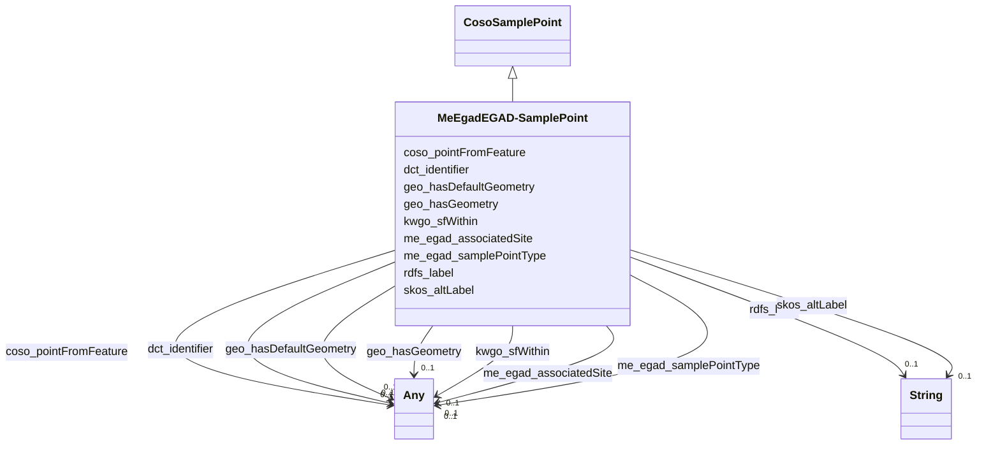

# Class: EGAD - Sample Point (me_egad_EGAD-SamplePoint)


_No class (type) description specified_


This class occurs 8324 times.


URI: [me_egad:EGAD-SamplePoint](http://sawgraph.spatialai.org/v1/me-egad#EGAD-SamplePoint)





## Inheritance
* [CosoSamplePoint](../classes/CosoSamplePoint.md)
    * **MeEgadEGAD-SamplePoint**


## Slots

| Name | Cardinality and Range | Description | Inheritance | Occurrences |
| ---  | --- | --- | --- | --- |
| [me_egad_associatedSite](../slots/me_egad_associatedSite.md) | 0..1 <br/> [MeEgadEGAD-PFAS-Site](../classes/MeEgadEGAD-PFAS-Site.md)&nbsp;or&nbsp;<br />[MeEgadEGAD-Site](../classes/MeEgadEGAD-Site.md) | No slot (predicate) description specified <br/>  | direct | 16613 |
| [coso_pointFromFeature](../slots/coso_pointFromFeature.md) | 0..1 <br/> [MeEgadEGAD-SampledFeature](../classes/MeEgadEGAD-SampledFeature.md)&nbsp;or&nbsp;<br />[CosoFeature](../classes/CosoFeature.md) | No slot (predicate) description specified <br/>  | direct | 8040 |
| [rdfs_label](../slots/rdfs_label.md) | 0..1 <br/> [xsd:string](http://www.w3.org/2001/XMLSchema#string) | No slot (predicate) description specified <br/>  | direct | 8324 |
| [dct_identifier](../slots/dct_identifier.md) | 0..1 <br/> [xsd:string](http://www.w3.org/2001/XMLSchema#string)&nbsp;or&nbsp;<br />[xsd:integer](http://www.w3.org/2001/XMLSchema#integer) | No slot (predicate) description specified <br/>  | direct | 8040 |
| [skos_altLabel](../slots/skos_altLabel.md) | 0..1 <br/> [xsd:string](http://www.w3.org/2001/XMLSchema#string) | No slot (predicate) description specified <br/>  | direct | 8040 |
| [kwgo_sfWithin](../slots/kwgo_sfWithin.md) | 0..1 <br/> [xsd:anyURI](http://www.w3.org/2001/XMLSchema#anyURI)&nbsp;or&nbsp;<br />[KwgoS2CellLevel13](../classes/KwgoS2CellLevel13.md) | No slot (predicate) description specified <br/>  | direct | 9011 |
| [geo_hasGeometry](../slots/geo_hasGeometry.md) | 0..1 <br/> [GeoGeometry](../classes/GeoGeometry.md)&nbsp;or&nbsp;<br />[Sf#Point](../classes/Sf#Point.md) | No slot (predicate) description specified <br/>  | direct | 9022 |
| [me_egad_samplePointType](../slots/me_egad_samplePointType.md) | 0..1 <br/> [MeEgadEGAD-SamplePointType](../classes/MeEgadEGAD-SamplePointType.md)&nbsp;or&nbsp;<br />[xsd:anyURI](http://www.w3.org/2001/XMLSchema#anyURI)&nbsp;or&nbsp;<br />[OwlNamedIndividual](../classes/OwlNamedIndividual.md) | No slot (predicate) description specified <br/>  | direct | 24366 |
| [geo_hasDefaultGeometry](../slots/geo_hasDefaultGeometry.md) | 0..1 <br/> [GeoGeometry](../classes/GeoGeometry.md)&nbsp;or&nbsp;<br />[Sf#Point](../classes/Sf#Point.md) | No slot (predicate) description specified <br/>  | direct | 9022 |


## Usages

| used by | used in | type | used |
| ---  | --- | --- | --- |
| [KwgoS2CellLevel13](../classes/KwgoS2CellLevel13.md) | [kwgo_sfContains](../slots/kwgo_sfContains.md) | any_of[range] | [MeEgadEGAD-SamplePoint](../classes/MeEgadEGAD-SamplePoint.md) |
| [MeEgadEGAD-PFAS-Observation](../classes/MeEgadEGAD-PFAS-Observation.md) | [coso_observedAtSamplePoint](../slots/coso_observedAtSamplePoint.md) | any_of[range] | [MeEgadEGAD-SamplePoint](../classes/MeEgadEGAD-SamplePoint.md) |
| [MeEgadEGAD-Sample](../classes/MeEgadEGAD-Sample.md) | [coso_fromSamplePoint](../slots/coso_fromSamplePoint.md) | any_of[range] | [MeEgadEGAD-SamplePoint](../classes/MeEgadEGAD-SamplePoint.md) |


## LinkML Source

<!-- TODO: investigate https://stackoverflow.com/questions/37606292/how-to-create-tabbed-code-blocks-in-mkdocs-or-sphinx -->

### Direct

<details>

```yaml
name: me_egad_EGAD-SamplePoint
conforms_to: No schema conformance document specified
annotations:
  count:
    tag: count
    value: 8324
description: No class (type) description specified
title: EGAD - Sample Point
from_schema: sawgraph-kg
rank: 1000
is_a: coso_SamplePoint
slots:
- me_egad_associatedSite
- coso_pointFromFeature
- rdfs_label
- dct_identifier
- skos_altLabel
- kwgo_sfWithin
- geo_hasGeometry
- me_egad_samplePointType
- geo_hasDefaultGeometry
slot_usage:
  coso_pointFromFeature:
    name: coso_pointFromFeature
    annotations:
      me_egad_EGAD-SampledFeature:
        tag: me_egad_EGAD-SampledFeature
        value: 8040
  dct_identifier:
    name: dct_identifier
    annotations:
      integer:
        tag: integer
        value: 8040
  geo_hasDefaultGeometry:
    name: geo_hasDefaultGeometry
    annotations:
      geo_Geometry:
        tag: geo_Geometry
        value: 4511
      sf_#Point:
        tag: sf_#Point
        value: 4511
  geo_hasGeometry:
    name: geo_hasGeometry
    annotations:
      geo_Geometry:
        tag: geo_Geometry
        value: 4511
      sf_#Point:
        tag: sf_#Point
        value: 4511
  kwgo_sfWithin:
    name: kwgo_sfWithin
    annotations:
      kwgo_S2Cell_Level13:
        tag: kwgo_S2Cell_Level13
        value: 4502
      uri:
        tag: uri
        value: 4509
  me_egad_associatedSite:
    name: me_egad_associatedSite
    annotations:
      me_egad_EGAD-PFAS-Site:
        tag: me_egad_EGAD-PFAS-Site
        value: 8405
      me_egad_EGAD-Site:
        tag: me_egad_EGAD-Site
        value: 8208
  me_egad_samplePointType:
    name: me_egad_samplePointType
    annotations:
      me_egad_EGAD-SamplePointType:
        tag: me_egad_EGAD-SamplePointType
        value: 8021
      owl_NamedIndividual:
        tag: owl_NamedIndividual
        value: 8021
      uri:
        tag: uri
        value: 8324
  rdfs_label:
    name: rdfs_label
    annotations:
      string:
        tag: string
        value: 8324
  skos_altLabel:
    name: skos_altLabel
    annotations:
      string:
        tag: string
        value: 8040
class_uri: me_egad:EGAD-SamplePoint

```
</details>

### Induced

<details>

```yaml
name: me_egad_EGAD-SamplePoint
conforms_to: No schema conformance document specified
annotations:
  count:
    tag: count
    value: 8324
description: No class (type) description specified
title: EGAD - Sample Point
from_schema: sawgraph-kg
rank: 1000
is_a: coso_SamplePoint
slot_usage:
  coso_pointFromFeature:
    name: coso_pointFromFeature
    annotations:
      me_egad_EGAD-SampledFeature:
        tag: me_egad_EGAD-SampledFeature
        value: 8040
  dct_identifier:
    name: dct_identifier
    annotations:
      integer:
        tag: integer
        value: 8040
  geo_hasDefaultGeometry:
    name: geo_hasDefaultGeometry
    annotations:
      geo_Geometry:
        tag: geo_Geometry
        value: 4511
      sf_#Point:
        tag: sf_#Point
        value: 4511
  geo_hasGeometry:
    name: geo_hasGeometry
    annotations:
      geo_Geometry:
        tag: geo_Geometry
        value: 4511
      sf_#Point:
        tag: sf_#Point
        value: 4511
  kwgo_sfWithin:
    name: kwgo_sfWithin
    annotations:
      kwgo_S2Cell_Level13:
        tag: kwgo_S2Cell_Level13
        value: 4502
      uri:
        tag: uri
        value: 4509
  me_egad_associatedSite:
    name: me_egad_associatedSite
    annotations:
      me_egad_EGAD-PFAS-Site:
        tag: me_egad_EGAD-PFAS-Site
        value: 8405
      me_egad_EGAD-Site:
        tag: me_egad_EGAD-Site
        value: 8208
  me_egad_samplePointType:
    name: me_egad_samplePointType
    annotations:
      me_egad_EGAD-SamplePointType:
        tag: me_egad_EGAD-SamplePointType
        value: 8021
      owl_NamedIndividual:
        tag: owl_NamedIndividual
        value: 8021
      uri:
        tag: uri
        value: 8324
  rdfs_label:
    name: rdfs_label
    annotations:
      string:
        tag: string
        value: 8324
  skos_altLabel:
    name: skos_altLabel
    annotations:
      string:
        tag: string
        value: 8040
attributes:
  me_egad_associatedSite:
    name: me_egad_associatedSite
    annotations:
      me_egad_EGAD-PFAS-Site:
        tag: me_egad_EGAD-PFAS-Site
        value: 8405
      me_egad_EGAD-Site:
        tag: me_egad_EGAD-Site
        value: 8208
    description: No slot (predicate) description specified
    title: egad - associated site
    examples:
    - object:
        example_object: me_egad_data:site.29410
        example_object_type: me_egad_EGAD-PFAS-Site
        example_predicate: me_egad:associatedSite
        example_subject: me_egad_data:samplePoint.100410
        example_subject_type: me_egad_EGAD-SamplePoint
    - object:
        example_object: me_egad_data:site.29410
        example_object_type: me_egad_EGAD-Site
        example_predicate: me_egad:associatedSite
        example_subject: me_egad_data:samplePoint.100410
        example_subject_type: me_egad_EGAD-SamplePoint
    from_schema: sawgraph-kg
    rank: 1000
    slot_uri: me_egad:associatedSite
    alias: me_egad_associatedSite
    owner: me_egad_EGAD-SamplePoint
    domain_of:
    - me_egad_EGAD-SamplePoint
    range: Any
    any_of:
    - range: me_egad_EGAD-PFAS-Site
    - range: me_egad_EGAD-Site
  coso_pointFromFeature:
    name: coso_pointFromFeature
    annotations:
      me_egad_EGAD-SampledFeature:
        tag: me_egad_EGAD-SampledFeature
        value: 8040
    description: No slot (predicate) description specified
    title: point from feature
    examples:
    - object:
        example_object: me_egad_data:sampledFeature.100410
        example_object_type: me_egad_EGAD-SampledFeature
        example_predicate: coso:pointFromFeature
        example_subject: me_egad_data:samplePoint.100410
        example_subject_type: me_egad_EGAD-SamplePoint
    from_schema: sawgraph-kg
    rank: 1000
    domain: coso_Point
    slot_uri: coso:pointFromFeature
    alias: coso_pointFromFeature
    owner: me_egad_EGAD-SamplePoint
    domain_of:
    - me_egad_EGAD-SamplePoint
    range: Any
    any_of:
    - range: me_egad_EGAD-SampledFeature
    - range: coso_Feature
  rdfs_label:
    name: rdfs_label
    annotations:
      string:
        tag: string
        value: 8324
    description: No slot (predicate) description specified
    examples:
    - object:
        example_object: Microgram per Kilogram
        example_object_type: string
        example_predicate: rdfs:label
        example_subject: http://qudt.org/vocab/unit/MicroGM-PER-KiloGM
        example_subject_type: qudt_Unit
    - object:
        example_object: AB
        example_object_type: string
        example_predicate: rdfs:label
        example_subject: me_egad_data:AB
        example_subject_type: prov_Agent
    - object:
        example_object: COMPOUND IS FOUND IN THE ASSOCIATED METHOD BLANK (ORGANIC)
          OR THE REPORTED VALUE WAS LESS THAN THE REPORTING LIMIT BUT GREATER THAN
          OR EQUAL TO THE IDL. (INORGANIC)
        example_object_type: string
        example_predicate: rdfs:label
        example_subject: me_egad_data:concentrationQualifier.B
        example_subject_type: owl_NamedIndividual
    - object:
        example_object: ALPHA ANALYTICAL LAB - WESTBOROUGH, MA
        example_object_type: string
        example_predicate: rdfs:label
        example_subject: me_egad_data:organization.lab.AA
        example_subject_type: prov_Organization
    - object:
        example_object: EGAD PFAS measurements for sample EP001
        example_object_type: string
        example_predicate: rdfs:label
        example_subject: me_egad_data:result.101365P.NA.20130507.1763231
        example_subject_type: me_egad_EGAD-SinglePFAS-Concentration
    - object:
        example_object: EGAD PFAS measurements for sample EP001
        example_object_type: string
        example_predicate: rdfs:label
        example_subject: me_egad_data:result.101365P.NA.20130507.DEP18010
        example_subject_type: me_egad_EGAD-AggregatePFAS-Concentration
    - object:
        example_object: EGAD sample BETH WILLIAMS ACF
        example_object_type: string
        example_predicate: rdfs:label
        example_subject: me_egad_data:sample.AAL210144001R.20210112
        example_subject_type: me_egad_EGAD-Sample
    - object:
        example_object: EGAD sample point 100410
        example_object_type: string
        example_predicate: rdfs:label
        example_subject: me_egad_data:samplePoint.100410
        example_subject_type: me_egad_EGAD-SamplePoint
    - object:
        example_object: EGAD sampled feature associated with sample point 100410
        example_object_type: string
        example_predicate: rdfs:label
        example_subject: me_egad_data:sampledFeature.100410
        example_subject_type: me_egad_EGAD-SampledFeature
    - object:
        example_object: MAINE ARMY NATIONAL GUARD - BANGOR RANGE
        example_object_type: string
        example_predicate: rdfs:label
        example_subject: me_egad_data:site.100843
        example_subject_type: me_egad_EGAD-Site
    - object:
        example_object: FARMINGTON VILLAGE CORPORATION
        example_object_type: string
        example_predicate: rdfs:label
        example_subject: me_egad_data:site.131980
        example_subject_type: me_egad_EGAD-PFAS-Site
    - object:
        example_object: Single Contamiant Concentration Quantity
        example_object_type: string
        example_predicate: rdfs:label
        example_subject: coso:SingleContaminantConcentrationQuantityKind
        example_subject_type: coso_ContaminantConcentrationQuantityKind
    - object:
        example_object: Non-Detect
        example_object_type: string
        example_predicate: rdfs:label
        example_subject: coso:non-detect
        example_subject_type: qudt_EnumeratedValue
    - object:
        example_object: Enumerated Quantity
        example_object_type: string
        example_predicate: rdfs:label
        example_subject: qudt:EnumeratedQuantity
        example_subject_type: None
    - object:
        example_object: EGAD PFAS observation for sample BETH WILLIAMS ACF
        example_object_type: string
        example_predicate: rdfs:label
        example_subject: me_egad_data:observation.AAL210144001R.20210112.1763231
        example_subject_type: me_egad_EGAD-PFAS-Observation
    from_schema: sawgraph-kg
    rank: 1000
    slot_uri: rdfs:label
    alias: rdfs_label
    owner: me_egad_EGAD-SamplePoint
    domain_of:
    - owl_NamedIndividual
    - owl_OntologyProperty
    - qudt_AspectClass
    - qudt_BitEncodingType
    - qudt_BooleanEncodingType
    - qudt_ByteEncodingType
    - qudt_CardinalityType
    - qudt_CharEncodingType
    - qudt_DateTimeStringEncodingType
    - qudt_EndianType
    - qudt_EnumeratedValue
    - qudt_FloatingPointEncodingType
    - qudt_IntegerEncodingType
    - qudt_OrderedType
    - qudt_SignednessType
    - qudt_Unit
    - vaem_#CatalogEntry
    - vaem_#GraphMetaData
    - vaem_#Party
    - coso_ContaminantConcentrationQuantityKind
    - coso_ContaminantVolumeQuantityKind
    - coso_Substance
    - coso_SubstanceCollection
    - me_egad_EGAD-AggregatePFAS-Concentration
    - me_egad_EGAD-AnalysisMethod
    - me_egad_EGAD-ConcentrationQualifier
    - me_egad_EGAD-PFAS-Observation
    - me_egad_EGAD-PFAS-ParameterName
    - me_egad_EGAD-PFAS-Site
    - me_egad_EGAD-ResultType
    - me_egad_EGAD-Sample
    - me_egad_EGAD-SampleCollectionMethod
    - me_egad_EGAD-SampleDetailedLocation
    - me_egad_EGAD-SampleMaterialType
    - me_egad_EGAD-SampleMaterialTypeQualifier
    - me_egad_EGAD-SamplePoint
    - me_egad_EGAD-SamplePointType
    - me_egad_EGAD-SampleTreatmentStatus
    - me_egad_EGAD-SampledFeature
    - me_egad_EGAD-SinglePFAS-Concentration
    - me_egad_EGAD-Site
    - me_egad_EGAD-SiteType
    - me_egad_EGAD-ValidationLevel
    - prov_Agent
    - prov_Organization
    range: string
  dct_identifier:
    name: dct_identifier
    annotations:
      integer:
        tag: integer
        value: 8040
    description: No slot (predicate) description specified
    title: No slot (predicate) name specified -- this slot is noted as a subproperty
      of another slot in this graph but has not itself been defined.
    examples:
    - object:
        example_object: BETH WILLIAMS ACF
        example_object_type: string
        example_predicate: dct:identifier
        example_subject: me_egad_data:sample.AAL210144001R.20210112
        example_subject_type: me_egad_EGAD-Sample
    - object:
        example_object: '100410'
        example_object_type: integer
        example_predicate: dct:identifier
        example_subject: me_egad_data:samplePoint.100410
        example_subject_type: me_egad_EGAD-SamplePoint
    from_schema: sawgraph-kg
    rank: 1000
    slot_uri: dct:identifier
    alias: dct_identifier
    owner: me_egad_EGAD-SamplePoint
    domain_of:
    - me_egad_EGAD-Sample
    - me_egad_EGAD-SamplePoint
    range: Any
    any_of:
    - range: string
    - range: integer
  skos_altLabel:
    name: skos_altLabel
    annotations:
      string:
        tag: string
        value: 8040
    description: No slot (predicate) description specified
    title: No slot (predicate) name specified -- this slot is noted as a subproperty
      of another slot in this graph but has not itself been defined.
    examples:
    - object:
        example_object: B-5
        example_object_type: string
        example_predicate: skos:altLabel
        example_subject: me_egad_data:samplePoint.100410
        example_subject_type: me_egad_EGAD-SamplePoint
    - object:
        example_object: 10:2 FTS_A
        example_object_type: string
        example_predicate: skos:altLabel
        example_subject: me_egad_data:parameter.10-2_FTS_A
        example_subject_type: owl_NamedIndividual
    from_schema: sawgraph-kg
    rank: 1000
    slot_uri: skos:altLabel
    alias: skos_altLabel
    owner: me_egad_EGAD-SamplePoint
    domain_of:
    - owl_NamedIndividual
    - coso_Substance
    - coso_SubstanceCollection
    - me_egad_EGAD-PFAS-ParameterName
    - me_egad_EGAD-SamplePoint
    range: string
  kwgo_sfWithin:
    name: kwgo_sfWithin
    annotations:
      kwgo_S2Cell_Level13:
        tag: kwgo_S2Cell_Level13
        value: 4502
      uri:
        tag: uri
        value: 4509
    description: No slot (predicate) description specified
    examples:
    - object:
        example_object: kwgr:s2.level13.5525380644965711872
        example_object_type: kwgo_S2Cell_Level13
        example_predicate: kwgo:sfWithin
        example_subject: me_egad_data:samplePoint.100410
        example_subject_type: me_egad_EGAD-SamplePoint
    - object:
        example_object: dcgeoid:2302778255
        example_object_type: uri
        example_predicate: kwgo:sfWithin
        example_subject: me_egad_data:samplePoint.100410
        example_subject_type: me_egad_EGAD-SamplePoint
    - object:
        example_object: kwgr:s2.level13.5525436170302914560
        example_object_type: kwgo_S2Cell_Level13
        example_predicate: kwgo:sfWithin
        example_subject: me_egad_data:site.100843
        example_subject_type: me_egad_EGAD-PFAS-Site
    - object:
        example_object: kwgr:s2.level13.5525436170302914560
        example_object_type: kwgo_S2Cell_Level13
        example_predicate: kwgo:sfWithin
        example_subject: me_egad_data:site.100843
        example_subject_type: me_egad_EGAD-Site
    - object:
        example_object: dcgeoid:2301902795
        example_object_type: uri
        example_predicate: kwgo:sfWithin
        example_subject: me_egad_data:site.100843
        example_subject_type: me_egad_EGAD-Site
    - object:
        example_object: dcgeoid:2300724775
        example_object_type: uri
        example_predicate: kwgo:sfWithin
        example_subject: me_egad_data:site.131980
        example_subject_type: me_egad_EGAD-PFAS-Site
    from_schema: sawgraph-kg
    rank: 1000
    slot_uri: kwgo:sfWithin
    alias: kwgo_sfWithin
    owner: me_egad_EGAD-SamplePoint
    domain_of:
    - me_egad_EGAD-PFAS-Site
    - me_egad_EGAD-SamplePoint
    - me_egad_EGAD-Site
    range: Any
    any_of:
    - range: uri
    - range: kwgo_S2Cell_Level13
  geo_hasGeometry:
    name: geo_hasGeometry
    annotations:
      geo_Geometry:
        tag: geo_Geometry
        value: 4511
      sf_#Point:
        tag: sf_#Point
        value: 4511
    description: No slot (predicate) description specified
    examples:
    - object:
        example_object: me_egad_data:samplePoint.geometry.100410
        example_object_type: geo_Geometry
        example_predicate: geo:hasGeometry
        example_subject: me_egad_data:samplePoint.100410
        example_subject_type: me_egad_EGAD-SamplePoint
    - object:
        example_object: me_egad_data:samplePoint.geometry.100410
        example_object_type: sf_#Point
        example_predicate: geo:hasGeometry
        example_subject: me_egad_data:samplePoint.100410
        example_subject_type: me_egad_EGAD-SamplePoint
    - object:
        example_object: me_egad_data:egad.site.geometry.100843
        example_object_type: geo_Geometry
        example_predicate: geo:hasGeometry
        example_subject: me_egad_data:site.100843
        example_subject_type: me_egad_EGAD-PFAS-Site
    - object:
        example_object: me_egad_data:egad.site.geometry.100843
        example_object_type: sf_#Point
        example_predicate: geo:hasGeometry
        example_subject: me_egad_data:site.100843
        example_subject_type: me_egad_EGAD-PFAS-Site
    - object:
        example_object: me_egad_data:egad.site.geometry.100843
        example_object_type: geo_Geometry
        example_predicate: geo:hasGeometry
        example_subject: me_egad_data:site.100843
        example_subject_type: me_egad_EGAD-Site
    - object:
        example_object: me_egad_data:egad.site.geometry.100843
        example_object_type: sf_#Point
        example_predicate: geo:hasGeometry
        example_subject: me_egad_data:site.100843
        example_subject_type: me_egad_EGAD-Site
    from_schema: sawgraph-kg
    rank: 1000
    slot_uri: geo:hasGeometry
    alias: geo_hasGeometry
    owner: me_egad_EGAD-SamplePoint
    domain_of:
    - me_egad_EGAD-PFAS-Site
    - me_egad_EGAD-SamplePoint
    - me_egad_EGAD-Site
    range: Any
    any_of:
    - range: geo_Geometry
    - range: sf_#Point
  me_egad_samplePointType:
    name: me_egad_samplePointType
    annotations:
      me_egad_EGAD-SamplePointType:
        tag: me_egad_EGAD-SamplePointType
        value: 8021
      owl_NamedIndividual:
        tag: owl_NamedIndividual
        value: 8021
      uri:
        tag: uri
        value: 8324
    description: No slot (predicate) description specified
    title: egad - sample point type
    examples:
    - object:
        example_object: me_egad_data:featureType.MW
        example_object_type: me_egad_EGAD-SamplePointType
        example_predicate: me_egad:samplePointType
        example_subject: me_egad_data:samplePoint.100410
        example_subject_type: me_egad_EGAD-SamplePoint
    - object:
        example_object: me_egad_data:featureType.MW
        example_object_type: owl_NamedIndividual
        example_predicate: me_egad:samplePointType
        example_subject: me_egad_data:samplePoint.100410
        example_subject_type: me_egad_EGAD-SamplePoint
    - object:
        example_object: me_egad:featureType.MW
        example_object_type: uri
        example_predicate: me_egad:samplePointType
        example_subject: me_egad_data:samplePoint.100410
        example_subject_type: me_egad_EGAD-SamplePoint
    from_schema: sawgraph-kg
    rank: 1000
    slot_uri: me_egad:samplePointType
    alias: me_egad_samplePointType
    owner: me_egad_EGAD-SamplePoint
    domain_of:
    - me_egad_EGAD-SamplePoint
    range: Any
    any_of:
    - range: me_egad_EGAD-SamplePointType
    - range: uri
    - range: owl_NamedIndividual
  geo_hasDefaultGeometry:
    name: geo_hasDefaultGeometry
    annotations:
      geo_Geometry:
        tag: geo_Geometry
        value: 4511
      sf_#Point:
        tag: sf_#Point
        value: 4511
    description: No slot (predicate) description specified
    examples:
    - object:
        example_object: me_egad_data:samplePoint.geometry.100410
        example_object_type: geo_Geometry
        example_predicate: geo:hasDefaultGeometry
        example_subject: me_egad_data:samplePoint.100410
        example_subject_type: me_egad_EGAD-SamplePoint
    - object:
        example_object: me_egad_data:samplePoint.geometry.100410
        example_object_type: sf_#Point
        example_predicate: geo:hasDefaultGeometry
        example_subject: me_egad_data:samplePoint.100410
        example_subject_type: me_egad_EGAD-SamplePoint
    - object:
        example_object: me_egad_data:egad.site.geometry.100843
        example_object_type: geo_Geometry
        example_predicate: geo:hasDefaultGeometry
        example_subject: me_egad_data:site.100843
        example_subject_type: me_egad_EGAD-PFAS-Site
    - object:
        example_object: me_egad_data:egad.site.geometry.100843
        example_object_type: sf_#Point
        example_predicate: geo:hasDefaultGeometry
        example_subject: me_egad_data:site.100843
        example_subject_type: me_egad_EGAD-PFAS-Site
    - object:
        example_object: me_egad_data:egad.site.geometry.100843
        example_object_type: geo_Geometry
        example_predicate: geo:hasDefaultGeometry
        example_subject: me_egad_data:site.100843
        example_subject_type: me_egad_EGAD-Site
    - object:
        example_object: me_egad_data:egad.site.geometry.100843
        example_object_type: sf_#Point
        example_predicate: geo:hasDefaultGeometry
        example_subject: me_egad_data:site.100843
        example_subject_type: me_egad_EGAD-Site
    from_schema: sawgraph-kg
    rank: 1000
    slot_uri: geo:hasDefaultGeometry
    alias: geo_hasDefaultGeometry
    owner: me_egad_EGAD-SamplePoint
    domain_of:
    - me_egad_EGAD-PFAS-Site
    - me_egad_EGAD-SamplePoint
    - me_egad_EGAD-Site
    range: Any
    any_of:
    - range: geo_Geometry
    - range: sf_#Point
class_uri: me_egad:EGAD-SamplePoint

```
</details>