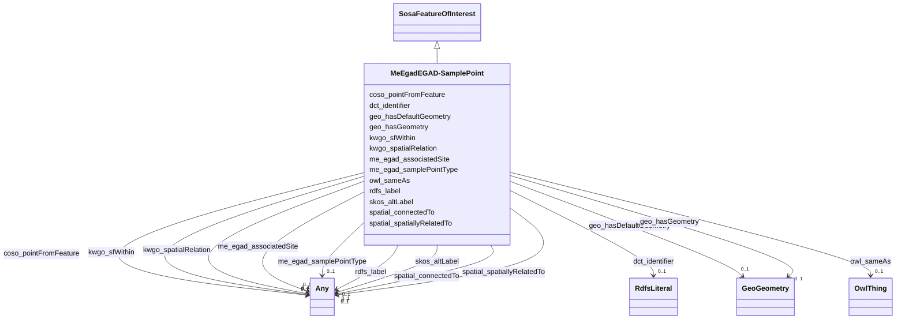

# Class: EGAD - Sample Point (me_egad_EGAD-SamplePoint)


This class occurs 8324 times.


URI: [me_egad:EGAD-SamplePoint](http://sawgraph.spatialai.org/v1/me-egad#EGAD-SamplePoint)





## Inheritance
* [SosaFeatureOfInterest](../classes/SosaFeatureOfInterest.md)
    * **MeEgadEGAD-SamplePoint**


## Slots

| Name | Cardinality and Range | Description | Inheritance | Occurrences |
| ---  | --- | --- | --- | --- |
| [geo_hasGeometry](../slots/geo_hasGeometry.md) | 0..1 <br/> [GeoGeometry](../classes/GeoGeometry.md) | A spatial representation for a given Feature <br/> source: http://www.opengis.net/spec/geosparql/1.1/req/geometry-extension/feature-properties<br/>source: http://www.opengis.net/ont/geosparql#<br/>source: http://www.opengis.net/spec/geosparql/1.0/req/geometry-extension/feature-properties<br/>description: A spatial representation for a given Feature. | direct | 9022 |
| [coso_pointFromFeature](../slots/coso_pointFromFeature.md) | 0..1 <br/> [HttpW3id.orgSawgraphV1Us-wqp#SampledFeature](../classes/HttpW3id.orgSawgraphV1Us-wqp#SampledFeature.md)&nbsp;or&nbsp;<br />[GeoFeature](../classes/GeoFeature.md)&nbsp;or&nbsp;<br />[MeEgadEGAD-SampledFeature](../classes/MeEgadEGAD-SampledFeature.md)&nbsp;or&nbsp;<br />[OwlThing](../classes/OwlThing.md)&nbsp;or&nbsp;<br />[CosoFeature](../classes/CosoFeature.md)&nbsp;or&nbsp;<br />[HttpW3id.orgSawgraphV1Me-egad#EGAD-SampledFeature](../classes/HttpW3id.orgSawgraphV1Me-egad#EGAD-SampledFeature.md)&nbsp;or&nbsp;<br />[SosaFeatureOfInterest](../classes/SosaFeatureOfInterest.md)&nbsp;or&nbsp;<br />[GeoSpatialObject](../classes/GeoSpatialObject.md) | A relation between a point location and the larger geospatial feature it is a... <br/>  | direct | 8040 |
| [kwgo_spatialRelation](../slots/kwgo_spatialRelation.md) | 0..1 <br/> [Any](../classes/Any.md) | KWG's general spatial relation <br/>  | direct | 22520 |
| [skos_altLabel](../slots/skos_altLabel.md) | 0..1 <br/> [Any](../classes/Any.md) | An alternative lexical label for a resource <br/> description: skos:prefLabel, skos:altLabel and skos:hiddenLabel are pairwise disjoint properties.<br/>description: The range of skos:altLabel is the class of RDF plain literals. | direct | 8040 |
| [me_egad_associatedSite](../slots/me_egad_associatedSite.md) | 0..1 <br/> [HttpW3id.orgSawgraphV1Me-egad#EGAD-PFAS-Site](../classes/HttpW3id.orgSawgraphV1Me-egad#EGAD-PFAS-Site.md)&nbsp;or&nbsp;<br />[MeEgadEGAD-PFAS-Site](../classes/MeEgadEGAD-PFAS-Site.md) |  <br/>  | direct | 10706 |
| [dct_identifier](../slots/dct_identifier.md) | 0..1 <br/> [RdfsLiteral](../classes/RdfsLiteral.md) | Recommended practice is to identify the resource by means of a string conform... <br/> description: An unambiguous reference to the resource within a given context. | direct | 8040 |
| [spatial_spatiallyRelatedTo](../slots/spatial_spatiallyRelatedTo.md) | 0..1 <br/> [KwgoS2CellLevel13](../classes/KwgoS2CellLevel13.md)&nbsp;or&nbsp;<br />[KwgoAdministrativeRegion](../classes/KwgoAdministrativeRegion.md)&nbsp;or&nbsp;<br />[OwlThing](../classes/OwlThing.md)&nbsp;or&nbsp;<br />[MeEgadEGAD-SamplePoint](../classes/MeEgadEGAD-SamplePoint.md)&nbsp;or&nbsp;<br />[KwgoAdministrativeRegion3](../classes/KwgoAdministrativeRegion3.md)&nbsp;or&nbsp;<br />[HttpW3id.orgSawgraphV1Me-egad#EGAD-SamplePoint](../classes/HttpW3id.orgSawgraphV1Me-egad#EGAD-SamplePoint.md)&nbsp;or&nbsp;<br />[MeEgadEGAD-PFAS-Site](../classes/MeEgadEGAD-PFAS-Site.md)&nbsp;or&nbsp;<br />[HttpW3id.orgSawgraphV1Me-egad#EGAD-PFAS-Site](../classes/HttpW3id.orgSawgraphV1Me-egad#EGAD-PFAS-Site.md)&nbsp;or&nbsp;<br />[GeoSpatialObject](../classes/GeoSpatialObject.md)&nbsp;or&nbsp;<br />[KwgoRegion](../classes/KwgoRegion.md) |  <br/>  | direct | 22520 |
| [owl_sameAs](../slots/owl_sameAs.md) | 0..1 <br/> [OwlThing](../classes/OwlThing.md) | The property that determines that two given individuals are equal <br/>  | direct | 8324 |
| [geo_hasDefaultGeometry](../slots/geo_hasDefaultGeometry.md) | 0..1 <br/> [GeoGeometry](../classes/GeoGeometry.md) | The default Geometry to be used in spatial calculations <br/> source: http://www.opengis.net/spec/geosparql/1.1/req/geometry-extension/feature-properties<br/>source: http://www.opengis.net/ont/geosparql#<br/>source: http://www.opengis.net/spec/geosparql/1.0/req/geometry-extension/feature-properties<br/>description: The default Geometry to be used in spatial calculations. It is usually the most detailed Geometry. | direct | 9022 |
| [rdfs_label](../slots/rdfs_label.md) | 0..1 <br/> [RdfsLiteral](../classes/RdfsLiteral.md)&nbsp;or&nbsp;<br />[xsd:string](http://www.w3.org/2001/XMLSchema#string) | A human-readable name for the subject <br/>  | direct | 8324 |
| [kwgo_sfWithin](../slots/kwgo_sfWithin.md) | 0..1 <br/> [Any](../classes/Any.md) | KWG's spatial within relation <br/>  | direct | 22520 |
| [me_egad_samplePointType](../slots/me_egad_samplePointType.md) | 0..1 <br/> [MeEgadEGAD-SamplePointType](../classes/MeEgadEGAD-SamplePointType.md)&nbsp;or&nbsp;<br />[OwlThing](../classes/OwlThing.md)&nbsp;or&nbsp;<br />[OwlNamedIndividual](../classes/OwlNamedIndividual.md) |  <br/>  | direct | 24366 |
| [spatial_connectedTo](../slots/spatial_connectedTo.md) | 0..1 <br/> [KwgoS2CellLevel13](../classes/KwgoS2CellLevel13.md)&nbsp;or&nbsp;<br />[KwgoAdministrativeRegion](../classes/KwgoAdministrativeRegion.md)&nbsp;or&nbsp;<br />[OwlThing](../classes/OwlThing.md)&nbsp;or&nbsp;<br />[MeEgadEGAD-SamplePoint](../classes/MeEgadEGAD-SamplePoint.md)&nbsp;or&nbsp;<br />[KwgoAdministrativeRegion3](../classes/KwgoAdministrativeRegion3.md)&nbsp;or&nbsp;<br />[HttpW3id.orgSawgraphV1Me-egad#EGAD-SamplePoint](../classes/HttpW3id.orgSawgraphV1Me-egad#EGAD-SamplePoint.md)&nbsp;or&nbsp;<br />[MeEgadEGAD-PFAS-Site](../classes/MeEgadEGAD-PFAS-Site.md)&nbsp;or&nbsp;<br />[HttpW3id.orgSawgraphV1Me-egad#EGAD-PFAS-Site](../classes/HttpW3id.orgSawgraphV1Me-egad#EGAD-PFAS-Site.md)&nbsp;or&nbsp;<br />[GeoSpatialObject](../classes/GeoSpatialObject.md)&nbsp;or&nbsp;<br />[KwgoRegion](../classes/KwgoRegion.md) |  <br/>  | direct | 22520 |


## Usages

| used by | used in | type | used |
| ---  | --- | --- | --- |
| [CosoAnimalBloodSample](../classes/CosoAnimalBloodSample.md) | [coso_fromSamplePoint](../slots/coso_fromSamplePoint.md) | any_of[range] | [MeEgadEGAD-SamplePoint](../classes/MeEgadEGAD-SamplePoint.md) |
| [CosoAnimalMaterialSample](../classes/CosoAnimalMaterialSample.md) | [coso_fromSamplePoint](../slots/coso_fromSamplePoint.md) | any_of[range] | [MeEgadEGAD-SamplePoint](../classes/MeEgadEGAD-SamplePoint.md) |
| [CosoAnimalMilkSample](../classes/CosoAnimalMilkSample.md) | [coso_fromSamplePoint](../slots/coso_fromSamplePoint.md) | any_of[range] | [MeEgadEGAD-SamplePoint](../classes/MeEgadEGAD-SamplePoint.md) |
| [CosoAnimalOrganSample](../classes/CosoAnimalOrganSample.md) | [coso_fromSamplePoint](../slots/coso_fromSamplePoint.md) | any_of[range] | [MeEgadEGAD-SamplePoint](../classes/MeEgadEGAD-SamplePoint.md) |
| [CosoAnimalTissueSample](../classes/CosoAnimalTissueSample.md) | [coso_fromSamplePoint](../slots/coso_fromSamplePoint.md) | any_of[range] | [MeEgadEGAD-SamplePoint](../classes/MeEgadEGAD-SamplePoint.md) |
| [CosoPlantMaterialSample](../classes/CosoPlantMaterialSample.md) | [coso_fromSamplePoint](../slots/coso_fromSamplePoint.md) | any_of[range] | [MeEgadEGAD-SamplePoint](../classes/MeEgadEGAD-SamplePoint.md) |
| [HttpW3id.orgSawgraphV1Me-egad#EGAD-PFAS-Observation](../classes/HttpW3id.orgSawgraphV1Me-egad#EGAD-PFAS-Observation.md) | [coso_observedAtSamplePoint](../slots/coso_observedAtSamplePoint.md) | any_of[range] | [MeEgadEGAD-SamplePoint](../classes/MeEgadEGAD-SamplePoint.md) |
| [HttpW3id.orgSawgraphV1Me-egad#EGAD-PFAS-Observation](../classes/HttpW3id.orgSawgraphV1Me-egad#EGAD-PFAS-Observation.md) | [coso_observedAtPoint](../slots/coso_observedAtPoint.md) | any_of[range] | [MeEgadEGAD-SamplePoint](../classes/MeEgadEGAD-SamplePoint.md) |
| [HttpW3id.orgSawgraphV1Me-egad#EGAD-PFAS-Observation](../classes/HttpW3id.orgSawgraphV1Me-egad#EGAD-PFAS-Observation.md) | [coso_hasAnyFeatureOfInterest](../slots/coso_hasAnyFeatureOfInterest.md) | any_of[range] | [MeEgadEGAD-SamplePoint](../classes/MeEgadEGAD-SamplePoint.md) |
| [HttpW3id.orgSawgraphV1Me-egad#EGAD-PFAS-Site](../classes/HttpW3id.orgSawgraphV1Me-egad#EGAD-PFAS-Site.md) | [spatial_spatiallyRelatedTo](../slots/spatial_spatiallyRelatedTo.md) | any_of[range] | [MeEgadEGAD-SamplePoint](../classes/MeEgadEGAD-SamplePoint.md) |
| [HttpW3id.orgSawgraphV1Me-egad#EGAD-PFAS-Site](../classes/HttpW3id.orgSawgraphV1Me-egad#EGAD-PFAS-Site.md) | [spatial_connectedTo](../slots/spatial_connectedTo.md) | any_of[range] | [MeEgadEGAD-SamplePoint](../classes/MeEgadEGAD-SamplePoint.md) |
| [HttpW3id.orgSawgraphV1Me-egad#EGAD-Sample](../classes/HttpW3id.orgSawgraphV1Me-egad#EGAD-Sample.md) | [coso_fromSamplePoint](../slots/coso_fromSamplePoint.md) | any_of[range] | [MeEgadEGAD-SamplePoint](../classes/MeEgadEGAD-SamplePoint.md) |
| [HttpW3id.orgSawgraphV1Me-egad#EGAD-SamplePoint](../classes/HttpW3id.orgSawgraphV1Me-egad#EGAD-SamplePoint.md) | [spatial_spatiallyRelatedTo](../slots/spatial_spatiallyRelatedTo.md) | any_of[range] | [MeEgadEGAD-SamplePoint](../classes/MeEgadEGAD-SamplePoint.md) |
| [HttpW3id.orgSawgraphV1Me-egad#EGAD-SamplePoint](../classes/HttpW3id.orgSawgraphV1Me-egad#EGAD-SamplePoint.md) | [spatial_connectedTo](../slots/spatial_connectedTo.md) | any_of[range] | [MeEgadEGAD-SamplePoint](../classes/MeEgadEGAD-SamplePoint.md) |
| [HttpW3id.orgSawgraphV1Me-egad-data#DefEGADBeefBloodSample](../classes/HttpW3id.orgSawgraphV1Me-egad-data#DefEGADBeefBloodSample.md) | [coso_fromSamplePoint](../slots/coso_fromSamplePoint.md) | any_of[range] | [MeEgadEGAD-SamplePoint](../classes/MeEgadEGAD-SamplePoint.md) |
| [HttpW3id.orgSawgraphV1Me-egad-data#DefEGADDrinkingWaterSample](../classes/HttpW3id.orgSawgraphV1Me-egad-data#DefEGADDrinkingWaterSample.md) | [coso_fromSamplePoint](../slots/coso_fromSamplePoint.md) | any_of[range] | [MeEgadEGAD-SamplePoint](../classes/MeEgadEGAD-SamplePoint.md) |
| [HttpW3id.orgSawgraphV1Me-egad-data#DefEGADGroundWaterSample](../classes/HttpW3id.orgSawgraphV1Me-egad-data#DefEGADGroundWaterSample.md) | [coso_fromSamplePoint](../slots/coso_fromSamplePoint.md) | any_of[range] | [MeEgadEGAD-SamplePoint](../classes/MeEgadEGAD-SamplePoint.md) |
| [HttpW3id.orgSawgraphV1Me-egad-data#DefEGADPorkBloodSample](../classes/HttpW3id.orgSawgraphV1Me-egad-data#DefEGADPorkBloodSample.md) | [coso_fromSamplePoint](../slots/coso_fromSamplePoint.md) | any_of[range] | [MeEgadEGAD-SamplePoint](../classes/MeEgadEGAD-SamplePoint.md) |
| [HttpW3id.orgSawgraphV1Me-egad-data#DefEGADSoilSample](../classes/HttpW3id.orgSawgraphV1Me-egad-data#DefEGADSoilSample.md) | [coso_fromSamplePoint](../slots/coso_fromSamplePoint.md) | any_of[range] | [MeEgadEGAD-SamplePoint](../classes/MeEgadEGAD-SamplePoint.md) |
| [HttpW3id.orgSawgraphV1Me-egad-data#DefEGADSurfaceWaterSample](../classes/HttpW3id.orgSawgraphV1Me-egad-data#DefEGADSurfaceWaterSample.md) | [coso_fromSamplePoint](../slots/coso_fromSamplePoint.md) | any_of[range] | [MeEgadEGAD-SamplePoint](../classes/MeEgadEGAD-SamplePoint.md) |
| [HttpW3id.orgSawgraphV1Us-wqp#Observation](../classes/HttpW3id.orgSawgraphV1Us-wqp#Observation.md) | [coso_observedAtSamplePoint](../slots/coso_observedAtSamplePoint.md) | any_of[range] | [MeEgadEGAD-SamplePoint](../classes/MeEgadEGAD-SamplePoint.md) |
| [HttpW3id.orgSawgraphV1Us-wqp#Sample](../classes/HttpW3id.orgSawgraphV1Us-wqp#Sample.md) | [coso_fromSamplePoint](../slots/coso_fromSamplePoint.md) | any_of[range] | [MeEgadEGAD-SamplePoint](../classes/MeEgadEGAD-SamplePoint.md) |
| [KwgoS2CellLevel13](../classes/KwgoS2CellLevel13.md) | [spatial_spatiallyRelatedTo](../slots/spatial_spatiallyRelatedTo.md) | any_of[range] | [MeEgadEGAD-SamplePoint](../classes/MeEgadEGAD-SamplePoint.md) |
| [KwgoS2CellLevel13](../classes/KwgoS2CellLevel13.md) | [spatial_connectedTo](../slots/spatial_connectedTo.md) | any_of[range] | [MeEgadEGAD-SamplePoint](../classes/MeEgadEGAD-SamplePoint.md) |
| [MeEgadEGAD-PFAS-Observation](../classes/MeEgadEGAD-PFAS-Observation.md) | [coso_observedAtSamplePoint](../slots/coso_observedAtSamplePoint.md) | any_of[range] | [MeEgadEGAD-SamplePoint](../classes/MeEgadEGAD-SamplePoint.md) |
| [MeEgadEGAD-PFAS-Observation](../classes/MeEgadEGAD-PFAS-Observation.md) | [coso_hasAnyFeatureOfInterest](../slots/coso_hasAnyFeatureOfInterest.md) | any_of[range] | [MeEgadEGAD-SamplePoint](../classes/MeEgadEGAD-SamplePoint.md) |
| [MeEgadEGAD-PFAS-Observation](../classes/MeEgadEGAD-PFAS-Observation.md) | [coso_observedAtPoint](../slots/coso_observedAtPoint.md) | any_of[range] | [MeEgadEGAD-SamplePoint](../classes/MeEgadEGAD-SamplePoint.md) |
| [MeEgadEGAD-PFAS-Site](../classes/MeEgadEGAD-PFAS-Site.md) | [spatial_spatiallyRelatedTo](../slots/spatial_spatiallyRelatedTo.md) | any_of[range] | [MeEgadEGAD-SamplePoint](../classes/MeEgadEGAD-SamplePoint.md) |
| [MeEgadEGAD-PFAS-Site](../classes/MeEgadEGAD-PFAS-Site.md) | [spatial_connectedTo](../slots/spatial_connectedTo.md) | any_of[range] | [MeEgadEGAD-SamplePoint](../classes/MeEgadEGAD-SamplePoint.md) |
| [MeEgadEGAD-Sample](../classes/MeEgadEGAD-Sample.md) | [coso_fromSamplePoint](../slots/coso_fromSamplePoint.md) | any_of[range] | [MeEgadEGAD-SamplePoint](../classes/MeEgadEGAD-SamplePoint.md) |
| [MeEgadEGAD-SamplePoint](../classes/MeEgadEGAD-SamplePoint.md) | [spatial_spatiallyRelatedTo](../slots/spatial_spatiallyRelatedTo.md) | any_of[range] | [MeEgadEGAD-SamplePoint](../classes/MeEgadEGAD-SamplePoint.md) |
| [MeEgadEGAD-SamplePoint](../classes/MeEgadEGAD-SamplePoint.md) | [spatial_connectedTo](../slots/spatial_connectedTo.md) | any_of[range] | [MeEgadEGAD-SamplePoint](../classes/MeEgadEGAD-SamplePoint.md) |


## LinkML Source

<!-- TODO: investigate https://stackoverflow.com/questions/37606292/how-to-create-tabbed-code-blocks-in-mkdocs-or-sphinx -->

### Direct

<details>

```yaml
name: me_egad_EGAD-SamplePoint
title: EGAD - Sample Point
from_schema: okns:sawgraph-kg
rank: 1000
is_a: sosa_FeatureOfInterest
slots:
- geo_hasGeometry
- coso_pointFromFeature
- kwgo_spatialRelation
- skos_altLabel
- me_egad_associatedSite
- dct_identifier
- spatial_spatiallyRelatedTo
- owl_sameAs
- geo_hasDefaultGeometry
- rdfs_label
- kwgo_sfWithin
- me_egad_samplePointType
- spatial_connectedTo
class_uri: me_egad:EGAD-SamplePoint

```
</details>

### Induced

<details>

```yaml
name: me_egad_EGAD-SamplePoint
title: EGAD - Sample Point
from_schema: okns:sawgraph-kg
rank: 1000
is_a: sosa_FeatureOfInterest
attributes:
  geo_hasGeometry:
    name: geo_hasGeometry
    description: A spatial representation for a given Feature.
    title: No slot (predicate) name specified -- this slot is noted as a subproperty
      of another slot in this graph but has not itself been defined.
    notes:
    - No occurrences of this slot in the graph.
    comments:
    - 'source: http://www.opengis.net/spec/geosparql/1.1/req/geometry-extension/feature-properties'
    - 'source: http://www.opengis.net/ont/geosparql#'
    - 'source: http://www.opengis.net/spec/geosparql/1.0/req/geometry-extension/feature-properties'
    - 'description: A spatial representation for a given Feature.'
    from_schema: okns:geo
    source: http://www.opengis.net/ont/geosparql#
    domain: geo_Feature
    slot_uri: geo:hasGeometry
    alias: geo_hasGeometry
    owner: me_egad_EGAD-SamplePoint
    domain_of:
    - http___w3id.org_sawgraph_v1_me-egad#EGAD-PFAS-Site
    - http___w3id.org_sawgraph_v1_me-egad#EGAD-SamplePoint
    - http___w3id.org_sawgraph_v1_us-wqp#Site
    - me_egad_EGAD-PFAS-Site
    - me_egad_EGAD-SamplePoint
    range: geo_Geometry
  coso_pointFromFeature:
    name: coso_pointFromFeature
    description: A relation between a point location and the larger geospatial feature
      it is a part of.
    title: point from feature
    from_schema: okns:sawgraph-kg
    rank: 1000
    slot_uri: coso:pointFromFeature
    alias: coso_pointFromFeature
    owner: me_egad_EGAD-SamplePoint
    domain_of:
    - http___w3id.org_sawgraph_v1_me-egad#EGAD-SamplePoint
    - http___w3id.org_sawgraph_v1_us-wqp#Site
    - me_egad_EGAD-SamplePoint
    union_of:
    - geo_Feature
    - owl_Thing
    - geo_SpatialObject
    - sosa_FeatureOfInterest
    - coso_Point
    range: Any
    any_of:
    - range: http___w3id.org_sawgraph_v1_us-wqp#SampledFeature
    - range: geo_Feature
    - range: me_egad_EGAD-SampledFeature
    - range: owl_Thing
    - range: coso_Feature
    - range: http___w3id.org_sawgraph_v1_me-egad#EGAD-SampledFeature
    - range: sosa_FeatureOfInterest
    - range: geo_SpatialObject
  kwgo_spatialRelation:
    name: kwgo_spatialRelation
    description: KWG's general spatial relation
    title: spatial relation
    notes:
    - No occurrences of this slot in the graph.
    from_schema: okns:kwg
    slot_uri: kwgo:spatialRelation
    alias: kwgo_spatialRelation
    owner: me_egad_EGAD-SamplePoint
    domain_of:
    - http___w3id.org_sawgraph_v1_me-egad#EGAD-PFAS-Site
    - http___w3id.org_sawgraph_v1_me-egad#EGAD-SamplePoint
    - kwgo_S2Cell_Level13
    - me_egad_EGAD-PFAS-Site
    - me_egad_EGAD-SamplePoint
    range: Any
  skos_altLabel:
    name: skos_altLabel
    description: An alternative lexical label for a resource.
    title: alternative label
    notes:
    - No occurrences of this slot in the graph.
    comments:
    - 'description: skos:prefLabel, skos:altLabel and skos:hiddenLabel are pairwise
      disjoint properties.'
    - 'description: The range of skos:altLabel is the class of RDF plain literals.'
    from_schema: okns:skos
    source: http://www.w3.org/2004/02/skos/core
    slot_uri: skos:altLabel
    alias: skos_altLabel
    owner: me_egad_EGAD-SamplePoint
    domain_of:
    - qudt_CountingUnit
    - qudt_DerivedUnit
    - qudt_Unit
    - __Ba76635ffb4afc02e78b9ef49973d089f
    - __Beb7217b5b32080b9606028314249e33b
    - coso_SubstanceCollection
    - http___w3id.org_sawgraph_v1_me-egad#EGAD-PFAS-ParameterName
    - http___w3id.org_sawgraph_v1_me-egad#EGAD-SamplePoint
    - me_egad_EGAD-PFAS-ParameterName
    - me_egad_EGAD-SamplePoint
    subproperty_of: rdfs_label
    range: Any
  me_egad_associatedSite:
    name: me_egad_associatedSite
    title: egad - associated site
    from_schema: okns:sawgraph-kg
    rank: 1000
    slot_uri: me_egad:associatedSite
    alias: me_egad_associatedSite
    owner: me_egad_EGAD-SamplePoint
    domain_of:
    - me_egad_EGAD-SamplePoint
    range: Any
    any_of:
    - range: http___w3id.org_sawgraph_v1_me-egad#EGAD-PFAS-Site
    - range: me_egad_EGAD-PFAS-Site
  dct_identifier:
    name: dct_identifier
    description: Recommended practice is to identify the resource by means of a string
      conforming to an identification system. Examples include International Standard
      Book Number (ISBN), Digital Object Identifier (DOI), and Uniform Resource Name
      (URN).  Persistent identifiers should be provided as HTTP URIs.
    title: Identifier
    notes:
    - No occurrences of this slot in the graph.
    comments:
    - 'description: An unambiguous reference to the resource within a given context.'
    from_schema: okns:dc
    source: http://purl.org/dc/terms/
    slot_uri: dct:identifier
    alias: dct_identifier
    owner: me_egad_EGAD-SamplePoint
    domain_of:
    - __Ba76635ffb4afc02e78b9ef49973d089f
    - __Beb7217b5b32080b9606028314249e33b
    - coso_AnimalBloodSample
    - coso_AnimalMaterialSample
    - coso_AnimalMilkSample
    - coso_AnimalOrganSample
    - coso_AnimalTissueSample
    - coso_PlantMaterialSample
    - coso_SubstanceCollection
    - http___w3id.org_sawgraph_v1_me-egad#EGAD-PFAS-ParameterName
    - http___w3id.org_sawgraph_v1_me-egad#EGAD-PFAS-Site
    - http___w3id.org_sawgraph_v1_me-egad#EGAD-Sample
    - http___w3id.org_sawgraph_v1_me-egad#EGAD-SamplePoint
    - http___w3id.org_sawgraph_v1_me-egad-data#DefEGADBeefBloodSample
    - http___w3id.org_sawgraph_v1_me-egad-data#DefEGADDrinkingWaterSample
    - http___w3id.org_sawgraph_v1_me-egad-data#DefEGADGroundWaterSample
    - http___w3id.org_sawgraph_v1_me-egad-data#DefEGADPorkBloodSample
    - http___w3id.org_sawgraph_v1_me-egad-data#DefEGADSoilSample
    - http___w3id.org_sawgraph_v1_me-egad-data#DefEGADSurfaceWaterSample
    - me_egad_EGAD-PFAS-Site
    - me_egad_EGAD-Sample
    - me_egad_EGAD-SamplePoint
    subproperty_of: dc_identifier
    range: rdfs_Literal
  spatial_spatiallyRelatedTo:
    name: spatial_spatiallyRelatedTo
    title: topological connection (spatial contact) (sawgraph)
    from_schema: okns:sawgraph-kg
    exact_mappings:
    - http://stko-kwg.geog.ucsb.edu/lod/ontology/spatialRelation
    rank: 1000
    slot_uri: spatial:spatiallyRelatedTo
    alias: spatial_spatiallyRelatedTo
    owner: me_egad_EGAD-SamplePoint
    domain_of:
    - http___w3id.org_sawgraph_v1_me-egad#EGAD-PFAS-Site
    - http___w3id.org_sawgraph_v1_me-egad#EGAD-SamplePoint
    - kwgo_S2Cell_Level13
    - me_egad_EGAD-PFAS-Site
    - me_egad_EGAD-SamplePoint
    subproperty_of: kwgo_spatialRelation
    union_of:
    - owl_Thing
    - geo_SpatialObject
    range: Any
    any_of:
    - range: kwgo_S2Cell_Level13
    - range: kwgo_AdministrativeRegion
    - range: owl_Thing
    - range: me_egad_EGAD-SamplePoint
    - range: kwgo_AdministrativeRegion_3
    - range: http___w3id.org_sawgraph_v1_me-egad#EGAD-SamplePoint
    - range: me_egad_EGAD-PFAS-Site
    - range: http___w3id.org_sawgraph_v1_me-egad#EGAD-PFAS-Site
    - range: geo_SpatialObject
    - range: kwgo_Region
  owl_sameAs:
    name: owl_sameAs
    description: The property that determines that two given individuals are equal.
    title: sameAs
    notes:
    - No occurrences of this slot in the graph.
    from_schema: okns:owl-rdf-rdfs
    source: http://www.w3.org/2002/07/owl#
    domain: owl_Thing
    slot_uri: owl:sameAs
    alias: owl_sameAs
    owner: me_egad_EGAD-SamplePoint
    domain_of:
    - __B00af777bec4da87c5aebb51d94b2d478
    - __B036a3008450d6ce37e35cf5a98355a60
    - __B085dcda89ed6aae0d3b229e767f0a1ca
    - __B0d427a711311f1499a234aa8af2c66d1
    - __B215b3a432e1c482d3680398a554edbbf
    - __B27231c83f17c76e178e0c9f5e10acc55
    - __B37977f50d3140da51a9630b8a57396a1
    - __B3cc7b3721547b07a4068dc98b6444b8b
    - __B423a0e253807f20386fc3ccbbd7e0378
    - __B44bec873efc8b96cad5f525429c64e0a
    - __B4fd286b2a5a12e342d61412628b6e4c2
    - __B53622dee107de372b2d0566f64ab6e3a
    - __B5e93e815b548435105d9273d424fa0e8
    - __B611b8dff312692e7f32a69834c787a60
    - __B623b56ef58fd82dd088819e22d655c08
    - __B75dbc5841338872cea35dced609fcd77
    - __B75e45ed04b2b903b9029968cada06faa
    - __B7728f65369357f97de36b133c9d1d5e0
    - __B8aa8791a0418cd594c8b56ad21351f72
    - __Ba6d85f816540f9fec5b71ba42fc2cca6
    - __Ba76635ffb4afc02e78b9ef49973d089f
    - __Bb0125be5bc4dc7be7e8452e7d22445f6
    - __Bb71af62f2f3e5e5b5e0fe81f24eca409
    - __Bbefc37cbdd03cae92dadef76b34dbf16
    - __Bbf63deb85414ddecd89e46bce27e7f0a
    - __Be047d68edc8eb3ce96d7edbad5217bfc
    - __Be497d3b0c2656040c05e303873a2d541
    - __Beb7217b5b32080b9606028314249e33b
    - __Beb77c26f8c395403edc359fd5f6dfb28
    - __Bf04685c17c0e71ae3c98e08c75cbdfcc
    - __Bf584e1bfd1c74de0eb37e7b926538b83
    - coso_AnimalBloodSample
    - coso_AnimalMaterialSample
    - coso_AnimalMilkSample
    - coso_AnimalOrganSample
    - coso_AnimalTissueSample
    - coso_ContaminantConcentrationQuantityKind
    - coso_ContaminantVolumeQuantityKind
    - coso_ContaminationProperty
    - coso_DetectQuantityValue
    - coso_NonDetectQuantityValue
    - coso_PlantMaterialSample
    - coso_SubstanceCollection
    - coso_WaterSample
    - http___w3id.org_comptox_CompTox_ChemicalEntity
    - http___w3id.org_sawgraph_v1_me-egad#EGAD-AggregatePFAS-Concentration
    - http___w3id.org_sawgraph_v1_me-egad#EGAD-AnalysisMethod
    - http___w3id.org_sawgraph_v1_me-egad#EGAD-ConcentrationQualifier
    - http___w3id.org_sawgraph_v1_me-egad#EGAD-MethodDetectionLimit
    - http___w3id.org_sawgraph_v1_me-egad#EGAD-PFAS-Observation
    - http___w3id.org_sawgraph_v1_me-egad#EGAD-PFAS-ParameterName
    - http___w3id.org_sawgraph_v1_me-egad#EGAD-PFAS-Site
    - http___w3id.org_sawgraph_v1_me-egad#EGAD-ReportingLimit
    - http___w3id.org_sawgraph_v1_me-egad#EGAD-ResultType
    - http___w3id.org_sawgraph_v1_me-egad#EGAD-Sample
    - http___w3id.org_sawgraph_v1_me-egad#EGAD-SampleCollectionMethod
    - http___w3id.org_sawgraph_v1_me-egad#EGAD-SampleDetailedLocation
    - http___w3id.org_sawgraph_v1_me-egad#EGAD-SampleMaterialType
    - http___w3id.org_sawgraph_v1_me-egad#EGAD-SampleMaterialTypeQualifier
    - http___w3id.org_sawgraph_v1_me-egad#EGAD-SamplePoint
    - http___w3id.org_sawgraph_v1_me-egad#EGAD-SamplePointType
    - http___w3id.org_sawgraph_v1_me-egad#EGAD-SampleTreatmentStatus
    - http___w3id.org_sawgraph_v1_me-egad#EGAD-SampledFeature
    - http___w3id.org_sawgraph_v1_me-egad#EGAD-SinglePFAS-Concentration
    - http___w3id.org_sawgraph_v1_me-egad#EGAD-SiteType
    - http___w3id.org_sawgraph_v1_me-egad#EGAD-ValidationLevel
    - http___w3id.org_sawgraph_v1_me-egad-data#DefEGADBeefBloodSample
    - http___w3id.org_sawgraph_v1_me-egad-data#DefEGADDrinkingWaterSample
    - http___w3id.org_sawgraph_v1_me-egad-data#DefEGADGroundWaterSample
    - http___w3id.org_sawgraph_v1_me-egad-data#DefEGADPorkBloodSample
    - http___w3id.org_sawgraph_v1_me-egad-data#DefEGADSoilSample
    - http___w3id.org_sawgraph_v1_me-egad-data#DefEGADSurfaceWaterSample
    - kwgo_S2Cell_Level13
    - me_egad_EGAD-AggregatePFAS-Concentration
    - me_egad_EGAD-AnalysisMethod
    - me_egad_EGAD-ConcentrationQualifier
    - me_egad_EGAD-MethodDetectionLimit
    - me_egad_EGAD-PFAS-Observation
    - me_egad_EGAD-PFAS-ParameterName
    - me_egad_EGAD-PFAS-Site
    - me_egad_EGAD-ReportingLimit
    - me_egad_EGAD-ResultType
    - me_egad_EGAD-Sample
    - me_egad_EGAD-SampleCollectionMethod
    - me_egad_EGAD-SampleDetailedLocation
    - me_egad_EGAD-SampleMaterialType
    - me_egad_EGAD-SampleMaterialTypeQualifier
    - me_egad_EGAD-SamplePoint
    - me_egad_EGAD-SamplePointType
    - me_egad_EGAD-SampleTreatmentStatus
    - me_egad_EGAD-SampledFeature
    - me_egad_EGAD-SinglePFAS-Concentration
    - me_egad_EGAD-SiteType
    - me_egad_EGAD-ValidationLevel
    - obo_FOODON_00001093
    - obo_FOODON_00002165
    - obo_FOODON_00002477
    - obo_FOODON_00003042
    - obo_FOODON_00003083
    - obo_FOODON_00003425
    - obo_FOODON_00003572
    - obo_FOODON_00004172
    - obo_FOODON_00004436
    - obo_FOODON_00004460
    - obo_FOODON_02010012
    - obo_FOODON_02010015
    - obo_FOODON_02010032
    - obo_FOODON_02010042
    - obo_FOODON_02010045
    - obo_FOODON_02010107
    - obo_FOODON_02020840
    - obo_FOODON_02020892
    - obo_FOODON_02021651
    - obo_FOODON_02021803
    - obo_FOODON_02021805
    - obo_FOODON_03301761
    - obo_FOODON_03411057
    - obo_FOODON_03411183
    - obo_FOODON_03411236
    - obo_FOODON_03411324
    - obo_FOODON_03411325
    - obo_FOODON_03411328
    - obo_FOODON_03411457
    - obo_FOODON_03411566
    - obo_FOODON_03411583
    - obo_FOODON_03411669
    - obo_FOODON_03413358
    - obo_FOODON_03413378
    - obo_FOODON_03420116
    - obo_FOODON_03420147
    - obo_FOODON_03420150
    - obo_FOODON_03420181
    - obo_FOODON_03420194
    - obo_NCBITaxon_147949
    - obo_NCBITaxon_27706
    - obo_NCBITaxon_381124
    - obo_NCBITaxon_8010
    - obo_NCBITaxon_8038
    - obo_NCBITaxon_8182
    - stad_QualityKind
    - stad_StatisticalQuantityKind
    range: owl_Thing
  geo_hasDefaultGeometry:
    name: geo_hasDefaultGeometry
    description: The default Geometry to be used in spatial calculations. It is usually
      the most detailed Geometry.
    notes:
    - Duplicate properties defaultGeometry and hasDefaultGeometry exist because of
      an inconsistency between ontology and documentation in GeoSPARQL 1.0. Only hasDefaultGeometry
      is described in the documention.
    - No occurrences of this slot in the graph.
    comments:
    - 'source: http://www.opengis.net/spec/geosparql/1.1/req/geometry-extension/feature-properties'
    - 'source: http://www.opengis.net/ont/geosparql#'
    - 'source: http://www.opengis.net/spec/geosparql/1.0/req/geometry-extension/feature-properties'
    - 'description: The default Geometry to be used in spatial calculations. It is
      usually the most detailed Geometry.'
    from_schema: okns:geo
    source: http://www.opengis.net/ont/geosparql#
    exact_mappings:
    - http://www.opengis.net/ont/geosparql#defaultGeometry
    domain: geo_Feature
    slot_uri: geo:hasDefaultGeometry
    alias: geo_hasDefaultGeometry
    owner: me_egad_EGAD-SamplePoint
    domain_of:
    - http___w3id.org_sawgraph_v1_me-egad#EGAD-PFAS-Site
    - http___w3id.org_sawgraph_v1_me-egad#EGAD-SamplePoint
    - me_egad_EGAD-PFAS-Site
    - me_egad_EGAD-SamplePoint
    subproperty_of: geo_hasGeometry
    range: geo_Geometry
  rdfs_label:
    name: rdfs_label
    description: A human-readable name for the subject.
    title: label
    from_schema: okns:owl-rdf-rdfs
    source: http://www.w3.org/2000/01/rdf-schema#
    domain: rdfs_Resource
    slot_uri: rdfs:label
    alias: rdfs_label
    owner: me_egad_EGAD-SamplePoint
    domain_of:
    - dcam_VocabularyEncodingScheme
    - dct_AgentClass
    - sdos_ActionStatusType
    - sdos_AdultOrientedEnumeration
    - sdos_BoardingPolicyType
    - sdos_BodyMeasurementTypeEnumeration
    - sdos_BookFormatType
    - sdos_Boolean
    - sdos_CarUsageType
    - sdos_CertificationStatusEnumeration
    - sdos_ContactPointOption
    - sdos_DataType
    - sdos_DayOfWeek
    - sdos_DeliveryMethod
    - sdos_DigitalDocumentPermissionType
    - sdos_DigitalPlatformEnumeration
    - sdos_DriveWheelConfigurationValue
    - sdos_DrugCostCategory
    - sdos_DrugPregnancyCategory
    - sdos_DrugPrescriptionStatus
    - sdos_EUEnergyEfficiencyEnumeration
    - sdos_EnergyStarEnergyEfficiencyEnumeration
    - sdos_EventAttendanceModeEnumeration
    - sdos_EventStatusType
    - sdos_FulfillmentTypeEnumeration
    - sdos_GameAvailabilityEnumeration
    - sdos_GamePlayMode
    - sdos_GameServerStatus
    - sdos_GenderType
    - sdos_GovernmentBenefitsType
    - sdos_HealthAspectEnumeration
    - sdos_IPTCDigitalSourceEnumeration
    - sdos_IncentiveQualifiedExpenseType
    - sdos_IncentiveStatus
    - sdos_IncentiveType
    - sdos_InfectiousAgentClass
    - sdos_ItemAvailability
    - sdos_ItemListOrderType
    - sdos_LegalForceStatus
    - sdos_LegalValueLevel
    - sdos_MapCategoryType
    - sdos_MeasurementMethodEnum
    - sdos_MediaManipulationRatingEnumeration
    - sdos_MedicalAudienceType
    - sdos_MedicalDevicePurpose
    - sdos_MedicalEvidenceLevel
    - sdos_MedicalImagingTechnique
    - sdos_MedicalObservationalStudyDesign
    - sdos_MedicalProcedureType
    - sdos_MedicalSpecialty
    - sdos_MedicalStudyStatus
    - sdos_MedicalTrialDesign
    - sdos_MedicineSystem
    - sdos_MerchantReturnEnumeration
    - sdos_MusicAlbumProductionType
    - sdos_MusicAlbumReleaseType
    - sdos_MusicReleaseFormatType
    - sdos_NLNonprofitType
    - sdos_OfferItemCondition
    - sdos_OrderStatus
    - sdos_PaymentMethodType
    - sdos_PaymentStatusType
    - sdos_PhysicalActivityCategory
    - sdos_PhysicalExam
    - sdos_PriceComponentTypeEnumeration
    - sdos_PriceTypeEnumeration
    - sdos_ProductReturnEnumeration
    - sdos_PurchaseType
    - sdos_RefundTypeEnumeration
    - sdos_ReservationStatusType
    - sdos_RestrictedDiet
    - sdos_ReturnFeesEnumeration
    - sdos_ReturnLabelSourceEnumeration
    - sdos_ReturnMethodEnumeration
    - sdos_RsvpResponseType
    - sdos_SizeSystemEnumeration
    - sdos_SteeringPositionValue
    - sdos_TierBenefitEnumeration
    - sdos_UKNonprofitType
    - sdos_USNonprofitType
    - sdos_WearableMeasurementTypeEnumeration
    - sdos_WearableSizeGroupEnumeration
    - sdos_WearableSizeSystemEnumeration
    - rdf_List
    - rdfs_Datatype
    - qudt_AspectClass
    - qudt_BinaryPrefix
    - qudt_BitEncodingType
    - qudt_BooleanEncodingType
    - qudt_ByteEncodingType
    - qudt_CardinalityType
    - qudt_CharEncodingType
    - qudt_ContextualUnit
    - qudt_CountingUnit
    - qudt_CurrencyUnit
    - qudt_DateTimeStringEncodingType
    - qudt_DecimalPrefix
    - qudt_DerivedUnit
    - qudt_DimensionlessUnit
    - qudt_EndianType
    - qudt_FloatingPointEncodingType
    - qudt_IntegerEncodingType
    - qudt_LogarithmicUnit
    - qudt_OrderedType
    - qudt_SignednessType
    - qudt_Unit
    - vaem_GraphMetaData
    - vaem_GraphRole
    - vaem_Party
    - time_DayOfWeek
    - time_TemporalUnit
    - rdf_DatatypeProperty
    - vaem_CatalogEntry
    - voag_Attribution
    - voag_AttributionLogo
    - voag_ChangeFrequency
    - voag_ChangeType
    - voag_ConfidentialityLevel
    - voag_CreativeCommonsPermission
    - voag_CreativeCommonsProhibition
    - voag_CreativeCommonsRequirement
    - voag_Governance
    - voag_GovernanceRole
    - voag_Icon
    - voag_IssueStatus
    - voag_LicenseModel
    - voag_Logo
    - voag_Maturity
    - voag_OrganizationLogo
    - voag_Pedigree
    - voag_PriorityValue
    - voag_ProductLogo
    - voag_Provenance
    - voag_PublicationStatus
    - voag_SchemaGraph
    - kwgo_AirPollutant
    - kwgo_BlueskyWildfireObservableProperty
    - kwgo_CensusObservableProperty
    - kwgo_ClimateObservableProperty
    - kwgo_CroplandObservableProperty
    - kwgo_DroughtIntensity
    - kwgo_FireCause
    - kwgo_HelipadAvailability
    - kwgo_HospitalStatus
    - kwgo_HospitalType
    - kwgo_ImpactObservableProperty
    - kwgo_LSADArea
    - kwgo_MTBSFireObservableProperty
    - kwgo_MagnitudeObservableProperty
    - kwgo_NIFCFireObservableProperty
    - kwgo_PublicHealthObservableProperty
    - kwgo_RoadType
    - kwgo_SmokePlumeObservableProperty
    - kwgo_SoilMapUnitObservableProperty
    - kwgo_StormTrackObservableProperty
    - kwgo_StormTrackletObservableProperty
    - kwgo_VulnerabilityObservableProperty
    - __B00af777bec4da87c5aebb51d94b2d478
    - __B036a3008450d6ce37e35cf5a98355a60
    - __B085dcda89ed6aae0d3b229e767f0a1ca
    - __B0d427a711311f1499a234aa8af2c66d1
    - __B215b3a432e1c482d3680398a554edbbf
    - __B27231c83f17c76e178e0c9f5e10acc55
    - __B37977f50d3140da51a9630b8a57396a1
    - __B3cc7b3721547b07a4068dc98b6444b8b
    - __B423a0e253807f20386fc3ccbbd7e0378
    - __B44bec873efc8b96cad5f525429c64e0a
    - __B4fd286b2a5a12e342d61412628b6e4c2
    - __B53622dee107de372b2d0566f64ab6e3a
    - __B5e93e815b548435105d9273d424fa0e8
    - __B611b8dff312692e7f32a69834c787a60
    - __B623b56ef58fd82dd088819e22d655c08
    - __B75dbc5841338872cea35dced609fcd77
    - __B75e45ed04b2b903b9029968cada06faa
    - __B7728f65369357f97de36b133c9d1d5e0
    - __B8aa8791a0418cd594c8b56ad21351f72
    - __Ba6d85f816540f9fec5b71ba42fc2cca6
    - __Ba76635ffb4afc02e78b9ef49973d089f
    - __Bb0125be5bc4dc7be7e8452e7d22445f6
    - __Bb71af62f2f3e5e5b5e0fe81f24eca409
    - __Bbefc37cbdd03cae92dadef76b34dbf16
    - __Bbf63deb85414ddecd89e46bce27e7f0a
    - __Be047d68edc8eb3ce96d7edbad5217bfc
    - __Be497d3b0c2656040c05e303873a2d541
    - __Beb7217b5b32080b9606028314249e33b
    - __Beb77c26f8c395403edc359fd5f6dfb28
    - __Bf04685c17c0e71ae3c98e08c75cbdfcc
    - __Bf584e1bfd1c74de0eb37e7b926538b83
    - coso_AnimalBloodSample
    - coso_AnimalMaterialSample
    - coso_AnimalMilkSample
    - coso_AnimalOrganSample
    - coso_AnimalTissueSample
    - coso_ContaminantConcentrationQuantityKind
    - coso_ContaminantVolumeQuantityKind
    - coso_PlantMaterialSample
    - coso_SubstanceCollection
    - coso_WaterSample
    - http___w3id.org_comptox_CompTox_ChemicalEntity
    - http___w3id.org_comptox_v1_ChemicalEntity
    - http___w3id.org_sawgraph_v1_me-egad#EGAD-AggregatePFAS-Concentration
    - http___w3id.org_sawgraph_v1_me-egad#EGAD-AnalysisMethod
    - http___w3id.org_sawgraph_v1_me-egad#EGAD-ConcentrationQualifier
    - http___w3id.org_sawgraph_v1_me-egad#EGAD-PFAS-Observation
    - http___w3id.org_sawgraph_v1_me-egad#EGAD-PFAS-ParameterName
    - http___w3id.org_sawgraph_v1_me-egad#EGAD-PFAS-Site
    - http___w3id.org_sawgraph_v1_me-egad#EGAD-ResultType
    - http___w3id.org_sawgraph_v1_me-egad#EGAD-Sample
    - http___w3id.org_sawgraph_v1_me-egad#EGAD-SampleCollectionMethod
    - http___w3id.org_sawgraph_v1_me-egad#EGAD-SampleDetailedLocation
    - http___w3id.org_sawgraph_v1_me-egad#EGAD-SampleMaterialType
    - http___w3id.org_sawgraph_v1_me-egad#EGAD-SampleMaterialTypeQualifier
    - http___w3id.org_sawgraph_v1_me-egad#EGAD-SamplePoint
    - http___w3id.org_sawgraph_v1_me-egad#EGAD-SamplePointType
    - http___w3id.org_sawgraph_v1_me-egad#EGAD-SampleTreatmentStatus
    - http___w3id.org_sawgraph_v1_me-egad#EGAD-SampledFeature
    - http___w3id.org_sawgraph_v1_me-egad#EGAD-SinglePFAS-Concentration
    - http___w3id.org_sawgraph_v1_me-egad#EGAD-SiteType
    - http___w3id.org_sawgraph_v1_me-egad#EGAD-ValidationLevel
    - http___w3id.org_sawgraph_v1_me-egad-data#DefEGADBeefBloodSample
    - http___w3id.org_sawgraph_v1_me-egad-data#DefEGADDrinkingWaterSample
    - http___w3id.org_sawgraph_v1_me-egad-data#DefEGADGroundWaterSample
    - http___w3id.org_sawgraph_v1_me-egad-data#DefEGADPorkBloodSample
    - http___w3id.org_sawgraph_v1_me-egad-data#DefEGADSoilSample
    - http___w3id.org_sawgraph_v1_me-egad-data#DefEGADSurfaceWaterSample
    - http___w3id.org_sawgraph_v1_us-wqp#AnalyticalMethod
    - http___w3id.org_sawgraph_v1_us-wqp#Characteristic
    - http___w3id.org_sawgraph_v1_us-wqp#DefWQPGroundWaterFeatureType
    - http___w3id.org_sawgraph_v1_us-wqp#DefWQPSurfaceWaterFeatureType
    - http___w3id.org_sawgraph_v1_us-wqp#DefWQPWasteWaterFeatureType
    - http___w3id.org_sawgraph_v1_us-wqp#Federal_USGovernment_Organization
    - http___w3id.org_sawgraph_v1_us-wqp#LocationType
    - http___w3id.org_sawgraph_v1_us-wqp#Observation
    - http___w3id.org_sawgraph_v1_us-wqp#PrivateNon-Industrial_Organization
    - http___w3id.org_sawgraph_v1_us-wqp#ResultMeasureQualifier
    - http___w3id.org_sawgraph_v1_us-wqp#Sample
    - http___w3id.org_sawgraph_v1_us-wqp#SampleMedia
    - http___w3id.org_sawgraph_v1_us-wqp#SampledFeature
    - http___w3id.org_sawgraph_v1_us-wqp#Site
    - http___w3id.org_sawgraph_v1_us-wqp#StateGovernmentUS_Organization
    - http___w3id.org_sawgraph_v1_us-wqp#State_USGovernment_Organization
    - http___w3id.org_sawgraph_v1_us-wqp#Taxon
    - http___w3id.org_sawgraph_v1_us-wqp#TaxonGroup.FishNekton
    - me_egad_EGAD-AggregatePFAS-Concentration
    - me_egad_EGAD-AnalysisMethod
    - me_egad_EGAD-ConcentrationQualifier
    - me_egad_EGAD-PFAS-Observation
    - me_egad_EGAD-PFAS-ParameterName
    - me_egad_EGAD-PFAS-Site
    - me_egad_EGAD-ResultType
    - me_egad_EGAD-Sample
    - me_egad_EGAD-SampleCollectionMethod
    - me_egad_EGAD-SampleDetailedLocation
    - me_egad_EGAD-SampleMaterialType
    - me_egad_EGAD-SampleMaterialTypeQualifier
    - me_egad_EGAD-SamplePoint
    - me_egad_EGAD-SamplePointType
    - me_egad_EGAD-SampleTreatmentStatus
    - me_egad_EGAD-SampledFeature
    - me_egad_EGAD-SinglePFAS-Concentration
    - me_egad_EGAD-SiteType
    - me_egad_EGAD-ValidationLevel
    - obo_FOODON_00001093
    - obo_FOODON_00002165
    - obo_FOODON_00002477
    - obo_FOODON_00003042
    - obo_FOODON_00003083
    - obo_FOODON_00003425
    - obo_FOODON_00003572
    - obo_FOODON_00004172
    - obo_FOODON_00004436
    - obo_FOODON_00004460
    - obo_FOODON_02010012
    - obo_FOODON_02010015
    - obo_FOODON_02010032
    - obo_FOODON_02010042
    - obo_FOODON_02010045
    - obo_FOODON_02010107
    - obo_FOODON_02020840
    - obo_FOODON_02020892
    - obo_FOODON_02021651
    - obo_FOODON_02021803
    - obo_FOODON_02021805
    - obo_FOODON_03301761
    - obo_FOODON_03411057
    - obo_FOODON_03411183
    - obo_FOODON_03411236
    - obo_FOODON_03411324
    - obo_FOODON_03411325
    - obo_FOODON_03411328
    - obo_FOODON_03411457
    - obo_FOODON_03411566
    - obo_FOODON_03411583
    - obo_FOODON_03411669
    - obo_FOODON_03413358
    - obo_FOODON_03413378
    - obo_FOODON_03420116
    - obo_FOODON_03420147
    - obo_FOODON_03420150
    - obo_FOODON_03420181
    - obo_FOODON_03420194
    - obo_NCBITaxon_126735
    - obo_NCBITaxon_13106
    - obo_NCBITaxon_147949
    - obo_NCBITaxon_154811
    - obo_NCBITaxon_184451
    - obo_NCBITaxon_225060
    - obo_NCBITaxon_225389
    - obo_NCBITaxon_27706
    - obo_NCBITaxon_27778
    - obo_NCBITaxon_283036
    - obo_NCBITaxon_34816
    - obo_NCBITaxon_381124
    - obo_NCBITaxon_46259
    - obo_NCBITaxon_6550
    - obo_NCBITaxon_6604
    - obo_NCBITaxon_66912
    - obo_NCBITaxon_66913
    - obo_NCBITaxon_75288
    - obo_NCBITaxon_7971
    - obo_NCBITaxon_7998
    - obo_NCBITaxon_8010
    - obo_NCBITaxon_8022
    - obo_NCBITaxon_8032
    - obo_NCBITaxon_8038
    - obo_NCBITaxon_8167
    - obo_NCBITaxon_8182
    range: Any
    any_of:
    - range: rdfs_Literal
    - range: string
  kwgo_sfWithin:
    name: kwgo_sfWithin
    description: KWG's spatial within relation
    title: within (simple feature)
    notes:
    - No occurrences of this slot in the graph.
    from_schema: okns:kwg
    slot_uri: kwgo:sfWithin
    alias: kwgo_sfWithin
    owner: me_egad_EGAD-SamplePoint
    domain_of:
    - http___w3id.org_sawgraph_v1_me-egad#EGAD-PFAS-Site
    - http___w3id.org_sawgraph_v1_me-egad#EGAD-SamplePoint
    - http___w3id.org_sawgraph_v1_us-wqp#Site
    - me_egad_EGAD-PFAS-Site
    - me_egad_EGAD-SamplePoint
    subproperty_of: kwgo_spatialRelation
    range: Any
  me_egad_samplePointType:
    name: me_egad_samplePointType
    title: egad - sample point type
    from_schema: okns:sawgraph-kg
    rank: 1000
    slot_uri: me_egad:samplePointType
    alias: me_egad_samplePointType
    owner: me_egad_EGAD-SamplePoint
    domain_of:
    - me_egad_EGAD-SamplePoint
    range: Any
    any_of:
    - range: me_egad_EGAD-SamplePointType
    - range: owl_Thing
    - range: owl_NamedIndividual
  spatial_connectedTo:
    name: spatial_connectedTo
    title: topological connection (spatial contact) (sawgraph)
    from_schema: okns:sawgraph-kg
    rank: 1000
    slot_uri: spatial:connectedTo
    alias: spatial_connectedTo
    owner: me_egad_EGAD-SamplePoint
    domain_of:
    - http___w3id.org_sawgraph_v1_me-egad#EGAD-PFAS-Site
    - http___w3id.org_sawgraph_v1_me-egad#EGAD-SamplePoint
    - kwgo_S2Cell_Level13
    - me_egad_EGAD-PFAS-Site
    - me_egad_EGAD-SamplePoint
    subproperty_of: kwgo_spatialRelation
    union_of:
    - owl_Thing
    - geo_SpatialObject
    range: Any
    any_of:
    - range: kwgo_S2Cell_Level13
    - range: kwgo_AdministrativeRegion
    - range: owl_Thing
    - range: me_egad_EGAD-SamplePoint
    - range: kwgo_AdministrativeRegion_3
    - range: http___w3id.org_sawgraph_v1_me-egad#EGAD-SamplePoint
    - range: me_egad_EGAD-PFAS-Site
    - range: http___w3id.org_sawgraph_v1_me-egad#EGAD-PFAS-Site
    - range: geo_SpatialObject
    - range: kwgo_Region
class_uri: me_egad:EGAD-SamplePoint

```
</details>