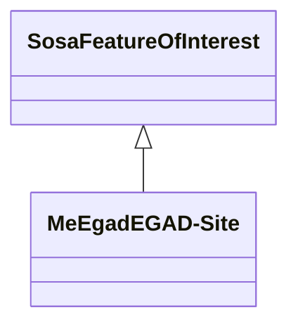

# Class: EGAD - Site (me_egad_EGAD-Site)


URI: [me_egad:EGAD-Site](http://sawgraph.spatialai.org/v1/me-egad#EGAD-Site)





## Inheritance
* [SosaFeatureOfInterest](../classes/SosaFeatureOfInterest.md)
    * **MeEgadEGAD-Site**


## Slots

| Name | Cardinality and Range | Description | Inheritance | Occurrences |
| ---  | --- | --- | --- | --- |


## LinkML Source

<!-- TODO: investigate https://stackoverflow.com/questions/37606292/how-to-create-tabbed-code-blocks-in-mkdocs-or-sphinx -->

### Direct

<details>

```yaml
name: me_egad_EGAD-Site
title: EGAD - Site
from_schema: okns:sawgraph-kg
rank: 1000
is_a: sosa_FeatureOfInterest
class_uri: me_egad:EGAD-Site

```
</details>

### Induced

<details>

```yaml
name: me_egad_EGAD-Site
title: EGAD - Site
from_schema: okns:sawgraph-kg
rank: 1000
is_a: sosa_FeatureOfInterest
class_uri: me_egad:EGAD-Site

```
</details>