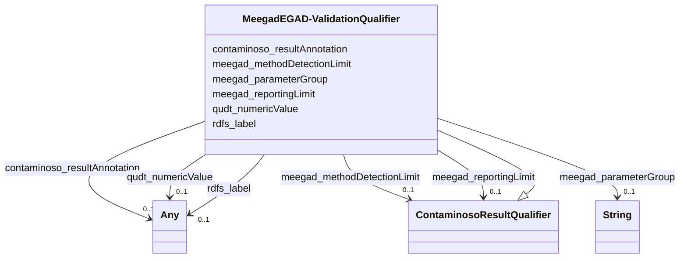

# Class: TODO -- what's a good name for this class (type)? (meegad_EGAD-ValidationQualifier)


_No type description provided_


URI: [meegad:EGAD-ValidationQualifier](http://sawgraph.spatialai.org/v1/me-egad#EGAD-ValidationQualifier)





## Inheritance
* [ContaminosoResultQualifier](../classes/ContaminosoResultQualifier.md)
    * **MeegadEGAD-ValidationQualifier**


## Slots

| Name | Cardinality and Range | Description | Inheritance |
| ---  | --- | --- | --- |
| [meegad_reportingLimit](../slots/meegad_reportingLimit.md) | 0..1 <br/> [ContaminosoResultQualifier](../classes/ContaminosoResultQualifier.md) | No slot description provided | [ContaminosoResultQualifier](../classes/ContaminosoResultQualifier.md) |
| [meegad_methodDetectionLimit](../slots/meegad_methodDetectionLimit.md) | 0..1 <br/> [ContaminosoResultQualifier](../classes/ContaminosoResultQualifier.md) | No slot description provided | [ContaminosoResultQualifier](../classes/ContaminosoResultQualifier.md) |
| [contaminoso_resultAnnotation](../slots/contaminoso_resultAnnotation.md) | 0..1 <br/> [ContaminosoResultQualifier](../classes/ContaminosoResultQualifier.md)&nbsp;or&nbsp;<br />[xsd:anyURI](http://www.w3.org/2001/XMLSchema#anyURI) | No slot description provided | [ContaminosoResultQualifier](../classes/ContaminosoResultQualifier.md) |
| [meegad_parameterGroup](../slots/meegad_parameterGroup.md) | 0..1 <br/> [xsd:string](http://www.w3.org/2001/XMLSchema#string) | No slot description provided | [ContaminosoResultQualifier](../classes/ContaminosoResultQualifier.md) |
| [rdfs_label](../slots/rdfs_label.md) | 0..1 <br/> [xsd:string](http://www.w3.org/2001/XMLSchema#string)&nbsp;or&nbsp;<br />[xsd:anyURI](http://www.w3.org/2001/XMLSchema#anyURI) | No slot description provided | [ContaminosoResultQualifier](../classes/ContaminosoResultQualifier.md) |
| [qudt_numericValue](../slots/qudt_numericValue.md) | 0..1 <br/> [xsd:decimal](http://www.w3.org/2001/XMLSchema#decimal)&nbsp;or&nbsp;<br />[xsd:double](http://www.w3.org/2001/XMLSchema#double) | No slot description provided | [ContaminosoResultQualifier](../classes/ContaminosoResultQualifier.md) |


## Examples

| Value |
| --- |
| http://sawgraph.spatialai.org/me-egad#concentrationQualifier.* |

## TODOs

* TODO -- Todos for this class go here
* or you can delete the todos
* if you think the class is perfect.

## Identifier and Mapping Information


### Schema Source


* from schema: sawgraph-kg


## Mappings

| Mapping Type | Mapped Value |
| ---  | ---  |
| self | meegad:EGAD-ValidationQualifier |
| native | sawgraph-kg/:MeegadEGAD-ValidationQualifier |


## LinkML Source

<!-- TODO: investigate https://stackoverflow.com/questions/37606292/how-to-create-tabbed-code-blocks-in-mkdocs-or-sphinx -->

### Direct

<details>
```yaml
name: meegad_EGAD-ValidationQualifier
description: No type description provided
title: TODO -- what's a good name for this class (type)?
todos:
- TODO -- Todos for this class go here
- or you can delete the todos
- if you think the class is perfect.
notes:
- Class with 56 occurences.
examples:
- value: http://sawgraph.spatialai.org/me-egad#concentrationQualifier.*
from_schema: sawgraph-kg
rank: 1000
is_a: contaminoso_ResultQualifier
class_uri: meegad:EGAD-ValidationQualifier

```
</details>

### Induced

<details>
```yaml
name: meegad_EGAD-ValidationQualifier
description: No type description provided
title: TODO -- what's a good name for this class (type)?
todos:
- TODO -- Todos for this class go here
- or you can delete the todos
- if you think the class is perfect.
notes:
- Class with 56 occurences.
examples:
- value: http://sawgraph.spatialai.org/me-egad#concentrationQualifier.*
from_schema: sawgraph-kg
rank: 1000
is_a: contaminoso_ResultQualifier
attributes:
  meegad_reportingLimit:
    name: meegad_reportingLimit
    description: No slot description provided
    title: No slot description provided
    todos:
    - TODO -- Todos for this slot go here
    - or you can delete the todos
    - if you think the class is perfect.
    comments:
    - 142152 occurrences with subject type contaminoso_ResultQualifier and object
      type contaminoso_ResultQualifier.
    examples:
    - value: http://sawgraph.spatialai.org/v1/me-egad-data#rl.WG17410824.AAWH.20230125.DEP18018
        meegad:reportingLimit http://sawgraph.spatialai.org/v1/me-egad-data#rl.WG17410824.AAWH.20230125.DEP18018
    from_schema: sawgraph-kg
    rank: 1000
    slot_uri: meegad:reportingLimit
    alias: meegad_reportingLimit
    owner: meegad_EGAD-ValidationQualifier
    domain_of:
    - contaminoso_ResultQualifier
    subproperty_of: contaminoso_resultAnnotation
    range: contaminoso_ResultQualifier
  meegad_methodDetectionLimit:
    name: meegad_methodDetectionLimit
    description: No slot description provided
    title: No slot description provided
    todos:
    - TODO -- Todos for this slot go here
    - or you can delete the todos
    - if you think the class is perfect.
    comments:
    - 141607 occurrences with subject type contaminoso_ResultQualifier and object
      type contaminoso_ResultQualifier.
    examples:
    - value: http://sawgraph.spatialai.org/v1/me-egad-data#mdl.WG17410824.AAWH.20230125.DEP18018
        meegad:methodDetectionLimit http://sawgraph.spatialai.org/v1/me-egad-data#rl.WG17410824.AAWH.20230125.DEP18018
    from_schema: sawgraph-kg
    rank: 1000
    slot_uri: meegad:methodDetectionLimit
    alias: meegad_methodDetectionLimit
    owner: meegad_EGAD-ValidationQualifier
    domain_of:
    - contaminoso_ResultQualifier
    subproperty_of: contaminoso_resultAnnotation
    range: contaminoso_ResultQualifier
  contaminoso_resultAnnotation:
    name: contaminoso_resultAnnotation
    description: No slot description provided
    title: No slot description provided
    todos:
    - TODO -- Todos for this slot go here
    - or you can delete the todos
    - if you think the class is perfect.
    comments:
    - 180161 occurrences with subject type contaminoso_ContaminantMeasurement and
      object type contaminoso_ResultQualifier.
    - 44340 occurrences with subject type contaminoso_AggregateContaminantMeasurement
      and object type contaminoso_ResultQualifier.
    - 535 occurrences with subject type contaminoso_ContaminantMeasurement and object
      type uri.
    - 72 occurrences with subject type contaminoso_AggregateContaminantMeasurement
      and object type uri.
    - 283759 occurrences with subject type contaminoso_ResultQualifier and object
      type contaminoso_ResultQualifier.
    examples:
    - value: http://sawgraph.spatialai.org/v1/me-egad-data#result.WG17410824.AAWH.20230125.1763231
        contaminoso:resultAnnotation meegad:validationLevel.DEP
    - value: http://sawgraph.spatialai.org/v1/me-egad-data#result.WG17410824.AAWH.20230125.DEP18018
        contaminoso:resultAnnotation meegad:validationLevel.DEP
    - value: http://sawgraph.spatialai.org/v1/me-egad-data#result.170094201.VAL.20170725.108427538
        contaminoso:resultAnnotation meegad:validationLevel.TierII-EPA-NE-REGION-1-GUIDELINES
    - value: http://sawgraph.spatialai.org/v1/me-egad-data#result.170098413.VAL.20170802.DEP18016
        contaminoso:resultAnnotation meegad:validationLevel.TierII-EPA-NE-REGION-1-GUIDELINES
    - value: http://sawgraph.spatialai.org/v1/me-egad-data#mdl.WG17410824.AAWH.20230125.DEP18018
        contaminoso:resultAnnotation http://sawgraph.spatialai.org/v1/me-egad-data#rl.WG17410824.AAWH.20230125.DEP18018
    from_schema: sawgraph-kg
    rank: 1000
    slot_uri: contaminoso:resultAnnotation
    alias: contaminoso_resultAnnotation
    owner: meegad_EGAD-ValidationQualifier
    domain_of:
    - contaminoso_AggregateContaminantMeasurement
    - contaminoso_ContaminantMeasurement
    - contaminoso_ResultQualifier
    range: Any
    any_of:
    - range: contaminoso_ResultQualifier
    - range: uri
  meegad_parameterGroup:
    name: meegad_parameterGroup
    description: No slot description provided
    title: No slot description provided
    todos:
    - TODO -- Todos for this slot go here
    - or you can delete the todos
    - if you think the class is perfect.
    comments:
    - 56 occurrences with subject type contaminoso_ResultQualifier and object type
      string.
    examples:
    - value: http://sawgraph.spatialai.org/me-egad#concentrationQualifier.* meegad:parameterGroup
        ALL
    from_schema: sawgraph-kg
    rank: 1000
    slot_uri: meegad:parameterGroup
    alias: meegad_parameterGroup
    owner: meegad_EGAD-ValidationQualifier
    domain_of:
    - contaminoso_ResultQualifier
    range: string
  rdfs_label:
    name: rdfs_label
    description: No slot description provided
    title: No slot description provided
    todos:
    - TODO -- Todos for this slot go here
    - or you can delete the todos
    - if you think the class is perfect.
    comments:
    - 66 occurrences with subject type contaminoso_ResultQualifier and object type
      string.
    - 33 occurrences with subject type ilisgs_WellPurpose and object type string.
    - 109 occurrences with subject type meegad_EGAD-SamplePointType and object type
      string.
    - 94 occurrences with subject type contaminoso_Substance and object type string.
    - 12 occurrences with subject type contaminoso_ObservationAnnotation and object
      type string.
    - 160 occurrences with subject type contaminoso_SampleAnnotation and object type
      string.
    - 97 occurrences with subject type contaminoso_MaterialType and object type string.
    - 1249 occurrences with subject type meegad_EGAD-AnalysisMethod and object type
      string.
    - 3 occurrences with subject type http___qudt.org_vocab_unitUnit and object type
      string.
    - 300 occurrences with subject type prov_Organization and object type string.
    - 115887 occurrences with subject type contaminoso_ContaminantMeasurement and
      object type string.
    - 26294 occurrences with subject type contaminoso_AggregateContaminantMeasurement
      and object type string.
    - 23031 occurrences with subject type contaminoso_MaterialSample and object type
      string.
    - 8324 occurrences with subject type contaminoso_Point and object type string.
    - 171069 occurrences with subject type contaminoso_Feature and object type string.
    - 957 occurrences with subject type meegad_EGAD-Site and object type string.
    - 62 occurrences with subject type meegad_EGAD-SiteType and object type string.
    - 142181 occurrences with subject type contaminoso_ContaminantObservation and
      object type string.
    examples:
    - value: http://sawgraph.spatialai.org/me-egad#concentrationQualifier.* rdfs:label
        QC RESULTS NOT WITHIN CONTROL LIMITS
    - value: http://sawgraph.spatialai.org/v1/il-isgs-data#d.ISGS-WellPurpose.CROP
        rdfs:label Outcrop
    - value: meegad:featureType.AST rdfs:label ABOVEGROUND STORAGE TANK
    - value: meegad:parameter.10-2_FTS_A rdfs:label 10:2 FLUOROTELOMER SULFONIC ACID
    - value: meegad:resultType.TRG rdfs:label TARGET/REGULAR RESULT
    - value: meegad:sampleLocation.AF rdfs:label AFTER FILTERS
    - value: meegad:sampleMaterialType.AS rdfs:label ASH (BOTTOM & FLY)
    - value: meegad:testMethod.CALCULATED rdfs:label CALCULATED
    - value: meegad:unit.MG-KG rdfs:label MILLIGRAMS PER KILOGRAM
    - value: http://sawgraph.spatialai.org/v1/me-egad-data#organization.lab.AA rdfs:label
        ALPHA ANALYTICAL LAB - WESTBOROUGH, MA
    - value: http://sawgraph.spatialai.org/v1/me-egad-data#result.1028303.ELL.20190405.45298906
        rdfs:label EGAD PFAS measurements for sample 722
    - value: http://sawgraph.spatialai.org/v1/me-egad-data#result.1028303.ELL.20190405.DEP18010
        rdfs:label EGAD PFAS measurements for sample 722
    - value: http://sawgraph.spatialai.org/v1/me-egad-data#sample.1028303.ELL.20190405
        rdfs:label EGAD sample 722
    - value: http://sawgraph.spatialai.org/v1/me-egad-data#samplePoint.100410 rdfs:label
        EGAD sample point 100410
    - value: http://sawgraph.spatialai.org/v1/me-egad-data#sampledFeature.100410 rdfs:label
        EGAD sampled festure associated with sample point 100410
    - value: http://sawgraph.spatialai.org/v1/me-egad-data#site.100843 rdfs:label
        EGAD site 100843
    - value: meegad:siteType.AGRICCHEM rdfs:label AGRICULTURAL CHEMICAL USE
    - value: http://sawgraph.spatialai.org/v1/me-egad-data#observation.1028303.ELL.20190405.45298906
        rdfs:label EGAD PFAS observation for sample 722
    from_schema: sawgraph-kg
    rank: 1000
    slot_uri: rdfs:label
    alias: rdfs_label
    owner: meegad_EGAD-ValidationQualifier
    domain_of:
    - contaminoso_AggregateContaminantMeasurement
    - contaminoso_ContaminantMeasurement
    - contaminoso_ContaminantObservation
    - contaminoso_Feature
    - contaminoso_MaterialSample
    - contaminoso_MaterialType
    - contaminoso_ObservationAnnotation
    - contaminoso_Point
    - contaminoso_ResultQualifier
    - contaminoso_SampleAnnotation
    - contaminoso_Substance
    - http___qudt.org_vocab_unitUnit
    - ilisgs_WellPurpose
    - meegad_EGAD-AnalysisMethod
    - meegad_EGAD-SamplePointType
    - meegad_EGAD-Site
    - meegad_EGAD-SiteType
    - prov_Organization
    range: Any
    any_of:
    - range: string
    - range: uri
  qudt_numericValue:
    name: qudt_numericValue
    description: No slot description provided
    title: No slot description provided
    todos:
    - TODO -- Todos for this slot go here
    - or you can delete the todos
    - if you think the class is perfect.
    comments:
    - 142927 occurrences with untyped subjects and object type decimal.
    - 127 occurrences with untyped subjects and object type http://www.w3.org/2001/XMLSchema#double.
    - 280289 occurrences with subject type contaminoso_ResultQualifier and object
      type decimal.
    - 570 occurrences with subject type contaminoso_ResultQualifier and object type
      double.
    examples:
    - value: http://sawgraph.spatialai.org/v1/me-egad-data#quantityValue.1028303.ELL.20190405.45298906
        qudt:numericValue 14.0
    - value: http://sawgraph.spatialai.org/v1/me-egad-data#quantityValue.L195312201.AAWH.20191107.375735
        qudt:numericValue 2.8e-05
    - value: http://sawgraph.spatialai.org/v1/me-egad-data#rl.1028303.ELL.20190405.45298906
        qudt:numericValue 1.6
    - value: http://sawgraph.spatialai.org/v1/me-egad-data#rl.320495081.TAI.20190423.335671
        qudt:numericValue 9.2e-05
    from_schema: sawgraph-kg
    rank: 1000
    slot_uri: qudt:numericValue
    alias: qudt_numericValue
    owner: meegad_EGAD-ValidationQualifier
    domain_of:
    - contaminoso_ResultQualifier
    range: Any
    any_of:
    - range: decimal
    - range: double
class_uri: meegad:EGAD-ValidationQualifier

```
</details>