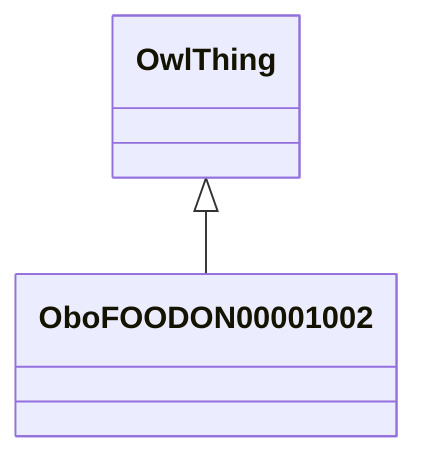

# Class: food product (obo_FOODON_00001002)


_The FoodOn "food product" class is provided as a branch under which new food product categories and food products themselves can be placed. Here classes are provided to differentiate a food product by its food composition, processing and/or consumption characteristics. This avoids brand name products but it may include generic food dish categories. It has a much greater depth and polyhierarchy than other agency product type schemes have in an effort to group related products together.  The upper level basis of this tree originated in the environment ontology (ENVO) and from the US Code of Federal Regulations._


URI: [obo:FOODON_00001002](http://purl.obolibrary.org/obo/FOODON_00001002)





## Inheritance
* [OwlThing](../classes/OwlThing.md)
    * **OboFOODON00001002**


## Slots

| Name | Cardinality and Range | Description | Inheritance | Occurrences |
| ---  | --- | --- | --- | --- |


## LinkML Source

<!-- TODO: investigate https://stackoverflow.com/questions/37606292/how-to-create-tabbed-code-blocks-in-mkdocs-or-sphinx -->

### Direct

<details>

```yaml
name: obo_FOODON_00001002
description: The FoodOn "food product" class is provided as a branch under which new
  food product categories and food products themselves can be placed. Here classes
  are provided to differentiate a food product by its food composition, processing
  and/or consumption characteristics. This avoids brand name products but it may include
  generic food dish categories. It has a much greater depth and polyhierarchy than
  other agency product type schemes have in an effort to group related products together.  The
  upper level basis of this tree originated in the environment ontology (ENVO) and
  from the US Code of Federal Regulations.
title: food product
from_schema: okns:sawgraph-kg
rank: 1000
is_a: owl_Thing
class_uri: obo:FOODON_00001002

```
</details>

### Induced

<details>

```yaml
name: obo_FOODON_00001002
description: The FoodOn "food product" class is provided as a branch under which new
  food product categories and food products themselves can be placed. Here classes
  are provided to differentiate a food product by its food composition, processing
  and/or consumption characteristics. This avoids brand name products but it may include
  generic food dish categories. It has a much greater depth and polyhierarchy than
  other agency product type schemes have in an effort to group related products together.  The
  upper level basis of this tree originated in the environment ontology (ENVO) and
  from the US Code of Federal Regulations.
title: food product
from_schema: okns:sawgraph-kg
rank: 1000
is_a: owl_Thing
class_uri: obo:FOODON_00001002

```
</details>