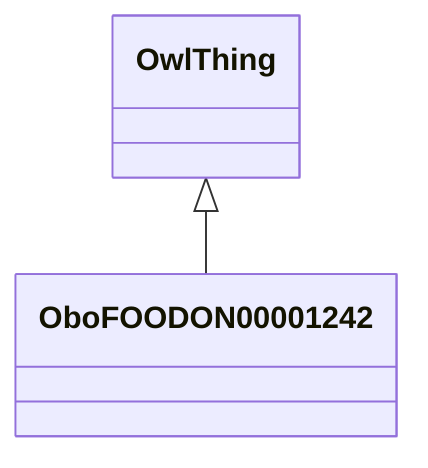

# Class: spice or herb (obo_FOODON_00001242)


URI: [obo:FOODON_00001242](http://purl.obolibrary.org/obo/FOODON_00001242)





## Inheritance
* [OwlThing](../classes/OwlThing.md)
    * **OboFOODON00001242**


## Slots

| Name | Cardinality and Range | Description | Inheritance | Occurrences |
| ---  | --- | --- | --- | --- |


## See Also

* [http://www.fao.org/WAICENT/faoinfo/economic/faodef/fdef10e.htm#1.01](http://www.fao.org/WAICENT/faoinfo/economic/faodef/fdef10e.htm#1.01)


## LinkML Source

<!-- TODO: investigate https://stackoverflow.com/questions/37606292/how-to-create-tabbed-code-blocks-in-mkdocs-or-sphinx -->

### Direct

<details>

```yaml
name: obo_FOODON_00001242
title: spice or herb
from_schema: okns:sawgraph-kg
see_also:
- http://www.fao.org/WAICENT/faoinfo/economic/faodef/fdef10e.htm#1.01
contributors:
- https://orcid.org/0000-0001-5275-8866
rank: 1000
is_a: owl_Thing
class_uri: obo:FOODON_00001242

```
</details>

### Induced

<details>

```yaml
name: obo_FOODON_00001242
title: spice or herb
from_schema: okns:sawgraph-kg
see_also:
- http://www.fao.org/WAICENT/faoinfo/economic/faodef/fdef10e.htm#1.01
contributors:
- https://orcid.org/0000-0001-5275-8866
rank: 1000
is_a: owl_Thing
class_uri: obo:FOODON_00001242

```
</details>