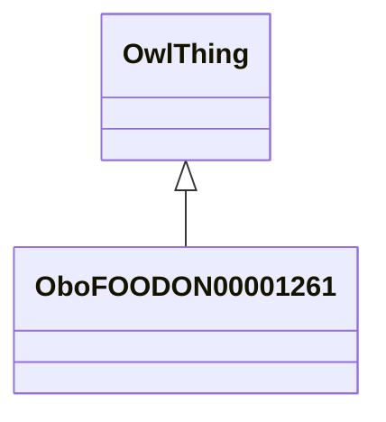

# Class: vegetable food product (obo_FOODON_00001261)


_FAO definition for vegetable: "Vegetables are plants cultivated both as field crops and garden crops, both in the open and under glass." and also: "Vegetables are grouped according to botanic characteristics as follows: leafy or stem vegetables (e.g., cabbage); fruit-bearing vegetables (e.g., melons); flower vegetables (e.g., cauliflowers); root, bulb and tuberous vegetables (e.g., onion); leguminous vegetables (e.g., green peas); other vegetables (e.g., green maize and mushrooms)."_


URI: [obo:FOODON_00001261](http://purl.obolibrary.org/obo/FOODON_00001261)





## Inheritance
* [OwlThing](../classes/OwlThing.md)
    * **OboFOODON00001261**


## Slots

| Name | Cardinality and Range | Description | Inheritance | Occurrences |
| ---  | --- | --- | --- | --- |


## See Also

* [https://www.fao.org/economic/the-statistics-division-ess/methodology/methodology-systems/crops-statistics-concepts-definitions-and-classifications/en/](https://www.fao.org/economic/the-statistics-division-ess/methodology/methodology-systems/crops-statistics-concepts-definitions-and-classifications/en/)


## LinkML Source

<!-- TODO: investigate https://stackoverflow.com/questions/37606292/how-to-create-tabbed-code-blocks-in-mkdocs-or-sphinx -->

### Direct

<details>

```yaml
name: obo_FOODON_00001261
description: 'FAO definition for vegetable: "Vegetables are plants cultivated both
  as field crops and garden crops, both in the open and under glass." and also: "Vegetables
  are grouped according to botanic characteristics as follows: leafy or stem vegetables
  (e.g., cabbage); fruit-bearing vegetables (e.g., melons); flower vegetables (e.g.,
  cauliflowers); root, bulb and tuberous vegetables (e.g., onion); leguminous vegetables
  (e.g., green peas); other vegetables (e.g., green maize and mushrooms)."'
title: vegetable food product
from_schema: okns:sawgraph-kg
see_also:
- https://www.fao.org/economic/the-statistics-division-ess/methodology/methodology-systems/crops-statistics-concepts-definitions-and-classifications/en/
rank: 1000
is_a: owl_Thing
class_uri: obo:FOODON_00001261

```
</details>

### Induced

<details>

```yaml
name: obo_FOODON_00001261
description: 'FAO definition for vegetable: "Vegetables are plants cultivated both
  as field crops and garden crops, both in the open and under glass." and also: "Vegetables
  are grouped according to botanic characteristics as follows: leafy or stem vegetables
  (e.g., cabbage); fruit-bearing vegetables (e.g., melons); flower vegetables (e.g.,
  cauliflowers); root, bulb and tuberous vegetables (e.g., onion); leguminous vegetables
  (e.g., green peas); other vegetables (e.g., green maize and mushrooms)."'
title: vegetable food product
from_schema: okns:sawgraph-kg
see_also:
- https://www.fao.org/economic/the-statistics-division-ess/methodology/methodology-systems/crops-statistics-concepts-definitions-and-classifications/en/
rank: 1000
is_a: owl_Thing
class_uri: obo:FOODON_00001261

```
</details>