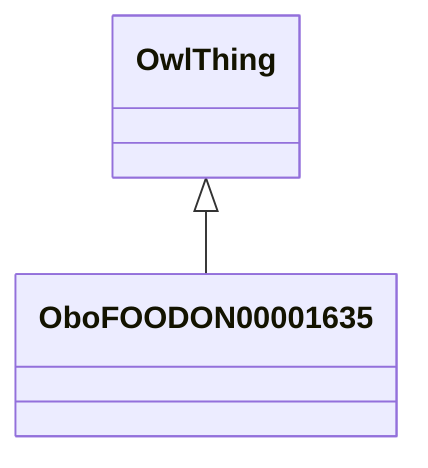

# Class: bean food product (obo_FOODON_00001635)


URI: [obo:FOODON_00001635](http://purl.obolibrary.org/obo/FOODON_00001635)





## Inheritance
* [OwlThing](../classes/OwlThing.md)
    * **OboFOODON00001635**


## Slots

| Name | Cardinality and Range | Description | Inheritance | Occurrences |
| ---  | --- | --- | --- | --- |


## See Also

* [http://purl.obolibrary.org/obo/FOODON_00002428](http://purl.obolibrary.org/obo/FOODON_00002428)
* [http://www.fao.org/es/faodef/fdef04e.htm#4.02](http://www.fao.org/es/faodef/fdef04e.htm#4.02)
* [https://oconto.extension.wisc.edu/files/2011/02/The-Importance-of-Dry-Beans-in-Your-Diet.pdf](https://oconto.extension.wisc.edu/files/2011/02/The-Importance-of-Dry-Beans-in-Your-Diet.pdf)


## LinkML Source

<!-- TODO: investigate https://stackoverflow.com/questions/37606292/how-to-create-tabbed-code-blocks-in-mkdocs-or-sphinx -->

### Direct

<details>

```yaml
name: obo_FOODON_00001635
title: bean food product
from_schema: okns:sawgraph-kg
see_also:
- http://purl.obolibrary.org/obo/FOODON_00002428
- http://www.fao.org/es/faodef/fdef04e.htm#4.02
- https://oconto.extension.wisc.edu/files/2011/02/The-Importance-of-Dry-Beans-in-Your-Diet.pdf
rank: 1000
is_a: owl_Thing
class_uri: obo:FOODON_00001635

```
</details>

### Induced

<details>

```yaml
name: obo_FOODON_00001635
title: bean food product
from_schema: okns:sawgraph-kg
see_also:
- http://purl.obolibrary.org/obo/FOODON_00002428
- http://www.fao.org/es/faodef/fdef04e.htm#4.02
- https://oconto.extension.wisc.edu/files/2011/02/The-Importance-of-Dry-Beans-in-Your-Diet.pdf
rank: 1000
is_a: owl_Thing
class_uri: obo:FOODON_00001635

```
</details>