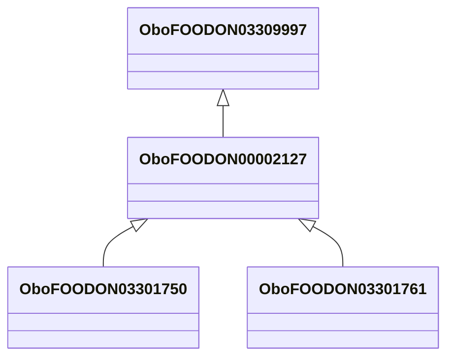

# Class: plant based food product for animal (obo_FOODON_00002127)


URI: [obo:FOODON_00002127](http://purl.obolibrary.org/obo/FOODON_00002127)





## Inheritance
* [OwlThing](../classes/OwlThing.md)
    * [OboFOODON03309997](../classes/OboFOODON03309997.md)
        * **OboFOODON00002127**
            * [OboFOODON03301750](../classes/OboFOODON03301750.md)
            * [OboFOODON03301761](../classes/OboFOODON03301761.md)


## Slots

| Name | Cardinality and Range | Description | Inheritance | Occurrences |
| ---  | --- | --- | --- | --- |


## See Also

* [https://www.feedipedia.org/](https://www.feedipedia.org/)


## LinkML Source

<!-- TODO: investigate https://stackoverflow.com/questions/37606292/how-to-create-tabbed-code-blocks-in-mkdocs-or-sphinx -->

### Direct

<details>

```yaml
name: obo_FOODON_00002127
title: plant based food product for animal
from_schema: okns:sawgraph-kg
see_also:
- https://www.feedipedia.org/
rank: 1000
is_a: obo_FOODON_03309997
class_uri: obo:FOODON_00002127

```
</details>

### Induced

<details>

```yaml
name: obo_FOODON_00002127
title: plant based food product for animal
from_schema: okns:sawgraph-kg
see_also:
- https://www.feedipedia.org/
rank: 1000
is_a: obo_FOODON_03309997
class_uri: obo:FOODON_00002127

```
</details>