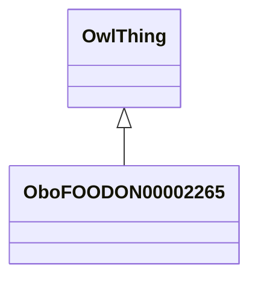

# Class: soybean seed (field) food product (obo_FOODON_00002265)


URI: [obo:FOODON_00002265](http://purl.obolibrary.org/obo/FOODON_00002265)





## Inheritance
* [OwlThing](../classes/OwlThing.md)
    * **OboFOODON00002265**


## Slots

| Name | Cardinality and Range | Description | Inheritance | Occurrences |
| ---  | --- | --- | --- | --- |


## See Also

* [http://purl.obolibrary.org/obo/FOODON_00002266](http://purl.obolibrary.org/obo/FOODON_00002266)


## LinkML Source

<!-- TODO: investigate https://stackoverflow.com/questions/37606292/how-to-create-tabbed-code-blocks-in-mkdocs-or-sphinx -->

### Direct

<details>

```yaml
name: obo_FOODON_00002265
title: soybean seed (field) food product
from_schema: okns:sawgraph-kg
see_also:
- http://purl.obolibrary.org/obo/FOODON_00002266
rank: 1000
is_a: owl_Thing
class_uri: obo:FOODON_00002265

```
</details>

### Induced

<details>

```yaml
name: obo_FOODON_00002265
title: soybean seed (field) food product
from_schema: okns:sawgraph-kg
see_also:
- http://purl.obolibrary.org/obo/FOODON_00002266
rank: 1000
is_a: owl_Thing
class_uri: obo:FOODON_00002265

```
</details>