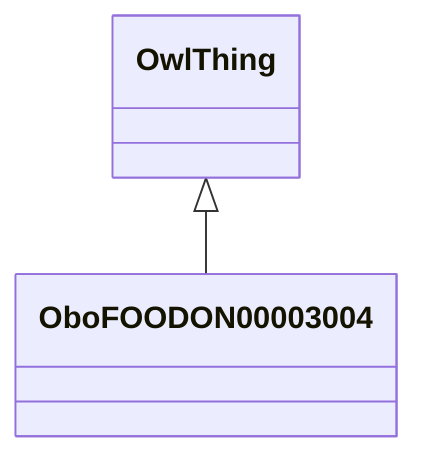

# Class: animal (obo_FOODON_00003004)


_A whole animal can be dead or alive, but its body must be relatively intact._


URI: [obo:FOODON_00003004](http://purl.obolibrary.org/obo/FOODON_00003004)





## Inheritance
* [OwlThing](../classes/OwlThing.md)
    * **OboFOODON00003004**


## Slots

| Name | Cardinality and Range | Description | Inheritance | Occurrences |
| ---  | --- | --- | --- | --- |


## Comments

* description: An animal which is dead or alive and has a relatively intact body.


## LinkML Source

<!-- TODO: investigate https://stackoverflow.com/questions/37606292/how-to-create-tabbed-code-blocks-in-mkdocs-or-sphinx -->

### Direct

<details>

```yaml
name: obo_FOODON_00003004
description: A whole animal can be dead or alive, but its body must be relatively
  intact.
title: animal
comments:
- 'description: An animal which is dead or alive and has a relatively intact body.'
from_schema: okns:sawgraph-kg
contributors:
- http://orcid.org/0000-0002-8844-9165
rank: 1000
is_a: owl_Thing
class_uri: obo:FOODON_00003004

```
</details>

### Induced

<details>

```yaml
name: obo_FOODON_00003004
description: A whole animal can be dead or alive, but its body must be relatively
  intact.
title: animal
comments:
- 'description: An animal which is dead or alive and has a relatively intact body.'
from_schema: okns:sawgraph-kg
contributors:
- http://orcid.org/0000-0002-8844-9165
rank: 1000
is_a: owl_Thing
class_uri: obo:FOODON_00003004

```
</details>