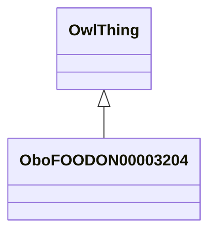

# Class: utin lap plant (obo_FOODON_00003204)


_"Eating one of these small bananas (about 100 g) covers the vitamin A requirement for 2 days. The Cavendish variety, on the other hand, contains almost no vitamin A. Growing vitamin A-rich banana varieties in more countries could contribute to a decline in global vitamin A deficiency." [http://www.fao.org/zhc/detail-events/en/c/446573/]_


URI: [obo:FOODON_00003204](http://purl.obolibrary.org/obo/FOODON_00003204)





## Inheritance
* [OwlThing](../classes/OwlThing.md)
    * **OboFOODON00003204**


## Slots

| Name | Cardinality and Range | Description | Inheritance | Occurrences |
| ---  | --- | --- | --- | --- |


## LinkML Source

<!-- TODO: investigate https://stackoverflow.com/questions/37606292/how-to-create-tabbed-code-blocks-in-mkdocs-or-sphinx -->

### Direct

<details>

```yaml
name: obo_FOODON_00003204
description: '"Eating one of these small bananas (about 100 g) covers the vitamin
  A requirement for 2 days. The Cavendish variety, on the other hand, contains almost
  no vitamin A. Growing vitamin A-rich banana varieties in more countries could contribute
  to a decline in global vitamin A deficiency." [http://www.fao.org/zhc/detail-events/en/c/446573/]'
title: utin lap plant
from_schema: okns:sawgraph-kg
rank: 1000
is_a: owl_Thing
class_uri: obo:FOODON_00003204

```
</details>

### Induced

<details>

```yaml
name: obo_FOODON_00003204
description: '"Eating one of these small bananas (about 100 g) covers the vitamin
  A requirement for 2 days. The Cavendish variety, on the other hand, contains almost
  no vitamin A. Growing vitamin A-rich banana varieties in more countries could contribute
  to a decline in global vitamin A deficiency." [http://www.fao.org/zhc/detail-events/en/c/446573/]'
title: utin lap plant
from_schema: okns:sawgraph-kg
rank: 1000
is_a: owl_Thing
class_uri: obo:FOODON_00003204

```
</details>