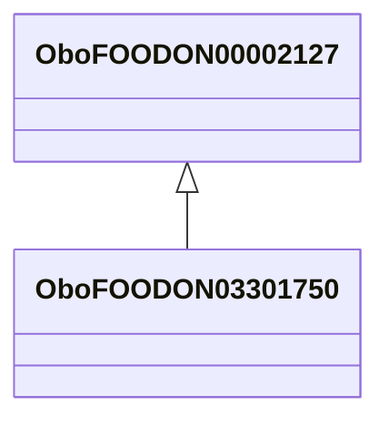

# Class: forage (animal feed) (obo_FOODON_03301750)


_SIREN DB annotation:␊* whole, natural shape FOODON:03430150␊* not heat-treated FOODON:03440003␊* whole plant or most parts used FOODON:03420150␊* non-food animal as food consumer FOODON:03510013␊* food animal as consumer FOODON:03510015_


URI: [obo:FOODON_03301750](http://purl.obolibrary.org/obo/FOODON_03301750)





## Inheritance
* [OwlThing](../classes/OwlThing.md)
    * [OboFOODON03309997](../classes/OboFOODON03309997.md)
        * [OboFOODON00002127](../classes/OboFOODON00002127.md)
            * **OboFOODON03301750**


## Slots

| Name | Cardinality and Range | Description | Inheritance | Occurrences |
| ---  | --- | --- | --- | --- |


## LinkML Source

<!-- TODO: investigate https://stackoverflow.com/questions/37606292/how-to-create-tabbed-code-blocks-in-mkdocs-or-sphinx -->

### Direct

<details>

```yaml
name: obo_FOODON_03301750
description: SIREN DB annotation:␊* whole, natural shape FOODON:03430150␊* not heat-treated
  FOODON:03440003␊* whole plant or most parts used FOODON:03420150␊* non-food animal
  as food consumer FOODON:03510013␊* food animal as consumer FOODON:03510015
title: forage (animal feed)
from_schema: okns:sawgraph-kg
rank: 1000
is_a: obo_FOODON_00002127
class_uri: obo:FOODON_03301750

```
</details>

### Induced

<details>

```yaml
name: obo_FOODON_03301750
description: SIREN DB annotation:␊* whole, natural shape FOODON:03430150␊* not heat-treated
  FOODON:03440003␊* whole plant or most parts used FOODON:03420150␊* non-food animal
  as food consumer FOODON:03510013␊* food animal as consumer FOODON:03510015
title: forage (animal feed)
from_schema: okns:sawgraph-kg
rank: 1000
is_a: obo_FOODON_00002127
class_uri: obo:FOODON_03301750

```
</details>