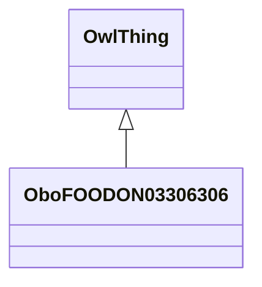

# Class: cow blood (obo_FOODON_03306306)


_SIREN DB annotation:␊* semiliquid FOODON:03430103␊* blood UBERON:0000178_


URI: [obo:FOODON_03306306](http://purl.obolibrary.org/obo/FOODON_03306306)





## Inheritance
* [OwlThing](../classes/OwlThing.md)
    * **OboFOODON03306306**


## Slots

| Name | Cardinality and Range | Description | Inheritance | Occurrences |
| ---  | --- | --- | --- | --- |


## LinkML Source

<!-- TODO: investigate https://stackoverflow.com/questions/37606292/how-to-create-tabbed-code-blocks-in-mkdocs-or-sphinx -->

### Direct

<details>

```yaml
name: obo_FOODON_03306306
description: SIREN DB annotation:␊* semiliquid FOODON:03430103␊* blood UBERON:0000178
title: cow blood
from_schema: okns:sawgraph-kg
contributors:
- https://orcid.org/0000-0001-5275-8866
rank: 1000
is_a: owl_Thing
class_uri: obo:FOODON_03306306

```
</details>

### Induced

<details>

```yaml
name: obo_FOODON_03306306
description: SIREN DB annotation:␊* semiliquid FOODON:03430103␊* blood UBERON:0000178
title: cow blood
from_schema: okns:sawgraph-kg
contributors:
- https://orcid.org/0000-0001-5275-8866
rank: 1000
is_a: owl_Thing
class_uri: obo:FOODON_03306306

```
</details>