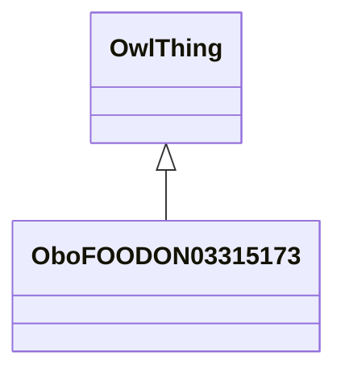

# Class: fish product (unspecified species) (obo_FOODON_03315173)


_SIREN DB annotation:␊* skeletal meat part FOODON:03420175_


URI: [obo:FOODON_03315173](http://purl.obolibrary.org/obo/FOODON_03315173)





## Inheritance
* [OwlThing](../classes/OwlThing.md)
    * **OboFOODON03315173**


## Slots

| Name | Cardinality and Range | Description | Inheritance | Occurrences |
| ---  | --- | --- | --- | --- |


## See Also

* [https://en.wikipedia.org/wiki/Fish_products](https://en.wikipedia.org/wiki/Fish_products)


## LinkML Source

<!-- TODO: investigate https://stackoverflow.com/questions/37606292/how-to-create-tabbed-code-blocks-in-mkdocs-or-sphinx -->

### Direct

<details>

```yaml
name: obo_FOODON_03315173
description: SIREN DB annotation:␊* skeletal meat part FOODON:03420175
title: fish product (unspecified species)
from_schema: okns:sawgraph-kg
see_also:
- https://en.wikipedia.org/wiki/Fish_products
rank: 1000
is_a: owl_Thing
class_uri: obo:FOODON_03315173

```
</details>

### Induced

<details>

```yaml
name: obo_FOODON_03315173
description: SIREN DB annotation:␊* skeletal meat part FOODON:03420175
title: fish product (unspecified species)
from_schema: okns:sawgraph-kg
see_also:
- https://en.wikipedia.org/wiki/Fish_products
rank: 1000
is_a: owl_Thing
class_uri: obo:FOODON_03315173

```
</details>