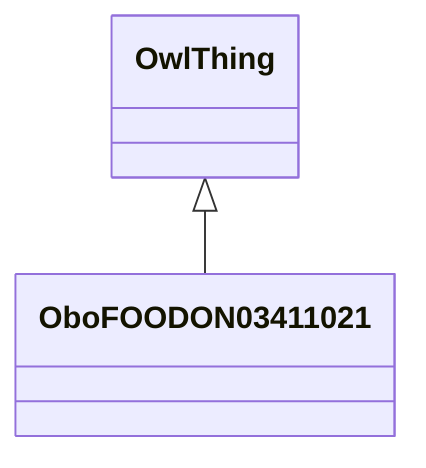

# Class: fish or lower water animal (obo_FOODON_03411021)


_This is equivalent to:␊␊'fish (food source)' or 'shellfish (food source)' or 'crustacean (food source)' or 'echinoderm (food source)' or 'coelenterate (food source)'␊␊However, this disjunction appears to be a burden on reasoners, and so this is currently not implemented._


URI: [obo:FOODON_03411021](http://purl.obolibrary.org/obo/FOODON_03411021)





## Inheritance
* [OwlThing](../classes/OwlThing.md)
    * **OboFOODON03411021**


## Slots

| Name | Cardinality and Range | Description | Inheritance | Occurrences |
| ---  | --- | --- | --- | --- |


## LinkML Source

<!-- TODO: investigate https://stackoverflow.com/questions/37606292/how-to-create-tabbed-code-blocks-in-mkdocs-or-sphinx -->

### Direct

<details>

```yaml
name: obo_FOODON_03411021
description: This is equivalent to:␊␊'fish (food source)' or 'shellfish (food source)'
  or 'crustacean (food source)' or 'echinoderm (food source)' or 'coelenterate (food
  source)'␊␊However, this disjunction appears to be a burden on reasoners, and so
  this is currently not implemented.
title: fish or lower water animal
from_schema: okns:sawgraph-kg
rank: 1000
is_a: owl_Thing
class_uri: obo:FOODON_03411021

```
</details>

### Induced

<details>

```yaml
name: obo_FOODON_03411021
description: This is equivalent to:␊␊'fish (food source)' or 'shellfish (food source)'
  or 'crustacean (food source)' or 'echinoderm (food source)' or 'coelenterate (food
  source)'␊␊However, this disjunction appears to be a burden on reasoners, and so
  this is currently not implemented.
title: fish or lower water animal
from_schema: okns:sawgraph-kg
rank: 1000
is_a: owl_Thing
class_uri: obo:FOODON_03411021

```
</details>