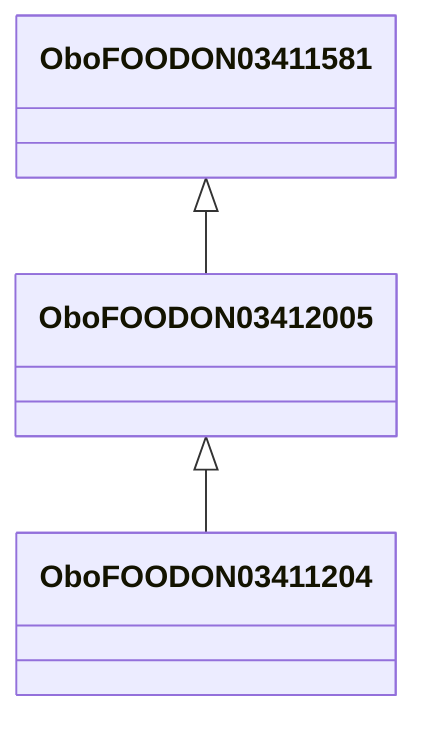

# Class: drum family (obo_FOODON_03412005)


URI: [obo:FOODON_03412005](http://purl.obolibrary.org/obo/FOODON_03412005)





## Inheritance
* [OwlThing](../classes/OwlThing.md)
    * [OboFOODON03411581](../classes/OboFOODON03411581.md)
        * **OboFOODON03412005**
            * [OboFOODON03411204](../classes/OboFOODON03411204.md)


## Slots

| Name | Cardinality and Range | Description | Inheritance | Occurrences |
| ---  | --- | --- | --- | --- |


## LinkML Source

<!-- TODO: investigate https://stackoverflow.com/questions/37606292/how-to-create-tabbed-code-blocks-in-mkdocs-or-sphinx -->

### Direct

<details>

```yaml
name: obo_FOODON_03412005
title: drum family
from_schema: okns:sawgraph-kg
rank: 1000
is_a: obo_FOODON_03411581
class_uri: obo:FOODON_03412005

```
</details>

### Induced

<details>

```yaml
name: obo_FOODON_03412005
title: drum family
from_schema: okns:sawgraph-kg
rank: 1000
is_a: obo_FOODON_03411581
class_uri: obo:FOODON_03412005

```
</details>