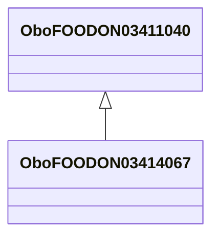

# Class: flathead catfish genus (obo_FOODON_03414067)


URI: [obo:FOODON_03414067](http://purl.obolibrary.org/obo/FOODON_03414067)





## Inheritance
* [OwlThing](../classes/OwlThing.md)
    * [OboFOODON03411365](../classes/OboFOODON03411365.md)
        * [OboFOODON03411598](../classes/OboFOODON03411598.md)
            * [OboFOODON03411040](../classes/OboFOODON03411040.md)
                * **OboFOODON03414067**


## Slots

| Name | Cardinality and Range | Description | Inheritance | Occurrences |
| ---  | --- | --- | --- | --- |


## LinkML Source

<!-- TODO: investigate https://stackoverflow.com/questions/37606292/how-to-create-tabbed-code-blocks-in-mkdocs-or-sphinx -->

### Direct

<details>

```yaml
name: obo_FOODON_03414067
title: flathead catfish genus
from_schema: okns:sawgraph-kg
rank: 1000
is_a: obo_FOODON_03411040
class_uri: obo:FOODON_03414067

```
</details>

### Induced

<details>

```yaml
name: obo_FOODON_03414067
title: flathead catfish genus
from_schema: okns:sawgraph-kg
rank: 1000
is_a: obo_FOODON_03411040
class_uri: obo:FOODON_03414067

```
</details>