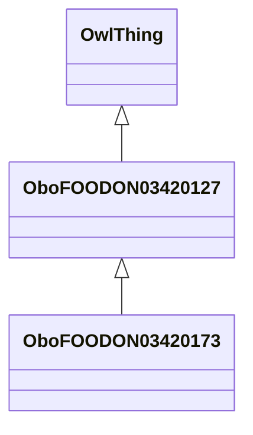

# Class: animal (whole or parts) (obo_FOODON_03420127)


_This class and its subclasses can be used if it is ambiguous whether the reference is being made to a whole animal or some part of it, including parts of organs rather than whole organs.␊␊LanguaL curation note: Includes carcass meat, organ meat, and nonmeat parts of animals, as well as the whole animal._


URI: [obo:FOODON_03420127](http://purl.obolibrary.org/obo/FOODON_03420127)





## Inheritance
* [OwlThing](../classes/OwlThing.md)
    * **OboFOODON03420127**
        * [OboFOODON03420173](../classes/OboFOODON03420173.md)


## Slots

| Name | Cardinality and Range | Description | Inheritance | Occurrences |
| ---  | --- | --- | --- | --- |


## LinkML Source

<!-- TODO: investigate https://stackoverflow.com/questions/37606292/how-to-create-tabbed-code-blocks-in-mkdocs-or-sphinx -->

### Direct

<details>

```yaml
name: obo_FOODON_03420127
description: 'This class and its subclasses can be used if it is ambiguous whether
  the reference is being made to a whole animal or some part of it, including parts
  of organs rather than whole organs.␊␊LanguaL curation note: Includes carcass meat,
  organ meat, and nonmeat parts of animals, as well as the whole animal.'
title: animal (whole or parts)
from_schema: okns:sawgraph-kg
rank: 1000
is_a: owl_Thing
class_uri: obo:FOODON_03420127

```
</details>

### Induced

<details>

```yaml
name: obo_FOODON_03420127
description: 'This class and its subclasses can be used if it is ambiguous whether
  the reference is being made to a whole animal or some part of it, including parts
  of organs rather than whole organs.␊␊LanguaL curation note: Includes carcass meat,
  organ meat, and nonmeat parts of animals, as well as the whole animal.'
title: animal (whole or parts)
from_schema: okns:sawgraph-kg
rank: 1000
is_a: owl_Thing
class_uri: obo:FOODON_03420127

```
</details>