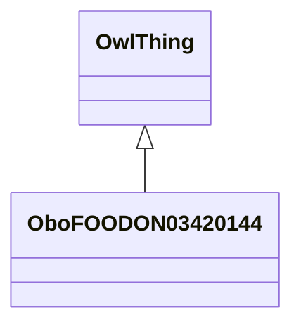

# Class: plant above surface, excluding fruit and seed (obo_FOODON_03420144)


_LanguaL curation note: This broad term is used for the plant as a whole, excluding the root and the fruit; for any piece consisting of two or more individual parts (e.g., a celery stalk with the leaf blades attached); or for any mixture of two or more individual parts (e.g., mushroom stems and pieces)._


URI: [obo:FOODON_03420144](http://purl.obolibrary.org/obo/FOODON_03420144)





## Inheritance
* [OwlThing](../classes/OwlThing.md)
    * **OboFOODON03420144**


## Slots

| Name | Cardinality and Range | Description | Inheritance | Occurrences |
| ---  | --- | --- | --- | --- |


## LinkML Source

<!-- TODO: investigate https://stackoverflow.com/questions/37606292/how-to-create-tabbed-code-blocks-in-mkdocs-or-sphinx -->

### Direct

<details>

```yaml
name: obo_FOODON_03420144
description: 'LanguaL curation note: This broad term is used for the plant as a whole,
  excluding the root and the fruit; for any piece consisting of two or more individual
  parts (e.g., a celery stalk with the leaf blades attached); or for any mixture of
  two or more individual parts (e.g., mushroom stems and pieces).'
title: plant above surface, excluding fruit and seed
from_schema: okns:sawgraph-kg
rank: 1000
is_a: owl_Thing
class_uri: obo:FOODON_03420144

```
</details>

### Induced

<details>

```yaml
name: obo_FOODON_03420144
description: 'LanguaL curation note: This broad term is used for the plant as a whole,
  excluding the root and the fruit; for any piece consisting of two or more individual
  parts (e.g., a celery stalk with the leaf blades attached); or for any mixture of
  two or more individual parts (e.g., mushroom stems and pieces).'
title: plant above surface, excluding fruit and seed
from_schema: okns:sawgraph-kg
rank: 1000
is_a: owl_Thing
class_uri: obo:FOODON_03420144

```
</details>