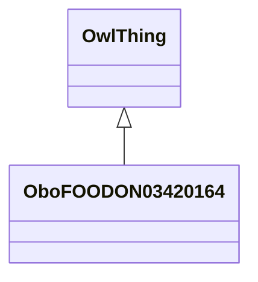

# Class: animal material (obo_FOODON_03420164)


_Langual note: Includes eggs and milk that, although separated from the animal, are produced as integral parts and are affected by the animal's food intake and metabolism._


URI: [obo:FOODON_03420164](http://purl.obolibrary.org/obo/FOODON_03420164)





## Inheritance
* [OwlThing](../classes/OwlThing.md)
    * **OboFOODON03420164**


## Slots

| Name | Cardinality and Range | Description | Inheritance | Occurrences |
| ---  | --- | --- | --- | --- |


## Comments

* description: This branch isn't necessarily food material


## LinkML Source

<!-- TODO: investigate https://stackoverflow.com/questions/37606292/how-to-create-tabbed-code-blocks-in-mkdocs-or-sphinx -->

### Direct

<details>

```yaml
name: obo_FOODON_03420164
description: 'Langual note: Includes eggs and milk that, although separated from the
  animal, are produced as integral parts and are affected by the animal''s food intake
  and metabolism.'
title: animal material
comments:
- 'description: This branch isn''t necessarily food material'
from_schema: okns:sawgraph-kg
contributors:
- https://orcid.org/0000-0001-5275-8866
rank: 1000
is_a: owl_Thing
class_uri: obo:FOODON_03420164

```
</details>

### Induced

<details>

```yaml
name: obo_FOODON_03420164
description: 'Langual note: Includes eggs and milk that, although separated from the
  animal, are produced as integral parts and are affected by the animal''s food intake
  and metabolism.'
title: animal material
comments:
- 'description: This branch isn''t necessarily food material'
from_schema: okns:sawgraph-kg
contributors:
- https://orcid.org/0000-0001-5275-8866
rank: 1000
is_a: owl_Thing
class_uri: obo:FOODON_03420164

```
</details>