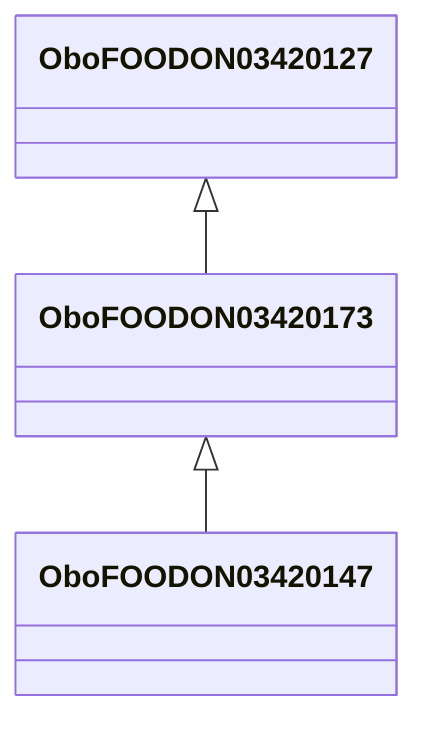

# Class: whole animal or most parts used (obo_FOODON_03420173)


_LanguaL curation note: Used when the entire animal body is the food source. Head or tail may have been removed. Use the appropriate narrower term depending on the presence or absence of skin, feathers, scales, fins and/or entrails. The body may have been cut into pieces or disintegrated._


URI: [obo:FOODON_03420173](http://purl.obolibrary.org/obo/FOODON_03420173)





## Inheritance
* [OwlThing](../classes/OwlThing.md)
    * [OboFOODON03420127](../classes/OboFOODON03420127.md)
        * **OboFOODON03420173**
            * [OboFOODON03420147](../classes/OboFOODON03420147.md)


## Slots

| Name | Cardinality and Range | Description | Inheritance | Occurrences |
| ---  | --- | --- | --- | --- |


## LinkML Source

<!-- TODO: investigate https://stackoverflow.com/questions/37606292/how-to-create-tabbed-code-blocks-in-mkdocs-or-sphinx -->

### Direct

<details>

```yaml
name: obo_FOODON_03420173
description: 'LanguaL curation note: Used when the entire animal body is the food
  source. Head or tail may have been removed. Use the appropriate narrower term depending
  on the presence or absence of skin, feathers, scales, fins and/or entrails. The
  body may have been cut into pieces or disintegrated.'
title: whole animal or most parts used
from_schema: okns:sawgraph-kg
rank: 1000
is_a: obo_FOODON_03420127
class_uri: obo:FOODON_03420173

```
</details>

### Induced

<details>

```yaml
name: obo_FOODON_03420173
description: 'LanguaL curation note: Used when the entire animal body is the food
  source. Head or tail may have been removed. Use the appropriate narrower term depending
  on the presence or absence of skin, feathers, scales, fins and/or entrails. The
  body may have been cut into pieces or disintegrated.'
title: whole animal or most parts used
from_schema: okns:sawgraph-kg
rank: 1000
is_a: obo_FOODON_03420127
class_uri: obo:FOODON_03420173

```
</details>