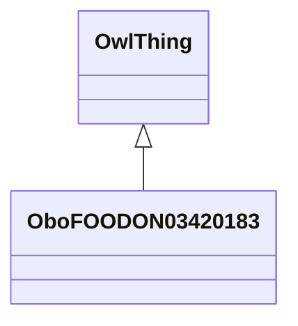

# Class: sprout (obo_FOODON_03420183)


_LanguaL curation note: Compare *GERMINATED OR SPROUTED SEED* and *STEM, STALK (WITHOUT LEAVES)*._


URI: [obo:FOODON_03420183](http://purl.obolibrary.org/obo/FOODON_03420183)





## Inheritance
* [OwlThing](../classes/OwlThing.md)
    * **OboFOODON03420183**


## Slots

| Name | Cardinality and Range | Description | Inheritance | Occurrences |
| ---  | --- | --- | --- | --- |


## LinkML Source

<!-- TODO: investigate https://stackoverflow.com/questions/37606292/how-to-create-tabbed-code-blocks-in-mkdocs-or-sphinx -->

### Direct

<details>

```yaml
name: obo_FOODON_03420183
description: 'LanguaL curation note: Compare *GERMINATED OR SPROUTED SEED* and *STEM,
  STALK (WITHOUT LEAVES)*.'
title: sprout
from_schema: okns:sawgraph-kg
rank: 1000
is_a: owl_Thing
class_uri: obo:FOODON_03420183

```
</details>

### Induced

<details>

```yaml
name: obo_FOODON_03420183
description: 'LanguaL curation note: Compare *GERMINATED OR SPROUTED SEED* and *STEM,
  STALK (WITHOUT LEAVES)*.'
title: sprout
from_schema: okns:sawgraph-kg
rank: 1000
is_a: owl_Thing
class_uri: obo:FOODON_03420183

```
</details>