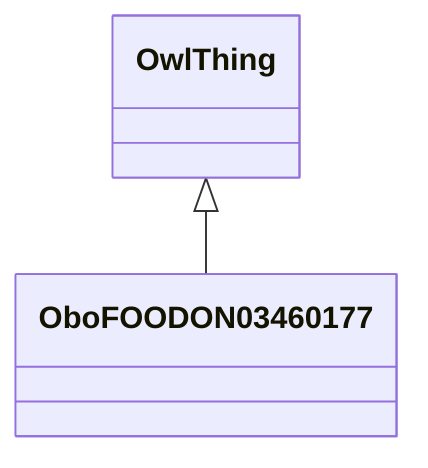

# Class: plant seed or nut food product (obo_FOODON_03460177)


_LanguaL curation note: With the exception of peanut (see *PEANUT OR PEANUT BUTTER ADDED*), used when a nut or seed ingredient is the second ingredient in order of predominance._


URI: [obo:FOODON_03460177](http://purl.obolibrary.org/obo/FOODON_03460177)





## Inheritance
* [OwlThing](../classes/OwlThing.md)
    * **OboFOODON03460177**


## Slots

| Name | Cardinality and Range | Description | Inheritance | Occurrences |
| ---  | --- | --- | --- | --- |


## LinkML Source

<!-- TODO: investigate https://stackoverflow.com/questions/37606292/how-to-create-tabbed-code-blocks-in-mkdocs-or-sphinx -->

### Direct

<details>

```yaml
name: obo_FOODON_03460177
description: 'LanguaL curation note: With the exception of peanut (see *PEANUT OR
  PEANUT BUTTER ADDED*), used when a nut or seed ingredient is the second ingredient
  in order of predominance.'
title: plant seed or nut food product
from_schema: okns:sawgraph-kg
rank: 1000
is_a: owl_Thing
class_uri: obo:FOODON_03460177

```
</details>

### Induced

<details>

```yaml
name: obo_FOODON_03460177
description: 'LanguaL curation note: With the exception of peanut (see *PEANUT OR
  PEANUT BUTTER ADDED*), used when a nut or seed ingredient is the second ingredient
  in order of predominance.'
title: plant seed or nut food product
from_schema: okns:sawgraph-kg
rank: 1000
is_a: owl_Thing
class_uri: obo:FOODON_03460177

```
</details>