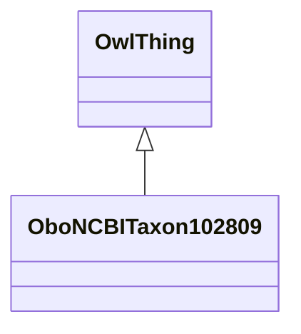

# Class: Astereae (obo_NCBITaxon_102809)


URI: [obo:NCBITaxon_102809](http://purl.obolibrary.org/obo/NCBITaxon_102809)





## Inheritance
* [OwlThing](../classes/OwlThing.md)
    * **OboNCBITaxon102809**


## Slots

| Name | Cardinality and Range | Description | Inheritance | Occurrences |
| ---  | --- | --- | --- | --- |


## LinkML Source

<!-- TODO: investigate https://stackoverflow.com/questions/37606292/how-to-create-tabbed-code-blocks-in-mkdocs-or-sphinx -->

### Direct

<details>

```yaml
name: obo_NCBITaxon_102809
title: Astereae
from_schema: okns:sawgraph-kg
rank: 1000
is_a: owl_Thing
class_uri: obo:NCBITaxon_102809

```
</details>

### Induced

<details>

```yaml
name: obo_NCBITaxon_102809
title: Astereae
from_schema: okns:sawgraph-kg
rank: 1000
is_a: owl_Thing
class_uri: obo:NCBITaxon_102809

```
</details>