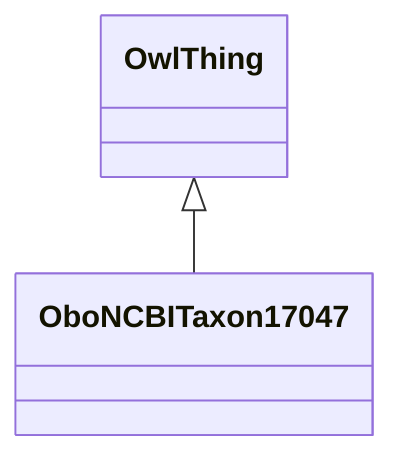

# Class: Malpighia (obo_NCBITaxon_17047)


URI: [obo:NCBITaxon_17047](http://purl.obolibrary.org/obo/NCBITaxon_17047)





## Inheritance
* [OwlThing](../classes/OwlThing.md)
    * **OboNCBITaxon17047**


## Slots

| Name | Cardinality and Range | Description | Inheritance | Occurrences |
| ---  | --- | --- | --- | --- |


## LinkML Source

<!-- TODO: investigate https://stackoverflow.com/questions/37606292/how-to-create-tabbed-code-blocks-in-mkdocs-or-sphinx -->

### Direct

<details>

```yaml
name: obo_NCBITaxon_17047
title: Malpighia
from_schema: okns:sawgraph-kg
rank: 1000
is_a: owl_Thing
class_uri: obo:NCBITaxon_17047

```
</details>

### Induced

<details>

```yaml
name: obo_NCBITaxon_17047
title: Malpighia
from_schema: okns:sawgraph-kg
rank: 1000
is_a: owl_Thing
class_uri: obo:NCBITaxon_17047

```
</details>