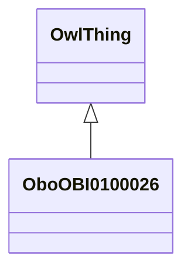

# Class: organism (obo_OBI_0100026)


URI: [obo:OBI_0100026](http://purl.obolibrary.org/obo/OBI_0100026)





## Inheritance
* [OwlThing](../classes/OwlThing.md)
    * **OboOBI0100026**


## Slots

| Name | Cardinality and Range | Description | Inheritance | Occurrences |
| ---  | --- | --- | --- | --- |


## LinkML Source

<!-- TODO: investigate https://stackoverflow.com/questions/37606292/how-to-create-tabbed-code-blocks-in-mkdocs-or-sphinx -->

### Direct

<details>

```yaml
name: obo_OBI_0100026
title: organism
from_schema: okns:sawgraph-kg
rank: 1000
is_a: owl_Thing
class_uri: obo:OBI_0100026

```
</details>

### Induced

<details>

```yaml
name: obo_OBI_0100026
title: organism
from_schema: okns:sawgraph-kg
rank: 1000
is_a: owl_Thing
class_uri: obo:OBI_0100026

```
</details>