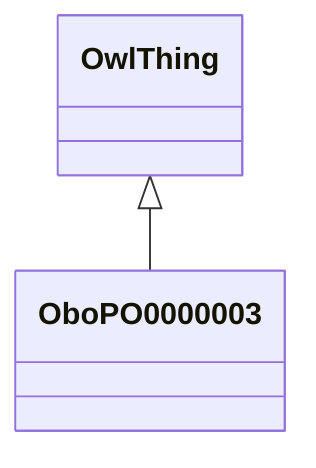

# Class: whole plant (obo_PO_0000003)


_Examples include plant embryo (PO:0009009), megagametophyte (PO:0025279) and microgametophyte (PO:0025280)._


URI: [obo:PO_0000003](http://purl.obolibrary.org/obo/PO_0000003)





## Inheritance
* [OwlThing](../classes/OwlThing.md)
    * **OboPO0000003**


## Slots

| Name | Cardinality and Range | Description | Inheritance | Occurrences |
| ---  | --- | --- | --- | --- |


## LinkML Source

<!-- TODO: investigate https://stackoverflow.com/questions/37606292/how-to-create-tabbed-code-blocks-in-mkdocs-or-sphinx -->

### Direct

<details>

```yaml
name: obo_PO_0000003
description: Examples include plant embryo (PO:0009009), megagametophyte (PO:0025279)
  and microgametophyte (PO:0025280).
title: whole plant
from_schema: okns:sawgraph-kg
rank: 1000
is_a: owl_Thing
class_uri: obo:PO_0000003

```
</details>

### Induced

<details>

```yaml
name: obo_PO_0000003
description: Examples include plant embryo (PO:0009009), megagametophyte (PO:0025279)
  and microgametophyte (PO:0025280).
title: whole plant
from_schema: okns:sawgraph-kg
rank: 1000
is_a: owl_Thing
class_uri: obo:PO_0000003

```
</details>