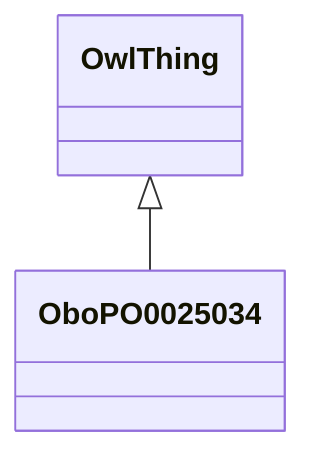

# Class: leaf (obo_PO_0025034)


_LanguaL definition: The flat or fleshy expanded blade (lamina) including a small and insignificant leafstalk but excluding a large and fleshy leafstalk such as celery stalks or rhubarb stalks.␊␊LanguaL curation note: If the part indexed consists of a large leafstalk and a leaf blade, use *PLANT ABOVE SURFACE, EXCLUDING FRUIT OR SEED*. Compare *STEM, STALK (WITHOUT LEAVES)*._


URI: [obo:PO_0025034](http://purl.obolibrary.org/obo/PO_0025034)





## Inheritance
* [OwlThing](../classes/OwlThing.md)
    * **OboPO0025034**


## Slots

| Name | Cardinality and Range | Description | Inheritance | Occurrences |
| ---  | --- | --- | --- | --- |


## LinkML Source

<!-- TODO: investigate https://stackoverflow.com/questions/37606292/how-to-create-tabbed-code-blocks-in-mkdocs-or-sphinx -->

### Direct

<details>

```yaml
name: obo_PO_0025034
description: 'LanguaL definition: The flat or fleshy expanded blade (lamina) including
  a small and insignificant leafstalk but excluding a large and fleshy leafstalk such
  as celery stalks or rhubarb stalks.␊␊LanguaL curation note: If the part indexed
  consists of a large leafstalk and a leaf blade, use *PLANT ABOVE SURFACE, EXCLUDING
  FRUIT OR SEED*. Compare *STEM, STALK (WITHOUT LEAVES)*.'
title: leaf
from_schema: okns:sawgraph-kg
rank: 1000
is_a: owl_Thing
class_uri: obo:PO_0025034

```
</details>

### Induced

<details>

```yaml
name: obo_PO_0025034
description: 'LanguaL definition: The flat or fleshy expanded blade (lamina) including
  a small and insignificant leafstalk but excluding a large and fleshy leafstalk such
  as celery stalks or rhubarb stalks.␊␊LanguaL curation note: If the part indexed
  consists of a large leafstalk and a leaf blade, use *PLANT ABOVE SURFACE, EXCLUDING
  FRUIT OR SEED*. Compare *STEM, STALK (WITHOUT LEAVES)*.'
title: leaf
from_schema: okns:sawgraph-kg
rank: 1000
is_a: owl_Thing
class_uri: obo:PO_0025034

```
</details>