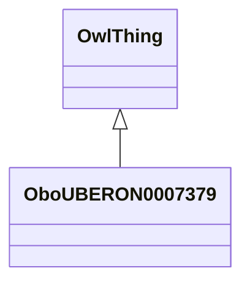

# Class: shelled egg (obo_UBERON_0007379)


_LanguaL curation note: The egg shell functions as a container. Therefore, the physical state of a raw egg in the shell is *LIQUID, HIGH VISCOSITY, WITH NO VISIBLE PARTICLES*._


URI: [obo:UBERON_0007379](http://purl.obolibrary.org/obo/UBERON_0007379)





## Inheritance
* [OwlThing](../classes/OwlThing.md)
    * **OboUBERON0007379**


## Slots

| Name | Cardinality and Range | Description | Inheritance | Occurrences |
| ---  | --- | --- | --- | --- |


## LinkML Source

<!-- TODO: investigate https://stackoverflow.com/questions/37606292/how-to-create-tabbed-code-blocks-in-mkdocs-or-sphinx -->

### Direct

<details>

```yaml
name: obo_UBERON_0007379
description: 'LanguaL curation note: The egg shell functions as a container. Therefore,
  the physical state of a raw egg in the shell is *LIQUID, HIGH VISCOSITY, WITH NO
  VISIBLE PARTICLES*.'
title: shelled egg
from_schema: okns:sawgraph-kg
rank: 1000
is_a: owl_Thing
class_uri: obo:UBERON_0007379

```
</details>

### Induced

<details>

```yaml
name: obo_UBERON_0007379
description: 'LanguaL curation note: The egg shell functions as a container. Therefore,
  the physical state of a raw egg in the shell is *LIQUID, HIGH VISCOSITY, WITH NO
  VISIBLE PARTICLES*.'
title: shelled egg
from_schema: okns:sawgraph-kg
rank: 1000
is_a: owl_Thing
class_uri: obo:UBERON_0007379

```
</details>