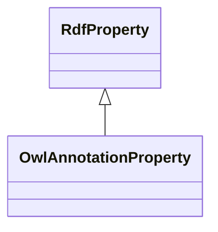

# Class: No class (entity type) name specified (owl_AnnotationProperty)


_No class (type) description specified_


URI: [owl:AnnotationProperty](http://www.w3.org/2002/07/owl#AnnotationProperty)





## Inheritance
* [RdfProperty](../classes/RdfProperty.md)
    * **OwlAnnotationProperty**


## Slots

| Name | Cardinality and Range | Description | Inheritance | Occurrences |
| ---  | --- | --- | --- | --- |


## Usages

| used by | used in | type | used |
| ---  | --- | --- | --- |
| [OwlRestriction](../classes/OwlRestriction.md) | [owl_onProperty](../slots/owl_onProperty.md) | any_of[range] | [OwlAnnotationProperty](../classes/OwlAnnotationProperty.md) |
| [Vaem#GraphMetaData](../classes/Vaem#GraphMetaData.md) | [vaem_#usesNonImportedResource](../slots/vaem_#usesNonImportedResource.md) | any_of[range] | [OwlAnnotationProperty](../classes/OwlAnnotationProperty.md) |


## LinkML Source

<!-- TODO: investigate https://stackoverflow.com/questions/37606292/how-to-create-tabbed-code-blocks-in-mkdocs-or-sphinx -->

### Direct

<details>

```yaml
name: owl_AnnotationProperty
conforms_to: No schema conformance document specified
description: No class (type) description specified
title: No class (entity type) name specified
from_schema: sawgraph-kg
rank: 1000
is_a: rdf_Property
class_uri: owl:AnnotationProperty

```
</details>

### Induced

<details>

```yaml
name: owl_AnnotationProperty
conforms_to: No schema conformance document specified
description: No class (type) description specified
title: No class (entity type) name specified
from_schema: sawgraph-kg
rank: 1000
is_a: rdf_Property
class_uri: owl:AnnotationProperty

```
</details>