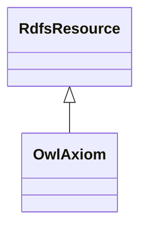

# Class: Axiom (owl_Axiom)


_The class of annotated axioms for which the RDF serialization consists of an annotated subject, predicate and object._


This class occurs 2 times.


URI: [owl:Axiom](http://www.w3.org/2002/07/owl#Axiom)





## Inheritance
* [RdfsResource](../classes/RdfsResource.md)
    * **OwlAxiom**


## Slots

| Name | Cardinality and Range | Description | Inheritance | Occurrences |
| ---  | --- | --- | --- | --- |


## LinkML Source

<!-- TODO: investigate https://stackoverflow.com/questions/37606292/how-to-create-tabbed-code-blocks-in-mkdocs-or-sphinx -->

### Direct

<details>

```yaml
name: owl_Axiom
description: The class of annotated axioms for which the RDF serialization consists
  of an annotated subject, predicate and object.
title: Axiom
from_schema: okns:owl-rdf-rdfs
source: http://www.w3.org/2002/07/owl#
is_a: rdfs_Resource
class_uri: owl:Axiom

```
</details>

### Induced

<details>

```yaml
name: owl_Axiom
description: The class of annotated axioms for which the RDF serialization consists
  of an annotated subject, predicate and object.
title: Axiom
from_schema: okns:owl-rdf-rdfs
source: http://www.w3.org/2002/07/owl#
is_a: rdfs_Resource
class_uri: owl:Axiom

```
</details>