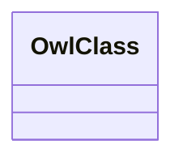

# Class: No class (type) name specified (owl_Class)


_No class (type) description specified_


URI: []()





<!-- no inheritance hierarchy -->


## Slots

| Name | Cardinality and Range | Description | Inheritance | Occurrences |
| ---  | --- | --- | --- | --- |


## Usages

| used by | used in | type | used |
| ---  | --- | --- | --- |
| [OwlRestriction](../classes/OwlRestriction.md) | [owl_allValuesFrom](../slots/owl_allValuesFrom.md) | any_of[range] | [OwlClass](../classes/OwlClass.md) |


## LinkML Source

<!-- TODO: investigate https://stackoverflow.com/questions/37606292/how-to-create-tabbed-code-blocks-in-mkdocs-or-sphinx -->

### Direct

<details>

```yaml
name: owl_Class
conforms_to: No schema conformance document specified
description: No class (type) description specified
title: No class (type) name specified
from_schema: sawgraph-kg
rank: 1000
class_uri: ''

```
</details>

### Induced

<details>

```yaml
name: owl_Class
conforms_to: No schema conformance document specified
description: No class (type) description specified
title: No class (type) name specified
from_schema: sawgraph-kg
rank: 1000
class_uri: ''

```
</details>