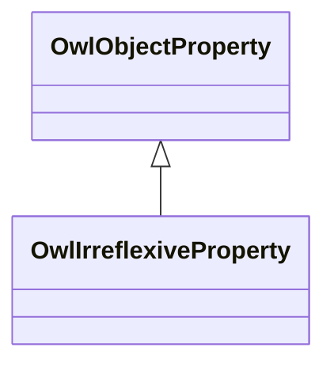

# Class: No class (entity type) name specified (owl_IrreflexiveProperty)


_No class (type) description specified_


URI: [owl:IrreflexiveProperty](http://www.w3.org/2002/07/owl#IrreflexiveProperty)





## Inheritance
* [OwlObjectProperty](../classes/OwlObjectProperty.md)
    * **OwlIrreflexiveProperty**


## Slots

| Name | Cardinality and Range | Description | Inheritance | Occurrences |
| ---  | --- | --- | --- | --- |


## LinkML Source

<!-- TODO: investigate https://stackoverflow.com/questions/37606292/how-to-create-tabbed-code-blocks-in-mkdocs-or-sphinx -->

### Direct

<details>

```yaml
name: owl_IrreflexiveProperty
conforms_to: No schema conformance document specified
description: No class (type) description specified
title: No class (entity type) name specified
from_schema: sawgraph-kg
rank: 1000
is_a: owl_ObjectProperty
class_uri: owl:IrreflexiveProperty

```
</details>

### Induced

<details>

```yaml
name: owl_IrreflexiveProperty
conforms_to: No schema conformance document specified
description: No class (type) description specified
title: No class (entity type) name specified
from_schema: sawgraph-kg
rank: 1000
is_a: owl_ObjectProperty
class_uri: owl:IrreflexiveProperty

```
</details>