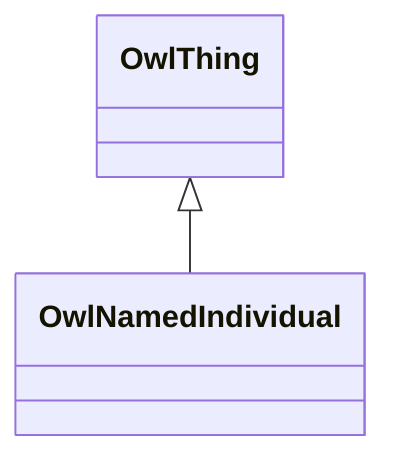

# Class: NamedIndividual (owl_NamedIndividual)


_The class of named individuals._


This class occurs 870 times.


URI: [owl:NamedIndividual](http://www.w3.org/2002/07/owl#NamedIndividual)





## Inheritance
* [OwlThing](../classes/OwlThing.md)
    * **OwlNamedIndividual**


## Slots

| Name | Cardinality and Range | Description | Inheritance | Occurrences |
| ---  | --- | --- | --- | --- |


## Usages

| used by | used in | type | used |
| ---  | --- | --- | --- |
| [Beb7217b5b32080b9606028314249e33b](../classes/Beb7217b5b32080b9606028314249e33b.md) | [coso_hasMember](../slots/coso_hasMember.md) | any_of[range] | [OwlNamedIndividual](../classes/OwlNamedIndividual.md) |
| [CosoAnimalBloodSample](../classes/CosoAnimalBloodSample.md) | [coso_sampleAnnotation](../slots/coso_sampleAnnotation.md) | any_of[range] | [OwlNamedIndividual](../classes/OwlNamedIndividual.md) |
| [CosoAnimalBloodSample](../classes/CosoAnimalBloodSample.md) | [http___w3id.org_sawgraph_v1_me_egad#sampleCollectionMethod](../slots/http___w3id.org_sawgraph_v1_me_egad#sampleCollectionMethod.md) | any_of[range] | [OwlNamedIndividual](../classes/OwlNamedIndividual.md) |
| [CosoAnimalBloodSample](../classes/CosoAnimalBloodSample.md) | [coso_sampleOfMaterialType](../slots/coso_sampleOfMaterialType.md) | any_of[range] | [OwlNamedIndividual](../classes/OwlNamedIndividual.md) |
| [CosoAnimalMaterialSample](../classes/CosoAnimalMaterialSample.md) | [coso_sampleAnnotation](../slots/coso_sampleAnnotation.md) | any_of[range] | [OwlNamedIndividual](../classes/OwlNamedIndividual.md) |
| [CosoAnimalMaterialSample](../classes/CosoAnimalMaterialSample.md) | [http___w3id.org_sawgraph_v1_me_egad#sampleCollectionMethod](../slots/http___w3id.org_sawgraph_v1_me_egad#sampleCollectionMethod.md) | any_of[range] | [OwlNamedIndividual](../classes/OwlNamedIndividual.md) |
| [CosoAnimalMaterialSample](../classes/CosoAnimalMaterialSample.md) | [coso_sampleOfMaterialType](../slots/coso_sampleOfMaterialType.md) | any_of[range] | [OwlNamedIndividual](../classes/OwlNamedIndividual.md) |
| [CosoAnimalMilkSample](../classes/CosoAnimalMilkSample.md) | [coso_sampleAnnotation](../slots/coso_sampleAnnotation.md) | any_of[range] | [OwlNamedIndividual](../classes/OwlNamedIndividual.md) |
| [CosoAnimalMilkSample](../classes/CosoAnimalMilkSample.md) | [http___w3id.org_sawgraph_v1_me_egad#sampleCollectionMethod](../slots/http___w3id.org_sawgraph_v1_me_egad#sampleCollectionMethod.md) | any_of[range] | [OwlNamedIndividual](../classes/OwlNamedIndividual.md) |
| [CosoAnimalMilkSample](../classes/CosoAnimalMilkSample.md) | [http___w3id.org_sawgraph_v1_me_egad#sampleTreatmentStatus](../slots/http___w3id.org_sawgraph_v1_me_egad#sampleTreatmentStatus.md) | any_of[range] | [OwlNamedIndividual](../classes/OwlNamedIndividual.md) |
| [CosoAnimalMilkSample](../classes/CosoAnimalMilkSample.md) | [coso_sampleOfMaterialType](../slots/coso_sampleOfMaterialType.md) | any_of[range] | [OwlNamedIndividual](../classes/OwlNamedIndividual.md) |
| [CosoAnimalOrganSample](../classes/CosoAnimalOrganSample.md) | [coso_sampleAnnotation](../slots/coso_sampleAnnotation.md) | any_of[range] | [OwlNamedIndividual](../classes/OwlNamedIndividual.md) |
| [CosoAnimalOrganSample](../classes/CosoAnimalOrganSample.md) | [http___w3id.org_sawgraph_v1_me_egad#sampleCollectionLocation](../slots/http___w3id.org_sawgraph_v1_me_egad#sampleCollectionLocation.md) | any_of[range] | [OwlNamedIndividual](../classes/OwlNamedIndividual.md) |
| [CosoAnimalOrganSample](../classes/CosoAnimalOrganSample.md) | [http___w3id.org_sawgraph_v1_me_egad#sampleCollectionMethod](../slots/http___w3id.org_sawgraph_v1_me_egad#sampleCollectionMethod.md) | any_of[range] | [OwlNamedIndividual](../classes/OwlNamedIndividual.md) |
| [CosoAnimalOrganSample](../classes/CosoAnimalOrganSample.md) | [coso_sampleOfMaterialType](../slots/coso_sampleOfMaterialType.md) | any_of[range] | [OwlNamedIndividual](../classes/OwlNamedIndividual.md) |
| [CosoAnimalTissueSample](../classes/CosoAnimalTissueSample.md) | [coso_sampleAnnotation](../slots/coso_sampleAnnotation.md) | any_of[range] | [OwlNamedIndividual](../classes/OwlNamedIndividual.md) |
| [CosoAnimalTissueSample](../classes/CosoAnimalTissueSample.md) | [http___w3id.org_sawgraph_v1_me_egad#sampleCollectionLocation](../slots/http___w3id.org_sawgraph_v1_me_egad#sampleCollectionLocation.md) | any_of[range] | [OwlNamedIndividual](../classes/OwlNamedIndividual.md) |
| [CosoAnimalTissueSample](../classes/CosoAnimalTissueSample.md) | [http___w3id.org_sawgraph_v1_me_egad#sampleCollectionMethod](../slots/http___w3id.org_sawgraph_v1_me_egad#sampleCollectionMethod.md) | any_of[range] | [OwlNamedIndividual](../classes/OwlNamedIndividual.md) |
| [CosoAnimalTissueSample](../classes/CosoAnimalTissueSample.md) | [coso_sampleOfMaterialType](../slots/coso_sampleOfMaterialType.md) | any_of[range] | [OwlNamedIndividual](../classes/OwlNamedIndividual.md) |
| [CosoPlantMaterialSample](../classes/CosoPlantMaterialSample.md) | [coso_sampleAnnotation](../slots/coso_sampleAnnotation.md) | any_of[range] | [OwlNamedIndividual](../classes/OwlNamedIndividual.md) |
| [CosoPlantMaterialSample](../classes/CosoPlantMaterialSample.md) | [http___w3id.org_sawgraph_v1_me_egad#sampleCollectionLocation](../slots/http___w3id.org_sawgraph_v1_me_egad#sampleCollectionLocation.md) | any_of[range] | [OwlNamedIndividual](../classes/OwlNamedIndividual.md) |
| [CosoPlantMaterialSample](../classes/CosoPlantMaterialSample.md) | [http___w3id.org_sawgraph_v1_me_egad#sampleCollectionMethod](../slots/http___w3id.org_sawgraph_v1_me_egad#sampleCollectionMethod.md) | any_of[range] | [OwlNamedIndividual](../classes/OwlNamedIndividual.md) |
| [CosoPlantMaterialSample](../classes/CosoPlantMaterialSample.md) | [coso_sampleOfMaterialType](../slots/coso_sampleOfMaterialType.md) | any_of[range] | [OwlNamedIndividual](../classes/OwlNamedIndividual.md) |
| [CosoSubstanceCollection](../classes/CosoSubstanceCollection.md) | [coso_hasMember](../slots/coso_hasMember.md) | any_of[range] | [OwlNamedIndividual](../classes/OwlNamedIndividual.md) |
| [HttpW3id.orgSawgraphV1Me-egad#EGAD-AggregatePFAS-Concentration](../classes/HttpW3id.orgSawgraphV1Me-egad#EGAD-AggregatePFAS-Concentration.md) | [coso_resultAnnotation](../slots/coso_resultAnnotation.md) | any_of[range] | [OwlNamedIndividual](../classes/OwlNamedIndividual.md) |
| [HttpW3id.orgSawgraphV1Me-egad#EGAD-AggregatePFAS-Concentration](../classes/HttpW3id.orgSawgraphV1Me-egad#EGAD-AggregatePFAS-Concentration.md) | [http___w3id.org_sawgraph_v1_me_egad#validationQualifier](../slots/http___w3id.org_sawgraph_v1_me_egad#validationQualifier.md) | any_of[range] | [OwlNamedIndividual](../classes/OwlNamedIndividual.md) |
| [HttpW3id.orgSawgraphV1Me-egad#EGAD-AggregatePFAS-Concentration](../classes/HttpW3id.orgSawgraphV1Me-egad#EGAD-AggregatePFAS-Concentration.md) | [http___w3id.org_sawgraph_v1_me_egad#labQualifier](../slots/http___w3id.org_sawgraph_v1_me_egad#labQualifier.md) | any_of[range] | [OwlNamedIndividual](../classes/OwlNamedIndividual.md) |
| [HttpW3id.orgSawgraphV1Me-egad#EGAD-AggregatePFAS-Concentration](../classes/HttpW3id.orgSawgraphV1Me-egad#EGAD-AggregatePFAS-Concentration.md) | [stad_hasQualityKind](../slots/stad_hasQualityKind.md) | any_of[range] | [OwlNamedIndividual](../classes/OwlNamedIndividual.md) |
| [HttpW3id.orgSawgraphV1Me-egad#EGAD-AggregatePFAS-Concentration](../classes/HttpW3id.orgSawgraphV1Me-egad#EGAD-AggregatePFAS-Concentration.md) | [http___w3id.org_sawgraph_v1_me_egad#validationLevel](../slots/http___w3id.org_sawgraph_v1_me_egad#validationLevel.md) | any_of[range] | [OwlNamedIndividual](../classes/OwlNamedIndividual.md) |
| [HttpW3id.orgSawgraphV1Me-egad#EGAD-PFAS-Observation](../classes/HttpW3id.orgSawgraphV1Me-egad#EGAD-PFAS-Observation.md) | [CosoOfDatasetSubstance](../classes/CosoOfDatasetSubstance.md) | any_of[range] | [OwlNamedIndividual](../classes/OwlNamedIndividual.md) |
| [HttpW3id.orgSawgraphV1Me-egad#EGAD-PFAS-Observation](../classes/HttpW3id.orgSawgraphV1Me-egad#EGAD-PFAS-Observation.md) | [coso_ofSubstance](../slots/coso_ofSubstance.md) | any_of[range] | [OwlNamedIndividual](../classes/OwlNamedIndividual.md) |
| [HttpW3id.orgSawgraphV1Me-egad#EGAD-PFAS-Observation](../classes/HttpW3id.orgSawgraphV1Me-egad#EGAD-PFAS-Observation.md) | [coso_analysisMethod](../slots/coso_analysisMethod.md) | any_of[range] | [OwlNamedIndividual](../classes/OwlNamedIndividual.md) |
| [HttpW3id.orgSawgraphV1Me-egad#EGAD-PFAS-Observation](../classes/HttpW3id.orgSawgraphV1Me-egad#EGAD-PFAS-Observation.md) | [http___w3id.org_sawgraph_v1_me_egad#resultType](../slots/http___w3id.org_sawgraph_v1_me_egad#resultType.md) | any_of[range] | [OwlNamedIndividual](../classes/OwlNamedIndividual.md) |
| [HttpW3id.orgSawgraphV1Me-egad#EGAD-PFAS-Observation](../classes/HttpW3id.orgSawgraphV1Me-egad#EGAD-PFAS-Observation.md) | [coso_observationAnnotation](../slots/coso_observationAnnotation.md) | any_of[range] | [OwlNamedIndividual](../classes/OwlNamedIndividual.md) |
| [HttpW3id.orgSawgraphV1Me-egad#EGAD-PFAS-Observation](../classes/HttpW3id.orgSawgraphV1Me-egad#EGAD-PFAS-Observation.md) | [coso_observedProperty](../slots/coso_observedProperty.md) | any_of[range] | [OwlNamedIndividual](../classes/OwlNamedIndividual.md) |
| [HttpW3id.orgSawgraphV1Me-egad#EGAD-PFAS-ParameterName](../classes/HttpW3id.orgSawgraphV1Me-egad#EGAD-PFAS-ParameterName.md) | [coso_hasMember](../slots/coso_hasMember.md) | any_of[range] | [OwlNamedIndividual](../classes/OwlNamedIndividual.md) |
| [HttpW3id.orgSawgraphV1Me-egad#EGAD-PFAS-Site](../classes/HttpW3id.orgSawgraphV1Me-egad#EGAD-PFAS-Site.md) | [http___w3id.org_sawgraph_v1_me_egad#siteType](../slots/http___w3id.org_sawgraph_v1_me_egad#siteType.md) | any_of[range] | [OwlNamedIndividual](../classes/OwlNamedIndividual.md) |
| [HttpW3id.orgSawgraphV1Me-egad#EGAD-PFAS-Site](../classes/HttpW3id.orgSawgraphV1Me-egad#EGAD-PFAS-Site.md) | [me_egad_siteType](../slots/me_egad_siteType.md) | any_of[range] | [OwlNamedIndividual](../classes/OwlNamedIndividual.md) |
| [HttpW3id.orgSawgraphV1Me-egad#EGAD-Sample](../classes/HttpW3id.orgSawgraphV1Me-egad#EGAD-Sample.md) | [coso_sampleAnnotation](../slots/coso_sampleAnnotation.md) | any_of[range] | [OwlNamedIndividual](../classes/OwlNamedIndividual.md) |
| [HttpW3id.orgSawgraphV1Me-egad#EGAD-Sample](../classes/HttpW3id.orgSawgraphV1Me-egad#EGAD-Sample.md) | [http___w3id.org_sawgraph_v1_me_egad#sampleCollectionLocation](../slots/http___w3id.org_sawgraph_v1_me_egad#sampleCollectionLocation.md) | any_of[range] | [OwlNamedIndividual](../classes/OwlNamedIndividual.md) |
| [HttpW3id.orgSawgraphV1Me-egad#EGAD-Sample](../classes/HttpW3id.orgSawgraphV1Me-egad#EGAD-Sample.md) | [http___w3id.org_sawgraph_v1_me_egad#sampleCollectionMethod](../slots/http___w3id.org_sawgraph_v1_me_egad#sampleCollectionMethod.md) | any_of[range] | [OwlNamedIndividual](../classes/OwlNamedIndividual.md) |
| [HttpW3id.orgSawgraphV1Me-egad#EGAD-Sample](../classes/HttpW3id.orgSawgraphV1Me-egad#EGAD-Sample.md) | [http___w3id.org_sawgraph_v1_me_egad#sampleTreatmentStatus](../slots/http___w3id.org_sawgraph_v1_me_egad#sampleTreatmentStatus.md) | any_of[range] | [OwlNamedIndividual](../classes/OwlNamedIndividual.md) |
| [HttpW3id.orgSawgraphV1Me-egad#EGAD-Sample](../classes/HttpW3id.orgSawgraphV1Me-egad#EGAD-Sample.md) | [coso_sampleOfMaterialType](../slots/coso_sampleOfMaterialType.md) | any_of[range] | [OwlNamedIndividual](../classes/OwlNamedIndividual.md) |
| [HttpW3id.orgSawgraphV1Me-egad#EGAD-SamplePoint](../classes/HttpW3id.orgSawgraphV1Me-egad#EGAD-SamplePoint.md) | [http___w3id.org_sawgraph_v1_me_egad#samplePointType](../slots/http___w3id.org_sawgraph_v1_me_egad#samplePointType.md) | any_of[range] | [OwlNamedIndividual](../classes/OwlNamedIndividual.md) |
| [HttpW3id.orgSawgraphV1Me-egad#EGAD-SampledFeature](../classes/HttpW3id.orgSawgraphV1Me-egad#EGAD-SampledFeature.md) | [http___w3id.org_sawgraph_v1_me_egad#sampledFeatureType](../slots/http___w3id.org_sawgraph_v1_me_egad#sampledFeatureType.md) | any_of[range] | [OwlNamedIndividual](../classes/OwlNamedIndividual.md) |
| [HttpW3id.orgSawgraphV1Me-egad#EGAD-SampledFeature](../classes/HttpW3id.orgSawgraphV1Me-egad#EGAD-SampledFeature.md) | [coso_ofFeatureType](../slots/coso_ofFeatureType.md) | any_of[range] | [OwlNamedIndividual](../classes/OwlNamedIndividual.md) |
| [HttpW3id.orgSawgraphV1Me-egad#EGAD-SinglePFAS-Concentration](../classes/HttpW3id.orgSawgraphV1Me-egad#EGAD-SinglePFAS-Concentration.md) | [coso_resultAnnotation](../slots/coso_resultAnnotation.md) | any_of[range] | [OwlNamedIndividual](../classes/OwlNamedIndividual.md) |
| [HttpW3id.orgSawgraphV1Me-egad#EGAD-SinglePFAS-Concentration](../classes/HttpW3id.orgSawgraphV1Me-egad#EGAD-SinglePFAS-Concentration.md) | [http___w3id.org_sawgraph_v1_me_egad#validationQualifier](../slots/http___w3id.org_sawgraph_v1_me_egad#validationQualifier.md) | any_of[range] | [OwlNamedIndividual](../classes/OwlNamedIndividual.md) |
| [HttpW3id.orgSawgraphV1Me-egad#EGAD-SinglePFAS-Concentration](../classes/HttpW3id.orgSawgraphV1Me-egad#EGAD-SinglePFAS-Concentration.md) | [http___w3id.org_sawgraph_v1_me_egad#labQualifier](../slots/http___w3id.org_sawgraph_v1_me_egad#labQualifier.md) | any_of[range] | [OwlNamedIndividual](../classes/OwlNamedIndividual.md) |
| [HttpW3id.orgSawgraphV1Me-egad#EGAD-SinglePFAS-Concentration](../classes/HttpW3id.orgSawgraphV1Me-egad#EGAD-SinglePFAS-Concentration.md) | [stad_hasQualityKind](../slots/stad_hasQualityKind.md) | any_of[range] | [OwlNamedIndividual](../classes/OwlNamedIndividual.md) |
| [HttpW3id.orgSawgraphV1Me-egad#EGAD-SinglePFAS-Concentration](../classes/HttpW3id.orgSawgraphV1Me-egad#EGAD-SinglePFAS-Concentration.md) | [http___w3id.org_sawgraph_v1_me_egad#validationLevel](../slots/http___w3id.org_sawgraph_v1_me_egad#validationLevel.md) | any_of[range] | [OwlNamedIndividual](../classes/OwlNamedIndividual.md) |
| [HttpW3id.orgSawgraphV1Me-egad-data#DefEGADBeefBloodSample](../classes/HttpW3id.orgSawgraphV1Me-egad-data#DefEGADBeefBloodSample.md) | [coso_sampleAnnotation](../slots/coso_sampleAnnotation.md) | any_of[range] | [OwlNamedIndividual](../classes/OwlNamedIndividual.md) |
| [HttpW3id.orgSawgraphV1Me-egad-data#DefEGADBeefBloodSample](../classes/HttpW3id.orgSawgraphV1Me-egad-data#DefEGADBeefBloodSample.md) | [http___w3id.org_sawgraph_v1_me_egad#sampleCollectionMethod](../slots/http___w3id.org_sawgraph_v1_me_egad#sampleCollectionMethod.md) | any_of[range] | [OwlNamedIndividual](../classes/OwlNamedIndividual.md) |
| [HttpW3id.orgSawgraphV1Me-egad-data#DefEGADBeefBloodSample](../classes/HttpW3id.orgSawgraphV1Me-egad-data#DefEGADBeefBloodSample.md) | [coso_sampleOfMaterialType](../slots/coso_sampleOfMaterialType.md) | any_of[range] | [OwlNamedIndividual](../classes/OwlNamedIndividual.md) |
| [HttpW3id.orgSawgraphV1Me-egad-data#DefEGADDrinkingWaterSample](../classes/HttpW3id.orgSawgraphV1Me-egad-data#DefEGADDrinkingWaterSample.md) | [coso_sampleAnnotation](../slots/coso_sampleAnnotation.md) | any_of[range] | [OwlNamedIndividual](../classes/OwlNamedIndividual.md) |
| [HttpW3id.orgSawgraphV1Me-egad-data#DefEGADDrinkingWaterSample](../classes/HttpW3id.orgSawgraphV1Me-egad-data#DefEGADDrinkingWaterSample.md) | [http___w3id.org_sawgraph_v1_me_egad#sampleCollectionLocation](../slots/http___w3id.org_sawgraph_v1_me_egad#sampleCollectionLocation.md) | any_of[range] | [OwlNamedIndividual](../classes/OwlNamedIndividual.md) |
| [HttpW3id.orgSawgraphV1Me-egad-data#DefEGADDrinkingWaterSample](../classes/HttpW3id.orgSawgraphV1Me-egad-data#DefEGADDrinkingWaterSample.md) | [http___w3id.org_sawgraph_v1_me_egad#sampleCollectionMethod](../slots/http___w3id.org_sawgraph_v1_me_egad#sampleCollectionMethod.md) | any_of[range] | [OwlNamedIndividual](../classes/OwlNamedIndividual.md) |
| [HttpW3id.orgSawgraphV1Me-egad-data#DefEGADDrinkingWaterSample](../classes/HttpW3id.orgSawgraphV1Me-egad-data#DefEGADDrinkingWaterSample.md) | [http___w3id.org_sawgraph_v1_me_egad#sampleTreatmentStatus](../slots/http___w3id.org_sawgraph_v1_me_egad#sampleTreatmentStatus.md) | any_of[range] | [OwlNamedIndividual](../classes/OwlNamedIndividual.md) |
| [HttpW3id.orgSawgraphV1Me-egad-data#DefEGADDrinkingWaterSample](../classes/HttpW3id.orgSawgraphV1Me-egad-data#DefEGADDrinkingWaterSample.md) | [coso_sampleOfMaterialType](../slots/coso_sampleOfMaterialType.md) | any_of[range] | [OwlNamedIndividual](../classes/OwlNamedIndividual.md) |
| [HttpW3id.orgSawgraphV1Me-egad-data#DefEGADGroundWaterSample](../classes/HttpW3id.orgSawgraphV1Me-egad-data#DefEGADGroundWaterSample.md) | [coso_sampleAnnotation](../slots/coso_sampleAnnotation.md) | any_of[range] | [OwlNamedIndividual](../classes/OwlNamedIndividual.md) |
| [HttpW3id.orgSawgraphV1Me-egad-data#DefEGADGroundWaterSample](../classes/HttpW3id.orgSawgraphV1Me-egad-data#DefEGADGroundWaterSample.md) | [http___w3id.org_sawgraph_v1_me_egad#sampleCollectionLocation](../slots/http___w3id.org_sawgraph_v1_me_egad#sampleCollectionLocation.md) | any_of[range] | [OwlNamedIndividual](../classes/OwlNamedIndividual.md) |
| [HttpW3id.orgSawgraphV1Me-egad-data#DefEGADGroundWaterSample](../classes/HttpW3id.orgSawgraphV1Me-egad-data#DefEGADGroundWaterSample.md) | [http___w3id.org_sawgraph_v1_me_egad#sampleCollectionMethod](../slots/http___w3id.org_sawgraph_v1_me_egad#sampleCollectionMethod.md) | any_of[range] | [OwlNamedIndividual](../classes/OwlNamedIndividual.md) |
| [HttpW3id.orgSawgraphV1Me-egad-data#DefEGADGroundWaterSample](../classes/HttpW3id.orgSawgraphV1Me-egad-data#DefEGADGroundWaterSample.md) | [http___w3id.org_sawgraph_v1_me_egad#sampleTreatmentStatus](../slots/http___w3id.org_sawgraph_v1_me_egad#sampleTreatmentStatus.md) | any_of[range] | [OwlNamedIndividual](../classes/OwlNamedIndividual.md) |
| [HttpW3id.orgSawgraphV1Me-egad-data#DefEGADGroundWaterSample](../classes/HttpW3id.orgSawgraphV1Me-egad-data#DefEGADGroundWaterSample.md) | [coso_sampleOfMaterialType](../slots/coso_sampleOfMaterialType.md) | any_of[range] | [OwlNamedIndividual](../classes/OwlNamedIndividual.md) |
| [HttpW3id.orgSawgraphV1Me-egad-data#DefEGADPorkBloodSample](../classes/HttpW3id.orgSawgraphV1Me-egad-data#DefEGADPorkBloodSample.md) | [coso_sampleAnnotation](../slots/coso_sampleAnnotation.md) | any_of[range] | [OwlNamedIndividual](../classes/OwlNamedIndividual.md) |
| [HttpW3id.orgSawgraphV1Me-egad-data#DefEGADPorkBloodSample](../classes/HttpW3id.orgSawgraphV1Me-egad-data#DefEGADPorkBloodSample.md) | [http___w3id.org_sawgraph_v1_me_egad#sampleCollectionMethod](../slots/http___w3id.org_sawgraph_v1_me_egad#sampleCollectionMethod.md) | any_of[range] | [OwlNamedIndividual](../classes/OwlNamedIndividual.md) |
| [HttpW3id.orgSawgraphV1Me-egad-data#DefEGADPorkBloodSample](../classes/HttpW3id.orgSawgraphV1Me-egad-data#DefEGADPorkBloodSample.md) | [coso_sampleOfMaterialType](../slots/coso_sampleOfMaterialType.md) | any_of[range] | [OwlNamedIndividual](../classes/OwlNamedIndividual.md) |
| [HttpW3id.orgSawgraphV1Me-egad-data#DefEGADSoilSample](../classes/HttpW3id.orgSawgraphV1Me-egad-data#DefEGADSoilSample.md) | [coso_sampleAnnotation](../slots/coso_sampleAnnotation.md) | any_of[range] | [OwlNamedIndividual](../classes/OwlNamedIndividual.md) |
| [HttpW3id.orgSawgraphV1Me-egad-data#DefEGADSoilSample](../classes/HttpW3id.orgSawgraphV1Me-egad-data#DefEGADSoilSample.md) | [http___w3id.org_sawgraph_v1_me_egad#sampleCollectionLocation](../slots/http___w3id.org_sawgraph_v1_me_egad#sampleCollectionLocation.md) | any_of[range] | [OwlNamedIndividual](../classes/OwlNamedIndividual.md) |
| [HttpW3id.orgSawgraphV1Me-egad-data#DefEGADSoilSample](../classes/HttpW3id.orgSawgraphV1Me-egad-data#DefEGADSoilSample.md) | [http___w3id.org_sawgraph_v1_me_egad#sampleCollectionMethod](../slots/http___w3id.org_sawgraph_v1_me_egad#sampleCollectionMethod.md) | any_of[range] | [OwlNamedIndividual](../classes/OwlNamedIndividual.md) |
| [HttpW3id.orgSawgraphV1Me-egad-data#DefEGADSoilSample](../classes/HttpW3id.orgSawgraphV1Me-egad-data#DefEGADSoilSample.md) | [http___w3id.org_sawgraph_v1_me_egad#sampleTreatmentStatus](../slots/http___w3id.org_sawgraph_v1_me_egad#sampleTreatmentStatus.md) | any_of[range] | [OwlNamedIndividual](../classes/OwlNamedIndividual.md) |
| [HttpW3id.orgSawgraphV1Me-egad-data#DefEGADSoilSample](../classes/HttpW3id.orgSawgraphV1Me-egad-data#DefEGADSoilSample.md) | [coso_sampleOfMaterialType](../slots/coso_sampleOfMaterialType.md) | any_of[range] | [OwlNamedIndividual](../classes/OwlNamedIndividual.md) |
| [HttpW3id.orgSawgraphV1Me-egad-data#DefEGADSurfaceWaterSample](../classes/HttpW3id.orgSawgraphV1Me-egad-data#DefEGADSurfaceWaterSample.md) | [coso_sampleAnnotation](../slots/coso_sampleAnnotation.md) | any_of[range] | [OwlNamedIndividual](../classes/OwlNamedIndividual.md) |
| [HttpW3id.orgSawgraphV1Me-egad-data#DefEGADSurfaceWaterSample](../classes/HttpW3id.orgSawgraphV1Me-egad-data#DefEGADSurfaceWaterSample.md) | [http___w3id.org_sawgraph_v1_me_egad#sampleCollectionLocation](../slots/http___w3id.org_sawgraph_v1_me_egad#sampleCollectionLocation.md) | any_of[range] | [OwlNamedIndividual](../classes/OwlNamedIndividual.md) |
| [HttpW3id.orgSawgraphV1Me-egad-data#DefEGADSurfaceWaterSample](../classes/HttpW3id.orgSawgraphV1Me-egad-data#DefEGADSurfaceWaterSample.md) | [http___w3id.org_sawgraph_v1_me_egad#sampleCollectionMethod](../slots/http___w3id.org_sawgraph_v1_me_egad#sampleCollectionMethod.md) | any_of[range] | [OwlNamedIndividual](../classes/OwlNamedIndividual.md) |
| [HttpW3id.orgSawgraphV1Me-egad-data#DefEGADSurfaceWaterSample](../classes/HttpW3id.orgSawgraphV1Me-egad-data#DefEGADSurfaceWaterSample.md) | [http___w3id.org_sawgraph_v1_me_egad#sampleTreatmentStatus](../slots/http___w3id.org_sawgraph_v1_me_egad#sampleTreatmentStatus.md) | any_of[range] | [OwlNamedIndividual](../classes/OwlNamedIndividual.md) |
| [HttpW3id.orgSawgraphV1Me-egad-data#DefEGADSurfaceWaterSample](../classes/HttpW3id.orgSawgraphV1Me-egad-data#DefEGADSurfaceWaterSample.md) | [coso_sampleOfMaterialType](../slots/coso_sampleOfMaterialType.md) | any_of[range] | [OwlNamedIndividual](../classes/OwlNamedIndividual.md) |
| [HttpW3id.orgSawgraphV1Us-wqp#Observation](../classes/HttpW3id.orgSawgraphV1Us-wqp#Observation.md) | [coso_observedProperty](../slots/coso_observedProperty.md) | any_of[range] | [OwlNamedIndividual](../classes/OwlNamedIndividual.md) |
| [HttpW3id.orgSawgraphV1Us-wqp#Observation](../classes/HttpW3id.orgSawgraphV1Us-wqp#Observation.md) | [CosoOfDatasetSubstance](../classes/CosoOfDatasetSubstance.md) | any_of[range] | [OwlNamedIndividual](../classes/OwlNamedIndividual.md) |
| [HttpW3id.orgSawgraphV1Us-wqp#Sample](../classes/HttpW3id.orgSawgraphV1Us-wqp#Sample.md) | [coso_sampleOfMaterialType](../slots/coso_sampleOfMaterialType.md) | any_of[range] | [OwlNamedIndividual](../classes/OwlNamedIndividual.md) |
| [MeEgadEGAD-AggregatePFAS-Concentration](../classes/MeEgadEGAD-AggregatePFAS-Concentration.md) | [coso_resultAnnotation](../slots/coso_resultAnnotation.md) | any_of[range] | [OwlNamedIndividual](../classes/OwlNamedIndividual.md) |
| [MeEgadEGAD-AggregatePFAS-Concentration](../classes/MeEgadEGAD-AggregatePFAS-Concentration.md) | [me_egad_labQualifier](../slots/me_egad_labQualifier.md) | any_of[range] | [OwlNamedIndividual](../classes/OwlNamedIndividual.md) |
| [MeEgadEGAD-AggregatePFAS-Concentration](../classes/MeEgadEGAD-AggregatePFAS-Concentration.md) | [me_egad_validationLevel](../slots/me_egad_validationLevel.md) | any_of[range] | [OwlNamedIndividual](../classes/OwlNamedIndividual.md) |
| [MeEgadEGAD-AggregatePFAS-Concentration](../classes/MeEgadEGAD-AggregatePFAS-Concentration.md) | [me_egad_validationQualifier](../slots/me_egad_validationQualifier.md) | any_of[range] | [OwlNamedIndividual](../classes/OwlNamedIndividual.md) |
| [MeEgadEGAD-PFAS-Observation](../classes/MeEgadEGAD-PFAS-Observation.md) | [me_egad_resultType](../slots/me_egad_resultType.md) | any_of[range] | [OwlNamedIndividual](../classes/OwlNamedIndividual.md) |
| [MeEgadEGAD-PFAS-Observation](../classes/MeEgadEGAD-PFAS-Observation.md) | [coso_analysisMethod](../slots/coso_analysisMethod.md) | any_of[range] | [OwlNamedIndividual](../classes/OwlNamedIndividual.md) |
| [MeEgadEGAD-PFAS-Observation](../classes/MeEgadEGAD-PFAS-Observation.md) | [coso_observationAnnotation](../slots/coso_observationAnnotation.md) | any_of[range] | [OwlNamedIndividual](../classes/OwlNamedIndividual.md) |
| [MeEgadEGAD-PFAS-Observation](../classes/MeEgadEGAD-PFAS-Observation.md) | [coso_ofSubstance](../slots/coso_ofSubstance.md) | any_of[range] | [OwlNamedIndividual](../classes/OwlNamedIndividual.md) |
| [MeEgadEGAD-PFAS-Site](../classes/MeEgadEGAD-PFAS-Site.md) | [http___w3id.org_sawgraph_v1_me_egad#siteType](../slots/http___w3id.org_sawgraph_v1_me_egad#siteType.md) | any_of[range] | [OwlNamedIndividual](../classes/OwlNamedIndividual.md) |
| [MeEgadEGAD-PFAS-Site](../classes/MeEgadEGAD-PFAS-Site.md) | [me_egad_siteType](../slots/me_egad_siteType.md) | any_of[range] | [OwlNamedIndividual](../classes/OwlNamedIndividual.md) |
| [MeEgadEGAD-Sample](../classes/MeEgadEGAD-Sample.md) | [coso_sampleAnnotation](../slots/coso_sampleAnnotation.md) | any_of[range] | [OwlNamedIndividual](../classes/OwlNamedIndividual.md) |
| [MeEgadEGAD-Sample](../classes/MeEgadEGAD-Sample.md) | [me_egad_sampleTreatmentStatus](../slots/me_egad_sampleTreatmentStatus.md) | any_of[range] | [OwlNamedIndividual](../classes/OwlNamedIndividual.md) |
| [MeEgadEGAD-Sample](../classes/MeEgadEGAD-Sample.md) | [me_egad_sampleCollectionMethod](../slots/me_egad_sampleCollectionMethod.md) | any_of[range] | [OwlNamedIndividual](../classes/OwlNamedIndividual.md) |
| [MeEgadEGAD-Sample](../classes/MeEgadEGAD-Sample.md) | [me_egad_sampleCollectionLocation](../slots/me_egad_sampleCollectionLocation.md) | any_of[range] | [OwlNamedIndividual](../classes/OwlNamedIndividual.md) |
| [MeEgadEGAD-Sample](../classes/MeEgadEGAD-Sample.md) | [coso_sampleOfMaterialType](../slots/coso_sampleOfMaterialType.md) | any_of[range] | [OwlNamedIndividual](../classes/OwlNamedIndividual.md) |
| [MeEgadEGAD-SamplePoint](../classes/MeEgadEGAD-SamplePoint.md) | [me_egad_samplePointType](../slots/me_egad_samplePointType.md) | any_of[range] | [OwlNamedIndividual](../classes/OwlNamedIndividual.md) |
| [MeEgadEGAD-SampledFeature](../classes/MeEgadEGAD-SampledFeature.md) | [me_egad_sampledFeatureType](../slots/me_egad_sampledFeatureType.md) | any_of[range] | [OwlNamedIndividual](../classes/OwlNamedIndividual.md) |
| [MeEgadEGAD-SinglePFAS-Concentration](../classes/MeEgadEGAD-SinglePFAS-Concentration.md) | [coso_resultAnnotation](../slots/coso_resultAnnotation.md) | any_of[range] | [OwlNamedIndividual](../classes/OwlNamedIndividual.md) |
| [MeEgadEGAD-SinglePFAS-Concentration](../classes/MeEgadEGAD-SinglePFAS-Concentration.md) | [me_egad_labQualifier](../slots/me_egad_labQualifier.md) | any_of[range] | [OwlNamedIndividual](../classes/OwlNamedIndividual.md) |
| [MeEgadEGAD-SinglePFAS-Concentration](../classes/MeEgadEGAD-SinglePFAS-Concentration.md) | [me_egad_validationLevel](../slots/me_egad_validationLevel.md) | any_of[range] | [OwlNamedIndividual](../classes/OwlNamedIndividual.md) |
| [MeEgadEGAD-SinglePFAS-Concentration](../classes/MeEgadEGAD-SinglePFAS-Concentration.md) | [me_egad_validationQualifier](../slots/me_egad_validationQualifier.md) | any_of[range] | [OwlNamedIndividual](../classes/OwlNamedIndividual.md) |


## LinkML Source

<!-- TODO: investigate https://stackoverflow.com/questions/37606292/how-to-create-tabbed-code-blocks-in-mkdocs-or-sphinx -->

### Direct

<details>

```yaml
name: owl_NamedIndividual
description: The class of named individuals.
title: NamedIndividual
from_schema: okns:owl-rdf-rdfs
source: http://www.w3.org/2002/07/owl#
is_a: owl_Thing
class_uri: owl:NamedIndividual

```
</details>

### Induced

<details>

```yaml
name: owl_NamedIndividual
description: The class of named individuals.
title: NamedIndividual
from_schema: okns:owl-rdf-rdfs
source: http://www.w3.org/2002/07/owl#
is_a: owl_Thing
class_uri: owl:NamedIndividual

```
</details>