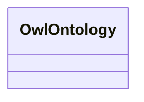

# Class: No class (type) name specified (owl_Ontology)


_No class (type) description specified_


URI: []()





<!-- no inheritance hierarchy -->


## Slots

| Name | Cardinality and Range | Description | Inheritance | Occurrences |
| ---  | --- | --- | --- | --- |


## Usages

| used by | used in | type | used |
| ---  | --- | --- | --- |
| [OwlOntologyProperty](../classes/OwlOntologyProperty.md) | [rdfs_isDefinedBy](../slots/rdfs_isDefinedBy.md) | any_of[range] | [OwlOntology](../classes/OwlOntology.md) |
| [QudtAspectClass](../classes/QudtAspectClass.md) | [rdfs_isDefinedBy](../slots/rdfs_isDefinedBy.md) | any_of[range] | [OwlOntology](../classes/OwlOntology.md) |
| [QudtBitEncodingType](../classes/QudtBitEncodingType.md) | [rdfs_isDefinedBy](../slots/rdfs_isDefinedBy.md) | any_of[range] | [OwlOntology](../classes/OwlOntology.md) |
| [QudtBooleanEncodingType](../classes/QudtBooleanEncodingType.md) | [rdfs_isDefinedBy](../slots/rdfs_isDefinedBy.md) | any_of[range] | [OwlOntology](../classes/OwlOntology.md) |
| [QudtByteEncodingType](../classes/QudtByteEncodingType.md) | [rdfs_isDefinedBy](../slots/rdfs_isDefinedBy.md) | any_of[range] | [OwlOntology](../classes/OwlOntology.md) |
| [QudtCardinalityType](../classes/QudtCardinalityType.md) | [rdfs_isDefinedBy](../slots/rdfs_isDefinedBy.md) | any_of[range] | [OwlOntology](../classes/OwlOntology.md) |
| [QudtCharEncodingType](../classes/QudtCharEncodingType.md) | [rdfs_isDefinedBy](../slots/rdfs_isDefinedBy.md) | any_of[range] | [OwlOntology](../classes/OwlOntology.md) |
| [QudtDateTimeStringEncodingType](../classes/QudtDateTimeStringEncodingType.md) | [rdfs_isDefinedBy](../slots/rdfs_isDefinedBy.md) | any_of[range] | [OwlOntology](../classes/OwlOntology.md) |
| [QudtDerivedUnit](../classes/QudtDerivedUnit.md) | [rdfs_isDefinedBy](../slots/rdfs_isDefinedBy.md) | any_of[range] | [OwlOntology](../classes/OwlOntology.md) |
| [QudtEndianType](../classes/QudtEndianType.md) | [rdfs_isDefinedBy](../slots/rdfs_isDefinedBy.md) | any_of[range] | [OwlOntology](../classes/OwlOntology.md) |
| [QudtFloatingPointEncodingType](../classes/QudtFloatingPointEncodingType.md) | [rdfs_isDefinedBy](../slots/rdfs_isDefinedBy.md) | any_of[range] | [OwlOntology](../classes/OwlOntology.md) |
| [QudtIntegerEncodingType](../classes/QudtIntegerEncodingType.md) | [rdfs_isDefinedBy](../slots/rdfs_isDefinedBy.md) | any_of[range] | [OwlOntology](../classes/OwlOntology.md) |
| [QudtOrderedType](../classes/QudtOrderedType.md) | [rdfs_isDefinedBy](../slots/rdfs_isDefinedBy.md) | any_of[range] | [OwlOntology](../classes/OwlOntology.md) |
| [QudtSignednessType](../classes/QudtSignednessType.md) | [rdfs_isDefinedBy](../slots/rdfs_isDefinedBy.md) | any_of[range] | [OwlOntology](../classes/OwlOntology.md) |
| [QudtUnit](../classes/QudtUnit.md) | [rdfs_isDefinedBy](../slots/rdfs_isDefinedBy.md) | any_of[range] | [OwlOntology](../classes/OwlOntology.md) |
| [Vaem#CatalogEntry](../classes/Vaem#CatalogEntry.md) | [rdfs_isDefinedBy](../slots/rdfs_isDefinedBy.md) | any_of[range] | [OwlOntology](../classes/OwlOntology.md) |
| [Vaem#GraphMetaData](../classes/Vaem#GraphMetaData.md) | [vaem_#isMetadataFor](../slots/vaem_#isMetadataFor.md) | range | [OwlOntology](../classes/OwlOntology.md) |
| [Vaem#GraphMetaData](../classes/Vaem#GraphMetaData.md) | [rdfs_isDefinedBy](../slots/rdfs_isDefinedBy.md) | any_of[range] | [OwlOntology](../classes/OwlOntology.md) |
| [Vaem#GraphMetaData](../classes/Vaem#GraphMetaData.md) | [owl_versionIRI](../slots/owl_versionIRI.md) | range | [OwlOntology](../classes/OwlOntology.md) |
| [Vaem#Party](../classes/Vaem#Party.md) | [rdfs_isDefinedBy](../slots/rdfs_isDefinedBy.md) | any_of[range] | [OwlOntology](../classes/OwlOntology.md) |


## LinkML Source

<!-- TODO: investigate https://stackoverflow.com/questions/37606292/how-to-create-tabbed-code-blocks-in-mkdocs-or-sphinx -->

### Direct

<details>

```yaml
name: owl_Ontology
conforms_to: No schema conformance document specified
description: No class (type) description specified
title: No class (type) name specified
from_schema: sawgraph-kg
rank: 1000
class_uri: ''

```
</details>

### Induced

<details>

```yaml
name: owl_Ontology
conforms_to: No schema conformance document specified
description: No class (type) description specified
title: No class (type) name specified
from_schema: sawgraph-kg
rank: 1000
class_uri: ''

```
</details>