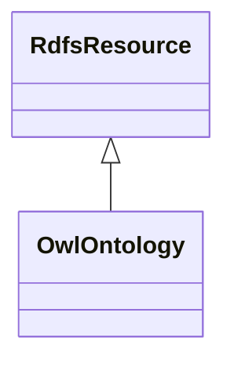

# Class: No class (entity type) name specified (owl_Ontology)


_No class (type) description specified_


URI: [owl:Ontology](http://www.w3.org/2002/07/owl#Ontology)





## Inheritance
* [RdfsResource](../classes/RdfsResource.md)
    * **OwlOntology**


## Slots

| Name | Cardinality and Range | Description | Inheritance | Occurrences |
| ---  | --- | --- | --- | --- |


## Usages

| used by | used in | type | used |
| ---  | --- | --- | --- |
| [OwlNamedIndividual](../classes/OwlNamedIndividual.md) | [rdfs_seeAlso](../slots/rdfs_seeAlso.md) | any_of[range] | [OwlOntology](../classes/OwlOntology.md) |
| [OwlNamedIndividual](../classes/OwlNamedIndividual.md) | [rdfs_isDefinedBy](../slots/rdfs_isDefinedBy.md) | any_of[range] | [OwlOntology](../classes/OwlOntology.md) |
| [OwlThing](../classes/OwlThing.md) | [rdfs_seeAlso](../slots/rdfs_seeAlso.md) | any_of[range] | [OwlOntology](../classes/OwlOntology.md) |
| [OwlThing](../classes/OwlThing.md) | [rdfs_isDefinedBy](../slots/rdfs_isDefinedBy.md) | any_of[range] | [OwlOntology](../classes/OwlOntology.md) |
| [QudtAspectClass](../classes/QudtAspectClass.md) | [rdfs_isDefinedBy](../slots/rdfs_isDefinedBy.md) | any_of[range] | [OwlOntology](../classes/OwlOntology.md) |
| [QudtBitEncodingType](../classes/QudtBitEncodingType.md) | [rdfs_isDefinedBy](../slots/rdfs_isDefinedBy.md) | any_of[range] | [OwlOntology](../classes/OwlOntology.md) |
| [QudtBooleanEncodingType](../classes/QudtBooleanEncodingType.md) | [rdfs_isDefinedBy](../slots/rdfs_isDefinedBy.md) | any_of[range] | [OwlOntology](../classes/OwlOntology.md) |
| [QudtByteEncodingType](../classes/QudtByteEncodingType.md) | [rdfs_isDefinedBy](../slots/rdfs_isDefinedBy.md) | any_of[range] | [OwlOntology](../classes/OwlOntology.md) |
| [QudtCharEncodingType](../classes/QudtCharEncodingType.md) | [rdfs_isDefinedBy](../slots/rdfs_isDefinedBy.md) | any_of[range] | [OwlOntology](../classes/OwlOntology.md) |
| [QudtConcept](../classes/QudtConcept.md) | [rdfs_seeAlso](../slots/rdfs_seeAlso.md) | any_of[range] | [OwlOntology](../classes/OwlOntology.md) |
| [QudtConcept](../classes/QudtConcept.md) | [rdfs_isDefinedBy](../slots/rdfs_isDefinedBy.md) | any_of[range] | [OwlOntology](../classes/OwlOntology.md) |
| [QudtDatatype](../classes/QudtDatatype.md) | [rdfs_seeAlso](../slots/rdfs_seeAlso.md) | any_of[range] | [OwlOntology](../classes/OwlOntology.md) |
| [QudtDatatype](../classes/QudtDatatype.md) | [rdfs_isDefinedBy](../slots/rdfs_isDefinedBy.md) | any_of[range] | [OwlOntology](../classes/OwlOntology.md) |
| [QudtDateTimeStringEncodingType](../classes/QudtDateTimeStringEncodingType.md) | [rdfs_isDefinedBy](../slots/rdfs_isDefinedBy.md) | any_of[range] | [OwlOntology](../classes/OwlOntology.md) |
| [QudtDerivedUnit](../classes/QudtDerivedUnit.md) | [rdfs_isDefinedBy](../slots/rdfs_isDefinedBy.md) | any_of[range] | [OwlOntology](../classes/OwlOntology.md) |
| [QudtDerivedUnit](../classes/QudtDerivedUnit.md) | [rdfs_seeAlso](../slots/rdfs_seeAlso.md) | any_of[range] | [OwlOntology](../classes/OwlOntology.md) |
| [QudtDiscipline](../classes/QudtDiscipline.md) | [rdfs_seeAlso](../slots/rdfs_seeAlso.md) | any_of[range] | [OwlOntology](../classes/OwlOntology.md) |
| [QudtDiscipline](../classes/QudtDiscipline.md) | [rdfs_isDefinedBy](../slots/rdfs_isDefinedBy.md) | any_of[range] | [OwlOntology](../classes/OwlOntology.md) |
| [QudtEndianType](../classes/QudtEndianType.md) | [rdfs_isDefinedBy](../slots/rdfs_isDefinedBy.md) | any_of[range] | [OwlOntology](../classes/OwlOntology.md) |
| [QudtEndianType](../classes/QudtEndianType.md) | [rdfs_seeAlso](../slots/rdfs_seeAlso.md) | any_of[range] | [OwlOntology](../classes/OwlOntology.md) |
| [QudtEnumeratedValue](../classes/QudtEnumeratedValue.md) | [rdfs_seeAlso](../slots/rdfs_seeAlso.md) | any_of[range] | [OwlOntology](../classes/OwlOntology.md) |
| [QudtEnumeratedValue](../classes/QudtEnumeratedValue.md) | [rdfs_isDefinedBy](../slots/rdfs_isDefinedBy.md) | any_of[range] | [OwlOntology](../classes/OwlOntology.md) |
| [QudtEnumeration](../classes/QudtEnumeration.md) | [rdfs_seeAlso](../slots/rdfs_seeAlso.md) | any_of[range] | [OwlOntology](../classes/OwlOntology.md) |
| [QudtEnumeration](../classes/QudtEnumeration.md) | [rdfs_isDefinedBy](../slots/rdfs_isDefinedBy.md) | any_of[range] | [OwlOntology](../classes/OwlOntology.md) |
| [QudtFloatingPointEncodingType](../classes/QudtFloatingPointEncodingType.md) | [rdfs_isDefinedBy](../slots/rdfs_isDefinedBy.md) | any_of[range] | [OwlOntology](../classes/OwlOntology.md) |
| [QudtIntegerEncodingType](../classes/QudtIntegerEncodingType.md) | [rdfs_isDefinedBy](../slots/rdfs_isDefinedBy.md) | any_of[range] | [OwlOntology](../classes/OwlOntology.md) |
| [QudtMathsFunctionType](../classes/QudtMathsFunctionType.md) | [rdfs_seeAlso](../slots/rdfs_seeAlso.md) | any_of[range] | [OwlOntology](../classes/OwlOntology.md) |
| [QudtMathsFunctionType](../classes/QudtMathsFunctionType.md) | [rdfs_isDefinedBy](../slots/rdfs_isDefinedBy.md) | any_of[range] | [OwlOntology](../classes/OwlOntology.md) |
| [QudtQuantity](../classes/QudtQuantity.md) | [rdfs_seeAlso](../slots/rdfs_seeAlso.md) | any_of[range] | [OwlOntology](../classes/OwlOntology.md) |
| [QudtQuantity](../classes/QudtQuantity.md) | [rdfs_isDefinedBy](../slots/rdfs_isDefinedBy.md) | any_of[range] | [OwlOntology](../classes/OwlOntology.md) |
| [QudtQuantityKind](../classes/QudtQuantityKind.md) | [rdfs_seeAlso](../slots/rdfs_seeAlso.md) | any_of[range] | [OwlOntology](../classes/OwlOntology.md) |
| [QudtQuantityKind](../classes/QudtQuantityKind.md) | [rdfs_isDefinedBy](../slots/rdfs_isDefinedBy.md) | any_of[range] | [OwlOntology](../classes/OwlOntology.md) |
| [QudtQuantityValue](../classes/QudtQuantityValue.md) | [rdfs_seeAlso](../slots/rdfs_seeAlso.md) | any_of[range] | [OwlOntology](../classes/OwlOntology.md) |
| [QudtQuantityValue](../classes/QudtQuantityValue.md) | [rdfs_isDefinedBy](../slots/rdfs_isDefinedBy.md) | any_of[range] | [OwlOntology](../classes/OwlOntology.md) |
| [QudtRuleType](../classes/QudtRuleType.md) | [rdfs_seeAlso](../slots/rdfs_seeAlso.md) | any_of[range] | [OwlOntology](../classes/OwlOntology.md) |
| [QudtRuleType](../classes/QudtRuleType.md) | [rdfs_isDefinedBy](../slots/rdfs_isDefinedBy.md) | any_of[range] | [OwlOntology](../classes/OwlOntology.md) |
| [QudtSignednessType](../classes/QudtSignednessType.md) | [rdfs_isDefinedBy](../slots/rdfs_isDefinedBy.md) | any_of[range] | [OwlOntology](../classes/OwlOntology.md) |
| [QudtSymbol](../classes/QudtSymbol.md) | [rdfs_seeAlso](../slots/rdfs_seeAlso.md) | any_of[range] | [OwlOntology](../classes/OwlOntology.md) |
| [QudtSymbol](../classes/QudtSymbol.md) | [rdfs_isDefinedBy](../slots/rdfs_isDefinedBy.md) | any_of[range] | [OwlOntology](../classes/OwlOntology.md) |
| [QudtTransformType](../classes/QudtTransformType.md) | [rdfs_seeAlso](../slots/rdfs_seeAlso.md) | any_of[range] | [OwlOntology](../classes/OwlOntology.md) |
| [QudtTransformType](../classes/QudtTransformType.md) | [rdfs_isDefinedBy](../slots/rdfs_isDefinedBy.md) | any_of[range] | [OwlOntology](../classes/OwlOntology.md) |
| [QudtUnit](../classes/QudtUnit.md) | [rdfs_isDefinedBy](../slots/rdfs_isDefinedBy.md) | any_of[range] | [OwlOntology](../classes/OwlOntology.md) |
| [QudtUnit](../classes/QudtUnit.md) | [rdfs_seeAlso](../slots/rdfs_seeAlso.md) | any_of[range] | [OwlOntology](../classes/OwlOntology.md) |
| [QudtVerifiable](../classes/QudtVerifiable.md) | [rdfs_isDefinedBy](../slots/rdfs_isDefinedBy.md) | any_of[range] | [OwlOntology](../classes/OwlOntology.md) |
| [QudtVerifiable](../classes/QudtVerifiable.md) | [rdfs_seeAlso](../slots/rdfs_seeAlso.md) | any_of[range] | [OwlOntology](../classes/OwlOntology.md) |
| [Vaem#CatalogEntry](../classes/Vaem#CatalogEntry.md) | [rdfs_isDefinedBy](../slots/rdfs_isDefinedBy.md) | any_of[range] | [OwlOntology](../classes/OwlOntology.md) |
| [Vaem#GraphMetaData](../classes/Vaem#GraphMetaData.md) | [vaem_#isMetadataFor](../slots/vaem_#isMetadataFor.md) | range | [OwlOntology](../classes/OwlOntology.md) |
| [Vaem#GraphMetaData](../classes/Vaem#GraphMetaData.md) | [rdfs_isDefinedBy](../slots/rdfs_isDefinedBy.md) | any_of[range] | [OwlOntology](../classes/OwlOntology.md) |
| [Vaem#GraphMetaData](../classes/Vaem#GraphMetaData.md) | [owl_versionIRI](../slots/owl_versionIRI.md) | any_of[range] | [OwlOntology](../classes/OwlOntology.md) |
| [Vaem#Party](../classes/Vaem#Party.md) | [rdfs_isDefinedBy](../slots/rdfs_isDefinedBy.md) | any_of[range] | [OwlOntology](../classes/OwlOntology.md) |
| [B006560071c8e13d0cfb224acef80b7d5](../classes/B006560071c8e13d0cfb224acef80b7d5.md) | [rdfs_seeAlso](../slots/rdfs_seeAlso.md) | any_of[range] | [OwlOntology](../classes/OwlOntology.md) |
| [B006560071c8e13d0cfb224acef80b7d5](../classes/B006560071c8e13d0cfb224acef80b7d5.md) | [rdfs_isDefinedBy](../slots/rdfs_isDefinedBy.md) | any_of[range] | [OwlOntology](../classes/OwlOntology.md) |
| [B031f4709082b8fd395b0a7a42ca24e0e](../classes/B031f4709082b8fd395b0a7a42ca24e0e.md) | [rdfs_seeAlso](../slots/rdfs_seeAlso.md) | any_of[range] | [OwlOntology](../classes/OwlOntology.md) |
| [B031f4709082b8fd395b0a7a42ca24e0e](../classes/B031f4709082b8fd395b0a7a42ca24e0e.md) | [rdfs_isDefinedBy](../slots/rdfs_isDefinedBy.md) | any_of[range] | [OwlOntology](../classes/OwlOntology.md) |
| [B05e44ef0dae70e2dd72c89f36a1473fe](../classes/B05e44ef0dae70e2dd72c89f36a1473fe.md) | [rdfs_seeAlso](../slots/rdfs_seeAlso.md) | any_of[range] | [OwlOntology](../classes/OwlOntology.md) |
| [B05e44ef0dae70e2dd72c89f36a1473fe](../classes/B05e44ef0dae70e2dd72c89f36a1473fe.md) | [rdfs_isDefinedBy](../slots/rdfs_isDefinedBy.md) | any_of[range] | [OwlOntology](../classes/OwlOntology.md) |
| [B06945e371c65d137066f33e51a15fc88](../classes/B06945e371c65d137066f33e51a15fc88.md) | [rdfs_seeAlso](../slots/rdfs_seeAlso.md) | any_of[range] | [OwlOntology](../classes/OwlOntology.md) |
| [B06945e371c65d137066f33e51a15fc88](../classes/B06945e371c65d137066f33e51a15fc88.md) | [rdfs_isDefinedBy](../slots/rdfs_isDefinedBy.md) | any_of[range] | [OwlOntology](../classes/OwlOntology.md) |
| [B09aad887077f56524a134d1a40bd7caa](../classes/B09aad887077f56524a134d1a40bd7caa.md) | [rdfs_seeAlso](../slots/rdfs_seeAlso.md) | any_of[range] | [OwlOntology](../classes/OwlOntology.md) |
| [B09aad887077f56524a134d1a40bd7caa](../classes/B09aad887077f56524a134d1a40bd7caa.md) | [rdfs_isDefinedBy](../slots/rdfs_isDefinedBy.md) | any_of[range] | [OwlOntology](../classes/OwlOntology.md) |
| [B0a84b9bdeb47e945c269cf50f7ab964d](../classes/B0a84b9bdeb47e945c269cf50f7ab964d.md) | [rdfs_seeAlso](../slots/rdfs_seeAlso.md) | any_of[range] | [OwlOntology](../classes/OwlOntology.md) |
| [B0a84b9bdeb47e945c269cf50f7ab964d](../classes/B0a84b9bdeb47e945c269cf50f7ab964d.md) | [rdfs_isDefinedBy](../slots/rdfs_isDefinedBy.md) | any_of[range] | [OwlOntology](../classes/OwlOntology.md) |
| [B0ec50ed72490f52ac3672a1e7857f5bc](../classes/B0ec50ed72490f52ac3672a1e7857f5bc.md) | [rdfs_seeAlso](../slots/rdfs_seeAlso.md) | any_of[range] | [OwlOntology](../classes/OwlOntology.md) |
| [B0ec50ed72490f52ac3672a1e7857f5bc](../classes/B0ec50ed72490f52ac3672a1e7857f5bc.md) | [rdfs_isDefinedBy](../slots/rdfs_isDefinedBy.md) | any_of[range] | [OwlOntology](../classes/OwlOntology.md) |
| [B1ec2fb807fea9c1bd025ce9f9a44be32](../classes/B1ec2fb807fea9c1bd025ce9f9a44be32.md) | [rdfs_seeAlso](../slots/rdfs_seeAlso.md) | any_of[range] | [OwlOntology](../classes/OwlOntology.md) |
| [B1ec2fb807fea9c1bd025ce9f9a44be32](../classes/B1ec2fb807fea9c1bd025ce9f9a44be32.md) | [rdfs_isDefinedBy](../slots/rdfs_isDefinedBy.md) | any_of[range] | [OwlOntology](../classes/OwlOntology.md) |
| [B1f076b6912d64fb8de40fd5bf49bf226](../classes/B1f076b6912d64fb8de40fd5bf49bf226.md) | [rdfs_seeAlso](../slots/rdfs_seeAlso.md) | any_of[range] | [OwlOntology](../classes/OwlOntology.md) |
| [B1f076b6912d64fb8de40fd5bf49bf226](../classes/B1f076b6912d64fb8de40fd5bf49bf226.md) | [rdfs_isDefinedBy](../slots/rdfs_isDefinedBy.md) | any_of[range] | [OwlOntology](../classes/OwlOntology.md) |
| [B208cce2958b0b6528c5e5d8145c6578d](../classes/B208cce2958b0b6528c5e5d8145c6578d.md) | [rdfs_seeAlso](../slots/rdfs_seeAlso.md) | any_of[range] | [OwlOntology](../classes/OwlOntology.md) |
| [B208cce2958b0b6528c5e5d8145c6578d](../classes/B208cce2958b0b6528c5e5d8145c6578d.md) | [rdfs_isDefinedBy](../slots/rdfs_isDefinedBy.md) | any_of[range] | [OwlOntology](../classes/OwlOntology.md) |
| [B23b71ba786a9087768d90a9895a157fb](../classes/B23b71ba786a9087768d90a9895a157fb.md) | [rdfs_seeAlso](../slots/rdfs_seeAlso.md) | any_of[range] | [OwlOntology](../classes/OwlOntology.md) |
| [B23b71ba786a9087768d90a9895a157fb](../classes/B23b71ba786a9087768d90a9895a157fb.md) | [rdfs_isDefinedBy](../slots/rdfs_isDefinedBy.md) | any_of[range] | [OwlOntology](../classes/OwlOntology.md) |
| [B2e82ec95fdc5573f9d05e591a4644e03](../classes/B2e82ec95fdc5573f9d05e591a4644e03.md) | [rdfs_seeAlso](../slots/rdfs_seeAlso.md) | any_of[range] | [OwlOntology](../classes/OwlOntology.md) |
| [B2e82ec95fdc5573f9d05e591a4644e03](../classes/B2e82ec95fdc5573f9d05e591a4644e03.md) | [rdfs_isDefinedBy](../slots/rdfs_isDefinedBy.md) | any_of[range] | [OwlOntology](../classes/OwlOntology.md) |
| [B33a4bff87e63dbebb7e68ae4f6624bed](../classes/B33a4bff87e63dbebb7e68ae4f6624bed.md) | [rdfs_seeAlso](../slots/rdfs_seeAlso.md) | any_of[range] | [OwlOntology](../classes/OwlOntology.md) |
| [B33a4bff87e63dbebb7e68ae4f6624bed](../classes/B33a4bff87e63dbebb7e68ae4f6624bed.md) | [rdfs_isDefinedBy](../slots/rdfs_isDefinedBy.md) | any_of[range] | [OwlOntology](../classes/OwlOntology.md) |
| [B350ea24db131fe436ada5793055ac224](../classes/B350ea24db131fe436ada5793055ac224.md) | [rdfs_seeAlso](../slots/rdfs_seeAlso.md) | any_of[range] | [OwlOntology](../classes/OwlOntology.md) |
| [B350ea24db131fe436ada5793055ac224](../classes/B350ea24db131fe436ada5793055ac224.md) | [rdfs_isDefinedBy](../slots/rdfs_isDefinedBy.md) | any_of[range] | [OwlOntology](../classes/OwlOntology.md) |
| [B35dd872c46bbac02f1b1999558dc2e7a](../classes/B35dd872c46bbac02f1b1999558dc2e7a.md) | [rdfs_seeAlso](../slots/rdfs_seeAlso.md) | any_of[range] | [OwlOntology](../classes/OwlOntology.md) |
| [B35dd872c46bbac02f1b1999558dc2e7a](../classes/B35dd872c46bbac02f1b1999558dc2e7a.md) | [rdfs_isDefinedBy](../slots/rdfs_isDefinedBy.md) | any_of[range] | [OwlOntology](../classes/OwlOntology.md) |
| [B3996198628e8debde20be7d2bfd72451](../classes/B3996198628e8debde20be7d2bfd72451.md) | [rdfs_isDefinedBy](../slots/rdfs_isDefinedBy.md) | any_of[range] | [OwlOntology](../classes/OwlOntology.md) |
| [B3996198628e8debde20be7d2bfd72451](../classes/B3996198628e8debde20be7d2bfd72451.md) | [rdfs_seeAlso](../slots/rdfs_seeAlso.md) | any_of[range] | [OwlOntology](../classes/OwlOntology.md) |
| [B4988d800b6a457b8e9d23239a25a722c](../classes/B4988d800b6a457b8e9d23239a25a722c.md) | [rdfs_seeAlso](../slots/rdfs_seeAlso.md) | any_of[range] | [OwlOntology](../classes/OwlOntology.md) |
| [B4988d800b6a457b8e9d23239a25a722c](../classes/B4988d800b6a457b8e9d23239a25a722c.md) | [rdfs_isDefinedBy](../slots/rdfs_isDefinedBy.md) | any_of[range] | [OwlOntology](../classes/OwlOntology.md) |
| [B4e073dc105a18a558c067923597f0dcf](../classes/B4e073dc105a18a558c067923597f0dcf.md) | [rdfs_seeAlso](../slots/rdfs_seeAlso.md) | any_of[range] | [OwlOntology](../classes/OwlOntology.md) |
| [B4e073dc105a18a558c067923597f0dcf](../classes/B4e073dc105a18a558c067923597f0dcf.md) | [rdfs_isDefinedBy](../slots/rdfs_isDefinedBy.md) | any_of[range] | [OwlOntology](../classes/OwlOntology.md) |
| [B4f0e79d63147e2e6dacf649c0ae23375](../classes/B4f0e79d63147e2e6dacf649c0ae23375.md) | [rdfs_seeAlso](../slots/rdfs_seeAlso.md) | any_of[range] | [OwlOntology](../classes/OwlOntology.md) |
| [B4f0e79d63147e2e6dacf649c0ae23375](../classes/B4f0e79d63147e2e6dacf649c0ae23375.md) | [rdfs_isDefinedBy](../slots/rdfs_isDefinedBy.md) | any_of[range] | [OwlOntology](../classes/OwlOntology.md) |
| [B52937cc8dbb22057fb5a128068caae3e](../classes/B52937cc8dbb22057fb5a128068caae3e.md) | [rdfs_isDefinedBy](../slots/rdfs_isDefinedBy.md) | any_of[range] | [OwlOntology](../classes/OwlOntology.md) |
| [B52937cc8dbb22057fb5a128068caae3e](../classes/B52937cc8dbb22057fb5a128068caae3e.md) | [rdfs_seeAlso](../slots/rdfs_seeAlso.md) | any_of[range] | [OwlOntology](../classes/OwlOntology.md) |
| [B54e27a7ad0f2a017400bf40f12905ea7](../classes/B54e27a7ad0f2a017400bf40f12905ea7.md) | [rdfs_seeAlso](../slots/rdfs_seeAlso.md) | any_of[range] | [OwlOntology](../classes/OwlOntology.md) |
| [B54e27a7ad0f2a017400bf40f12905ea7](../classes/B54e27a7ad0f2a017400bf40f12905ea7.md) | [rdfs_isDefinedBy](../slots/rdfs_isDefinedBy.md) | any_of[range] | [OwlOntology](../classes/OwlOntology.md) |
| [B56a2cea6d406b97b5706b7dded4290e9](../classes/B56a2cea6d406b97b5706b7dded4290e9.md) | [rdfs_seeAlso](../slots/rdfs_seeAlso.md) | any_of[range] | [OwlOntology](../classes/OwlOntology.md) |
| [B56a2cea6d406b97b5706b7dded4290e9](../classes/B56a2cea6d406b97b5706b7dded4290e9.md) | [rdfs_isDefinedBy](../slots/rdfs_isDefinedBy.md) | any_of[range] | [OwlOntology](../classes/OwlOntology.md) |
| [B5a8009d185c57bf4c45da4a0fdd16bd9](../classes/B5a8009d185c57bf4c45da4a0fdd16bd9.md) | [rdfs_seeAlso](../slots/rdfs_seeAlso.md) | any_of[range] | [OwlOntology](../classes/OwlOntology.md) |
| [B5a8009d185c57bf4c45da4a0fdd16bd9](../classes/B5a8009d185c57bf4c45da4a0fdd16bd9.md) | [rdfs_isDefinedBy](../slots/rdfs_isDefinedBy.md) | any_of[range] | [OwlOntology](../classes/OwlOntology.md) |
| [B5afd40c6b94aba1f13de2c658f11378a](../classes/B5afd40c6b94aba1f13de2c658f11378a.md) | [rdfs_seeAlso](../slots/rdfs_seeAlso.md) | any_of[range] | [OwlOntology](../classes/OwlOntology.md) |
| [B5afd40c6b94aba1f13de2c658f11378a](../classes/B5afd40c6b94aba1f13de2c658f11378a.md) | [rdfs_isDefinedBy](../slots/rdfs_isDefinedBy.md) | any_of[range] | [OwlOntology](../classes/OwlOntology.md) |
| [B62a33823d247298450a38812782f97f5](../classes/B62a33823d247298450a38812782f97f5.md) | [rdfs_seeAlso](../slots/rdfs_seeAlso.md) | any_of[range] | [OwlOntology](../classes/OwlOntology.md) |
| [B62a33823d247298450a38812782f97f5](../classes/B62a33823d247298450a38812782f97f5.md) | [rdfs_isDefinedBy](../slots/rdfs_isDefinedBy.md) | any_of[range] | [OwlOntology](../classes/OwlOntology.md) |
| [B62f4ca32bee89335c5f2cde8750f0952](../classes/B62f4ca32bee89335c5f2cde8750f0952.md) | [rdfs_isDefinedBy](../slots/rdfs_isDefinedBy.md) | any_of[range] | [OwlOntology](../classes/OwlOntology.md) |
| [B62f4ca32bee89335c5f2cde8750f0952](../classes/B62f4ca32bee89335c5f2cde8750f0952.md) | [rdfs_seeAlso](../slots/rdfs_seeAlso.md) | any_of[range] | [OwlOntology](../classes/OwlOntology.md) |
| [B67799f02f12f9e598057cf6c5606db0d](../classes/B67799f02f12f9e598057cf6c5606db0d.md) | [rdfs_seeAlso](../slots/rdfs_seeAlso.md) | any_of[range] | [OwlOntology](../classes/OwlOntology.md) |
| [B67799f02f12f9e598057cf6c5606db0d](../classes/B67799f02f12f9e598057cf6c5606db0d.md) | [rdfs_isDefinedBy](../slots/rdfs_isDefinedBy.md) | any_of[range] | [OwlOntology](../classes/OwlOntology.md) |
| [B68e17206ad4607f0f881044840c41c4f](../classes/B68e17206ad4607f0f881044840c41c4f.md) | [rdfs_seeAlso](../slots/rdfs_seeAlso.md) | any_of[range] | [OwlOntology](../classes/OwlOntology.md) |
| [B68e17206ad4607f0f881044840c41c4f](../classes/B68e17206ad4607f0f881044840c41c4f.md) | [rdfs_isDefinedBy](../slots/rdfs_isDefinedBy.md) | any_of[range] | [OwlOntology](../classes/OwlOntology.md) |
| [B6a083ad1e13123eed8aa0ae4938403b6](../classes/B6a083ad1e13123eed8aa0ae4938403b6.md) | [rdfs_seeAlso](../slots/rdfs_seeAlso.md) | any_of[range] | [OwlOntology](../classes/OwlOntology.md) |
| [B6a083ad1e13123eed8aa0ae4938403b6](../classes/B6a083ad1e13123eed8aa0ae4938403b6.md) | [rdfs_isDefinedBy](../slots/rdfs_isDefinedBy.md) | any_of[range] | [OwlOntology](../classes/OwlOntology.md) |
| [B7562df68ecb21c16369015b4829049e8](../classes/B7562df68ecb21c16369015b4829049e8.md) | [rdfs_seeAlso](../slots/rdfs_seeAlso.md) | any_of[range] | [OwlOntology](../classes/OwlOntology.md) |
| [B7562df68ecb21c16369015b4829049e8](../classes/B7562df68ecb21c16369015b4829049e8.md) | [rdfs_isDefinedBy](../slots/rdfs_isDefinedBy.md) | any_of[range] | [OwlOntology](../classes/OwlOntology.md) |
| [B759a060b1552f5afbc0077c0116a05d8](../classes/B759a060b1552f5afbc0077c0116a05d8.md) | [rdfs_seeAlso](../slots/rdfs_seeAlso.md) | any_of[range] | [OwlOntology](../classes/OwlOntology.md) |
| [B759a060b1552f5afbc0077c0116a05d8](../classes/B759a060b1552f5afbc0077c0116a05d8.md) | [rdfs_isDefinedBy](../slots/rdfs_isDefinedBy.md) | any_of[range] | [OwlOntology](../classes/OwlOntology.md) |
| [B7f743940eb366fa70db0e72f92c486ae](../classes/B7f743940eb366fa70db0e72f92c486ae.md) | [rdfs_isDefinedBy](../slots/rdfs_isDefinedBy.md) | any_of[range] | [OwlOntology](../classes/OwlOntology.md) |
| [B7f743940eb366fa70db0e72f92c486ae](../classes/B7f743940eb366fa70db0e72f92c486ae.md) | [rdfs_seeAlso](../slots/rdfs_seeAlso.md) | any_of[range] | [OwlOntology](../classes/OwlOntology.md) |
| [B83cd416c76244b666544da84186161ee](../classes/B83cd416c76244b666544da84186161ee.md) | [rdfs_isDefinedBy](../slots/rdfs_isDefinedBy.md) | any_of[range] | [OwlOntology](../classes/OwlOntology.md) |
| [B83cd416c76244b666544da84186161ee](../classes/B83cd416c76244b666544da84186161ee.md) | [rdfs_seeAlso](../slots/rdfs_seeAlso.md) | any_of[range] | [OwlOntology](../classes/OwlOntology.md) |
| [B83d4a0eeef762831e26378a7377f71e7](../classes/B83d4a0eeef762831e26378a7377f71e7.md) | [rdfs_seeAlso](../slots/rdfs_seeAlso.md) | any_of[range] | [OwlOntology](../classes/OwlOntology.md) |
| [B83d4a0eeef762831e26378a7377f71e7](../classes/B83d4a0eeef762831e26378a7377f71e7.md) | [rdfs_isDefinedBy](../slots/rdfs_isDefinedBy.md) | any_of[range] | [OwlOntology](../classes/OwlOntology.md) |
| [B840c556fd61bcb53542ea2197ac60aa9](../classes/B840c556fd61bcb53542ea2197ac60aa9.md) | [rdfs_seeAlso](../slots/rdfs_seeAlso.md) | any_of[range] | [OwlOntology](../classes/OwlOntology.md) |
| [B840c556fd61bcb53542ea2197ac60aa9](../classes/B840c556fd61bcb53542ea2197ac60aa9.md) | [rdfs_isDefinedBy](../slots/rdfs_isDefinedBy.md) | any_of[range] | [OwlOntology](../classes/OwlOntology.md) |
| [B91d76961c9f8ddbd60f889ceeaa2b40e](../classes/B91d76961c9f8ddbd60f889ceeaa2b40e.md) | [rdfs_seeAlso](../slots/rdfs_seeAlso.md) | any_of[range] | [OwlOntology](../classes/OwlOntology.md) |
| [B91d76961c9f8ddbd60f889ceeaa2b40e](../classes/B91d76961c9f8ddbd60f889ceeaa2b40e.md) | [rdfs_isDefinedBy](../slots/rdfs_isDefinedBy.md) | any_of[range] | [OwlOntology](../classes/OwlOntology.md) |
| [B9416863afef47838f397f708f628e129](../classes/B9416863afef47838f397f708f628e129.md) | [rdfs_seeAlso](../slots/rdfs_seeAlso.md) | any_of[range] | [OwlOntology](../classes/OwlOntology.md) |
| [B9416863afef47838f397f708f628e129](../classes/B9416863afef47838f397f708f628e129.md) | [rdfs_isDefinedBy](../slots/rdfs_isDefinedBy.md) | any_of[range] | [OwlOntology](../classes/OwlOntology.md) |
| [B9647143c38c2eb22c9764bae62e0e1bf](../classes/B9647143c38c2eb22c9764bae62e0e1bf.md) | [rdfs_seeAlso](../slots/rdfs_seeAlso.md) | any_of[range] | [OwlOntology](../classes/OwlOntology.md) |
| [B9647143c38c2eb22c9764bae62e0e1bf](../classes/B9647143c38c2eb22c9764bae62e0e1bf.md) | [rdfs_isDefinedBy](../slots/rdfs_isDefinedBy.md) | any_of[range] | [OwlOntology](../classes/OwlOntology.md) |
| [Ba265b6e5375ebb0aadae09c47f43d655](../classes/Ba265b6e5375ebb0aadae09c47f43d655.md) | [rdfs_isDefinedBy](../slots/rdfs_isDefinedBy.md) | any_of[range] | [OwlOntology](../classes/OwlOntology.md) |
| [Ba265b6e5375ebb0aadae09c47f43d655](../classes/Ba265b6e5375ebb0aadae09c47f43d655.md) | [rdfs_seeAlso](../slots/rdfs_seeAlso.md) | any_of[range] | [OwlOntology](../classes/OwlOntology.md) |
| [Ba696c0237fbf24c0b1bf71a1c42f57dd](../classes/Ba696c0237fbf24c0b1bf71a1c42f57dd.md) | [rdfs_seeAlso](../slots/rdfs_seeAlso.md) | any_of[range] | [OwlOntology](../classes/OwlOntology.md) |
| [Ba696c0237fbf24c0b1bf71a1c42f57dd](../classes/Ba696c0237fbf24c0b1bf71a1c42f57dd.md) | [rdfs_isDefinedBy](../slots/rdfs_isDefinedBy.md) | any_of[range] | [OwlOntology](../classes/OwlOntology.md) |
| [Badedf2d5daa6297871dc3e5a2fe50510](../classes/Badedf2d5daa6297871dc3e5a2fe50510.md) | [rdfs_seeAlso](../slots/rdfs_seeAlso.md) | any_of[range] | [OwlOntology](../classes/OwlOntology.md) |
| [Badedf2d5daa6297871dc3e5a2fe50510](../classes/Badedf2d5daa6297871dc3e5a2fe50510.md) | [rdfs_isDefinedBy](../slots/rdfs_isDefinedBy.md) | any_of[range] | [OwlOntology](../classes/OwlOntology.md) |
| [Baee1e1036c9c300a20d18c9a77ed4baa](../classes/Baee1e1036c9c300a20d18c9a77ed4baa.md) | [rdfs_seeAlso](../slots/rdfs_seeAlso.md) | any_of[range] | [OwlOntology](../classes/OwlOntology.md) |
| [Baee1e1036c9c300a20d18c9a77ed4baa](../classes/Baee1e1036c9c300a20d18c9a77ed4baa.md) | [rdfs_isDefinedBy](../slots/rdfs_isDefinedBy.md) | any_of[range] | [OwlOntology](../classes/OwlOntology.md) |
| [Bb3b966a83ead8099fc1d9350e1c85c2d](../classes/Bb3b966a83ead8099fc1d9350e1c85c2d.md) | [rdfs_seeAlso](../slots/rdfs_seeAlso.md) | any_of[range] | [OwlOntology](../classes/OwlOntology.md) |
| [Bb3b966a83ead8099fc1d9350e1c85c2d](../classes/Bb3b966a83ead8099fc1d9350e1c85c2d.md) | [rdfs_isDefinedBy](../slots/rdfs_isDefinedBy.md) | any_of[range] | [OwlOntology](../classes/OwlOntology.md) |
| [Bb9e7c7534aa5d13f4067c5278593fc34](../classes/Bb9e7c7534aa5d13f4067c5278593fc34.md) | [rdfs_seeAlso](../slots/rdfs_seeAlso.md) | any_of[range] | [OwlOntology](../classes/OwlOntology.md) |
| [Bb9e7c7534aa5d13f4067c5278593fc34](../classes/Bb9e7c7534aa5d13f4067c5278593fc34.md) | [rdfs_isDefinedBy](../slots/rdfs_isDefinedBy.md) | any_of[range] | [OwlOntology](../classes/OwlOntology.md) |
| [Bc2ad66c8645d30f8bc2834eab721cb6b](../classes/Bc2ad66c8645d30f8bc2834eab721cb6b.md) | [rdfs_seeAlso](../slots/rdfs_seeAlso.md) | any_of[range] | [OwlOntology](../classes/OwlOntology.md) |
| [Bc2ad66c8645d30f8bc2834eab721cb6b](../classes/Bc2ad66c8645d30f8bc2834eab721cb6b.md) | [rdfs_isDefinedBy](../slots/rdfs_isDefinedBy.md) | any_of[range] | [OwlOntology](../classes/OwlOntology.md) |
| [Bc61095527952bb22dc6c72bcea5e2015](../classes/Bc61095527952bb22dc6c72bcea5e2015.md) | [rdfs_seeAlso](../slots/rdfs_seeAlso.md) | any_of[range] | [OwlOntology](../classes/OwlOntology.md) |
| [Bc61095527952bb22dc6c72bcea5e2015](../classes/Bc61095527952bb22dc6c72bcea5e2015.md) | [rdfs_isDefinedBy](../slots/rdfs_isDefinedBy.md) | any_of[range] | [OwlOntology](../classes/OwlOntology.md) |
| [Bc61726e4df6d53655e7a7348513c3069](../classes/Bc61726e4df6d53655e7a7348513c3069.md) | [rdfs_seeAlso](../slots/rdfs_seeAlso.md) | any_of[range] | [OwlOntology](../classes/OwlOntology.md) |
| [Bc61726e4df6d53655e7a7348513c3069](../classes/Bc61726e4df6d53655e7a7348513c3069.md) | [rdfs_isDefinedBy](../slots/rdfs_isDefinedBy.md) | any_of[range] | [OwlOntology](../classes/OwlOntology.md) |
| [Bc7ae4ff7a896ebd1b9bbd0a982032af7](../classes/Bc7ae4ff7a896ebd1b9bbd0a982032af7.md) | [rdfs_seeAlso](../slots/rdfs_seeAlso.md) | any_of[range] | [OwlOntology](../classes/OwlOntology.md) |
| [Bc7ae4ff7a896ebd1b9bbd0a982032af7](../classes/Bc7ae4ff7a896ebd1b9bbd0a982032af7.md) | [rdfs_isDefinedBy](../slots/rdfs_isDefinedBy.md) | any_of[range] | [OwlOntology](../classes/OwlOntology.md) |
| [Bcc8ed61f20db00dad98ecb1f45323a36](../classes/Bcc8ed61f20db00dad98ecb1f45323a36.md) | [rdfs_seeAlso](../slots/rdfs_seeAlso.md) | any_of[range] | [OwlOntology](../classes/OwlOntology.md) |
| [Bcc8ed61f20db00dad98ecb1f45323a36](../classes/Bcc8ed61f20db00dad98ecb1f45323a36.md) | [rdfs_isDefinedBy](../slots/rdfs_isDefinedBy.md) | any_of[range] | [OwlOntology](../classes/OwlOntology.md) |
| [Bcdf33b4fe74cf5bd488c01b88536fbc4](../classes/Bcdf33b4fe74cf5bd488c01b88536fbc4.md) | [rdfs_seeAlso](../slots/rdfs_seeAlso.md) | any_of[range] | [OwlOntology](../classes/OwlOntology.md) |
| [Bcdf33b4fe74cf5bd488c01b88536fbc4](../classes/Bcdf33b4fe74cf5bd488c01b88536fbc4.md) | [rdfs_isDefinedBy](../slots/rdfs_isDefinedBy.md) | any_of[range] | [OwlOntology](../classes/OwlOntology.md) |
| [Bd2cb89944394492862955024a10bc9b2](../classes/Bd2cb89944394492862955024a10bc9b2.md) | [rdfs_seeAlso](../slots/rdfs_seeAlso.md) | any_of[range] | [OwlOntology](../classes/OwlOntology.md) |
| [Bd2cb89944394492862955024a10bc9b2](../classes/Bd2cb89944394492862955024a10bc9b2.md) | [rdfs_isDefinedBy](../slots/rdfs_isDefinedBy.md) | any_of[range] | [OwlOntology](../classes/OwlOntology.md) |
| [Bd4c82b4e72756dd07838e3ed64fc01d3](../classes/Bd4c82b4e72756dd07838e3ed64fc01d3.md) | [rdfs_seeAlso](../slots/rdfs_seeAlso.md) | any_of[range] | [OwlOntology](../classes/OwlOntology.md) |
| [Bd4c82b4e72756dd07838e3ed64fc01d3](../classes/Bd4c82b4e72756dd07838e3ed64fc01d3.md) | [rdfs_isDefinedBy](../slots/rdfs_isDefinedBy.md) | any_of[range] | [OwlOntology](../classes/OwlOntology.md) |
| [Bd7ac0dbb4a69dd5b498c4fd86dffe2cc](../classes/Bd7ac0dbb4a69dd5b498c4fd86dffe2cc.md) | [rdfs_seeAlso](../slots/rdfs_seeAlso.md) | any_of[range] | [OwlOntology](../classes/OwlOntology.md) |
| [Bd7ac0dbb4a69dd5b498c4fd86dffe2cc](../classes/Bd7ac0dbb4a69dd5b498c4fd86dffe2cc.md) | [rdfs_isDefinedBy](../slots/rdfs_isDefinedBy.md) | any_of[range] | [OwlOntology](../classes/OwlOntology.md) |
| [Bd82d59dfe322d0239d857ed8bdb33e3f](../classes/Bd82d59dfe322d0239d857ed8bdb33e3f.md) | [rdfs_seeAlso](../slots/rdfs_seeAlso.md) | any_of[range] | [OwlOntology](../classes/OwlOntology.md) |
| [Bd82d59dfe322d0239d857ed8bdb33e3f](../classes/Bd82d59dfe322d0239d857ed8bdb33e3f.md) | [rdfs_isDefinedBy](../slots/rdfs_isDefinedBy.md) | any_of[range] | [OwlOntology](../classes/OwlOntology.md) |
| [Bdb6944567f83d61b12154bb798e56a73](../classes/Bdb6944567f83d61b12154bb798e56a73.md) | [rdfs_seeAlso](../slots/rdfs_seeAlso.md) | any_of[range] | [OwlOntology](../classes/OwlOntology.md) |
| [Bdb6944567f83d61b12154bb798e56a73](../classes/Bdb6944567f83d61b12154bb798e56a73.md) | [rdfs_isDefinedBy](../slots/rdfs_isDefinedBy.md) | any_of[range] | [OwlOntology](../classes/OwlOntology.md) |
| [Bdd4fc09703ba7068bd657def8b28558d](../classes/Bdd4fc09703ba7068bd657def8b28558d.md) | [rdfs_seeAlso](../slots/rdfs_seeAlso.md) | any_of[range] | [OwlOntology](../classes/OwlOntology.md) |
| [Bdd4fc09703ba7068bd657def8b28558d](../classes/Bdd4fc09703ba7068bd657def8b28558d.md) | [rdfs_isDefinedBy](../slots/rdfs_isDefinedBy.md) | any_of[range] | [OwlOntology](../classes/OwlOntology.md) |
| [Be27c59ce83ee86d507f22cbe2cfb2312](../classes/Be27c59ce83ee86d507f22cbe2cfb2312.md) | [rdfs_seeAlso](../slots/rdfs_seeAlso.md) | any_of[range] | [OwlOntology](../classes/OwlOntology.md) |
| [Be27c59ce83ee86d507f22cbe2cfb2312](../classes/Be27c59ce83ee86d507f22cbe2cfb2312.md) | [rdfs_isDefinedBy](../slots/rdfs_isDefinedBy.md) | any_of[range] | [OwlOntology](../classes/OwlOntology.md) |
| [Be2c88f2a392c478b7dd00ad2fe5624e0](../classes/Be2c88f2a392c478b7dd00ad2fe5624e0.md) | [rdfs_seeAlso](../slots/rdfs_seeAlso.md) | any_of[range] | [OwlOntology](../classes/OwlOntology.md) |
| [Be2c88f2a392c478b7dd00ad2fe5624e0](../classes/Be2c88f2a392c478b7dd00ad2fe5624e0.md) | [rdfs_isDefinedBy](../slots/rdfs_isDefinedBy.md) | any_of[range] | [OwlOntology](../classes/OwlOntology.md) |
| [Be49fab2c67d8cc380d54a6132f08f932](../classes/Be49fab2c67d8cc380d54a6132f08f932.md) | [rdfs_seeAlso](../slots/rdfs_seeAlso.md) | any_of[range] | [OwlOntology](../classes/OwlOntology.md) |
| [Be49fab2c67d8cc380d54a6132f08f932](../classes/Be49fab2c67d8cc380d54a6132f08f932.md) | [rdfs_isDefinedBy](../slots/rdfs_isDefinedBy.md) | any_of[range] | [OwlOntology](../classes/OwlOntology.md) |
| [Be77f95b3df7489ec3a00781058957f6e](../classes/Be77f95b3df7489ec3a00781058957f6e.md) | [rdfs_seeAlso](../slots/rdfs_seeAlso.md) | any_of[range] | [OwlOntology](../classes/OwlOntology.md) |
| [Be77f95b3df7489ec3a00781058957f6e](../classes/Be77f95b3df7489ec3a00781058957f6e.md) | [rdfs_isDefinedBy](../slots/rdfs_isDefinedBy.md) | any_of[range] | [OwlOntology](../classes/OwlOntology.md) |
| [Bec4199b5ebcddd742b4aaf5f25e4e0bf](../classes/Bec4199b5ebcddd742b4aaf5f25e4e0bf.md) | [rdfs_seeAlso](../slots/rdfs_seeAlso.md) | any_of[range] | [OwlOntology](../classes/OwlOntology.md) |
| [Bec4199b5ebcddd742b4aaf5f25e4e0bf](../classes/Bec4199b5ebcddd742b4aaf5f25e4e0bf.md) | [rdfs_isDefinedBy](../slots/rdfs_isDefinedBy.md) | any_of[range] | [OwlOntology](../classes/OwlOntology.md) |
| [Bf18cfef7abd2b808d3e5a50da0b1bde7](../classes/Bf18cfef7abd2b808d3e5a50da0b1bde7.md) | [rdfs_seeAlso](../slots/rdfs_seeAlso.md) | any_of[range] | [OwlOntology](../classes/OwlOntology.md) |
| [Bf18cfef7abd2b808d3e5a50da0b1bde7](../classes/Bf18cfef7abd2b808d3e5a50da0b1bde7.md) | [rdfs_isDefinedBy](../slots/rdfs_isDefinedBy.md) | any_of[range] | [OwlOntology](../classes/OwlOntology.md) |
| [Bf26292944c6ab4d33d63f6b9bafd777c](../classes/Bf26292944c6ab4d33d63f6b9bafd777c.md) | [rdfs_seeAlso](../slots/rdfs_seeAlso.md) | any_of[range] | [OwlOntology](../classes/OwlOntology.md) |
| [Bf26292944c6ab4d33d63f6b9bafd777c](../classes/Bf26292944c6ab4d33d63f6b9bafd777c.md) | [rdfs_isDefinedBy](../slots/rdfs_isDefinedBy.md) | any_of[range] | [OwlOntology](../classes/OwlOntology.md) |
| [CosoDetectQuantityValue](../classes/CosoDetectQuantityValue.md) | [rdfs_seeAlso](../slots/rdfs_seeAlso.md) | any_of[range] | [OwlOntology](../classes/OwlOntology.md) |
| [CosoDetectQuantityValue](../classes/CosoDetectQuantityValue.md) | [rdfs_isDefinedBy](../slots/rdfs_isDefinedBy.md) | any_of[range] | [OwlOntology](../classes/OwlOntology.md) |
| [CosoNonDetectQuantityValue](../classes/CosoNonDetectQuantityValue.md) | [rdfs_seeAlso](../slots/rdfs_seeAlso.md) | any_of[range] | [OwlOntology](../classes/OwlOntology.md) |
| [CosoNonDetectQuantityValue](../classes/CosoNonDetectQuantityValue.md) | [rdfs_isDefinedBy](../slots/rdfs_isDefinedBy.md) | any_of[range] | [OwlOntology](../classes/OwlOntology.md) |
| [CosoSubstanceCollection](../classes/CosoSubstanceCollection.md) | [rdfs_seeAlso](../slots/rdfs_seeAlso.md) | any_of[range] | [OwlOntology](../classes/OwlOntology.md) |
| [CosoSubstanceCollection](../classes/CosoSubstanceCollection.md) | [rdfs_isDefinedBy](../slots/rdfs_isDefinedBy.md) | any_of[range] | [OwlOntology](../classes/OwlOntology.md) |
| [GeoGeometry](../classes/GeoGeometry.md) | [rdfs_seeAlso](../slots/rdfs_seeAlso.md) | any_of[range] | [OwlOntology](../classes/OwlOntology.md) |
| [GeoGeometry](../classes/GeoGeometry.md) | [rdfs_isDefinedBy](../slots/rdfs_isDefinedBy.md) | any_of[range] | [OwlOntology](../classes/OwlOntology.md) |
| [KwgoAdministrativeRegion](../classes/KwgoAdministrativeRegion.md) | [rdfs_seeAlso](../slots/rdfs_seeAlso.md) | any_of[range] | [OwlOntology](../classes/OwlOntology.md) |
| [KwgoAdministrativeRegion](../classes/KwgoAdministrativeRegion.md) | [rdfs_isDefinedBy](../slots/rdfs_isDefinedBy.md) | any_of[range] | [OwlOntology](../classes/OwlOntology.md) |
| [KwgoAdministrativeRegion0](../classes/KwgoAdministrativeRegion0.md) | [rdfs_seeAlso](../slots/rdfs_seeAlso.md) | any_of[range] | [OwlOntology](../classes/OwlOntology.md) |
| [KwgoAdministrativeRegion0](../classes/KwgoAdministrativeRegion0.md) | [rdfs_isDefinedBy](../slots/rdfs_isDefinedBy.md) | any_of[range] | [OwlOntology](../classes/OwlOntology.md) |
| [KwgoAdministrativeRegion1](../classes/KwgoAdministrativeRegion1.md) | [rdfs_seeAlso](../slots/rdfs_seeAlso.md) | any_of[range] | [OwlOntology](../classes/OwlOntology.md) |
| [KwgoAdministrativeRegion1](../classes/KwgoAdministrativeRegion1.md) | [rdfs_isDefinedBy](../slots/rdfs_isDefinedBy.md) | any_of[range] | [OwlOntology](../classes/OwlOntology.md) |
| [KwgoAdministrativeRegion2](../classes/KwgoAdministrativeRegion2.md) | [rdfs_seeAlso](../slots/rdfs_seeAlso.md) | any_of[range] | [OwlOntology](../classes/OwlOntology.md) |
| [KwgoAdministrativeRegion2](../classes/KwgoAdministrativeRegion2.md) | [rdfs_isDefinedBy](../slots/rdfs_isDefinedBy.md) | any_of[range] | [OwlOntology](../classes/OwlOntology.md) |
| [KwgoAdministrativeRegion3](../classes/KwgoAdministrativeRegion3.md) | [rdfs_seeAlso](../slots/rdfs_seeAlso.md) | any_of[range] | [OwlOntology](../classes/OwlOntology.md) |
| [KwgoAdministrativeRegion3](../classes/KwgoAdministrativeRegion3.md) | [rdfs_isDefinedBy](../slots/rdfs_isDefinedBy.md) | any_of[range] | [OwlOntology](../classes/OwlOntology.md) |
| [KwgoAdministrativeRegion4](../classes/KwgoAdministrativeRegion4.md) | [rdfs_seeAlso](../slots/rdfs_seeAlso.md) | any_of[range] | [OwlOntology](../classes/OwlOntology.md) |
| [KwgoAdministrativeRegion4](../classes/KwgoAdministrativeRegion4.md) | [rdfs_isDefinedBy](../slots/rdfs_isDefinedBy.md) | any_of[range] | [OwlOntology](../classes/OwlOntology.md) |
| [KwgoAdministrativeRegion5](../classes/KwgoAdministrativeRegion5.md) | [rdfs_seeAlso](../slots/rdfs_seeAlso.md) | any_of[range] | [OwlOntology](../classes/OwlOntology.md) |
| [KwgoAdministrativeRegion5](../classes/KwgoAdministrativeRegion5.md) | [rdfs_isDefinedBy](../slots/rdfs_isDefinedBy.md) | any_of[range] | [OwlOntology](../classes/OwlOntology.md) |
| [KwgoAdministrativeRegion6](../classes/KwgoAdministrativeRegion6.md) | [rdfs_seeAlso](../slots/rdfs_seeAlso.md) | any_of[range] | [OwlOntology](../classes/OwlOntology.md) |
| [KwgoAdministrativeRegion6](../classes/KwgoAdministrativeRegion6.md) | [rdfs_isDefinedBy](../slots/rdfs_isDefinedBy.md) | any_of[range] | [OwlOntology](../classes/OwlOntology.md) |
| [KwgoCell](../classes/KwgoCell.md) | [rdfs_seeAlso](../slots/rdfs_seeAlso.md) | any_of[range] | [OwlOntology](../classes/OwlOntology.md) |
| [KwgoCell](../classes/KwgoCell.md) | [rdfs_isDefinedBy](../slots/rdfs_isDefinedBy.md) | any_of[range] | [OwlOntology](../classes/OwlOntology.md) |
| [KwgoRoadSegment](../classes/KwgoRoadSegment.md) | [rdfs_seeAlso](../slots/rdfs_seeAlso.md) | any_of[range] | [OwlOntology](../classes/OwlOntology.md) |
| [KwgoRoadSegment](../classes/KwgoRoadSegment.md) | [rdfs_isDefinedBy](../slots/rdfs_isDefinedBy.md) | any_of[range] | [OwlOntology](../classes/OwlOntology.md) |
| [KwgoS2Cell](../classes/KwgoS2Cell.md) | [rdfs_seeAlso](../slots/rdfs_seeAlso.md) | any_of[range] | [OwlOntology](../classes/OwlOntology.md) |
| [KwgoS2Cell](../classes/KwgoS2Cell.md) | [rdfs_isDefinedBy](../slots/rdfs_isDefinedBy.md) | any_of[range] | [OwlOntology](../classes/OwlOntology.md) |
| [KwgoS2CellLevel13](../classes/KwgoS2CellLevel13.md) | [rdfs_seeAlso](../slots/rdfs_seeAlso.md) | any_of[range] | [OwlOntology](../classes/OwlOntology.md) |
| [KwgoS2CellLevel13](../classes/KwgoS2CellLevel13.md) | [rdfs_isDefinedBy](../slots/rdfs_isDefinedBy.md) | any_of[range] | [OwlOntology](../classes/OwlOntology.md) |
| [KwgoStatisticalArea](../classes/KwgoStatisticalArea.md) | [rdfs_seeAlso](../slots/rdfs_seeAlso.md) | any_of[range] | [OwlOntology](../classes/OwlOntology.md) |
| [KwgoStatisticalArea](../classes/KwgoStatisticalArea.md) | [rdfs_isDefinedBy](../slots/rdfs_isDefinedBy.md) | any_of[range] | [OwlOntology](../classes/OwlOntology.md) |
| [KwgoZipCodeArea](../classes/KwgoZipCodeArea.md) | [rdfs_seeAlso](../slots/rdfs_seeAlso.md) | any_of[range] | [OwlOntology](../classes/OwlOntology.md) |
| [KwgoZipCodeArea](../classes/KwgoZipCodeArea.md) | [rdfs_isDefinedBy](../slots/rdfs_isDefinedBy.md) | any_of[range] | [OwlOntology](../classes/OwlOntology.md) |
| [MeEgadEGAD-ConcentrationQualifier](../classes/MeEgadEGAD-ConcentrationQualifier.md) | [rdfs_seeAlso](../slots/rdfs_seeAlso.md) | any_of[range] | [OwlOntology](../classes/OwlOntology.md) |
| [MeEgadEGAD-ConcentrationQualifier](../classes/MeEgadEGAD-ConcentrationQualifier.md) | [rdfs_isDefinedBy](../slots/rdfs_isDefinedBy.md) | any_of[range] | [OwlOntology](../classes/OwlOntology.md) |
| [MeEgadEGAD-MethodDetectionLimit](../classes/MeEgadEGAD-MethodDetectionLimit.md) | [rdfs_seeAlso](../slots/rdfs_seeAlso.md) | any_of[range] | [OwlOntology](../classes/OwlOntology.md) |
| [MeEgadEGAD-MethodDetectionLimit](../classes/MeEgadEGAD-MethodDetectionLimit.md) | [rdfs_isDefinedBy](../slots/rdfs_isDefinedBy.md) | any_of[range] | [OwlOntology](../classes/OwlOntology.md) |
| [MeEgadEGAD-PFAS-ParameterName](../classes/MeEgadEGAD-PFAS-ParameterName.md) | [rdfs_seeAlso](../slots/rdfs_seeAlso.md) | any_of[range] | [OwlOntology](../classes/OwlOntology.md) |
| [MeEgadEGAD-PFAS-ParameterName](../classes/MeEgadEGAD-PFAS-ParameterName.md) | [rdfs_isDefinedBy](../slots/rdfs_isDefinedBy.md) | any_of[range] | [OwlOntology](../classes/OwlOntology.md) |
| [MeEgadEGAD-ReportingLimit](../classes/MeEgadEGAD-ReportingLimit.md) | [rdfs_seeAlso](../slots/rdfs_seeAlso.md) | any_of[range] | [OwlOntology](../classes/OwlOntology.md) |
| [MeEgadEGAD-ReportingLimit](../classes/MeEgadEGAD-ReportingLimit.md) | [rdfs_isDefinedBy](../slots/rdfs_isDefinedBy.md) | any_of[range] | [OwlOntology](../classes/OwlOntology.md) |
| [MeEgadEGAD-ResultType](../classes/MeEgadEGAD-ResultType.md) | [rdfs_seeAlso](../slots/rdfs_seeAlso.md) | any_of[range] | [OwlOntology](../classes/OwlOntology.md) |
| [MeEgadEGAD-ResultType](../classes/MeEgadEGAD-ResultType.md) | [rdfs_isDefinedBy](../slots/rdfs_isDefinedBy.md) | any_of[range] | [OwlOntology](../classes/OwlOntology.md) |
| [MeEgadEGAD-SampleCollectionMethod](../classes/MeEgadEGAD-SampleCollectionMethod.md) | [rdfs_seeAlso](../slots/rdfs_seeAlso.md) | any_of[range] | [OwlOntology](../classes/OwlOntology.md) |
| [MeEgadEGAD-SampleCollectionMethod](../classes/MeEgadEGAD-SampleCollectionMethod.md) | [rdfs_isDefinedBy](../slots/rdfs_isDefinedBy.md) | any_of[range] | [OwlOntology](../classes/OwlOntology.md) |
| [MeEgadEGAD-SampleDetailedLocation](../classes/MeEgadEGAD-SampleDetailedLocation.md) | [rdfs_seeAlso](../slots/rdfs_seeAlso.md) | any_of[range] | [OwlOntology](../classes/OwlOntology.md) |
| [MeEgadEGAD-SampleDetailedLocation](../classes/MeEgadEGAD-SampleDetailedLocation.md) | [rdfs_isDefinedBy](../slots/rdfs_isDefinedBy.md) | any_of[range] | [OwlOntology](../classes/OwlOntology.md) |
| [MeEgadEGAD-SampleMaterialType](../classes/MeEgadEGAD-SampleMaterialType.md) | [rdfs_seeAlso](../slots/rdfs_seeAlso.md) | any_of[range] | [OwlOntology](../classes/OwlOntology.md) |
| [MeEgadEGAD-SampleMaterialType](../classes/MeEgadEGAD-SampleMaterialType.md) | [rdfs_isDefinedBy](../slots/rdfs_isDefinedBy.md) | any_of[range] | [OwlOntology](../classes/OwlOntology.md) |
| [MeEgadEGAD-SampleMaterialTypeQualifier](../classes/MeEgadEGAD-SampleMaterialTypeQualifier.md) | [rdfs_seeAlso](../slots/rdfs_seeAlso.md) | any_of[range] | [OwlOntology](../classes/OwlOntology.md) |
| [MeEgadEGAD-SampleMaterialTypeQualifier](../classes/MeEgadEGAD-SampleMaterialTypeQualifier.md) | [rdfs_isDefinedBy](../slots/rdfs_isDefinedBy.md) | any_of[range] | [OwlOntology](../classes/OwlOntology.md) |
| [MeEgadEGAD-SamplePointType](../classes/MeEgadEGAD-SamplePointType.md) | [rdfs_seeAlso](../slots/rdfs_seeAlso.md) | any_of[range] | [OwlOntology](../classes/OwlOntology.md) |
| [MeEgadEGAD-SamplePointType](../classes/MeEgadEGAD-SamplePointType.md) | [rdfs_isDefinedBy](../slots/rdfs_isDefinedBy.md) | any_of[range] | [OwlOntology](../classes/OwlOntology.md) |
| [MeEgadEGAD-SampleTreatmentStatus](../classes/MeEgadEGAD-SampleTreatmentStatus.md) | [rdfs_seeAlso](../slots/rdfs_seeAlso.md) | any_of[range] | [OwlOntology](../classes/OwlOntology.md) |
| [MeEgadEGAD-SampleTreatmentStatus](../classes/MeEgadEGAD-SampleTreatmentStatus.md) | [rdfs_isDefinedBy](../slots/rdfs_isDefinedBy.md) | any_of[range] | [OwlOntology](../classes/OwlOntology.md) |
| [MeEgadEGAD-SiteType](../classes/MeEgadEGAD-SiteType.md) | [rdfs_seeAlso](../slots/rdfs_seeAlso.md) | any_of[range] | [OwlOntology](../classes/OwlOntology.md) |
| [MeEgadEGAD-SiteType](../classes/MeEgadEGAD-SiteType.md) | [rdfs_isDefinedBy](../slots/rdfs_isDefinedBy.md) | any_of[range] | [OwlOntology](../classes/OwlOntology.md) |
| [MeEgadEGAD-ValidationLevel](../classes/MeEgadEGAD-ValidationLevel.md) | [rdfs_seeAlso](../slots/rdfs_seeAlso.md) | any_of[range] | [OwlOntology](../classes/OwlOntology.md) |
| [MeEgadEGAD-ValidationLevel](../classes/MeEgadEGAD-ValidationLevel.md) | [rdfs_isDefinedBy](../slots/rdfs_isDefinedBy.md) | any_of[range] | [OwlOntology](../classes/OwlOntology.md) |
| [QudtEnumeratedQuantity](../classes/QudtEnumeratedQuantity.md) | [rdfs_seeAlso](../slots/rdfs_seeAlso.md) | any_of[range] | [OwlOntology](../classes/OwlOntology.md) |
| [QudtEnumeratedQuantity](../classes/QudtEnumeratedQuantity.md) | [rdfs_isDefinedBy](../slots/rdfs_isDefinedBy.md) | any_of[range] | [OwlOntology](../classes/OwlOntology.md) |
| [StadQualityKind](../classes/StadQualityKind.md) | [rdfs_seeAlso](../slots/rdfs_seeAlso.md) | any_of[range] | [OwlOntology](../classes/OwlOntology.md) |
| [StadQualityKind](../classes/StadQualityKind.md) | [rdfs_isDefinedBy](../slots/rdfs_isDefinedBy.md) | any_of[range] | [OwlOntology](../classes/OwlOntology.md) |
| [StadQuantity](../classes/StadQuantity.md) | [rdfs_seeAlso](../slots/rdfs_seeAlso.md) | any_of[range] | [OwlOntology](../classes/OwlOntology.md) |
| [StadQuantity](../classes/StadQuantity.md) | [rdfs_isDefinedBy](../slots/rdfs_isDefinedBy.md) | any_of[range] | [OwlOntology](../classes/OwlOntology.md) |
| [StadSingleData](../classes/StadSingleData.md) | [rdfs_seeAlso](../slots/rdfs_seeAlso.md) | any_of[range] | [OwlOntology](../classes/OwlOntology.md) |
| [StadSingleData](../classes/StadSingleData.md) | [rdfs_isDefinedBy](../slots/rdfs_isDefinedBy.md) | any_of[range] | [OwlOntology](../classes/OwlOntology.md) |
| [StadStatisticalAggregateData](../classes/StadStatisticalAggregateData.md) | [rdfs_seeAlso](../slots/rdfs_seeAlso.md) | any_of[range] | [OwlOntology](../classes/OwlOntology.md) |
| [StadStatisticalAggregateData](../classes/StadStatisticalAggregateData.md) | [rdfs_isDefinedBy](../slots/rdfs_isDefinedBy.md) | any_of[range] | [OwlOntology](../classes/OwlOntology.md) |
| [StadStatisticalQuantityKind](../classes/StadStatisticalQuantityKind.md) | [rdfs_seeAlso](../slots/rdfs_seeAlso.md) | any_of[range] | [OwlOntology](../classes/OwlOntology.md) |
| [StadStatisticalQuantityKind](../classes/StadStatisticalQuantityKind.md) | [rdfs_isDefinedBy](../slots/rdfs_isDefinedBy.md) | any_of[range] | [OwlOntology](../classes/OwlOntology.md) |


## LinkML Source

<!-- TODO: investigate https://stackoverflow.com/questions/37606292/how-to-create-tabbed-code-blocks-in-mkdocs-or-sphinx -->

### Direct

<details>

```yaml
name: owl_Ontology
conforms_to: No schema conformance document specified
description: No class (type) description specified
title: No class (entity type) name specified
from_schema: sawgraph-kg
rank: 1000
is_a: rdfs_Resource
class_uri: owl:Ontology

```
</details>

### Induced

<details>

```yaml
name: owl_Ontology
conforms_to: No schema conformance document specified
description: No class (type) description specified
title: No class (entity type) name specified
from_schema: sawgraph-kg
rank: 1000
is_a: rdfs_Resource
class_uri: owl:Ontology

```
</details>