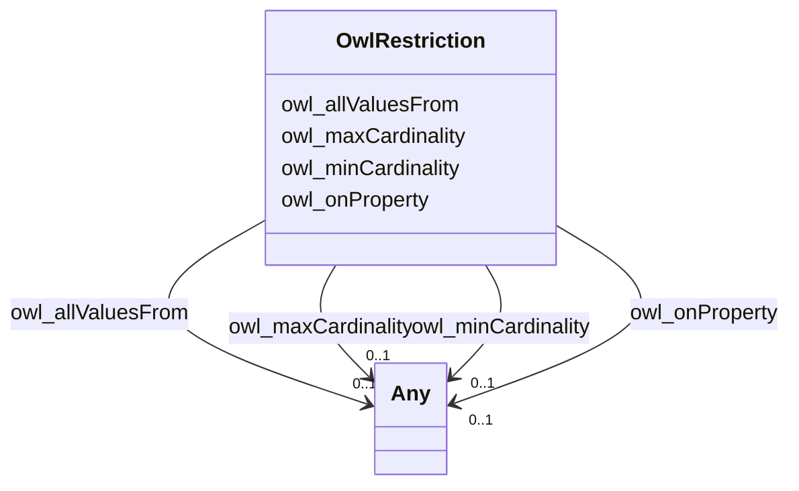

# Class: No class (type) name specified (owl_Restriction)


_No class (type) description specified_


This class occurs 62 times.


URI: [owl:Restriction](http://www.w3.org/2002/07/owl#Restriction)





<!-- no inheritance hierarchy -->


## Slots

| Name | Cardinality and Range | Description | Inheritance | Occurrences |
| ---  | --- | --- | --- | --- |
| [owl_allValuesFrom](../slots/owl_allValuesFrom.md) | 0..1 <br/> [xsd:anyURI](http://www.w3.org/2001/XMLSchema#anyURI)&nbsp;or&nbsp;<br />[OwlClass](../classes/OwlClass.md) | No slot (predicate) description specified <br/>  | direct | 20 |
| [owl_onProperty](../slots/owl_onProperty.md) | 0..1 <br/> [OwlAnnotationProperty](../classes/OwlAnnotationProperty.md)&nbsp;or&nbsp;<br />[OwlObjectProperty](../classes/OwlObjectProperty.md)&nbsp;or&nbsp;<br />[xsd:anyURI](http://www.w3.org/2001/XMLSchema#anyURI)&nbsp;or&nbsp;<br />[OwlDatatypeProperty](../classes/OwlDatatypeProperty.md) | No slot (predicate) description specified <br/>  | direct | 62 |
| [owl_maxCardinality](../slots/owl_maxCardinality.md) | 0..1 <br/> [Unsignedinteger](../types/Unsignedinteger.md)&nbsp;or&nbsp;<br />[Int32](../types/Int32.md)&nbsp;or&nbsp;<br />[xsd:integer](http://www.w3.org/2001/XMLSchema#integer) | No slot (predicate) description specified <br/>  | direct | 31 |
| [owl_minCardinality](../slots/owl_minCardinality.md) | 0..1 <br/> [Unsignedinteger](../types/Unsignedinteger.md)&nbsp;or&nbsp;<br />[Int32](../types/Int32.md) | No slot (predicate) description specified <br/>  | direct | 11 |


## Usages

| used by | used in | type | used |
| ---  | --- | --- | --- |
| [QudtAspectClass](../classes/QudtAspectClass.md) | [rdfs_subClassOf](../slots/rdfs_subClassOf.md) | any_of[range] | [OwlRestriction](../classes/OwlRestriction.md) |


## LinkML Source

<!-- TODO: investigate https://stackoverflow.com/questions/37606292/how-to-create-tabbed-code-blocks-in-mkdocs-or-sphinx -->

### Direct

<details>

```yaml
name: owl_Restriction
conforms_to: No schema conformance document specified
annotations:
  count:
    tag: count
    value: 62
description: No class (type) description specified
title: No class (type) name specified
from_schema: sawgraph-kg
rank: 1000
slots:
- owl_allValuesFrom
- owl_onProperty
- owl_maxCardinality
- owl_minCardinality
slot_usage:
  owl_allValuesFrom:
    name: owl_allValuesFrom
    annotations:
      owl_Class:
        tag: owl_Class
        value: 13
      uri:
        tag: uri
        value: 7
  owl_maxCardinality:
    name: owl_maxCardinality
    annotations:
      int32:
        tag: int32
        value: 7
      integer:
        tag: integer
        value: 20
      unsignedinteger:
        tag: unsignedinteger
        value: 4
  owl_minCardinality:
    name: owl_minCardinality
    annotations:
      int32:
        tag: int32
        value: 2
      unsignedinteger:
        tag: unsignedinteger
        value: 9
  owl_onProperty:
    name: owl_onProperty
    annotations:
      owl_AnnotationProperty:
        tag: owl_AnnotationProperty
        value: 1
      owl_DatatypeProperty:
        tag: owl_DatatypeProperty
        value: 2
      owl_ObjectProperty:
        tag: owl_ObjectProperty
        value: 8
      uri:
        tag: uri
        value: 51
class_uri: owl:Restriction

```
</details>

### Induced

<details>

```yaml
name: owl_Restriction
conforms_to: No schema conformance document specified
annotations:
  count:
    tag: count
    value: 62
description: No class (type) description specified
title: No class (type) name specified
from_schema: sawgraph-kg
rank: 1000
slot_usage:
  owl_allValuesFrom:
    name: owl_allValuesFrom
    annotations:
      owl_Class:
        tag: owl_Class
        value: 13
      uri:
        tag: uri
        value: 7
  owl_maxCardinality:
    name: owl_maxCardinality
    annotations:
      int32:
        tag: int32
        value: 7
      integer:
        tag: integer
        value: 20
      unsignedinteger:
        tag: unsignedinteger
        value: 4
  owl_minCardinality:
    name: owl_minCardinality
    annotations:
      int32:
        tag: int32
        value: 2
      unsignedinteger:
        tag: unsignedinteger
        value: 9
  owl_onProperty:
    name: owl_onProperty
    annotations:
      owl_AnnotationProperty:
        tag: owl_AnnotationProperty
        value: 1
      owl_DatatypeProperty:
        tag: owl_DatatypeProperty
        value: 2
      owl_ObjectProperty:
        tag: owl_ObjectProperty
        value: 8
      uri:
        tag: uri
        value: 51
attributes:
  owl_allValuesFrom:
    name: owl_allValuesFrom
    annotations:
      owl_Class:
        tag: owl_Class
        value: 13
      uri:
        tag: uri
        value: 7
    description: No slot (predicate) description specified
    examples:
    - object:
        example_object: qudt:Datatype
        example_object_type: owl_Class
        example_predicate: owl:allValuesFrom
        example_subject: _:B1b94d9e751ffada9b24c828d0fa88371
        example_subject_type: owl_Restriction
    - object:
        example_object: qudt:OrderedType
        example_object_type: uri
        example_predicate: owl:allValuesFrom
        example_subject: _:B54b5f5e01e0d6114012a8c907ebde248
        example_subject_type: owl_Restriction
    from_schema: sawgraph-kg
    rank: 1000
    slot_uri: owl:allValuesFrom
    alias: owl_allValuesFrom
    owner: owl_Restriction
    domain_of:
    - owl_Restriction
    range: Any
    any_of:
    - range: uri
    - range: owl_Class
  owl_onProperty:
    name: owl_onProperty
    annotations:
      owl_AnnotationProperty:
        tag: owl_AnnotationProperty
        value: 1
      owl_DatatypeProperty:
        tag: owl_DatatypeProperty
        value: 2
      owl_ObjectProperty:
        tag: owl_ObjectProperty
        value: 8
      uri:
        tag: uri
        value: 51
    description: No slot (predicate) description specified
    examples:
    - object:
        example_object: qudt:abbreviation
        example_object_type: owl_DatatypeProperty
        example_predicate: owl:onProperty
        example_subject: _:B1483a74553e695096917e036e115647b
        example_subject_type: owl_Restriction
    - object:
        example_object: qudt:basis
        example_object_type: uri
        example_predicate: owl:onProperty
        example_subject: _:B1b94d9e751ffada9b24c828d0fa88371
        example_subject_type: owl_Restriction
    - object:
        example_object: coso:observedProperty
        example_object_type: owl_ObjectProperty
        example_predicate: owl:onProperty
        example_subject: _:B6913f0a64a969f89379ad1e1a3c4555b
        example_subject_type: owl_Restriction
    - object:
        example_object: dct:description
        example_object_type: owl_AnnotationProperty
        example_predicate: owl:onProperty
        example_subject: _:Bd98fe8bdc6e04c95195453fbd99b19cd
        example_subject_type: owl_Restriction
    from_schema: sawgraph-kg
    rank: 1000
    slot_uri: owl:onProperty
    alias: owl_onProperty
    owner: owl_Restriction
    domain_of:
    - owl_Restriction
    range: Any
    any_of:
    - range: owl_AnnotationProperty
    - range: owl_ObjectProperty
    - range: uri
    - range: owl_DatatypeProperty
  owl_maxCardinality:
    name: owl_maxCardinality
    annotations:
      int32:
        tag: int32
        value: 7
      integer:
        tag: integer
        value: 20
      unsignedinteger:
        tag: unsignedinteger
        value: 4
    description: No slot (predicate) description specified
    examples:
    - object:
        example_object: '1'
        example_object_type: int32
        example_predicate: owl:maxCardinality
        example_subject: _:B1483a74553e695096917e036e115647b
        example_subject_type: owl_Restriction
    - object:
        example_object: '1'
        example_object_type: integer
        example_predicate: owl:maxCardinality
        example_subject: _:B1eaf986f62f70bde3920fc763297ba4b
        example_subject_type: owl_Restriction
    - object:
        example_object: '1'
        example_object_type: unsignedinteger
        example_predicate: owl:maxCardinality
        example_subject: _:B2d418fab187385bd606ec62687307b1d
        example_subject_type: owl_Restriction
    from_schema: sawgraph-kg
    rank: 1000
    slot_uri: owl:maxCardinality
    alias: owl_maxCardinality
    owner: owl_Restriction
    domain_of:
    - owl_Restriction
    range: Any
    any_of:
    - range: unsignedinteger
    - range: int32
    - range: integer
  owl_minCardinality:
    name: owl_minCardinality
    annotations:
      int32:
        tag: int32
        value: 2
      unsignedinteger:
        tag: unsignedinteger
        value: 9
    description: No slot (predicate) description specified
    examples:
    - object:
        example_object: '0'
        example_object_type: unsignedinteger
        example_predicate: owl:minCardinality
        example_subject: _:B2d99c95457974d6f9fb58deb3a118f49
        example_subject_type: owl_Restriction
    - object:
        example_object: '0'
        example_object_type: int32
        example_predicate: owl:minCardinality
        example_subject: _:Be739d8ba5c2b46b3967f46b720ce1114
        example_subject_type: owl_Restriction
    from_schema: sawgraph-kg
    rank: 1000
    slot_uri: owl:minCardinality
    alias: owl_minCardinality
    owner: owl_Restriction
    domain_of:
    - owl_Restriction
    range: Any
    any_of:
    - range: unsignedinteger
    - range: int32
class_uri: owl:Restriction

```
</details>