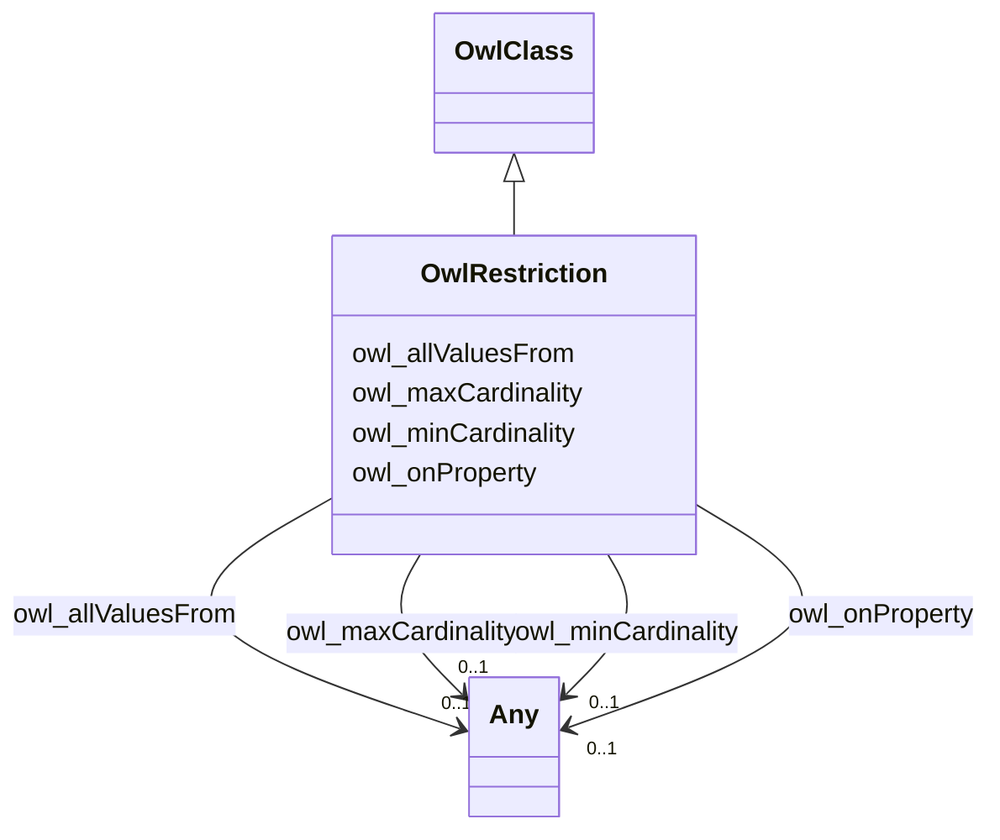

# Class: No class (entity type) name specified (owl_Restriction)


_No class (type) description specified_


This class occurs 62 times.


URI: [owl:Restriction](http://www.w3.org/2002/07/owl#Restriction)





## Inheritance
* [RdfsClass](../classes/RdfsClass.md)
    * [OwlClass](../classes/OwlClass.md)
        * **OwlRestriction**


## Slots

| Name | Cardinality and Range | Description | Inheritance | Occurrences |
| ---  | --- | --- | --- | --- |
| [owl_allValuesFrom](../slots/owl_allValuesFrom.md) | 0..1 <br/> [OwlThing](../classes/OwlThing.md)&nbsp;or&nbsp;<br />[OwlClass](../classes/OwlClass.md)&nbsp;or&nbsp;<br />[RdfsDatatype](../classes/RdfsDatatype.md)&nbsp;or&nbsp;<br />[RdfsClass](../classes/RdfsClass.md) | No slot (predicate) description specified <br/>  | direct | 55 |
| [owl_onProperty](../slots/owl_onProperty.md) | 0..1 <br/> [OwlThing](../classes/OwlThing.md)&nbsp;or&nbsp;<br />[OwlAnnotationProperty](../classes/OwlAnnotationProperty.md)&nbsp;or&nbsp;<br />[OwlDatatypeProperty](../classes/OwlDatatypeProperty.md)&nbsp;or&nbsp;<br />[RdfProperty](../classes/RdfProperty.md)&nbsp;or&nbsp;<br />[OwlObjectProperty](../classes/OwlObjectProperty.md) | No slot (predicate) description specified <br/>  | direct | 89 |
| [owl_maxCardinality](../slots/owl_maxCardinality.md) | 0..1 <br/> [Unsignedinteger](../types/Unsignedinteger.md)&nbsp;or&nbsp;<br />[RdfsLiteral](../classes/RdfsLiteral.md)&nbsp;or&nbsp;<br />[xsd:integer](http://www.w3.org/2001/XMLSchema#integer)&nbsp;or&nbsp;<br />[Int32](../types/Int32.md) | No slot (predicate) description specified <br/>  | direct | 31 |
| [owl_minCardinality](../slots/owl_minCardinality.md) | 0..1 <br/> [Unsignedinteger](../types/Unsignedinteger.md)&nbsp;or&nbsp;<br />[RdfsLiteral](../classes/RdfsLiteral.md)&nbsp;or&nbsp;<br />[Int32](../types/Int32.md) | No slot (predicate) description specified <br/>  | direct | 11 |


## LinkML Source

<!-- TODO: investigate https://stackoverflow.com/questions/37606292/how-to-create-tabbed-code-blocks-in-mkdocs-or-sphinx -->

### Direct

<details>

```yaml
name: owl_Restriction
conforms_to: No schema conformance document specified
annotations:
  count:
    tag: count
    value: 62
description: No class (type) description specified
title: No class (entity type) name specified
from_schema: sawgraph-kg
rank: 1000
is_a: owl_Class
slots:
- owl_allValuesFrom
- owl_onProperty
- owl_maxCardinality
- owl_minCardinality
slot_usage:
  owl_allValuesFrom:
    name: owl_allValuesFrom
    annotations:
      owl_Class:
        tag: owl_Class
        value: 13
      owl_Thing:
        tag: owl_Thing
        value: 20
      rdfs_Class:
        tag: rdfs_Class
        value: 20
      rdfs_Datatype:
        tag: rdfs_Datatype
        value: 2
  owl_maxCardinality:
    name: owl_maxCardinality
    annotations:
      int32:
        tag: int32
        value: 7
      integer:
        tag: integer
        value: 20
      unsignedinteger:
        tag: unsignedinteger
        value: 4
  owl_minCardinality:
    name: owl_minCardinality
    annotations:
      int32:
        tag: int32
        value: 2
      unsignedinteger:
        tag: unsignedinteger
        value: 9
  owl_onProperty:
    name: owl_onProperty
    annotations:
      owl_AnnotationProperty:
        tag: owl_AnnotationProperty
        value: 1
      owl_DatatypeProperty:
        tag: owl_DatatypeProperty
        value: 2
      owl_ObjectProperty:
        tag: owl_ObjectProperty
        value: 8
      owl_Thing:
        tag: owl_Thing
        value: 62
      rdf_Property:
        tag: rdf_Property
        value: 16
class_uri: owl:Restriction

```
</details>

### Induced

<details>

```yaml
name: owl_Restriction
conforms_to: No schema conformance document specified
annotations:
  count:
    tag: count
    value: 62
description: No class (type) description specified
title: No class (entity type) name specified
from_schema: sawgraph-kg
rank: 1000
is_a: owl_Class
slot_usage:
  owl_allValuesFrom:
    name: owl_allValuesFrom
    annotations:
      owl_Class:
        tag: owl_Class
        value: 13
      owl_Thing:
        tag: owl_Thing
        value: 20
      rdfs_Class:
        tag: rdfs_Class
        value: 20
      rdfs_Datatype:
        tag: rdfs_Datatype
        value: 2
  owl_maxCardinality:
    name: owl_maxCardinality
    annotations:
      int32:
        tag: int32
        value: 7
      integer:
        tag: integer
        value: 20
      unsignedinteger:
        tag: unsignedinteger
        value: 4
  owl_minCardinality:
    name: owl_minCardinality
    annotations:
      int32:
        tag: int32
        value: 2
      unsignedinteger:
        tag: unsignedinteger
        value: 9
  owl_onProperty:
    name: owl_onProperty
    annotations:
      owl_AnnotationProperty:
        tag: owl_AnnotationProperty
        value: 1
      owl_DatatypeProperty:
        tag: owl_DatatypeProperty
        value: 2
      owl_ObjectProperty:
        tag: owl_ObjectProperty
        value: 8
      owl_Thing:
        tag: owl_Thing
        value: 62
      rdf_Property:
        tag: rdf_Property
        value: 16
attributes:
  owl_allValuesFrom:
    name: owl_allValuesFrom
    annotations:
      owl_Class:
        tag: owl_Class
        value: 13
      owl_Thing:
        tag: owl_Thing
        value: 20
      rdfs_Class:
        tag: rdfs_Class
        value: 20
      rdfs_Datatype:
        tag: rdfs_Datatype
        value: 2
    description: No slot (predicate) description specified
    title: No slot (predicate) name specified
    examples:
    - object:
        example_object: qudt:EnumeratedValue
        example_object_type: owl_Thing
        example_predicate: owl:allValuesFrom
        example_subject: _:B028f2531b3b2d380ecbddd6893801342
        example_subject_type: owl_Restriction
    - object:
        example_object: qudt:EnumeratedValue
        example_object_type: owl_Class
        example_predicate: owl:allValuesFrom
        example_subject: _:B028f2531b3b2d380ecbddd6893801342
        example_subject_type: owl_Restriction
    - object:
        example_object: qudt:EnumeratedValue
        example_object_type: rdfs_Class
        example_predicate: owl:allValuesFrom
        example_subject: _:B028f2531b3b2d380ecbddd6893801342
        example_subject_type: owl_Restriction
    - object:
        example_object: xsd:string
        example_object_type: rdfs_Datatype
        example_predicate: owl:allValuesFrom
        example_subject: _:Bc72f0a6928d26f5f09981dbdf8032c33
        example_subject_type: owl_Restriction
    from_schema: sawgraph-kg
    rank: 1000
    slot_uri: owl:allValuesFrom
    alias: owl_allValuesFrom
    owner: owl_Restriction
    domain_of:
    - owl_Restriction
    union_of:
    - '{''domain'': ''owl_Class''}'
    - '{''domain'': ''owl_Restriction''}'
    - '{''domain'': ''rdfs_Class''}'
    range: Any
    any_of:
    - range: owl_Thing
    - range: owl_Class
    - range: rdfs_Datatype
    - range: rdfs_Class
  owl_onProperty:
    name: owl_onProperty
    annotations:
      owl_AnnotationProperty:
        tag: owl_AnnotationProperty
        value: 1
      owl_DatatypeProperty:
        tag: owl_DatatypeProperty
        value: 2
      owl_ObjectProperty:
        tag: owl_ObjectProperty
        value: 8
      owl_Thing:
        tag: owl_Thing
        value: 62
      rdf_Property:
        tag: rdf_Property
        value: 16
    description: No slot (predicate) description specified
    title: No slot (predicate) name specified
    examples:
    - object:
        example_object: qudt:enumeratedValue
        example_object_type: owl_Thing
        example_predicate: owl:onProperty
        example_subject: _:B028f2531b3b2d380ecbddd6893801342
        example_subject_type: owl_Restriction
    - object:
        example_object: qudt:enumeratedValue
        example_object_type: rdf_Property
        example_predicate: owl:onProperty
        example_subject: _:B028f2531b3b2d380ecbddd6893801342
        example_subject_type: owl_Restriction
    - object:
        example_object: qudt:enumeratedValue
        example_object_type: owl_ObjectProperty
        example_predicate: owl:onProperty
        example_subject: _:B028f2531b3b2d380ecbddd6893801342
        example_subject_type: owl_Restriction
    - object:
        example_object: qudt:abbreviation
        example_object_type: owl_DatatypeProperty
        example_predicate: owl:onProperty
        example_subject: _:B2884e26759d573de491a452ee02cd5be
        example_subject_type: owl_Restriction
    - object:
        example_object: dct:description
        example_object_type: owl_AnnotationProperty
        example_predicate: owl:onProperty
        example_subject: _:B3132a05d8995a22458a38f94cdb45e45
        example_subject_type: owl_Restriction
    from_schema: sawgraph-kg
    rank: 1000
    slot_uri: owl:onProperty
    alias: owl_onProperty
    owner: owl_Restriction
    domain_of:
    - owl_Restriction
    union_of:
    - '{''domain'': ''owl_Class''}'
    - '{''domain'': ''owl_Restriction''}'
    - '{''domain'': ''rdfs_Class''}'
    range: Any
    any_of:
    - range: owl_Thing
    - range: owl_AnnotationProperty
    - range: owl_DatatypeProperty
    - range: rdf_Property
    - range: owl_ObjectProperty
  owl_maxCardinality:
    name: owl_maxCardinality
    annotations:
      int32:
        tag: int32
        value: 7
      integer:
        tag: integer
        value: 20
      unsignedinteger:
        tag: unsignedinteger
        value: 4
    description: No slot (predicate) description specified
    title: No slot (predicate) name specified
    examples:
    - object:
        example_object: '1'
        example_object_type: integer
        example_predicate: owl:maxCardinality
        example_subject: _:B040a3495e8a7e81253a5a9e35c747f26
        example_subject_type: owl_Restriction
    - object:
        example_object: '1'
        example_object_type: int32
        example_predicate: owl:maxCardinality
        example_subject: _:B2884e26759d573de491a452ee02cd5be
        example_subject_type: owl_Restriction
    - object:
        example_object: '1'
        example_object_type: unsignedinteger
        example_predicate: owl:maxCardinality
        example_subject: _:B9fab7a8c48e9f0c2663ef5cda30b2842
        example_subject_type: owl_Restriction
    from_schema: sawgraph-kg
    rank: 1000
    slot_uri: owl:maxCardinality
    alias: owl_maxCardinality
    owner: owl_Restriction
    domain_of:
    - owl_Restriction
    union_of:
    - '{''domain'': ''owl_Class''}'
    - '{''domain'': ''owl_Restriction''}'
    - '{''domain'': ''rdfs_Class''}'
    range: Any
    any_of:
    - range: unsignedinteger
    - range: rdfs_Literal
    - range: integer
    - range: int32
  owl_minCardinality:
    name: owl_minCardinality
    annotations:
      int32:
        tag: int32
        value: 2
      unsignedinteger:
        tag: unsignedinteger
        value: 9
    description: No slot (predicate) description specified
    title: No slot (predicate) name specified
    examples:
    - object:
        example_object: '0'
        example_object_type: int32
        example_predicate: owl:minCardinality
        example_subject: _:B034dc74789599b0e98c60b3a0f255193
        example_subject_type: owl_Restriction
    - object:
        example_object: '0'
        example_object_type: unsignedinteger
        example_predicate: owl:minCardinality
        example_subject: _:B07369d6468d5ba92651edaaff1cab22e
        example_subject_type: owl_Restriction
    from_schema: sawgraph-kg
    rank: 1000
    slot_uri: owl:minCardinality
    alias: owl_minCardinality
    owner: owl_Restriction
    domain_of:
    - owl_Restriction
    union_of:
    - '{''domain'': ''owl_Class''}'
    - '{''domain'': ''owl_Restriction''}'
    - '{''domain'': ''rdfs_Class''}'
    range: Any
    any_of:
    - range: unsignedinteger
    - range: rdfs_Literal
    - range: int32
class_uri: owl:Restriction

```
</details>