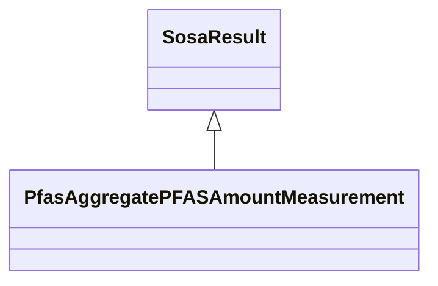

# Class: TODO -- what's a good name for this class (type)? (pfas_AggregatePFASAmountMeasurement)


_TODO -- tell the world what this class (type) describes._


URI: [pfas:AggregatePFASAmountMeasurement](http://sawgraph.spatialai.org/v1/pfas#AggregatePFASAmountMeasurement)





## Inheritance
* [SosaResult](../classes/SosaResult.md)
    * **PfasAggregatePFASAmountMeasurement**


## Slots

| Name | Cardinality and Range | Description | Inheritance |
| ---  | --- | --- | --- |


## TODOs

* TODO -- Todos for this class go here
* or you can delete the todos
* if you think the class is perfect.

## Identifier and Mapping Information


### Schema Source


* from schema: sawgraph-kg


## Mappings

| Mapping Type | Mapped Value |
| ---  | ---  |
| self | pfas:AggregatePFASAmountMeasurement |
| native | sawgraph-kg/:PfasAggregatePFASAmountMeasurement |


## LinkML Source

<!-- TODO: investigate https://stackoverflow.com/questions/37606292/how-to-create-tabbed-code-blocks-in-mkdocs-or-sphinx -->

### Direct

<details>
```yaml
name: pfas_AggregatePFASAmountMeasurement
description: TODO -- tell the world what this class (type) describes.
title: TODO -- what's a good name for this class (type)?
todos:
- TODO -- Todos for this class go here
- or you can delete the todos
- if you think the class is perfect.
notes:
- Class with 0 occurences.
from_schema: sawgraph-kg
is_a: sosa_Result
class_uri: pfas:AggregatePFASAmountMeasurement

```
</details>

### Induced

<details>
```yaml
name: pfas_AggregatePFASAmountMeasurement
description: TODO -- tell the world what this class (type) describes.
title: TODO -- what's a good name for this class (type)?
todos:
- TODO -- Todos for this class go here
- or you can delete the todos
- if you think the class is perfect.
notes:
- Class with 0 occurences.
from_schema: sawgraph-kg
is_a: sosa_Result
class_uri: pfas:AggregatePFASAmountMeasurement

```
</details>