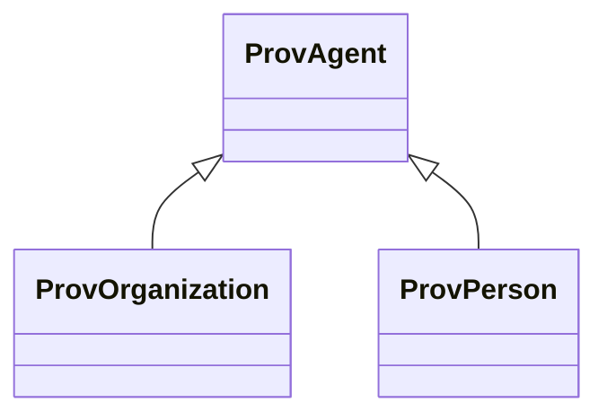

# Class: Agent (prov_Agent)


_An agent is something that bears some form of responsibility for an activity taking place, for the existence of an entity, or for another agent's activity._


This class occurs 686 times.


URI: [prov:Agent](http://www.w3.org/ns/prov#Agent)





## Inheritance
* **ProvAgent**
    * [ProvOrganization](../classes/ProvOrganization.md)
    * [ProvPerson](../classes/ProvPerson.md)


## Slots

| Name | Cardinality and Range | Description | Inheritance | Occurrences |
| ---  | --- | --- | --- | --- |


## Usages

| used by | used in | type | used |
| ---  | --- | --- | --- |
| [CosoAnimalMaterialSample](../classes/CosoAnimalMaterialSample.md) | [prov_wasAttributedTo](../slots/prov_wasAttributedTo.md) | range | [ProvAgent](../classes/ProvAgent.md) |
| [CosoAnimalMilkSample](../classes/CosoAnimalMilkSample.md) | [prov_wasAttributedTo](../slots/prov_wasAttributedTo.md) | range | [ProvAgent](../classes/ProvAgent.md) |
| [CosoAnimalOrganSample](../classes/CosoAnimalOrganSample.md) | [prov_wasAttributedTo](../slots/prov_wasAttributedTo.md) | range | [ProvAgent](../classes/ProvAgent.md) |
| [CosoAnimalTissueSample](../classes/CosoAnimalTissueSample.md) | [prov_wasAttributedTo](../slots/prov_wasAttributedTo.md) | range | [ProvAgent](../classes/ProvAgent.md) |
| [CosoPlantMaterialSample](../classes/CosoPlantMaterialSample.md) | [prov_wasAttributedTo](../slots/prov_wasAttributedTo.md) | range | [ProvAgent](../classes/ProvAgent.md) |
| [HttpW3id.orgSawgraphV1Me-egad#EGAD-PFAS-Observation](../classes/HttpW3id.orgSawgraphV1Me-egad#EGAD-PFAS-Observation.md) | [prov_wasAttributedTo](../slots/prov_wasAttributedTo.md) | range | [ProvAgent](../classes/ProvAgent.md) |
| [HttpW3id.orgSawgraphV1Me-egad#EGAD-Sample](../classes/HttpW3id.orgSawgraphV1Me-egad#EGAD-Sample.md) | [prov_wasAttributedTo](../slots/prov_wasAttributedTo.md) | range | [ProvAgent](../classes/ProvAgent.md) |
| [HttpW3id.orgSawgraphV1Me-egad-data#DefEGADBeefBloodSample](../classes/HttpW3id.orgSawgraphV1Me-egad-data#DefEGADBeefBloodSample.md) | [prov_wasAttributedTo](../slots/prov_wasAttributedTo.md) | range | [ProvAgent](../classes/ProvAgent.md) |
| [HttpW3id.orgSawgraphV1Me-egad-data#DefEGADDrinkingWaterSample](../classes/HttpW3id.orgSawgraphV1Me-egad-data#DefEGADDrinkingWaterSample.md) | [prov_wasAttributedTo](../slots/prov_wasAttributedTo.md) | range | [ProvAgent](../classes/ProvAgent.md) |
| [HttpW3id.orgSawgraphV1Me-egad-data#DefEGADGroundWaterSample](../classes/HttpW3id.orgSawgraphV1Me-egad-data#DefEGADGroundWaterSample.md) | [prov_wasAttributedTo](../slots/prov_wasAttributedTo.md) | range | [ProvAgent](../classes/ProvAgent.md) |
| [HttpW3id.orgSawgraphV1Me-egad-data#DefEGADPorkBloodSample](../classes/HttpW3id.orgSawgraphV1Me-egad-data#DefEGADPorkBloodSample.md) | [prov_wasAttributedTo](../slots/prov_wasAttributedTo.md) | range | [ProvAgent](../classes/ProvAgent.md) |
| [HttpW3id.orgSawgraphV1Me-egad-data#DefEGADSoilSample](../classes/HttpW3id.orgSawgraphV1Me-egad-data#DefEGADSoilSample.md) | [prov_wasAttributedTo](../slots/prov_wasAttributedTo.md) | range | [ProvAgent](../classes/ProvAgent.md) |
| [HttpW3id.orgSawgraphV1Me-egad-data#DefEGADSurfaceWaterSample](../classes/HttpW3id.orgSawgraphV1Me-egad-data#DefEGADSurfaceWaterSample.md) | [prov_wasAttributedTo](../slots/prov_wasAttributedTo.md) | range | [ProvAgent](../classes/ProvAgent.md) |
| [HttpW3id.orgSawgraphV1Us-wqp#Observation](../classes/HttpW3id.orgSawgraphV1Us-wqp#Observation.md) | [prov_wasAttributedTo](../slots/prov_wasAttributedTo.md) | range | [ProvAgent](../classes/ProvAgent.md) |
| [HttpW3id.orgSawgraphV1Us-wqp#Site](../classes/HttpW3id.orgSawgraphV1Us-wqp#Site.md) | [prov_wasAttributedTo](../slots/prov_wasAttributedTo.md) | range | [ProvAgent](../classes/ProvAgent.md) |
| [MeEgadEGAD-PFAS-Observation](../classes/MeEgadEGAD-PFAS-Observation.md) | [prov_wasAttributedTo](../slots/prov_wasAttributedTo.md) | range | [ProvAgent](../classes/ProvAgent.md) |
| [MeEgadEGAD-Sample](../classes/MeEgadEGAD-Sample.md) | [prov_wasAttributedTo](../slots/prov_wasAttributedTo.md) | range | [ProvAgent](../classes/ProvAgent.md) |


## LinkML Source

<!-- TODO: investigate https://stackoverflow.com/questions/37606292/how-to-create-tabbed-code-blocks-in-mkdocs-or-sphinx -->

### Direct

<details>

```yaml
name: prov_Agent
description: An agent is something that bears some form of responsibility for an activity
  taking place, for the existence of an entity, or for another agent's activity.
title: Agent
from_schema: okns:prov
source: http://www.w3.org/ns/prov-o#
class_uri: prov:Agent

```
</details>

### Induced

<details>

```yaml
name: prov_Agent
description: An agent is something that bears some form of responsibility for an activity
  taking place, for the existence of an entity, or for another agent's activity.
title: Agent
from_schema: okns:prov
source: http://www.w3.org/ns/prov-o#
class_uri: prov:Agent

```
</details>