# Class: No (data)type name specified -- this type is noted as a supertype of another type in this graph but has not itself been defined. (qudt_Concept)


_The root class for all QUDT concepts._


This class occurs 9 times.


URI: [qudt:Concept](http://qudt.org/schema/qudt/Concept)

```mermaid
 classDiagram
    class QudtConcept
    click QudtConcept href "../QudtConcept"
      OwlThing <|-- QudtConcept
        click OwlThing href "../OwlThing"
      

      QudtConcept <|-- QudtAbstractQuantityKind
        click QudtAbstractQuantityKind href "../QudtAbstractQuantityKind"
      QudtConcept <|-- QudtBaseDimensionMagnitude
        click QudtBaseDimensionMagnitude href "../QudtBaseDimensionMagnitude"
      QudtConcept <|-- QudtCitation
        click QudtCitation href "../QudtCitation"
      QudtConcept <|-- QudtDataItem
        click QudtDataItem href "../QudtDataItem"
      QudtConcept <|-- QudtDatatype
        click QudtDatatype href "../QudtDatatype"
      QudtConcept <|-- QudtDiscipline
        click QudtDiscipline href "../QudtDiscipline"
      QudtConcept <|-- QudtEncoding
        click QudtEncoding href "../QudtEncoding"
      QudtConcept <|-- QudtFigure
        click QudtFigure href "../QudtFigure"
      QudtConcept <|-- QudtMathsFunctionType
        click QudtMathsFunctionType href "../QudtMathsFunctionType"
      QudtConcept <|-- QudtOrganization
        click QudtOrganization href "../QudtOrganization"
      QudtConcept <|-- QudtQuantityKindDimensionVector
        click QudtQuantityKindDimensionVector href "../QudtQuantityKindDimensionVector"
      QudtConcept <|-- QudtScale
        click QudtScale href "../QudtScale"
      QudtConcept <|-- QudtSymbol
        click QudtSymbol href "../QudtSymbol"
      QudtConcept <|-- QudtSystemOfQuantityKinds
        click QudtSystemOfQuantityKinds href "../QudtSystemOfQuantityKinds"
      
      
      
```





## Inheritance
* [OwlThing](../classes/OwlThing.md)
    * **QudtConcept**
        * [QudtAbstractQuantityKind](../classes/QudtAbstractQuantityKind.md)
        * [QudtBaseDimensionMagnitude](../classes/QudtBaseDimensionMagnitude.md)
        * [QudtCitation](../classes/QudtCitation.md)
        * [QudtDataItem](../classes/QudtDataItem.md)
        * [QudtDatatype](../classes/QudtDatatype.md)
        * [QudtDiscipline](../classes/QudtDiscipline.md)
        * [QudtEncoding](../classes/QudtEncoding.md)
        * [QudtFigure](../classes/QudtFigure.md)
        * [QudtMathsFunctionType](../classes/QudtMathsFunctionType.md)
        * [QudtOrganization](../classes/QudtOrganization.md)
        * [QudtQuantityKindDimensionVector](../classes/QudtQuantityKindDimensionVector.md)
        * [QudtScale](../classes/QudtScale.md)
        * [QudtSymbol](../classes/QudtSymbol.md)
        * [QudtSystemOfQuantityKinds](../classes/QudtSystemOfQuantityKinds.md)


## Slots

| Name | Cardinality and Range | Description | Inheritance | Occurrences |
| ---  | --- | --- | --- | --- |


## Usages

| used by | used in | type | used |
| ---  | --- | --- | --- |
| [QudtDerivedUnit](../classes/QudtDerivedUnit.md) | [qudt_guidance](../slots/qudt_guidance.md) | domain | [QudtConcept](../classes/QudtConcept.md) |
| [HttpW3id.orgSawgraphV1Me-egad#EGAD-AggregatePFAS-Concentration](../classes/HttpW3id.orgSawgraphV1Me-egad#EGAD-AggregatePFAS-Concentration.md) | [coso_measurementValue](../slots/coso_measurementValue.md) | any_of[range] | [QudtConcept](../classes/QudtConcept.md) |
| [HttpW3id.orgSawgraphV1Me-egad#EGAD-AggregatePFAS-Concentration](../classes/HttpW3id.orgSawgraphV1Me-egad#EGAD-AggregatePFAS-Concentration.md) | [http___w3id.org_sawgraph_v1_me_egad#methodDetectionLimit](../slots/http___w3id.org_sawgraph_v1_me_egad#methodDetectionLimit.md) | any_of[range] | [QudtConcept](../classes/QudtConcept.md) |
| [HttpW3id.orgSawgraphV1Me-egad#EGAD-AggregatePFAS-Concentration](../classes/HttpW3id.orgSawgraphV1Me-egad#EGAD-AggregatePFAS-Concentration.md) | [coso_measurementUnit](../slots/coso_measurementUnit.md) | any_of[range] | [QudtConcept](../classes/QudtConcept.md) |
| [HttpW3id.orgSawgraphV1Me-egad#EGAD-AggregatePFAS-Concentration](../classes/HttpW3id.orgSawgraphV1Me-egad#EGAD-AggregatePFAS-Concentration.md) | [http___w3id.org_sawgraph_v1_me_egad#reportingLimit](../slots/http___w3id.org_sawgraph_v1_me_egad#reportingLimit.md) | any_of[range] | [QudtConcept](../classes/QudtConcept.md) |
| [HttpW3id.orgSawgraphV1Me-egad#EGAD-PFAS-Observation](../classes/HttpW3id.orgSawgraphV1Me-egad#EGAD-PFAS-Observation.md) | [coso_hasResult](../slots/coso_hasResult.md) | any_of[range] | [QudtConcept](../classes/QudtConcept.md) |
| [HttpW3id.orgSawgraphV1Me-egad#EGAD-SinglePFAS-Concentration](../classes/HttpW3id.orgSawgraphV1Me-egad#EGAD-SinglePFAS-Concentration.md) | [coso_measurementValue](../slots/coso_measurementValue.md) | any_of[range] | [QudtConcept](../classes/QudtConcept.md) |
| [HttpW3id.orgSawgraphV1Me-egad#EGAD-SinglePFAS-Concentration](../classes/HttpW3id.orgSawgraphV1Me-egad#EGAD-SinglePFAS-Concentration.md) | [http___w3id.org_sawgraph_v1_me_egad#methodDetectionLimit](../slots/http___w3id.org_sawgraph_v1_me_egad#methodDetectionLimit.md) | any_of[range] | [QudtConcept](../classes/QudtConcept.md) |
| [HttpW3id.orgSawgraphV1Me-egad#EGAD-SinglePFAS-Concentration](../classes/HttpW3id.orgSawgraphV1Me-egad#EGAD-SinglePFAS-Concentration.md) | [coso_measurementUnit](../slots/coso_measurementUnit.md) | any_of[range] | [QudtConcept](../classes/QudtConcept.md) |
| [HttpW3id.orgSawgraphV1Me-egad#EGAD-SinglePFAS-Concentration](../classes/HttpW3id.orgSawgraphV1Me-egad#EGAD-SinglePFAS-Concentration.md) | [http___w3id.org_sawgraph_v1_me_egad#reportingLimit](../slots/http___w3id.org_sawgraph_v1_me_egad#reportingLimit.md) | any_of[range] | [QudtConcept](../classes/QudtConcept.md) |
| [HttpW3id.orgSawgraphV1Us-wqp#Observation](../classes/HttpW3id.orgSawgraphV1Us-wqp#Observation.md) | [coso_hasResult](../slots/coso_hasResult.md) | any_of[range] | [QudtConcept](../classes/QudtConcept.md) |
| [MeEgadEGAD-AggregatePFAS-Concentration](../classes/MeEgadEGAD-AggregatePFAS-Concentration.md) | [coso_measurementValue](../slots/coso_measurementValue.md) | any_of[range] | [QudtConcept](../classes/QudtConcept.md) |
| [MeEgadEGAD-AggregatePFAS-Concentration](../classes/MeEgadEGAD-AggregatePFAS-Concentration.md) | [coso_measurementUnit](../slots/coso_measurementUnit.md) | any_of[range] | [QudtConcept](../classes/QudtConcept.md) |
| [MeEgadEGAD-AggregatePFAS-Concentration](../classes/MeEgadEGAD-AggregatePFAS-Concentration.md) | [me_egad_methodDetectionLimit](../slots/me_egad_methodDetectionLimit.md) | any_of[range] | [QudtConcept](../classes/QudtConcept.md) |
| [MeEgadEGAD-AggregatePFAS-Concentration](../classes/MeEgadEGAD-AggregatePFAS-Concentration.md) | [me_egad_reportingLimit](../slots/me_egad_reportingLimit.md) | any_of[range] | [QudtConcept](../classes/QudtConcept.md) |
| [MeEgadEGAD-PFAS-Observation](../classes/MeEgadEGAD-PFAS-Observation.md) | [coso_hasResult](../slots/coso_hasResult.md) | any_of[range] | [QudtConcept](../classes/QudtConcept.md) |
| [MeEgadEGAD-SinglePFAS-Concentration](../classes/MeEgadEGAD-SinglePFAS-Concentration.md) | [coso_measurementValue](../slots/coso_measurementValue.md) | any_of[range] | [QudtConcept](../classes/QudtConcept.md) |
| [MeEgadEGAD-SinglePFAS-Concentration](../classes/MeEgadEGAD-SinglePFAS-Concentration.md) | [coso_measurementUnit](../slots/coso_measurementUnit.md) | any_of[range] | [QudtConcept](../classes/QudtConcept.md) |
| [MeEgadEGAD-SinglePFAS-Concentration](../classes/MeEgadEGAD-SinglePFAS-Concentration.md) | [me_egad_methodDetectionLimit](../slots/me_egad_methodDetectionLimit.md) | any_of[range] | [QudtConcept](../classes/QudtConcept.md) |
| [MeEgadEGAD-SinglePFAS-Concentration](../classes/MeEgadEGAD-SinglePFAS-Concentration.md) | [me_egad_reportingLimit](../slots/me_egad_reportingLimit.md) | any_of[range] | [QudtConcept](../classes/QudtConcept.md) |


## LinkML Source

<!-- TODO: investigate https://stackoverflow.com/questions/37606292/how-to-create-tabbed-code-blocks-in-mkdocs-or-sphinx -->

### Direct

<details>

```yaml
name: qudt_Concept
description: The root class for all QUDT concepts.
title: No (data)type name specified -- this type is noted as a supertype of another
  type in this graph but has not itself been defined.
from_schema: okns:qudt
source: http://qudt.org/schema/qudt
is_a: owl_Thing
class_uri: qudt:Concept

```
</details>

### Induced

<details>

```yaml
name: qudt_Concept
description: The root class for all QUDT concepts.
title: No (data)type name specified -- this type is noted as a supertype of another
  type in this graph but has not itself been defined.
from_schema: okns:qudt
source: http://qudt.org/schema/qudt
is_a: owl_Thing
class_uri: qudt:Concept

```
</details>