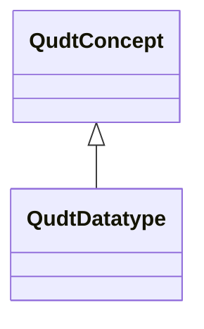

# Class: QUDT Datatype (qudt_Datatype)


_A data type is a definition of a set of values (for example, "all integers between 0 and 10"), and the allowable operations on those values; the meaning of the data; and the way values of that type can be stored. Some types are primitive - built-in to the language, with no visible internal structure - e.g. Boolean; others are composite - constructed from one or more other types (of either kind) - e.g. lists, arrays, structures, unions. Object-oriented programming extends this with classes which encapsulate both the structure of a type and the operations that can be performed on it. Some languages provide strong typing, others allow implicit type conversion and/or explicit type conversion._


URI: [qudt:Datatype](http://qudt.org/schema/qudt/Datatype)





## Inheritance
* [QudtConcept](../classes/QudtConcept.md)
    * **QudtDatatype**


## Slots

| Name | Cardinality and Range | Description | Inheritance | Occurrences |
| ---  | --- | --- | --- | --- |


## LinkML Source

<!-- TODO: investigate https://stackoverflow.com/questions/37606292/how-to-create-tabbed-code-blocks-in-mkdocs-or-sphinx -->

### Direct

<details>

```yaml
name: qudt_Datatype
conforms_to: No schema conformance document specified
description: A data type is a definition of a set of values (for example, "all integers
  between 0 and 10"), and the allowable operations on those values; the meaning of
  the data; and the way values of that type can be stored. Some types are primitive
  - built-in to the language, with no visible internal structure - e.g. Boolean; others
  are composite - constructed from one or more other types (of either kind) - e.g.
  lists, arrays, structures, unions. Object-oriented programming extends this with
  classes which encapsulate both the structure of a type and the operations that can
  be performed on it. Some languages provide strong typing, others allow implicit
  type conversion and/or explicit type conversion.
title: QUDT Datatype
from_schema: sawgraph-kg
source: http://qudt.org/2.1/schema/qudt
rank: 1000
is_a: qudt_Concept
class_uri: qudt:Datatype

```
</details>

### Induced

<details>

```yaml
name: qudt_Datatype
conforms_to: No schema conformance document specified
description: A data type is a definition of a set of values (for example, "all integers
  between 0 and 10"), and the allowable operations on those values; the meaning of
  the data; and the way values of that type can be stored. Some types are primitive
  - built-in to the language, with no visible internal structure - e.g. Boolean; others
  are composite - constructed from one or more other types (of either kind) - e.g.
  lists, arrays, structures, unions. Object-oriented programming extends this with
  classes which encapsulate both the structure of a type and the operations that can
  be performed on it. Some languages provide strong typing, others allow implicit
  type conversion and/or explicit type conversion.
title: QUDT Datatype
from_schema: sawgraph-kg
source: http://qudt.org/2.1/schema/qudt
rank: 1000
is_a: qudt_Concept
class_uri: qudt:Datatype

```
</details>