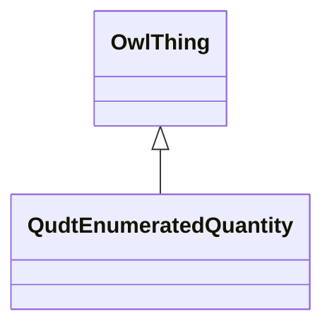

# Class: Enumerated Quantity (qudt_EnumeratedQuantity)


URI: [qudt:EnumeratedQuantity](http://qudt.org/schema/qudt/EnumeratedQuantity)





## Inheritance
* [OwlThing](../classes/OwlThing.md)
    * **QudtEnumeratedQuantity**


## Slots

| Name | Cardinality and Range | Description | Inheritance | Occurrences |
| ---  | --- | --- | --- | --- |


## LinkML Source

<!-- TODO: investigate https://stackoverflow.com/questions/37606292/how-to-create-tabbed-code-blocks-in-mkdocs-or-sphinx -->

### Direct

<details>

```yaml
name: qudt_EnumeratedQuantity
title: Enumerated Quantity
from_schema: okns:sawgraph-kg
rank: 1000
is_a: owl_Thing
class_uri: qudt:EnumeratedQuantity

```
</details>

### Induced

<details>

```yaml
name: qudt_EnumeratedQuantity
title: Enumerated Quantity
from_schema: okns:sawgraph-kg
rank: 1000
is_a: owl_Thing
class_uri: qudt:EnumeratedQuantity

```
</details>